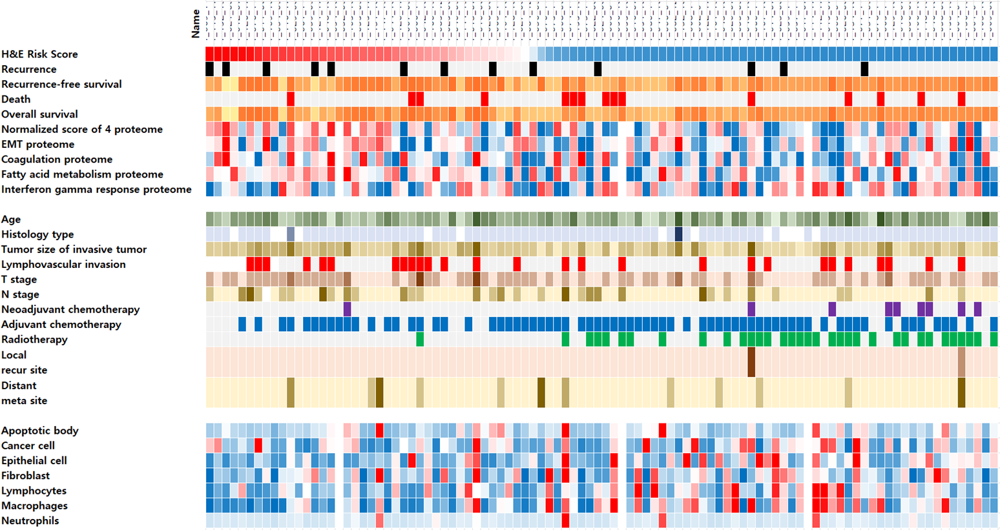
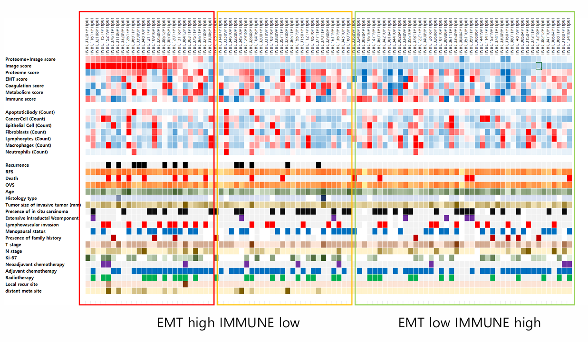
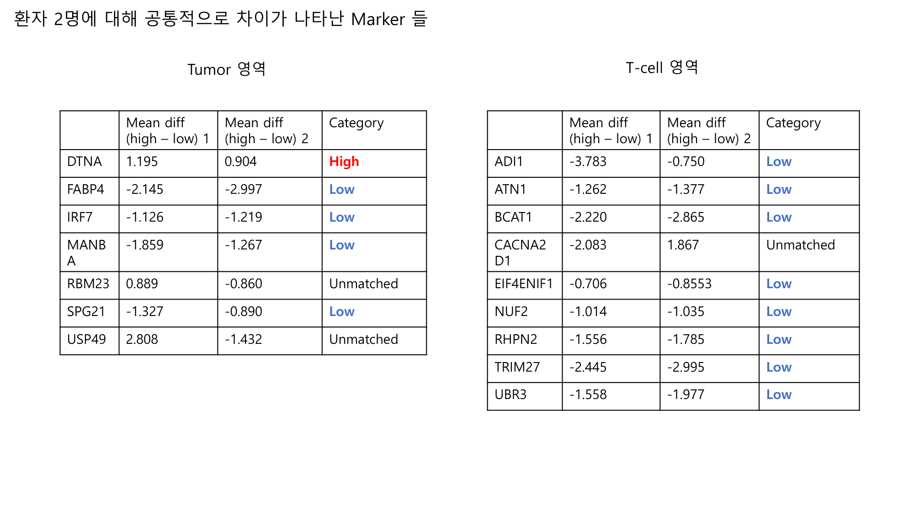

# `inference/analysis/` — Hist2Cell predictions × Proteomics ROI 통합 분석

> **⚠️ 핵심 caveat (먼저 읽기)**
>
> 본 디렉토리에는 **두 종류의 독립적 분석 결과** 가 함께 들어 있다.
> 1. **Hist2Cell** — `humanlung_cell2location_leave_A50_out.pth` (lung 학습) 가중치를 KBSMC **breast** SVS 두 장에 적용한 결과. 80개 cell type 라벨은 모두 lung 분류이므로 **세부 type 단위 해석 불가**, 그룹 단위 (immune / epithelial / stromal / vascular / …) + 공간 패턴만 의미.
> 2. **KBSMC 공동연구의 proteomics ROI 분석** — tiatoolbox AI 위험도 모델이 선정한 ROI (270 μm 패치 cluster) 에 대한 LC-MS proteomics. 본 모델과 독립적 modality + 독립적 AI 모델.
>
> 이 디렉토리의 목적은 **두 modality 의 신호 일치/불일치** 를 정성적으로 정리하고 동료가 **proteomics 와 Hist2Cell 결과를 spatial 으로 매칭** 할 수 있도록 데이터/방법론을 명시하는 것. 임상 진단 보고서 아님.

---

## 1. 디렉토리 인벤토리

```
inference/analysis/
├── README.md                                    ← 이 파일
├── analyze.py                                   재실행 스크립트 (Hist2Cell predictions 후속 분석)
├── cell_type_groups.csv                         80 cell type → lineage group + is_strict_proxy / is_broad_proxy flags
├── EPITHELIAL_PROXY_METHODOLOGY.md              strict / broad epithelial-activity proxy 의 선정 근거 + reference
│
├── KBSMC_heatmap.png                            96 sample 환자 cohort bulk heatmap
├── KBSMC_heatmap_final.csv                      96 sample 의 column 순서
├── TCGA_TNBC_external_valid.png                 TCGA TNBC 외부검증 (EMT vs IMMUNE 축)
│
├── proteomics_분석.pdf                          ROI proteomics 결과 (페이지 1-3 = 환자1, 4-6 = 환자2, 7 = 공통)
├── proteomics_common_markers.png                위 페이지 7 을 PNG 로 추출 (이 README §5 에 임베드)
├── 메테오바이오텍_1-085_12_ROI_추출_결과.pdf      환자 1번 ROI 선정 방법론 (53 페이지)
├── 메테오바이오텍_1_152_19_ROI_추출_결과.pdf      환자 2번 ROI 선정 방법론 (53 페이지)
│
├── slide1_085_12_v2/                            환자 1번 통합 분석
│   ├── findings.md                              통합 소견 (Hist2Cell + proteomics)
│   ├── abundance_by_celltype.csv                80 type 별 mean/median/max/fraction-nonzero
│   ├── abundance_by_group.csv                   group 별 합산 + strict / broad epithelial-activity proxy pseudo-group
│   ├── spatial_top10_celltypes.png              top 10 type 의 spot scatter
│   ├── spatial_group_heatmaps.png               10 group 의 spatial sum
│   ├── spatial_immune_vs_epithelial.png         3-panel: immune total / strict proxy / broad proxy
│   ├── moran_r_pairs.csv                        80×80 cell-pair Moran's R
│   ├── moran_r_clustermap.png                   Moran's R hierarchical clustermap
│   ├── proteomics_top50_heatmaps.png            proteomics_분석.pdf 페이지 2 추출 (tumor + T-cell)
│   ├── proteomics_umap.png                      페이지 3 추출 (UMAP)
│   ├── roi_methodology.png                      ROI PDF 페이지 2 (방법론 설명)
│   └── roi_section_distribution.png             ROI PDF 페이지 3 (48 tube 분포)
│
└── slide2_152_19_v2/                            환자 2번 통합 분석 (동일 구조)
    └── findings.md, abundance_*, spatial_*, moran_*, proteomics_*, roi_*
```

상위 디렉토리 `inference/slide{1,2}_*_v2/` 에는 **prep + inference 산출물** (predictions.csv/.npy, coords.h5, spots.csv, spot_view.jpg, tissue_mask.png) 이 그대로 있다. 본 analysis/ 는 그것들을 입력으로 사용.

---

## 2. 데이터 흐름 한눈에 보기

```
[ 같은 SVS 슬라이드 ]
        ├── Hist2Cell 모델 (lung-trained)
        │     │
        │     ├── 105 μm 격자 spot 별 80 cell type abundance
        │     │     → predictions.csv / .npy / coords.h5
        │     │
        │     └── 후속 분석 (analyze.py)
        │           → abundance_by_*.csv, spatial_*.png, moran_r_*
        │
        └── tiatoolbox AI 위험도 모델
              │
              ├── 270 μm 패치 별 위험도 score
              │     → 그림 (KBSMC_heatmap.png 의 H&E Risk Score row)
              │
              ├── ROI 선정 (48 tube/환자, cluster 4 패치/tube)
              │     → 메테오바이오텍_*_ROI_추출_결과.pdf
              │
              └── LC-MS proteomics
                    → proteomics_분석.pdf  (Tumor a vs b, T-cell c vs d 비교)
```

두 modality 의 결과는 같은 슬라이드를 다른 격자 (105 μm vs 270 μm) 로 보고 다른 신호 (cell composition vs protein abundance) 를 측정. 본 분석의 핵심은 두 신호의 **공간적 일관성** 정성 평가.

---

## 3. KBSMC 96 sample 환자 cohort context



`KBSMC_heatmap_final.csv` 의 column 순서로 96명 환자 sample 이 정렬되어 있고, **slide1 (1_085_12)** 은 **30번째**, **slide2 (1_152_19)** 는 **3번째** column 에 위치. 이 heatmap 의 축은 4 개 section 으로 구성된다.

### 3.1 상단: AI 기반 score 와 outcome
- **H&E Risk Score**: tiatoolbox AI 모델이 H&E 영상으로 예측한 재발 위험도. 본 cohort 의 핵심 stratification 축이고, 위에서부터 sample 정렬도 이 점수 순.
- **Recurrence / Recurrence-free survival / Death / Overall survival**: 임상 outcome.
- **Normalized score of 4 proteome / EMT / Coagulation / Fatty acid metabolism / IFN-gamma response**: proteomic pathway scores. EMT 가 H&E Risk Score 와 가장 강하게 cluster.

### 3.2 중단: 임상/병리 metadata
Age, Histology type, Tumor size, LVI, T/N stage, neoadjuvant/adjuvant chemo, radiotherapy, recurrence/metastasis sites.

### 3.3 하단: cell composition
**Apoptotic body, Cancer cell, Epithelial cell, Fibroblast, Lymphocytes, Macrophages, Neutrophils** — 별도 분석 결과 (어떤 모델로 측정했는지는 cohort metadata 에 명시).

### 3.4 환자 1 (slide1 = column 30) 과 환자 2 (slide2 = column 3) 의 cohort 위치

본 두 슬라이드는 **96 sample 의 양 끝이 아니라 중간 위치**. 즉 cohort 안에서 risk score 극단치는 아닌 평범 ~ 중상위 sample. 이는 Hist2Cell 분석 결과와 일치 — 두 슬라이드 모두 typical breast tumor 의 패턴 (내부 heterogeneity 존재) 을 보였고 outlier 가 아니었다.

→ 본 분석의 결론 (예: epithelial-activity proxy hot-spot, immune cluster 등) 은 cohort 안에서 일반화 가능한 패턴일 가능성이 높음.

---

## 4. TCGA TNBC 외부 검증



KBSMC cohort 에서 식별된 **EMT-high/IMMUNE-low vs EMT-low/IMMUNE-high** 두 cluster 가 TCGA TNBC sample 에서도 같은 패턴으로 재현된다.

좌측 cluster (EMT high IMMUNE low):
- AI risk score 높음
- EMT proteome 강함, IFN-gamma response 약함
- proteomic-cell composition 에서 cancer cell + fibroblast 강조, lymphocyte 약함
- → **mesenchymal/proliferative tumor compartment 우세** 한 그룹

우측 cluster (EMT low IMMUNE high):
- AI risk score 낮음
- EMT 약함, IFN-gamma response 강함
- lymphocyte / macrophage 강조
- → **immune-infiltrated 영역 우세** 한 그룹

→ KBSMC cohort 의 stratification axis 가 TNBC universal 한 신호임을 시사. 본 두 슬라이드의 분석은 이 axis 위에서 어디 위치하는지 → KBSMC heatmap §3.4 참고.

본 Hist2Cell 분석 맥락: 우리의 **epithelial-activity proxy** signal 은 TCGA 의 EMT axis 와 같은 종류의 신호 (proliferative/epithelial activity 의 spatial proxy — `EPITHELIAL_PROXY_METHODOLOGY.md` 참조), **immune total** 은 IMMUNE axis 와 같은 종류. 두 modality 가 같은 stratification 을 양쪽에서 잡고 있다.

---

## 5. 환자 2명에 대해 공통적으로 차이가 나타난 Marker (cross-patient consistency)



환자 1번 (`slide1_085_12`) 과 환자 2번 (`slide2_152_19`) 양쪽에서 **같은 방향으로** high vs low risk 차이를 보인 protein 들.

### 5.1 Tumor 영역 공통 marker

| Gene | 환자 1 mean diff | 환자 2 mean diff | category |
|---|---:|---:|---|
| **DTNA** | +1.195 | +0.904 | **High** in both |
| FABP4 | -2.145 | -2.997 | **Low** in both |
| IRF7 | -1.126 | -1.219 | **Low** in both |
| MANBA | -1.859 | -1.267 | **Low** in both |
| SPG21 | -1.327 | -0.890 | **Low** in both |
| RBM23 | +0.889 | -0.860 | unmatched |
| USP49 | +2.808 | -1.432 | unmatched |

**해석**:
- **DTNA** (dystrobrevin alpha, cytoskeleton) 가 두 환자의 high-risk tumor 에서 일관되게 강함 → robust universal marker 후보.
- **FABP4 (fatty acid binding protein 4)** 가 두 환자 low-risk tumor 에서 강함 → low-risk tumor 의 metabolic 특성 (fatty acid metabolism, KBSMC heatmap 의 "Fatty acid metabolism proteome" row 와도 부합).
- **IRF7 (interferon regulatory factor 7)** low in high-risk → high-risk tumor 에서 type I interferon response 약화. tumor immune evasion 의 정황 증거.

### 5.2 T-cell 영역 공통 marker

| Gene | 환자 1 mean diff | 환자 2 mean diff | category |
|---|---:|---:|---|
| ADI1 | -3.783 | -0.750 | **Low** in both |
| ATN1 | -1.262 | -1.377 | **Low** in both |
| **BCAT1** | -2.220 | -2.865 | **Low** in both |
| EIF4ENIF1 | -0.706 | -0.855 | **Low** in both |
| NUF2 | -1.014 | -1.035 | **Low** in both |
| RHPN2 | -1.556 | -1.785 | **Low** in both |
| TRIM27 | -2.445 | -2.995 | **Low** in both |
| UBR3 | -1.558 | -1.977 | **Low** in both |
| CACNA2D1 | -2.083 | +1.867 | unmatched |

**해석**:
- T-cell 영역의 공통 marker 는 모두 **low in high-risk** 방향 (= high-risk T-cell 영역에서 단백질이 **감소**). 이는 high-risk T-cell 영역이 protein-poor/exhaustion 상태일 가능성 시사.
- **BCAT1 (branched-chain amino acid transaminase)** — metabolism 마커, tumor microenvironment 의 amino acid stress 와 연관.
- **TRIM27, NUF2** — proliferation/cell-cycle 관련. high-risk T-cell 에서 감소 → "proliferating T-cell이 적음" 의 spatial proxy.

### 5.3 Hist2Cell 결과와의 연결

이 cross-patient 공통 마커들은 **본 Hist2Cell 분석에서 직접 측정하지 않는 protein-level 신호**다. 하지만 다음 해석이 가능하다:

- **DTNA high in tumor** ↔ Hist2Cell 의 **epithelial-activity proxy hot-spot 영역** (strict 또는 broad) 과 spatial 매칭하면 공동 신호 검증 가능.
- **FABP4 low in high-risk tumor** ↔ Hist2Cell 의 immune-myeloid (macrophage 류) 와 inverse 관계 — macrophage 의 lipid handling 약화? 후속 검증 가치.
- **IRF7 low in high-risk tumor** ↔ Hist2Cell 의 immune signal 이 약한 영역 과 일치 가능 — IFN response 가 약한 영역이 곧 immune-cold 영역.
- **T-cell 영역의 모든 protein 이 high-risk 에서 감소** ↔ Hist2Cell 의 immune-lymphoid 자체는 검출되었으나 **functional T-cell 활성** 은 별개. proteomics 가 quality 정보 추가.

---

## 6. 슬라이드별 통합 소견 (per-slide findings)

각 슬라이드의 Hist2Cell 결과 + ROI proteomics 결과 + 공동 해석은 별도 문서에 정리되어 있다.

- **slide1_085_12** (환자 1): [`slide1_085_12_v2/findings.md`](slide1_085_12_v2/findings.md)
  - stromal-rich, 비교적 quiescent. Stromal-muscle 1위, low-risk tumor 가 high 의 2배.
  - immune ↔ broad epithelial-activity proxy 강한 양의 상관 (ρ=0.94), broad-dominant spot 10.9%. strict-dominant 는 0.35% (broad 의 핵심은 AT2/Suprabasal 의존).
  - proteomics: tumor 영역 high-risk 에 KIF20A/KIF22/INCENP (mitosis) 강함. T-cell 영역 분리는 약함.
- **slide2_152_19** (환자 2): [`slide2_152_19_v2/findings.md`](slide2_152_19_v2/findings.md)
  - epithelial-rich, 활발한 immune+proliferation. Epithelial-airway 1위.
  - Goblet ↔ immune 강한 mutual exclusion (mucinous compartment 가능성).
  - cancer-우세 spot 17.7% (환자 1 의 1.6배).
  - proteomics: tumor high-risk 에 GZMH/LCK (immune 동반) + TFAP2C (mammary epithelial). Tumor 와 T-cell 영역 boundary 가 환자 1 보다 흐림.

---

## 7. 인덱스 정렬 / 좌표계 / patch 재추출

### 인덱스 정렬 (Hist2Cell 산출물)
```
predictions.csv  row i  ↔  predictions.npy[i]  ↔  coords.h5["coords"][i]  ↔  spots.csv row i
```
N (slide1) = 35,821, N (slide2) = 40,502. spot_id 형식: `<slide>_x<X>y<Y>` (X, Y 는 tile center 의 level-0 픽셀 좌표).

### 좌표계
- **X, Y**: slide level-0 (full-res) 픽셀 좌표, tile center
- **mpp**: 0.2615 μm/px (Aperio 40×) — 두 슬라이드 동일
- 물리 좌표: `physical_x_mm = X * 0.2615 / 1000`

### Patch 재추출 (224×224, model 입력 그대로)
```python
import openslide, pandas as pd
df = pd.read_csv("inference/slide1_085_12_v2/predictions.csv")
sl = openslide.OpenSlide("/mnt/.../Z 2025000042,1-085-12,.svs")
i = 100
X, Y = int(df.loc[i, "X"]), int(df.loc[i, "Y"])
patch = sl.read_region((X-112, Y-112), 0, (224, 224)).convert("RGB")
sl.close()
```

### ROI 좌표 ↔ Hist2Cell 좌표 매핑 (후속 작업)
ROI 는 270 μm 패치 (= 약 1033 px @ 0.2615 mpp) 단위, Hist2Cell 은 105 μm 격자 (= 400 px). 한 ROI tube 는 약 4 개의 270 μm 패치 = 약 16 개의 Hist2Cell spot 을 포함. ROI annotation (`.tmpprotocol`) 의 좌표를 받아오면 spot ID 매핑 가능.

---

## 8. cell type grouping 요약 (`cell_type_groups.csv`)

10 lineage group + 2 epithelial-activity proxy flags (총 80 type, strict = 3 종 / broad = 5 종, `EPITHELIAL_PROXY_METHODOLOGY.md` 참조):

| group | n | 멤버 |
|---|---:|---|
| Immune-lymphoid | 20 | B/CD4/CD8/NK/T_reg/gdT/ILC/MAIT/NKT |
| Immune-myeloid | 16 | DC*, Macro* (8), Monocyte*, Mast_cell |
| Epithelial-airway | 14 | Basal, Ciliated, Goblet/Club, SMG_*, Suprabasal, Myoepithelial |
| Vascular | 7 | Endothelia_* (lymphatic + 6 vascular sub) |
| Stromal-fibroblast | 6 | Fibro_* |
| Stromal-muscle | 6 | Muscle_smooth_*, pericyte_* |
| Stromal-other | 4 | Chondrocyte, Mesothelia, NAF_* |
| Epithelial-alveolar | 3 | AT1, AT2, Dividing_AT2 |
| Neural | 2 | Schwann_* |
| Other-blood | 2 | Erythrocyte, Megakaryocyte |

- `is_strict_proxy=1` (3 type, 가장 방어 가능): **Basal, Dividing_AT2, Dividing_Basal**
- `is_broad_proxy=1` (5 type, 위 + AT2/Suprabasal, cross-tissue 매핑 검증 가설): **AT2, Basal, Suprabasal, Dividing_AT2, Dividing_Basal**

---

## 9. proteomics 매칭 워크플로 (3 가지 case)

### Case A) proteomics 가 같은 SVS 의 ROI proteomics
- 본 디렉토리의 `proteomics_분석.pdf` 결과를 그대로 사용.
- ROI 좌표 (`.tmpprotocol`) 받아오면 → Hist2Cell `(X, Y)` spot 들 중 ROI 영역에 들어가는 것들 평균 → ROI-level Hist2Cell signature.

### Case B) proteomics 가 consecutive section
- thumbnail-level fiducial register → affine transform → coordinate 변환 후 nearest-neighbor 매칭.

### Case C) bulk proteomics
- `abundance_by_group.csv` 의 `mean_per_spot` / `sum_total` 을 sample-level cell composition vector 로 사용.
- KBSMC 의 96 sample 처럼 cohort heatmap 안에서 다른 sample 과 함께 stratify.

---

## 10. analyze.py 재실행

```bash
# 환경: /home/sjhong/hist2cell/.venv (uv 관리)
# 의존성: numpy, pandas, h5py, scipy, seaborn, matplotlib

python inference/analysis/analyze.py \
  --predictions inference/slide1_085_12_v2/predictions.csv \
  --coords      inference/slide1_085_12_v2/slide1_085_12_coords.h5 \
  --groups      inference/analysis/cell_type_groups.csv \
  --output      inference/analysis/slide1_085_12_v2

# slide2 동일 패턴
```

소요 시간: 슬라이드당 30–60초 (CPU). 가장 무거운 부분은 80×80 Moran's R (sparse 곱).

---

## 11. caveat 한 번 더 (모든 후속 해석 시 명심)

1. **lung 학습 → breast 적용**: cell type 이름은 lung 기준. 그룹 단위로만 절대값 의미.
2. **epithelial-activity proxy ≠ tumor detection**: strict 3 종 / broad 5 종 합산은 lung-derived spatial proxy. breast 맥락 의미는 `EPITHELIAL_PROXY_METHODOLOGY.md` 의 strict / broad 신뢰도 표 참조.
3. **mpp / tile_size mismatch**: Hist2Cell 105 μm 격자 vs ROI 270 μm. 매핑 시 평균 처리 필요.
4. **Inkstain / label false positive (~5–10%)**: 슬라이드 가장자리 신호 무시.
5. **두 modality 의 독립성**: tiatoolbox 가 본 Hist2Cell 보다 우선 학습된 KBSMC-튜닝 모델. 두 신호가 같은 방향이면 robust, 다르면 모델별 한계 검토.
6. **cohort context**: 본 두 슬라이드는 96 sample cohort 의 평범 ~ 중상위 sample (column 3, 30). outlier 아님.

---

## 12. 관련 파일 / 외부 reference

- 본 분석 코드: `inference/analysis/analyze.py`
- Hist2Cell 모델 정의 / 학습: `model/`, `tutorial_training/`, `model_weights/`
- Hist2Cell prep: `prep/prepare_wsi_for_inference_v2.py`
- Hist2Cell inference: `inference/infer.py`
- 전체 보고서 (단계별 작업 요약): `report/03_breast슬라이드2장_lung가중치_추론결과_v2framework.md`
- 학습 분포 cell type 정의: `example_data/humanlung_cell2location/cell_types.pkl`
- 외부 reference (tiatoolbox 위험도 모델): KBSMC 공동연구팀 측 코드 — 본 디렉토리에는 없음.
