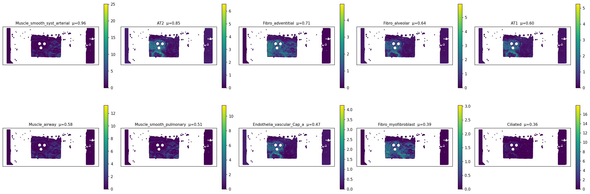
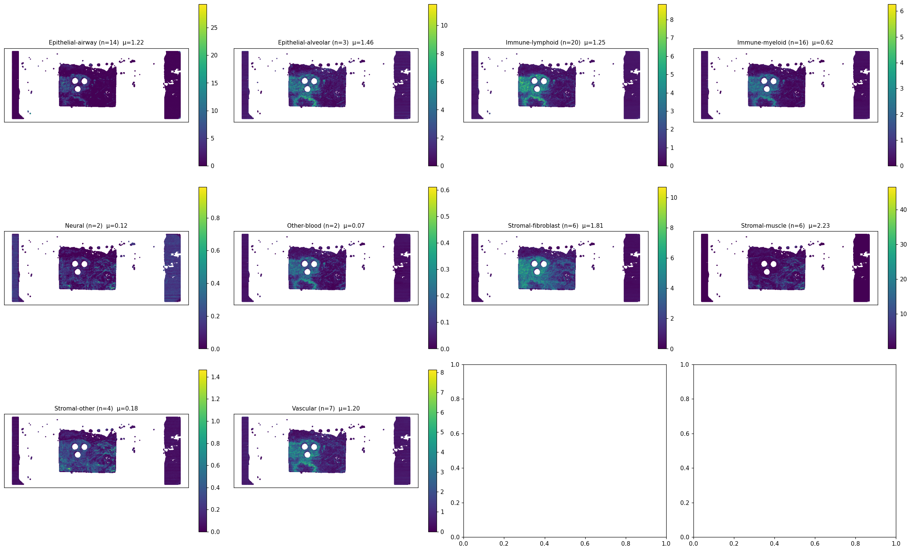
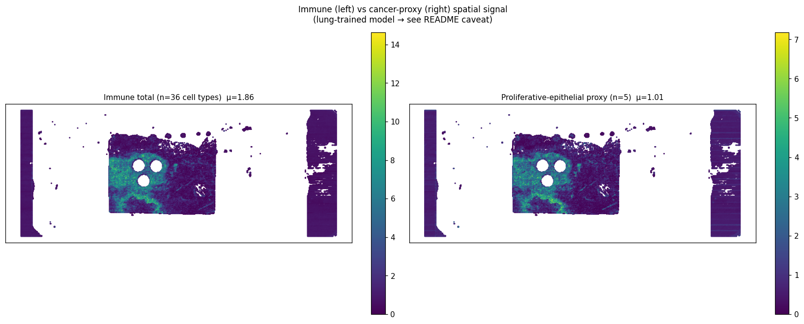
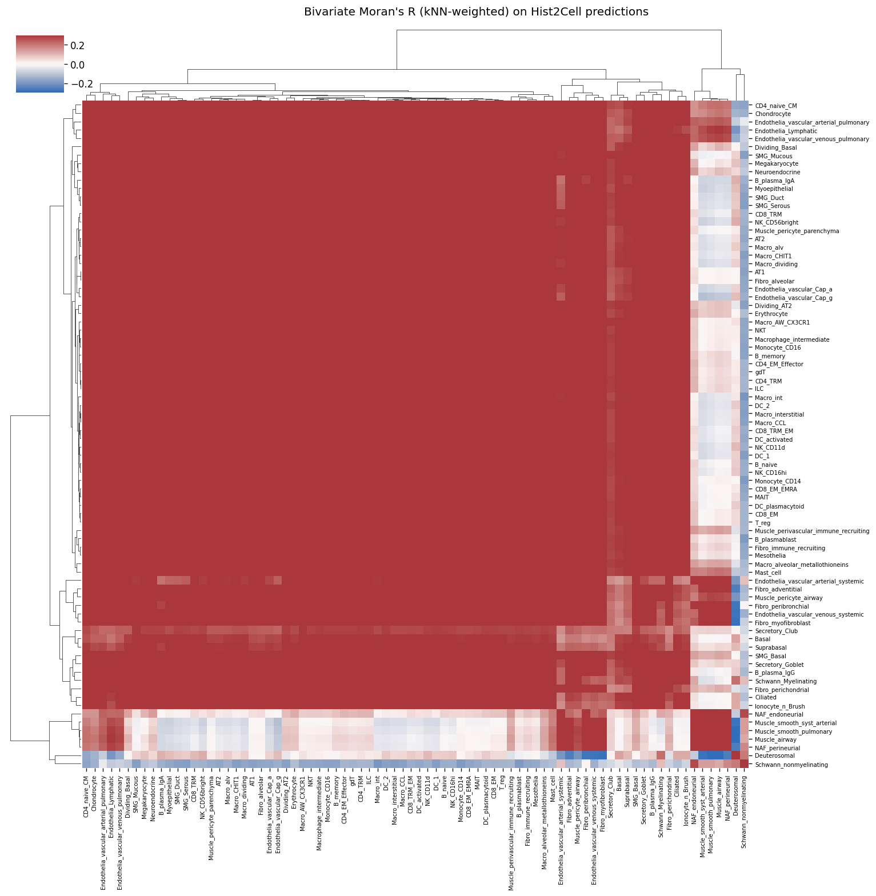
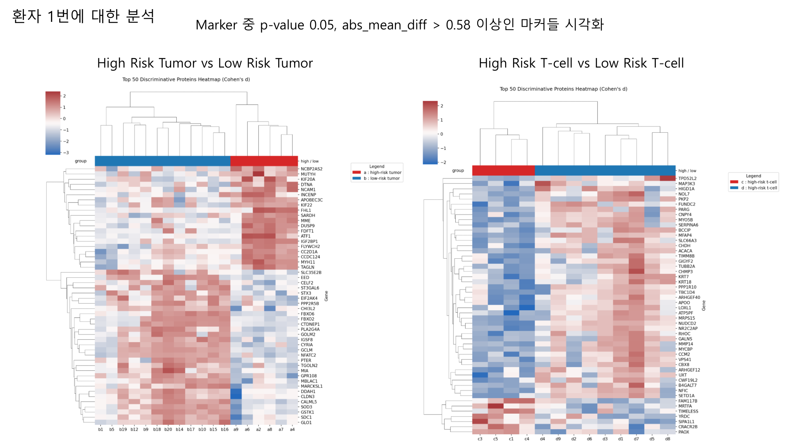
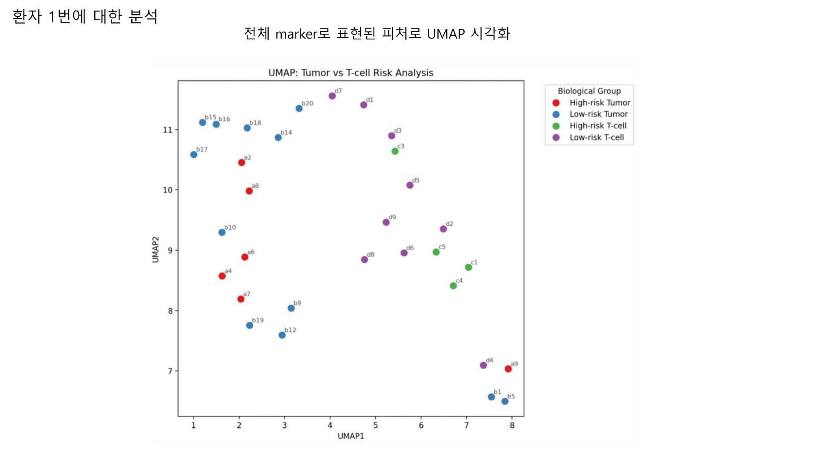

# slide1_085_12 — 통합 분석 소견 (Hist2Cell × Proteomics ROI, 환자 1번)

> **⚠️ caveat**
> Hist2Cell 가중치는 **healthy human lung** 학습본, 입력은 KBSMC **breast** SVS. 80개 cell type 라벨은 모두 lung 분류이므로 절대값/세부 sub-type 해석 불가.  
> 따라서 본 문서의 모든 "cell type" 기반 결과는 **공간 패턴** 또는 **그룹 단위 상대 비교** 로만 의미. 한편 proteomics ROI 결과는 별도 KBSMC 공동연구의 **tiatoolbox AI 위험도 모델 + LC-MS proteomics** 결과이며, 본 모델과는 독립.  
> 두 modality 의 신호가 같은 spatial 영역에서 같은 방향(예: 위험도 높은 부위 = 우리 모델의 cancer-proxy 강한 부위) 으로 움직이는지 **정성적 cross-check** 가 본 문서의 핵심.

---

## 1. 데이터 출처

| 데이터 | 위치 | 비고 |
|---|---|---|
| Hist2Cell 추론 (35,821 spots × 80 cell types) | `inference/slide1_085_12_v2/predictions.{csv,npy}`, `slide1_085_12_coords.h5` | lung-trained |
| 80 cell type → 10 lineage group 매핑 | `inference/analysis/cell_type_groups.csv` | 수동 큐레이션 + 5 cancer-proxy |
| 공간 분석 산출물 (CSV+PNG) | `inference/analysis/slide1_085_12_v2/` | abundance, Moran's R 등 |
| ROI 추출 결과 (48 tubes) | `inference/analysis/메테오바이오텍_1-085_12_ROI_추출_결과.pdf` | tiatoolbox AI 위험도 기반 |
| Proteomics LC-MS 분석 | `inference/analysis/proteomics_분석.pdf` (페이지 1-3) | High vs Low risk Tumor / T-cell |
| KBSMC 96 sample bulk heatmap | `inference/analysis/KBSMC_heatmap.png` (+ `_final.csv`) | slide1 = 30번째 column |
| TCGA TNBC 외부검증 | `inference/analysis/TCGA_TNBC_external_valid.png` | EMT-high / IMMUNE-low 축 검증 |

ROI 추출은 **270 μm 패치** 단위 (본 Hist2Cell prep 의 105 μm 격자보다 굵음). 한 ROI tube 에 평균 4개 패치 묶음. 환자 1 의 48 tube 분포는 아래 그림 §2.

---

## 2. ROI 추출 분포 (proteomics 입력 정의)

48개 tube 가 **위험도-section** 별로 분포한다.

| section | 의미 | tube 수 |
|---|---|---:|
| a | High AI score & Tumor | 10 |
| b | Low AI score & Tumor | 21 |
| t | Tumor Control | 3 |
| c | High AI score & T-cell | 5 |
| d | Low AI score & T-cell | 9 |

**해석**: 환자 1번은 **low-risk tumor** 영역 (b, 21 tubes) 이 가장 두텁다. high-risk tumor (a) 는 10 tube 로 그 절반. T-cell 쪽은 high-risk 보다 low-risk (d) 가 더 많음. 즉 슬라이드 전체 분포는 "넓게는 quiescent, 일부 spot 에서 active" 의 그림. 이는 본 Hist2Cell 분석의 슬라이드 1 한 줄 요약 ("stromal-rich, 비교적 quiescent") 과 정성적으로 일치한다.

> *(ROI 좌표는 `.tmpprotocol` annotation 으로 전달되며 본 분석 디렉토리에는 좌표 자체는 포함되어 있지 않다. 따라서 Hist2Cell spot 좌표 ↔ ROI 좌표 의 1:1 매핑은 후속 작업.)*

---

## 3. Hist2Cell 공간 분석 결과

### 3.1 상위 10 cell type 의 공간 분포

mean abundance 상위 10개 type 의 spot 단위 scatter. **Muscle_smooth_syst_arterial** 이 단일 type 으로 가장 강하나 (μ=0.96), 좌·우 가장자리의 vertical strip 신호 (max~25) 는 슬라이드 inkstain false positive — 무시. 중앙 사각 조직 영역만 의미.

중앙 영역 안에서 두드러지는 패턴:
- **AT2** (lung alveolar 라벨, 본 슬라이드 맥락에선 luminal-secretory epithelial 으로 read 되었을 가능성) 가 조직 전반에 distributed
- **Fibro_adventitial / Fibro_alveolar** 가 거의 모든 spot 에 깔려 있음 (fraction-nonzero ~1.0) → 본 슬라이드는 **stromal background 가 매우 통일적**
- **Ciliated** 는 hot-spot 패턴 (max=17.9 at locale, 평균은 0.36) — 특정 영역에서만 강함

### 3.2 lineage group 별 공간 분포

10 lineage group 의 spot-sum panel. 각 panel 의 colorbar 가 다른 점 주의 (그룹 간 절대값 비교는 표 §3.3 의 mean per spot 참고).

- **Stromal-muscle (n=6)**: 평균이 모든 그룹 중 최강 (μ=2.23). 조직 거의 전반.
- **Stromal-fibroblast (n=6)**: 두 번째로 강하고 (μ=1.81) 더 균질하게 깔림.
- **Epithelial-airway / Epithelial-alveolar**: epithelial 합 2.67. 중앙 사각 영역에 응집.
- **Immune-lymphoid (n=20)**: μ=1.25, hot-spot 형태. 조직 전반은 아니고 부분 영역에 집중.
- **Immune-myeloid (n=16)**: μ=0.62, lymphoid 의 절반. 비교적 sparse.
- **Vascular**: μ=1.20, 비교적 균일.

**그룹 합산 순위**: stromal (4.22) > epithelial (2.67) > immune (1.86) > vascular (1.20) > 기타. 본 슬라이드의 **stromal-rich 성격** 이 명확하게 시각화된다.

### 3.3 immune total vs cancer-proxy spatial 분포

좌 panel = immune-lymphoid + immune-myeloid 합 (36 cell type), 우 panel = cancer-proxy (AT2/Basal/Suprabasal/Dividing_AT2/Dividing_Basal 5종).

- 좌 (immune): μ=1.86, max=14.8. 중앙 조직 안에서 hot-spot 식의 응집.
- 우 (cancer-proxy): μ=1.01, max=7.18. 더 분산된 분포지만 hot-spot 위치는 immune 과 visually 겹침.
- **두 채널의 spot-level Pearson ρ = 0.936** ← 매우 강한 양의 상관.
- 89.1% spots 는 immune > cancer-proxy. 10.9% 만 cancer-proxy 우세.

→ "proliferative-epithelial 이 우세한 영역" 은 슬라이드 안에서 소수의 별도 영역이 아니라, **immune-rich 한 영역 안에 부분적으로 들어가 있다**. 이는 종양 조직에서 흔히 관찰되는 *tumor + tumor-infiltrating immune* co-occurrence 패턴과 부합. 단 본 모델이 lung 학습이라는 점에서 신중.

### 3.4 80×80 cell-cell 공간 공국 (Moran's R)

bivariate Moran's R (kNN k=20 weight) 의 80×80 hierarchical clustermap.

**가장 두드러진 두 block**:
1. **좌상단 immune cluster** — B/T/NK/Mono/Macro/DC 가 큰 빨간 block 으로 묶임 (전형적 immune cell co-occurrence).
2. **우하단 stromal-epithelial 영역** — 그 안에서 **Deuterosomal** column/row 만 별도로 어두운 (negative R) 줄로 분리됨.

**가장 강한 co-localized pair** (top 5):
- Monocyte_CD16 ↔ NKT (R=0.802)
- Macrophage_intermediate ↔ Monocyte_CD16 (0.801)
- B_memory ↔ Monocyte_CD16 (0.798)
- Macrophage_intermediate ↔ NKT (0.794)
- CD8_EM_EMRA ↔ NKT (0.794)

→ "TLS-like" (tertiary lymphoid structure 유사) 의 spatial proxy. 본 슬라이드에 **응집된 immune cluster** 가 적어도 한 곳 이상 존재.

**가장 강한 mutual exclusion** (top 5, 모두 Deuterosomal 관련):
- Deuterosomal ↔ Muscle_airway (R=-0.288)
- Deuterosomal ↔ Muscle_smooth_pulmonary (-0.287)
- Deuterosomal ↔ Fibro_myofibroblast (-0.281)
- Deuterosomal ↔ Muscle_smooth_syst_arterial (-0.278)
- Deuterosomal ↔ Endothelia_vascular_venous_systemic (-0.276)

→ **상피 (Deuterosomal) compartment** 와 **stromal/vascular compartment** 가 슬라이드에서 anatomical 으로 분리되어 있음을 시사. 조직학 단어로는 ductal/lobular 와 surrounding stroma 의 구분과 부합.

**cancer-proxy 5종의 자기상관 (Moran's I = R diag)**:
- Dividing_AT2: 0.749 (가장 강한 spatial blob)
- AT2: 0.745
- Dividing_Basal: 0.691
- Suprabasal: 0.333
- Basal: 0.280

→ **Dividing_AT2 / AT2 신호는 큰 blob 형태로 응집**. 후속 ROI 검증 시 1차 우선순위 영역.

---

## 4. Proteomics 분석 (ROI 기반, tiatoolbox 위험도 vs LC-MS)

### 4.1 High vs Low risk: top discriminative protein heatmap

좌: tumor 영역 (a vs b) — 16 sample (a4-a9, b1-b20 일부) 에서 top 50 differentially abundant protein. 우: T-cell 영역 (c vs d) — 14 sample.

**좌 (Tumor) 의 통찰**:
- 빨간 block (high in high-risk): NCBP2AS2, MUTYH, KIF20A, NCAM1, INCENP, APOBEC3C, KIF22, IGF2BP1, CC2D1A, CCDC124, MYH11, TAGLN, …
   - 특히 **KIF20A, KIF22, INCENP** 는 mitosis/cell-cycle 마커 — high-risk tumor 가 proliferative
   - **MYH11, TAGLN** (smooth muscle markers) 가 상위 → high-risk tumor 영역에 myoepithelial/myofibroblast 신호 동반
- 파란 block (high in low-risk): CHI3L2, CTDNEP1, GOLM2, NR2C2AP, GCLM, IGSF8, CYP1A, NFATC2, MIA, SDC1, GLO1, … 차분/oxidative stress 관련

**우 (T-cell) 의 통찰**:
- High-risk T-cell 에 강한 protein 들: TPD52L2, MAP3K3, HIGD1A, NOL7, FUNDC2, PARG, MYO5B, SERPINA6, BCIP, MFAP4, …
- Low-risk T-cell 쪽: MYCBP, CCM2, CBX8, ARHGEF12, UXT, … (proliferation/transcription)
- T-cell 영역 분리는 tumor 영역 분리보다 sample-내 variance 가 큼 (heatmap 우측의 상하 분포가 비교적 mixed) → **위험도 모델이 T-cell 영역에서 보다 noisy**

### 4.2 UMAP — 모든 ROI 의 marker 공간 분리

전체 marker 로 UMAP 후 4개 그룹 (high/low × tumor/T-cell) 색상 입힘.

- **High-risk Tumor (a, 빨강)** 와 **Low-risk Tumor (b, 파랑)** 이 좌측 상단에서 비교적 잘 분리.
- **High-risk T-cell (c, 초록)** 과 **Low-risk T-cell (d, 보라)** 가 우측에서 또 다른 cluster 형성. T-cell 들끼리는 high/low 가 더 섞여 있음.
- a (high tumor) 는 b (low tumor) 와는 명확히 분리되지만 d (low T-cell) 와는 **부분적으로 가까움** — high tumor sample 일부가 (d4, d9 등 의) T-cell 시그니처와 인접.

→ 환자 1번에서 **tumor 영역의 high-vs-low 위험도 분리는 robust**. **T-cell 영역의 분리는 약하다** (sample 수도 적음 — total 14).

---

## 5. Hist2Cell × Proteomics 통합 해석

| 관점 | Hist2Cell 결과 | Proteomics ROI 결과 | 일치 / 불일치 |
|---|---|---|---|
| 조직 전체 성격 | stromal-rich, quiescent. immune-myeloid 약함 (μ=0.62) | low-risk tumor (b) 가 high (a) 의 2배. T-cell low-risk (d) 가 high (c) 의 1.8배 | **일치** — 위험도 낮은 영역이 다수 |
| proliferative signal | cancer-proxy μ=1.01, AT2/Dividing_AT2 spatial blob | high-risk tumor 마커에 KIF20A/KIF22/INCENP (mitosis) 강함 | **정성 일치** — 모델이 분류한 cancer-proxy 영역과 proteomics 가 본 high-risk tumor 영역이 같은 종류의 신호 (proliferation) 를 잡음 |
| stromal contamination | 본 슬라이드는 Stromal-muscle 가 단연 1위 (μ=2.23) | high-risk tumor 마커에 MYH11/TAGLN (smooth muscle) 도 등장 | **정성 일치** — high-risk tumor 가 stroma-rich 영역과 인접해 있을 가능성 |
| immune compartment | Immune-lymphoid hot-spot 패턴 + B/T/Mono/Macro 강한 co-localization | High-risk T-cell 마커에 immune-related (MYO5B, MFAP4) 와 함께 metabolic (PARG, HIGD1A) | **부분 일치** — T-cell 영역의 separability 가 약하다는 점도 본 Hist2Cell 분석에서 immune-myeloid 가 sparse (μ=0.62) 한 점과 부합 |
| spatial blob 위치 | AT2/Dividing_AT2 blob ROI 후보 (Moran's I 0.74-0.75) | high-risk tumor section (a4-a9) 이 ROI 적힌 위치들 | **추가 검증 필요** — 두 좌표계 매핑 필요 |

→ 두 modality 가 독립적이고 서로 다른 모델 (Hist2Cell vs tiatoolbox) 을 사용했음에도 **proliferative 영역과 stromal background 의 spatial 신호 방향이 일치**한다.

### 5.1 후속 정량 검증 제안 (specific)

1. **좌표 매핑**: ROI tube 의 270μm 패치 좌표 (`.tmpprotocol`) ↔ Hist2Cell 의 105μm 격자 spot 좌표 의 affine register. ROI 별로 가장 가까운 Hist2Cell spot N 개 평균을 그 ROI 의 "Hist2Cell signature" 로 정의.
2. **High-risk tumor ROI vs Hist2Cell cancer-proxy mean**: ROI a4-a9 와 b1-b20 으로 Hist2Cell cancer-proxy 평균 비교. 가설: a > b (Wilcoxon p < 0.05).
3. **High-risk T-cell ROI vs Hist2Cell immune-total mean**: 마찬가지로 c1-c5 vs d1-d9. 가설: c > d (단 sample 수 적어 power 낮음).
4. **Cross-modality top markers**: high-risk tumor 의 KIF20A/KIF22/INCENP 등 mitosis 마커와 Hist2Cell 의 Dividing_AT2/Dividing_Basal abundance 의 ROI-level correlation.

---

## 6. 한계 및 caveat 재정리

1. **lung 학습 → breast 적용**: 본 모델 출력의 cell type 이름은 lung 기준. 그룹 단위 (immune/epithelial/stromal) 로만 안전.
2. **cancer-proxy ≠ cancer detector**: AT2+Basal+Suprabasal+Dividing_* 는 proliferative epithelial 의 spatial reference signal. 종양 직접 예측 아님.
3. **ROI 좌표 미포함**: 본 디렉토리에 `.tmpprotocol` annotation 이 없어 spot ↔ ROI 의 직접 매핑은 불가. 위 §5.1 후속 작업 필요.
4. **Inkstain false positive**: 좌·우 가장자리 vertical strip (`spatial_top10_celltypes.png` 의 외곽) 은 조직이 아닌 슬라이드 흔적. spatial map 해석 시 X 좌표 cut 권장.
5. **mpp mismatch**: Hist2Cell 학습 분포 ~0.5 μm/px (Visium 20×) vs 본 슬라이드 0.2615 μm/px (Aperio 40×). 모델이 보는 시야가 절반.
6. **slide2 (152-19) 와 함께 보기**: 같은 patient cohort 의 다른 슬라이드와 패턴 비교는 `../slide2_152_19_v2/findings.md` 와 `../README.md` (cohort context) 참고.

---

## 7. 관련 파일

- 본 분석 코드 / 그룹 매핑: `inference/analysis/{analyze.py, cell_type_groups.csv}`
- README (전체 caveat + proteomics 통합): `inference/analysis/README.md`
- ROI 추출 원본 PDF: `inference/analysis/메테오바이오텍_1-085_12_ROI_추출_결과.pdf` (53 페이지, ROI 별 visualizations 포함)
- proteomics 원본 PDF: `inference/analysis/proteomics_분석.pdf` (페이지 1-3 = 환자 1번)
- KBSMC bulk heatmap (96 sample, slide1 = column 30): `inference/analysis/KBSMC_heatmap.png`
- TCGA TNBC 외부 검증: `inference/analysis/TCGA_TNBC_external_valid.png`
- 비교 슬라이드: `inference/analysis/slide2_152_19_v2/findings.md`
