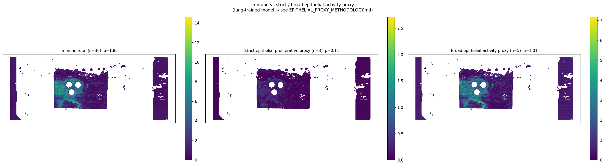

# slide1_085_12 — 통합 분석 소견 (Hist2Cell × Proteomics ROI, 환자 1번)

> **⚠️ caveat (먼저)**
> Hist2Cell 가중치는 **healthy human lung** 학습본, 입력은 KBSMC **breast** SVS. 80개 cell type 라벨은 모두 lung 분류 — 절대값/세부 sub-type 해석 불가, **공간 패턴 / 그룹 단위 상대 비교** 로만 사용. 본 문서에서 "epithelial-activity proxy" 는 lung-derived spatial proxy 이지 **breast tumor detector 가 아님** (`../EPITHELIAL_PROXY_METHODOLOGY.md` 의 strict/broad 2-score 설계 참조). proteomics ROI 결과는 KBSMC 공동연구의 tiatoolbox 위험도 + LC-MS 로 본 모델과 독립.

---

## 1. 데이터 출처

| 데이터 | 위치 | 비고 |
|---|---|---|
| Hist2Cell 추론 (35,821 spots × 80 cell types) | `inference/slide1_085_12_v2/predictions.{csv,npy}` | lung-trained |
| Cell type → lineage group + strict/broad proxy flag | `inference/analysis/cell_type_groups.csv` | strict 3종 / broad 5종 |
| 공간 분석 산출물 | `inference/analysis/slide1_085_12_v2/` | abundance, Moran's R |
| ROI 추출 (48 tubes) | `inference/analysis/메테오바이오텍_1-085_12_ROI_추출_결과.pdf` | tiatoolbox 위험도 기반 |
| Proteomics LC-MS | `inference/analysis/proteomics_분석.pdf` 페이지 1-3 | high vs low risk |
| 방법론 근거 | `inference/analysis/EPITHELIAL_PROXY_METHODOLOGY.md` | 본 결과 해석의 기반 |

---

## 2. ROI 추출 분포

| section | 의미 | tubes |
|---|---|---:|
| a | High AI score & Tumor | 10 |
| b | Low AI score & Tumor | 21 |
| t | Tumor Control | 3 |
| c | High AI score & T-cell | 5 |
| d | Low AI score & T-cell | 9 |

low-risk Tumor (b=21) > high-risk (a=10) → 슬라이드 전반은 *quiescent dominant*. 본 Hist2Cell 분석의 broad-proxy 우세 spot 10.9% (소수 dominant) 패턴과 정성 일치.

---

## 3. Hist2Cell 공간 분석 결과

### 3.1 상위 10 cell type

| 순위 | cell type | mean | max | fraction>0 |
|---:|---|---:|---:|---:|
| 1 | Muscle_smooth_syst_arterial | 0.964 | 25.08 | 0.846 |
| 2 | AT2 | 0.848 | 6.57 | 0.797 |
| 3 | Fibro_adventitial | 0.709 | 4.96 | 1.000 |
| 4 | Fibro_alveolar | 0.639 | 5.96 | 0.873 |
| 5 | AT1 | 0.599 | 5.27 | 0.853 |
| 6 | Muscle_airway | 0.580 | 13.27 | 0.812 |
| 7 | Muscle_smooth_pulmonary | 0.508 | 11.49 | 0.872 |
| 8 | Endothelia_vascular_Cap_a | 0.472 | 4.22 | 0.838 |
| 9 | Fibro_myofibroblast | 0.393 | 3.03 | 0.829 |
| 10 | Ciliated | 0.365 | 17.91 | 0.483 |

좌·우 가장자리의 vertical strip 신호 (Muscle_smooth_syst_arterial max=25) 는 슬라이드 inkstain false positive — 중앙 사각 조직 영역만 의미. 중앙 안에서는 Stromal-muscle / Fibro / AT2 가 distributed 형태.

### 3.2 lineage group + 두 proxy score

| group / pseudo-group | n | mean / spot | fraction>0 |
|---|---:|---:|---:|
| Stromal-muscle | 6 | **2.227** | 1.000 |
| Stromal-fibroblast | 6 | 1.814 | 1.000 |
| Epithelial-alveolar | 3 | 1.458 | 0.995 |
| Immune-lymphoid | 20 | 1.245 | 0.999 |
| Epithelial-airway | 14 | 1.215 | 1.000 |
| Vascular | 7 | 1.200 | 1.000 |
| **Broad epithelial-activity proxy** | 5 | **1.013** | 0.999 |
| Immune-myeloid | 16 | 0.619 | 0.997 |
| Stromal-other | 4 | 0.178 | 0.998 |
| Neural | 2 | 0.122 | 0.891 |
| **Strict epithelial-proliferative proxy** | 3 | **0.108** | 0.986 |
| Other-blood | 2 | 0.066 | 0.972 |

**그룹 합산 순위**: Stromal-muscle 1위 — slide1 의 **stromal-rich 성격** 명확. broad-proxy (1.01) vs strict-proxy (0.11) 의 차이가 큰데, 이는 **broad 의 약 90% 가 AT2 + Suprabasal 의 기여** (`is_broad_proxy=1` 의 5종 중 AT2/Suprabasal 이 broad-only). 즉 broad-proxy 신호는 사실상 AT2 신호.

### 3.3 immune vs strict / broad epithelial-activity proxy

| 지표 | immune total | strict proxy | broad proxy |
|---|---:|---:|---:|
| mean / spot | 1.864 | 0.108 | 1.013 |
| max | 14.78 | — | 7.18 |
| spots-dominant vs immune | — | **0.35%** | **10.87%** |
| Pearson ρ (vs immune) | — | **0.700** | **0.936** |

**핵심 발견 — strict vs broad 가 다른 그림을 그림**:
- **broad** (5-type) 는 immune 과 ρ=0.94 로 거의 같은 공간에 — broad-dominant 10.87% 의 영역은 immune-rich 영역 안에 mostly nested.
- **strict** (3-type, Basal/Dividing_AT2/Dividing_Basal) 은 immune 과 ρ=0.70, strict-dominant 는 **0.35% (소수)**. 즉 strict 한 정의로는 본 슬라이드의 "epithelial-proliferative dominant" 영역이 거의 없음.
- 두 score 의 차이는 **AT2 + Suprabasal 의 기여** — broad 의 큰 부분이 AT2 (top10 의 #2, μ=0.85) 에서 나옴. AT2 는 cross-tissue 매핑이 가설 수준이라, broad-proxy 결과 해석 시 *Suprabasal/AT2 의존성* 명심 필요.

### 3.4 80×80 cell-cell 공간 공국 (Moran's R)

**Strict proxy types — 자기상관 (Moran's I)**:

| label | R | 신뢰도 (methodology §3) |
|---|---:|---|
| Dividing_AT2 | 0.749 | strict 최고, 강한 spatial blob |
| Dividing_Basal | 0.691 | strict, 강한 blob |
| Basal | 0.280 | strict 약함 — 분포 dispersed |

**Broad-only types** (cross-tissue 매핑 신뢰도 낮음):

| label | R | 비고 |
|---|---:|---|
| AT2 | 0.745 | 단독 spatial blob 강함 (broad signal 의 핵심) |
| Suprabasal | 0.333 | 약함, dispersed |

→ slide1 의 epithelial-activity hot-spot 은 주로 **AT2 + Dividing_AT2** (둘 다 alveolar lineage) 의 공동 신호. Dividing_Basal 도 blob 형성. **strict 만 보면 hot-spot 은 Dividing_AT2/Basal blob 뿐**, broad 를 추가하면 AT2/Suprabasal blob 까지 포함되어 영역이 확장.

**Top 5 positive co-localized pairs** (immune cluster):
| A | B | R |
|---|---|---:|
| Monocyte_CD16 | NKT | 0.802 |
| Macrophage_intermediate | Monocyte_CD16 | 0.801 |
| B_memory | Monocyte_CD16 | 0.798 |
| Macrophage_intermediate | NKT | 0.794 |
| CD8_EM_EMRA | NKT | 0.794 |

→ B-T-Mono-Macro co-localization (TLS-like). slide1 에 응집된 immune cluster 존재.

**Top 5 negative (mutual exclusion)**: 모두 Deuterosomal ↔ Muscle/Fibro/Vascular — 상피 (Deuterosomal) compartment 와 stromal/vascular compartment 의 anatomical 분리.

---

## 4. Proteomics 분석 (ROI 기반)

### 4.1 High vs Low risk: top discriminative protein heatmap

- 좌 (Tumor a vs b): high-risk 마커에 **KIF20A, KIF22, INCENP** (mitosis) + **MYH11, TAGLN** (smooth muscle) 강함 — proliferative + stroma-인접.
- 우 (T-cell c vs d): T-cell 분리 약함 (sample 적음, total 14).

### 4.2 UMAP

High vs Low Tumor 비교적 잘 분리, T-cell 영역은 mixed.

---

## 5. Hist2Cell × Proteomics 통합 해석

| 관점 | Hist2Cell | Proteomics | 일치 / 부분 일치 / 검증 필요 |
|---|---|---|---|
| 전체 활성도 | broad-proxy 10.9% (소수 dominant) | low-risk Tumor (b:21) ≫ high-risk (a:10) | **일치** — quiescent dominant |
| stromal context | Stromal-muscle 1위 (μ=2.23), Fibro #2 | high-risk Tumor 마커에 MYH11/TAGLN | **일치** — high-risk tumor stroma-인접 |
| proliferative signal | Dividing_AT2 / Dividing_Basal blob (Moran R 0.75/0.69, strict 포함) | high-risk Tumor 마커에 KIF20A/22/INCENP (mitosis) | **정성 일치** — strict 의 cell-cycle 신호와 proteomics mitosis marker 가 같은 방향 |
| immune compartment | TLS-like B/T/Mono/Macro 응집 | T-cell 분리 약함 | **부분 일치** — Hist2Cell 은 응집 detect, proteomics 는 sample 수 한계 |
| AT2 의 의미 | broad-proxy 의 핵심 (immune 과 ρ=0.94) | proteomics 에 직접 AT2 marker 없음 | **검증 필요** — AT2 spatial 신호의 breast 맥락 의미는 CUCA her2st 후 확인 |

→ 두 modality 가 같은 방향 (low-risk dominant + 일부 proliferative blob + stroma-인접) 보고. 단 **broad-proxy 가 신호의 90% 를 AT2 에서 가져온다는 점이 결론 robustness 의 critical 부분** — AT2 의 cross-tissue 해석이 가설 수준이라 strict-proxy 만으로 재검증 권장. 본 슬라이드에서는 strict 도 약한 dominance (0.35%) 이지만 hot-spot (Dividing_AT2/Basal blob) 은 보존되어 결론 큰 변화 없음.

### 5.1 후속 정량 검증 제안

1. **좌표 매핑** — ROI 270μm 패치 ↔ Hist2Cell 105μm spot 의 affine register.
2. **High vs Low Tumor ROI 의 strict / broad proxy mean Wilcoxon** — 가설 strict(a) > strict(b), broad(a) > broad(b). 두 score 모두 같은 방향이면 결론 강함.
3. **KIF20A / KIF22 / INCENP ↔ Dividing_AT2 / Dividing_Basal abundance** — ROI-level Pearson ρ.
4. **CUCA her2st 도착 후 mammary epithelial (3종) score 와 strict/broad score 의 spatial overlap** — 본 lung-proxy 의 cross-tissue 타당성 직접 검증.

---

## 6. 한계 및 caveat

1. **lung 학습 → breast 적용** — 그룹/공간 단위만 신뢰.
2. **strict vs broad 차이는 결론 robustness 의 척도** — slide1 은 두 score 일치 방향성 robust.
3. **AT2 cross-tissue 매핑은 가설** — broad-proxy 결과는 strict 와 함께 봐야 정확.
4. **ROI 좌표 미포함** — 정량 검증은 좌표 도착 후.
5. **Inkstain false positive (~5%)** — 좌·우 가장자리 vertical strip.
6. **mpp / tile_size mismatch** — Visium 학습 vs Aperio 적용, 절대값 비교 금지.
7. **n=2 환자** — cross-patient generalization 통계적으로 불가.

---

## 7. 관련 파일

- 본 분석 코드 / groups CSV: `inference/analysis/{analyze.py, cell_type_groups.csv}`
- **방법론 근거 (필수)**: `inference/analysis/EPITHELIAL_PROXY_METHODOLOGY.md`
- README (전체 caveat + cohort): `inference/analysis/README.md`
- ROI 추출 원본 PDF: `inference/analysis/메테오바이오텍_1-085_12_ROI_추출_결과.pdf`
- proteomics 원본 PDF: `inference/analysis/proteomics_분석.pdf` 페이지 1-3
- KBSMC 96 sample bulk (slide1 = column 30): `inference/analysis/KBSMC_heatmap.png`
- 비교 슬라이드: `inference/analysis/slide2_152_19_v2/findings.md`
- Filter 적용 분석: `inference/analysis_filtered/slide1_085_12_v2/findings.md`
