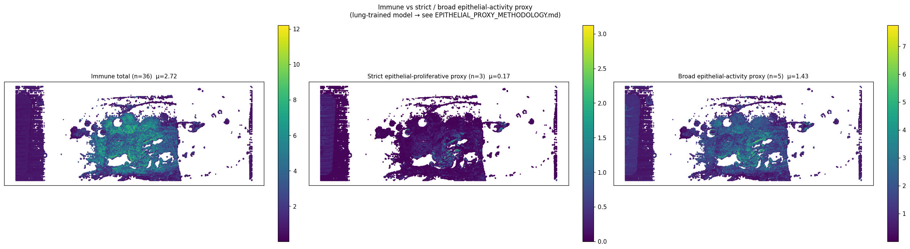

# slide2_152_19 — 통합 분석 소견 (Hist2Cell × Proteomics ROI, 환자 2번)

> **⚠️ caveat (먼저)**
> Hist2Cell 가중치는 **healthy human lung** 학습본, 입력은 KBSMC **breast** SVS. 80개 cell type 라벨은 모두 lung 분류 — 절대값/세부 sub-type 해석 불가, **공간 패턴 / 그룹 단위 상대 비교** 로만 사용. 본 문서에서 "epithelial-activity proxy" 는 lung-derived spatial proxy 이지 **breast tumor detector 가 아님** (`../EPITHELIAL_PROXY_METHODOLOGY.md` 의 strict/broad 2-score 설계 참조). proteomics ROI 결과는 KBSMC 공동연구의 tiatoolbox 위험도 + LC-MS 로 본 모델과 독립.

---

## 1. 데이터 출처

| 데이터 | 위치 | 비고 |
|---|---|---|
| Hist2Cell 추론 (40,502 spots × 80 cell types) | `inference/slide2_152_19_v2/predictions.{csv,npy}` | lung-trained |
| Cell type → lineage group + strict/broad proxy flag | `inference/analysis/cell_type_groups.csv` | strict 3종 / broad 5종 |
| 공간 분석 산출물 | `inference/analysis/slide2_152_19_v2/` | abundance, Moran's R |
| ROI 추출 (48 tubes) | `inference/analysis/메테오바이오텍_1_152_19_ROI_추출_결과.pdf` | tiatoolbox 위험도 기반 |
| Proteomics LC-MS | `inference/analysis/proteomics_분석.pdf` 페이지 4-6 | high vs low risk |
| 방법론 근거 | `inference/analysis/EPITHELIAL_PROXY_METHODOLOGY.md` | 본 결과 해석의 기반 |

---

## 2. ROI 추출 분포

| section | 의미 | tubes |
|---|---|---:|
| e | High AI score & Tumor | 13 |
| f | Low AI score & Tumor | 15 |
| v | Tumor Control | 5 |
| g | High AI score & T-cell | 7 |
| h | Low AI score & T-cell | 8 |

환자 1 (a:10, b:21) 보다 high/low 비율이 균형적 (e:13, f:15). 슬라이드 안에 high-risk 영역 더 많이 분포 → Hist2Cell 의 broad-proxy 우세 spot 17.7% (환자 1 의 1.6배) 와 같은 방향.

---

## 3. Hist2Cell 공간 분석 결과

### 3.1 상위 10 cell type

| 순위 | cell type | mean | max | fraction>0 |
|---:|---|---:|---:|---:|
| 1 | Ciliated | 1.215 | 20.74 | 0.806 |
| 2 | AT2 | 1.102 | 6.13 | 0.890 |
| 3 | Fibro_alveolar | 0.812 | 5.43 | 0.929 |
| 4 | AT1 | 0.684 | 4.63 | 0.886 |
| 5 | Endothelia_vascular_Cap_a | 0.582 | 3.56 | 0.939 |
| 6 | Muscle_smooth_syst_arterial | 0.458 | 14.20 | 0.679 |
| 7 | Fibro_adventitial | 0.441 | 3.74 | 0.926 |
| 8 | Endothelia_vascular_Cap_g | 0.412 | 2.52 | 0.927 |
| 9 | Secretory_Goblet | 0.382 | — | — |
| 10 | Muscle_airway | 0.359 | 10.43 | 0.687 |

**환자 1 과 가장 큰 차이**: 상위 1, 2, 3 위가 모두 **epithelial 계열** (Ciliated, AT2, Fibro_alveolar) — epithelial-rich. 환자 1 은 Muscle 1위였다. breast 맥락에서 Ciliated 의 max=20.7 (lung airway cilia 라벨이지만 luminal-secretory ductal 의 cross-tissue similar morphology 로 read 가능 — 가설 수준).

### 3.2 lineage group + 두 proxy score

| group / pseudo-group | n | mean / spot | fraction>0 |
|---|---:|---:|---:|
| **Epithelial-airway** | 14 | **2.706** | 1.000 |
| Epithelial-alveolar | 3 | 1.802 | 0.999 |
| Immune-lymphoid | 20 | 1.637 | 1.000 |
| Stromal-fibroblast | 6 | 1.488 | 1.000 |
| **Broad epithelial-activity proxy** | 5 | **1.427** | 1.000 |
| Vascular | 7 | 1.312 | 0.994 |
| Stromal-muscle | 6 | 1.194 | 0.989 |
| Immune-myeloid | 16 | 1.087 | 1.000 |
| **Strict epithelial-proliferative proxy** | 3 | **0.168** | 0.999 |
| Stromal-other | 4 | 0.145 | 0.861 |
| Other-blood | 2 | 0.092 | 0.973 |
| Neural | 2 | 0.081 | 0.716 |

Epithelial-airway 단독 1위 (μ=2.71). Epithelial 합 (airway + alveolar = 4.51) 이 환자 1 (2.67) 의 1.7배. Immune 합 (lymphoid + myeloid = 2.72) 도 환자 1 (1.86) 의 1.5배 → 환자 2 는 epithelial-rich + immune 강함.

**strict (0.168) vs broad (1.427)** — 차이가 매우 큼. broad-proxy 의 88% 가 AT2 + Suprabasal (broad-only) 에서 옴 → **broad-proxy 신호 = 사실상 AT2 신호** in slide2.

### 3.3 immune vs strict / broad epithelial-activity proxy

| 지표 | immune total | strict proxy | broad proxy |
|---|---:|---:|---:|
| mean / spot | 2.723 | 0.168 | 1.427 |
| max | 15.43 | — | 7.74 |
| spots-dominant vs immune | — | **0.04%** | **17.69%** |
| Pearson ρ (vs immune) | — | **0.251** | **0.816** |

**환자 2 의 가장 중요한 발견 — strict 와 broad 가 매우 다른 그림**:
- **broad** 는 immune 과 ρ=0.82, broad-dominant 17.69% (환자 1 의 1.6배) → "proliferative-epithelial 영역과 immune 분리 + 그 영역이 환자 1 의 1.6배" 인 듯한 신호
- **strict** (Basal/Dividing_AT2/Dividing_Basal) 은 immune 과 ρ=0.25, strict-dominant **0.04% (거의 0)** → 강력하게 방어 가능한 cell-cycle 표현형의 dominant 영역은 본 슬라이드에 **사실상 없음**

→ **이전 버전 분석의 "환자 2 는 cancer-proxy 영역이 환자 1 의 1.6배" 결론은 broad-proxy 의 AT2 + Suprabasal 신호에 거의 전적으로 의존**. strict 만 보면 cell-cycle dominant 영역은 거의 0% → AT2/Suprabasal 의 cross-tissue 해석에 결론이 절대적으로 의존. methodology §3 의 broad-only 신뢰도 (낮음) 와 직접 연결.

### 3.4 80×80 cell-cell 공간 공국 (Moran's R)

**Strict proxy types**:
| label | R | 신뢰도 |
|---|---:|---|
| Dividing_AT2 | 0.629 | strict, blob 형성 |
| Dividing_Basal | 0.579 | strict, blob |
| Basal | 0.475 | strict, 약함 |

**Broad-only types**:
| label | R | 비고 |
|---|---:|---|
| AT2 | 0.682 | strong blob (broad 핵심) |
| Suprabasal | 0.523 | blob 형성 |

모든 strict + broad-only 라벨이 0.4 이상의 자기상관 → spatial blob 형성. AT2 가 가장 강한 단일 spatial signal.

**Top 5 positive Moran R pairs**:
| A | B | R |
|---|---|---:|
| B_memory | DC_1 | 0.780 |
| B_memory | Monocyte_CD14 | 0.779 |
| B_memory | Monocyte_CD16 | 0.778 |
| B_memory | CD8_EM_EMRA | 0.775 |
| DC_1 | Macro_int | 0.774 |

→ **B 세포 중심 immune cluster** (환자 1 의 Monocyte 중심과 차별). TLS-like 신호.

**Top 5 negative (mutual exclusion) — 모두 Secretory_Goblet 관련**:
| A | B | R |
|---|---|---:|
| CD4_naive_CM | Secretory_Goblet | -0.357 |
| NKT | Secretory_Goblet | -0.342 |
| B_memory | Secretory_Goblet | -0.340 |
| CD8_EM_EMRA | Secretory_Goblet | -0.340 |
| Monocyte_CD14 | Secretory_Goblet | -0.338 |

→ **Goblet (mucinous epithelial) ↔ immune** 의 강한 spatial 분리. lung 맥락의 mucinous airway, breast 맥락 가설 = mucinous ductal carcinoma 또는 mucinous metaplasia 영역.

---

## 4. Proteomics 분석 (ROI 기반)

### 4.1 High vs Low risk: top discriminative protein heatmap

- 좌 (Tumor e vs f): high-risk 마커에 **GZMH, LCK, SP110** (immune!) + cytoskeleton (MAPK12, MARK3) → 환자 2 의 high-risk tumor 는 단순 proliferation 보다 **immune-mixed compartment**.
- 우 (T-cell g vs h): high-risk 에 **TFAP2C** (mammary epithelial transcription factor!) — 환자 2 specific.

### 4.2 UMAP

High vs Low Tumor 분리 약함 (환자 1 보다). 일부 high-risk Tumor sample 이 T-cell signature 와 가까움 → tumor-immune co-occurrence.

---

## 5. Hist2Cell × Proteomics 통합 해석

| 관점 | Hist2Cell (strict / broad) | Proteomics | 일치 / 부분 / 검증 |
|---|---|---|---|
| 전체 활성도 | broad-proxy 17.7% (환자 1 의 1.6배) BUT strict-proxy 0.04% | high/low Tumor 균형 (e:13, f:15) | **broad 일치 / strict 약함** — broad 결론은 AT2 의존 |
| epithelial-rich | Epi-airway μ=2.71 (단독 1위) + Ciliated/AT2/Goblet | high-risk T-cell 마커 TFAP2C (mammary epithelial!) | **일치** — proteomics 가 epithelial 침윤 동반 |
| immune compartment | B_memory 중심 cluster (TLS-like) | high-risk T-cell separability 약, BUT TFAP2C 등 epithelial-mixed | **부분 일치** — Hist2Cell 응집 detect, proteomics 는 mixed compartment |
| Goblet ↔ immune mutual exclusion | Moran R top 5 음수 모두 Goblet ↔ immune | proteomics 에 mucin 직접 측정 없음 | **검증 필요** — MUC1/MUC5AC 추가 IHC |
| proliferative signal | strict (Dividing_AT2/Basal blob R 0.50-0.63) BUT immune 과 ρ=0.25 만 | high-risk Tumor 마커 GZMH/LCK (immune!) + MAPK12/MARK3 | **부분 일치** — strict 신호 약하지만 hot-spot blob 은 존재, proteomics 의 immune-mixed Tumor 와 spatial overlap 검증 필요 |

→ **환자 2 의 핵심 메시지**: 두 modality 모두 슬라이드 2 가 **환자 1 보다 active + epithelial-rich + immune 강함** 을 보고. 단 Hist2Cell 의 "broad-proxy 17.7%" 가 매우 인상적 결과이지만 **strict 으로 재검증 시 사실상 0%** — 본 결론의 robust 부분은 *AT2 hot-spot blob* + *Goblet ↔ immune mutual exclusion* + *B-cell TLS* 정도이며, "cancer-proxy 우세 영역 17.7%" 라는 표현은 외부 reader 에게 단순화시켜 전달하지 말 것 (broad-AT2 의존이 절대적).

### 5.1 환자 2 만의 특이 신호

1. **TFAP2C ↔ Hist2Cell epithelial-airway hot-spot** — mammary epithelial transcription factor 가 high-risk T-cell ROI 에 강하다는 proteomics 신호와, Hist2Cell 의 epithelial-airway 영역의 spatial overlap 검증 권장.
2. **Goblet ↔ immune mutual exclusion** — mucinous compartment 의 신호. proteomics 의 mucin (MUC1/MUC5AC) 직접 측정 + IHC 권장.
3. **PTEN high in high-risk T-cell** — PTEN loss = 보통 high-risk 와 반대 — 환자 2 specific 이상 신호. 후속 IHC.

### 5.2 후속 정량 검증 제안

1. **좌표 매핑**: ROI 270 μm 패치 ↔ Hist2Cell 105 μm spot affine register.
2. **High vs Low Tumor ROI 의 strict & broad mean Wilcoxon**: 가설 — broad(e) > broad(f) (effect size 큼). strict 도 같은 방향이면 본 결론 robust.
3. **GZMH/LCK ↔ Immune-myeloid + Macro_int abundance** — ROI-level ρ.
4. **TFAP2C ↔ Epithelial-airway + (CUCA her2st 후) mammary epithelial abundance** — 직접 spatial overlap.
5. **Secretory_Goblet hot-spot 영역 단독 분석** — mucinous compartment 의 단백질 측정 권장.

---

## 6. 한계 및 caveat

1. **lung 학습 → breast 적용** — 그룹/공간 단위만 신뢰.
2. **broad-proxy 17.7% 는 AT2 의존 — strict 결과로 cross-check 권장**.
3. **lung Ciliated/Goblet 신호의 breast 맥락 의미는 가설** — luminal/mucinous epithelial 의 cross-tissue similar morphology 일 수 있으나, 직접 라벨 측정 아님. CUCA her2st 가중치로 검증.
4. **ROI 좌표 미포함** — 정량 검증은 좌표 후.
5. **mpp / tile_size mismatch** — 절대값 비교 금지.
6. **slide label false positive (~5%)**: 가장자리 효과.
7. **n=2 환자** — cross-patient generalization 불가.

---

## 7. 관련 파일

- 본 분석 코드 / groups CSV: `inference/analysis/{analyze.py, cell_type_groups.csv}`
- **방법론 근거 (필수)**: `inference/analysis/EPITHELIAL_PROXY_METHODOLOGY.md`
- README (전체 caveat + cohort): `inference/analysis/README.md`
- ROI 추출 원본 PDF: `inference/analysis/메테오바이오텍_1_152_19_ROI_추출_결과.pdf`
- proteomics 원본 PDF: `inference/analysis/proteomics_분석.pdf` 페이지 4-6
- KBSMC 96 sample bulk (slide2 = column 3): `inference/analysis/KBSMC_heatmap.png`
- 비교 슬라이드: `inference/analysis/slide1_085_12_v2/findings.md`
- Filter 적용 분석: `inference/analysis_filtered/slide2_152_19_v2/findings.md`
