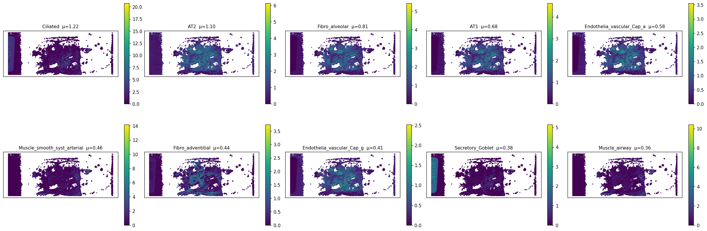
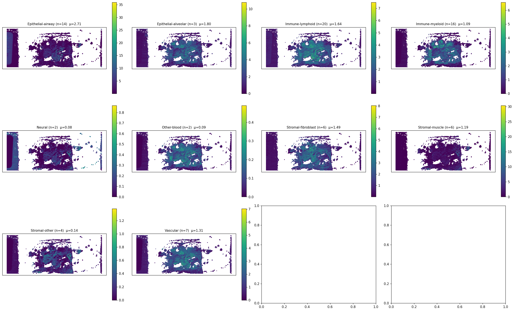
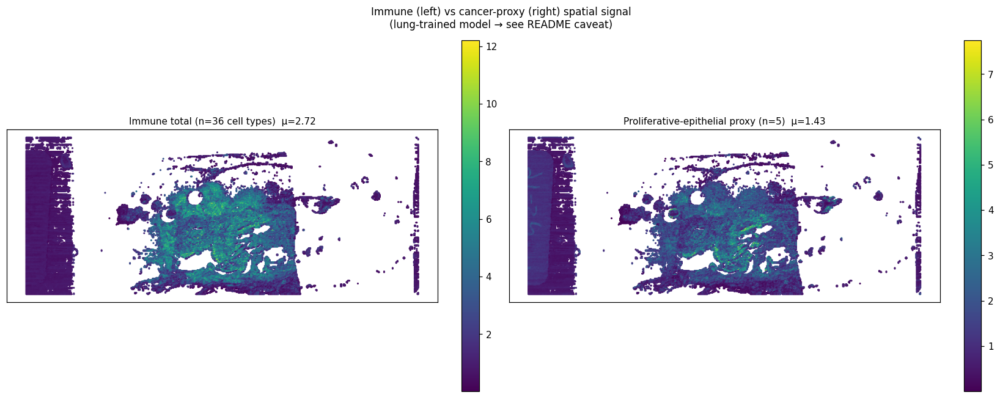
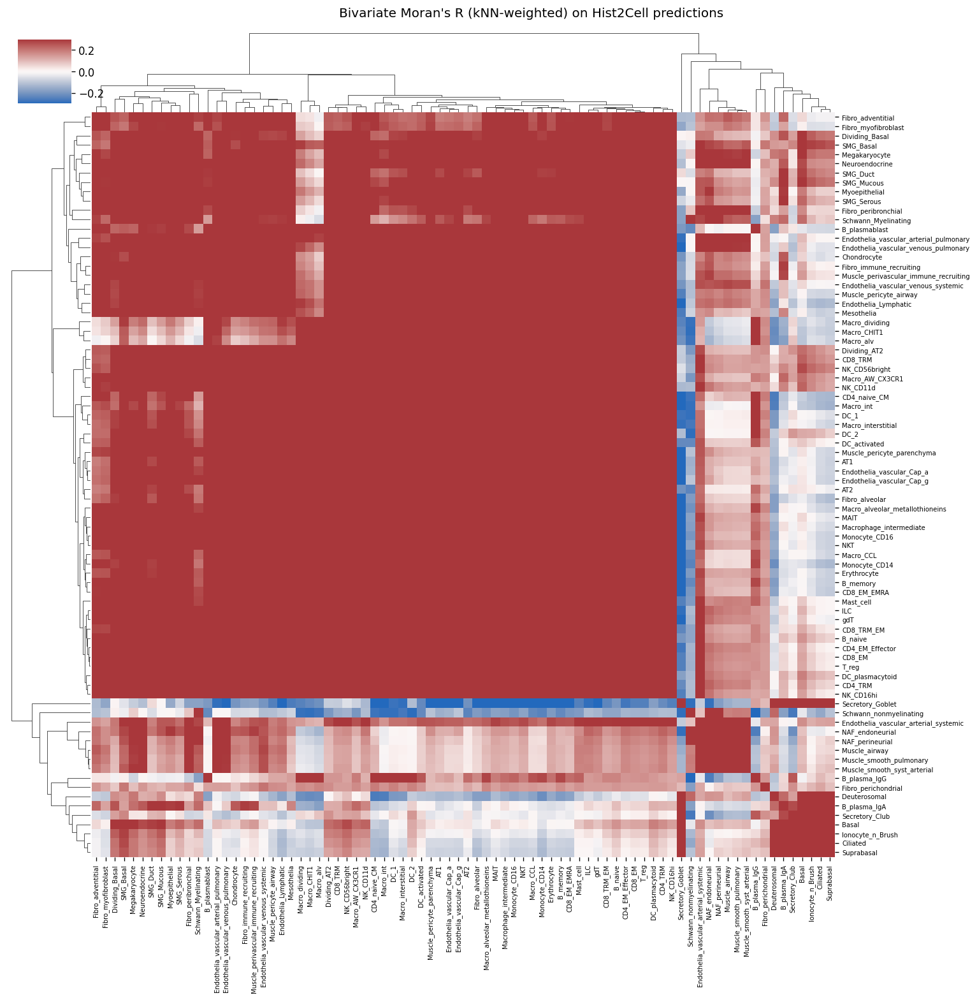

# slide2_152_19 — 통합 분석 소견 (Hist2Cell × Proteomics ROI, 환자 2번)

> **⚠️ caveat**
> Hist2Cell 가중치는 **healthy human lung** 학습본, 입력은 KBSMC **breast** SVS. 80개 cell type 라벨은 모두 lung 분류이므로 절대값/세부 sub-type 해석 불가.  
> 따라서 본 문서의 모든 "cell type" 기반 결과는 **공간 패턴** 또는 **그룹 단위 상대 비교** 로만 의미. 한편 proteomics ROI 결과는 별도 KBSMC 공동연구의 **tiatoolbox AI 위험도 모델 + LC-MS proteomics** 결과이며, 본 모델과는 독립.  
> 두 modality 의 신호가 같은 spatial 영역에서 같은 방향 (예: 위험도 높은 부위 = 우리 모델의 cancer-proxy 강한 부위) 으로 움직이는지 **정성적 cross-check** 가 본 문서의 핵심.

---

## 1. 데이터 출처

| 데이터 | 위치 | 비고 |
|---|---|---|
| Hist2Cell 추론 (40,502 spots × 80 cell types) | `inference/slide2_152_19_v2/predictions.{csv,npy}`, `slide2_152_19_coords.h5` | lung-trained |
| 80 cell type → 10 lineage group 매핑 | `inference/analysis/cell_type_groups.csv` | 수동 큐레이션 + 5 cancer-proxy |
| 공간 분석 산출물 (CSV+PNG) | `inference/analysis/slide2_152_19_v2/` | abundance, Moran's R 등 |
| ROI 추출 결과 (48 tubes) | `inference/analysis/메테오바이오텍_1_152_19_ROI_추출_결과.pdf` | tiatoolbox AI 위험도 기반 |
| Proteomics LC-MS 분석 | `inference/analysis/proteomics_분석.pdf` (페이지 4-6) | High vs Low risk Tumor / T-cell |
| KBSMC 96 sample bulk heatmap | `inference/analysis/KBSMC_heatmap.png` | slide2 = 3번째 column |
| TCGA TNBC 외부검증 | `inference/analysis/TCGA_TNBC_external_valid.png` | EMT-high / IMMUNE-low 축 검증 |

ROI 추출은 **270 μm 패치** 단위. 한 ROI tube 에 평균 4개 패치 묶음. 환자 2 의 48 tube 분포는 §2.

---

## 2. ROI 추출 분포 (proteomics 입력 정의)

| section | 의미 | tube 수 |
|---|---|---:|
| e | High AI score & Tumor | 13 |
| f | Low AI score & Tumor | 15 |
| v | Tumor Control | 5 |
| g | High AI score & T-cell | 7 |
| h | Low AI score & T-cell | 8 |

**해석**: 환자 2번은 환자 1번 (a:10, b:21) 보다 **high/low ratio 가 훨씬 균형적** (e:13 vs f:15, ~0.87:1). T-cell 도 마찬가지 (g:7, h:8). 즉 슬라이드 안에 high-risk 영역이 환자 1보다 더 많이 분포한다.

이는 본 Hist2Cell 분석의 슬라이드 2 한 줄 요약 ("epithelial-rich, 활발한 immune+proliferative signal") 과 정성적으로 일치한다. cancer-proxy μ 가 슬라이드 1 (1.01) 의 **1.4배 (1.43)**, cancer-우세 spot 비율도 슬라이드 1 (10.9%) 의 **1.6배 (17.7%)** 인 점이 ROI 분포의 균형성과 같은 방향이다.

> *(ROI 좌표는 `.tmpprotocol` annotation 으로 전달되며 본 분석 디렉토리에는 좌표 자체는 포함되어 있지 않음. 후속에서 spot 좌표와의 매핑 필요.)*

---

## 3. Hist2Cell 공간 분석 결과

### 3.1 상위 10 cell type 의 공간 분포

mean abundance 상위 10개 type:
1. Ciliated (μ=1.22, max=20.7)
2. AT2 (1.10, max=6.13)
3. Fibro_alveolar (0.81)
4. AT1 (0.68)
5. Endothelia_vascular_Cap_a (0.58)
6. Muscle_smooth_syst_arterial (0.46)
7. Fibro_adventitial (0.44)
8. Endothelia_vascular_Cap_g (0.41)
9. Secretory_Goblet (0.38)
10. Muscle_airway (0.36)

**환자 1과 가장 큰 차이**: 상위 1, 2, 3 위가 모두 **epithelial 계열** (Ciliated, AT2, Fibro_alveolar) 로 epithelial-rich. 환자 1 에서는 Muscle 이 1위였다.

특히 **Ciliated** (lung airway 라벨) 의 max=20.7 은 환자 1 의 17.9 보다 강함. breast 조직에서 Ciliated 신호는 lung 의 cilia 가 있는 cell 이 아니라, **luminal-secretory epithelial** 또는 **고도 분화된 ductal 세포** 로 read 되었을 가능성 — proteomics 에서 검증 가능.

### 3.2 lineage group 별 공간 분포

**Epithelial-airway 가 단독 panel 로 보면 가장 강함** (μ=2.71). epithelial-alveolar 1.80 까지 합치면 epithelial 합 4.51, 모든 그룹 합산 중 최강. 환자 1 (epithelial 합 2.67) 의 1.7배.

**Immune-lymphoid (μ=1.64), Immune-myeloid (μ=1.09)** 도 환자 1 (각각 1.25, 0.62) 의 1.3배 / 1.8배 → **immune 신호가 환자 1보다 명확히 강함**. inflammation 적극적으로 진행되는 영역으로 해석 가능 (단 lung 학습 모델 이라는 점 유의).

Stromal-muscle 은 오히려 환자 1 (2.23) 의 절반 수준 (1.19) → 환자 2 는 stroma-poor / epithelial-rich.

### 3.3 immune total vs cancer-proxy spatial 분포

좌 panel = immune-lymphoid + immune-myeloid 합 (36 cell type), 우 panel = cancer-proxy.

- 좌 (immune): μ=2.73, max=15.4. 환자 1 (μ=1.86) 의 1.5배. 중앙 조직 광범위 분포.
- 우 (cancer-proxy): μ=1.43, max=7.74. 환자 1 (1.01) 의 1.4배.
- **두 채널의 spot-level Pearson ρ = 0.816** ← 환자 1 (0.94) 보다 약간 낮음.
- 82.3% spots 는 immune > cancer-proxy. **17.7%** 는 cancer-proxy 우세 (환자 1 의 1.6배).

→ 환자 2 는 환자 1 보다 **proliferative-epithelial 영역과 immune 영역이 spatial 으로 더 분리**되어 있다. 17.7% 의 cancer-proxy 우세 영역은 후속 검증의 1차 ROI. 이 영역들이 proteomics 의 high-risk tumor (e1-e13) 와 spatial overlap 하는지 확인 권장.

### 3.4 80×80 cell-cell 공간 공국 (Moran's R)

**가장 강한 co-localized pair** (top 5):
- B_memory ↔ DC_1 (R=0.780)
- B_memory ↔ Monocyte_CD14 (0.779)
- B_memory ↔ Monocyte_CD16 (0.778)
- B_memory ↔ CD8_EM_EMRA (0.775)
- DC_1 ↔ Macro_int (0.774)

→ **B 세포 중심의 immune cluster**. 환자 1 의 Monocyte 중심 cluster 와 약간 다른 immune 조성. tertiary lymphoid structure 의 spatial proxy 로 더 확정적인 신호.

**가장 강한 mutual exclusion** (top 5, 모두 Secretory_Goblet 관련):
- Secretory_Goblet ↔ CD4_naive_CM (R=-0.357)
- Secretory_Goblet ↔ NKT (-0.342)
- Secretory_Goblet ↔ B_memory (-0.340)
- Secretory_Goblet ↔ CD8_EM_EMRA (-0.340)
- Secretory_Goblet ↔ Monocyte_CD14 (-0.338)

→ 환자 1 은 Deuterosomal 이 stromal 에 배타적이었는데, 환자 2 는 **Secretory_Goblet (mucus-producing epithelial)** 이 거의 모든 immune cell 과 강하게 공간 분리. lung 맥락에선 mucinous airway 영역, breast 맥락에선 **mucinous ductal carcinoma 영역 또는 mucinous metaplasia** 의 가능성. proteomics 의 mucin marker (MUC1/MUC5AC) 와의 매칭 검증이 환자 2에서 특히 중요.

**cancer-proxy 5종의 자기상관**:
- AT2: 0.682
- Dividing_AT2: 0.629
- Dividing_Basal: 0.579
- Suprabasal: 0.523
- Basal: 0.475

→ 환자 1 보다 단일-type 자기상관 약간 낮으나 모두 0.5 이상으로 spatial blob 형성. AT2-rich blob 이 cancer-proxy ROI 의 1순위.

---

## 4. Proteomics 분석 (ROI 기반, tiatoolbox 위험도 vs LC-MS)

### 4.1 High vs Low risk: top discriminative protein heatmap

좌: tumor 영역 (e vs f) — 28 sample (e1-e13, f1-f15) 에서 top 50 differentially abundant protein. 환자 1 (16 sample) 보다 **sample 수가 많아 통계 power 도 우세**. 우: T-cell 영역 (g vs h) — 15 sample.

**좌 (Tumor) 의 통찰**:
- 빨간 block (high in high-risk): WDR54, PACS2, ANK1, LRRK1, PRMT, AOX1, PI15, NMR4, CBB, MAPK12, MARK3, DCP1A, PHYHD1, GZMH, LCK, SP110, FHL3, NMI, CHMP6, …
   - **GZMH, LCK, SP110** 은 immune cell (T-cell, NK) marker — 단순 cell-cycle 보다 immune 침윤 신호 강조됨
   - **MAPK12, MARK3, ANK1** 은 cytoskeleton + signaling
- 파란 block (high in low-risk): UQCC1, HOOK1, MAU2, JAK1, AMOTL1, ADH1B, KRT81, COL6A6, …
   - **JAK1** (immune signaling) 이 low-risk 에 더 높음 — 흥미로움
   - **COL6A6** (collagen) 도 low-risk → stromal-rich 영역에 collagen 풍부
- **양쪽 group 분리도가 뚜렷** (heatmap 의 좌 빨강 / 우 파랑 block 명확)

**우 (T-cell) 의 통찰**:
- High-risk T-cell 마커: TFAP2C, PTEN, ZNF701, TIMMDC1, ORMDL1, MYL1, KHDC4, BCAT1, CRJP2A, MTHFR, USP13, SLC35E1, EIF4EBP1, NUF2, …
   - **TFAP2C** (mammary epithelial marker) — breast 조직 특이적!
   - **PTEN** (tumor suppressor) — high-risk 영역에서 PTEN 활성 증가는 의외 (보통 PTEN loss 가 high-risk)
- Low-risk T-cell 마커: HLA-DQB2, BSCL2, CRTC1, CD3E, STK17B, LIME1, CYP1B1, …
   - **HLA-DQB2, CD3E** (T-cell receptor signaling) → low-risk T-cell 영역이 오히려 conventional T-cell signaling 활성

→ **TFAP2C 가 high-risk T-cell 영역에 강한 점은 환자 2 만의 특이 신호** (환자 1 에서는 없음). breast luminal epithelial 침윤 패턴 시사.

### 4.2 UMAP — 모든 ROI 의 marker 공간 분리

전체 marker 로 UMAP 후 4개 그룹 색상 입힘. 환자 1 보다 **분리 약간 약함** — sample 수는 더 많지만 분포가 mixed.

- **High-risk Tumor (e, 빨강)** 와 **Low-risk Tumor (f, 파랑)** 이 좌측에서 부분 분리되나 e 와 f 의 일부 sample 이 서로 가까이 (e10, f13, e9 등).
- **High-risk T-cell (g, 초록)** 가 우측 상단에 잘 모임. **Low-risk T-cell (h, 보라)** 와 약간 섞임.
- **e8 (high tumor)** 이 g/h cluster (T-cell) 영역에 가까이 위치 — 일부 high-risk tumor sample 이 T-cell 시그니처를 동반 (tumor + immune infiltration co-occurrence) 가능.

→ 환자 2 는 **tumor 와 T-cell 영역 사이의 boundary 가 환자 1 보다 흐림** — 즉 두 영역이 spatial 으로 더 인접/혼재. 이는 본 Hist2Cell 분석의 ρ=0.816 (환자 1 의 0.94 보다 낮음 = 분리도 약간 더 큼) 과 같은 방향.

---

## 5. Hist2Cell × Proteomics 통합 해석

| 관점 | Hist2Cell 결과 | Proteomics ROI 결과 | 일치 / 불일치 |
|---|---|---|---|
| 조직 전체 성격 | epithelial-rich, immune+proliferation 활발 | High/Low Tumor 비율 균형 (e:13, f:15), High T-cell 7개 | **일치** — 환자 1보다 active |
| epithelial-rich | Epithelial-airway μ=2.71 (단독 1위), Ciliated/AT2/Goblet 강함 | High-risk T-cell 마커에 **TFAP2C** (mammary epithelial!) | **일치** — proteomics 가 epithelial 침윤 동반 |
| proliferative signal | cancer-proxy μ=1.43, 17.7% spot 우세 | High-risk tumor 마커에 GZMH/LCK (immune) + cytoskeleton (MAPK12/MARK3) | **부분 일치** — proliferation 자체보다 immune 침윤 동반된 tumor 신호 강조 |
| Goblet vs immune 강한 mutual exclusion | Moran R top 5 음수가 모두 Goblet ↔ immune | proteomics 마커에 mucin 직접 측정 없음 | **검증 필요** — MUC1/MUC5AC 추가 검증 권장 |
| immune compartment | Immune 합 2.73 강함, B 세포 중심 cluster | High-risk T-cell separability 약함 (UMAP) but high-risk 에 TFAP2C 등 epithelial-mixed | **부분 일치** — immune 강하나 pure T-cell 영역보다 mixed compartment |

→ 두 modality 가 독립적으로 본 슬라이드 2 의 **epithelial 활성도와 immune 침윤이 환자 1 보다 강함** 을 일관되게 보고한다. 단 proteomics 의 high-risk tumor 영역은 단순 proliferation 마커 (환자 1) 가 아니라 **immune 동반 epithelial marker** (TFAP2C, GZMH, LCK) 가 강조된다는 점이 환자 1 과의 차이.

### 5.1 환자 2 만의 특이 신호 (검증 우선순위)

1. **TFAP2C** (high-risk T-cell 마커) — mammary epithelial transcription factor. 환자 1 에는 없는 marker. → Hist2Cell 의 **epithelial-rich 영역 (Epithelial-airway)** 와 spatial overlap 검증.
2. **Secretory_Goblet ↔ immune 강한 mutual exclusion** — Hist2Cell 결과. → proteomics 의 mucin marker (MUC1/MUC5AC) 가 이 영역에서 강한지, 그리고 그 영역의 immune 마커가 약한지 검증.
3. **PTEN high in high-risk T-cell** — PTEN loss 가 보통 high-risk 인데 반대 — 환자 2 specific. tumor suppressor 활성이 immune 침윤 영역에 동반? 후속 IHC 권장.

### 5.2 후속 정량 검증 제안

1. **좌표 매핑**: ROI tube 의 270μm 패치 좌표 ↔ Hist2Cell 의 105μm 격자 spot 좌표 affine register.
2. **High-risk tumor ROI (e1-e13) vs Hist2Cell cancer-proxy + epithelial-airway 평균** 비교.
3. **High-risk T-cell ROI (g1-g7) 위치에서 Hist2Cell 의 immune-total vs Epithelial-airway 비율** 분석 — 환자 2 는 high T-cell 영역이 epithelial 과 mixed 일 가능성.
4. **TFAP2C ROI (heatmap 에서 가장 강한 sample) ↔ Hist2Cell epithelial-airway hot-spot** 의 spatial overlap.
5. **Secretory_Goblet hot-spot 영역의 mucin protein 측정** (별도 IHC 권장).

---

## 6. 한계 및 caveat 재정리

1. **lung 학습 → breast 적용**: 모델 출력의 cell type 이름은 lung 기준. 그룹 단위로만 해석 안전. 단 환자 2 에서 보이는 "Ciliated/Goblet 신호" 와 proteomics 의 TFAP2C 가 부합한다면, 모델이 luminal/ductal epithelial 을 일관되게 detect 하고 있다는 정황 증거가 됨.
2. **cancer-proxy ≠ cancer detector**: AT2+Basal+Suprabasal+Dividing_* 합산. 환자 2 에서 이 신호가 환자 1 의 1.4배라는 것은 **proliferative epithelial 영역이 더 많다** 는 정성적 결론으로만 사용.
3. **Slide label false positive (~5%)**: 좌측 라벨 sticker 영역 (`spot_view.jpg` 좌측). proteomics 매칭 전 `predictions.csv` 에서 X<8000 cut 권장.
4. **mpp mismatch + tile_size mismatch**: Hist2Cell 105 μm 격자, ROI 270 μm 격자 → 한 ROI tube 가 약 2.5×2.5 = 6 개의 Hist2Cell spot 을 평균하는 형태로 매핑 가능. 후속 단계에서 이 평균을 정량 계산.
5. **slide1 (085-12) 와 함께 보기**: 같은 환자 cohort 의 다른 슬라이드와 패턴 비교는 `../slide1_085_12_v2/findings.md` 와 `../README.md` (cohort context, KBSMC bulk heatmap, TCGA validation) 참고.

---

## 7. 관련 파일

- 본 분석 코드 / 그룹 매핑: `inference/analysis/{analyze.py, cell_type_groups.csv}`
- README (전체 caveat + cohort context): `inference/analysis/README.md`
- ROI 추출 원본 PDF: `inference/analysis/메테오바이오텍_1_152_19_ROI_추출_결과.pdf` (53 페이지)
- proteomics 원본 PDF: `inference/analysis/proteomics_분석.pdf` (페이지 4-6 = 환자 2번, 페이지 7 = 환자 1+2 공통 마커)
- KBSMC bulk heatmap (slide2 = column 3): `inference/analysis/KBSMC_heatmap.png`
- TCGA TNBC 외부 검증: `inference/analysis/TCGA_TNBC_external_valid.png`
- 비교 슬라이드: `inference/analysis/slide1_085_12_v2/findings.md`
