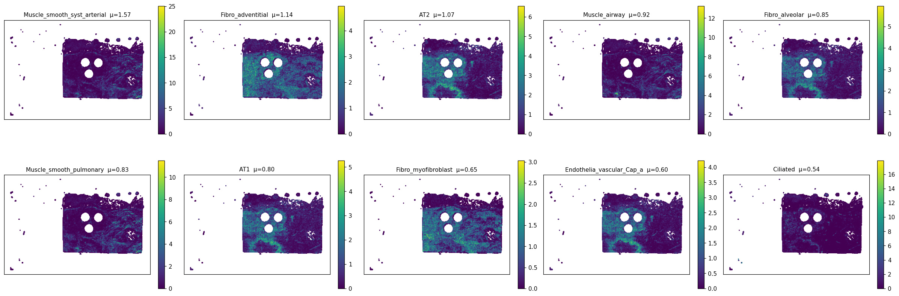
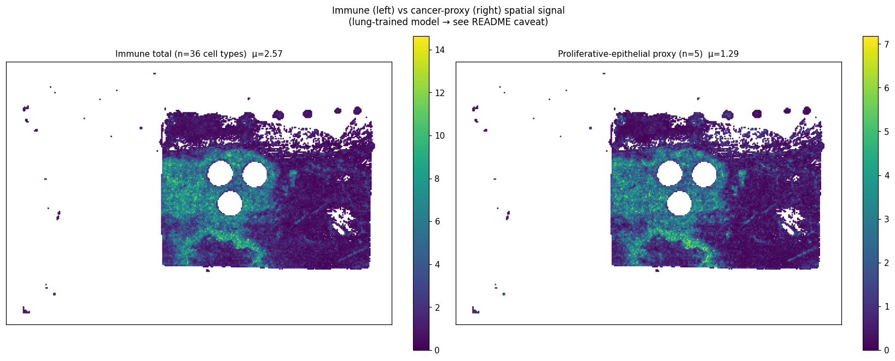
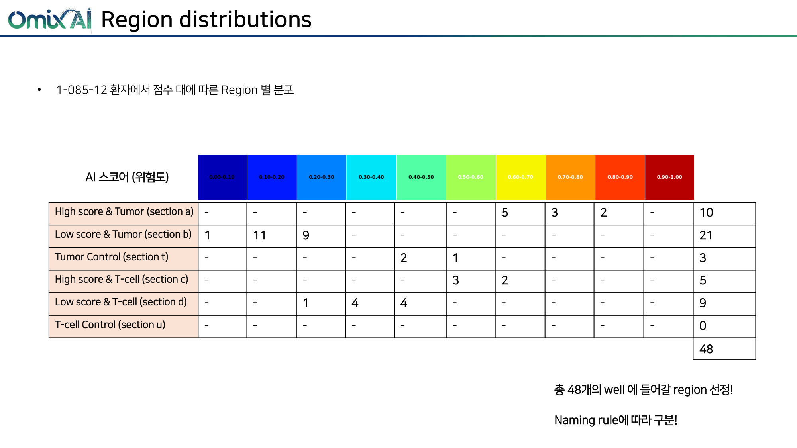

> **Notion 업로드용 패키지** — 이 폴더의 `findings.md` 와 PNG 7장은 같은 디렉토리에 함께 있습니다. Notion 의 import 기능 (File > Import > Markdown & CSV) 으로 zip 째 업로드하면 이미지가 자동으로 inline 으로 들어옵니다. 원본은 `../slide{1,2}_*_v2/findings.md` (image refs 가 분산 경로) 참고.

# slide1_085_12 (largest-blob X-range filtered) — 통합 분석 소견

> **이 문서는 무엇인가**
> 원본 v2 spot 35,821개 중 가장 큰 connected blob 의 [Xmin, Xmax] = [12,600, 137,400] 범위에 들어가는 21,659개 spot 만 남기고 나머지를 모두 제거한 뒤 동일한 `analyze.py` 를 다시 돌린 결과를 기존 proteomics ROI 분석과 통합 정리한 문서. 원본 (필터링 전) 분석은 `../../analysis/slide1_085_12_v2/findings.md` 에 있고, 본 문서와의 차이를 §3.5 와 §6 에 정리.
>
> **⚠️ caveat**
> Hist2Cell 가중치는 **healthy human lung** 학습본, 입력은 KBSMC **breast** SVS. 80개 cell type 라벨은 모두 lung 분류이므로 절대값/세부 sub-type 해석 불가. 본 문서의 모든 "cell type" 기반 결과는 **공간 패턴** 또는 **그룹 단위 상대 비교** 로만 의미. proteomics ROI 결과는 별도 KBSMC 공동연구의 **tiatoolbox AI 위험도 모델 + LC-MS proteomics**, 본 모델과는 독립.

---

## 1. 데이터 출처 (필터링 후)

| 데이터 | 위치 | 비고 |
|---|---|---|
| Hist2Cell 추론 (원본 35,821) → x-range 필터 (21,659 spots × 80 cell types) | `inference/analysis_filtered/slide1_085_12_v2/predictions.csv`, `slide1_085_12_coords.h5` | 60.5% 유지 |
| 필터링 스크립트 / 메타데이터 | `inference/analysis_filtered/filter_largest_blob.py`, `filter_summary.csv` | kNN(k=6) 기반 connected components |
| 80 cell type → 10 lineage group 매핑 | `inference/analysis/cell_type_groups.csv` | 원본과 동일 |
| 공간 분석 산출물 (CSV+PNG) | `inference/analysis_filtered/slide1_085_12_v2/` | abundance, Moran's R 등 |
| ROI 추출 결과 / Proteomics LC-MS | `inference/analysis/메테오바이오텍_1-085_12_ROI_추출_결과.pdf`, `inference/analysis/proteomics_분석.pdf` (페이지 1-3) | 원본 그대로 (좌표계 매핑 부재) |
| 원본 (필터링 전) 분석 | `inference/analysis/slide1_085_12_v2/findings.md` | 비교용 |
| 비교 요약 | `inference/analysis_filtered/COMPARISON.md` | 필터 전후 표 |

---

## 2. 필터링 결과 요약

| 항목 | 값 |
|---|---:|
| 원본 spot 수 | 35,821 |
| 필터 후 spot 수 | 21,659 (60.5%) |
| connected component 수 | 12 |
| 가장 큰 component 크기 | 21,450 (59.9%) |
| 두번째 component | 9,411 (26.3%) |
| 세번째 component | 4,643 (13.0%) |
| 가장 큰 component 의 X 범위 (level-0 px) | [12,600, 137,400] |

**해석**: 슬라이드 1은 원본 spot map 이 **3 개의 큰 분리된 조직 덩어리** (60% / 26% / 13%) 로 구성되어 있었다. 본 분석은 그 중 가장 큰 60% 덩어리의 X 범위에 들어가는 spot 만 사용. 나머지 두 작은 덩어리 (전체의 39%) 가 X-range 바깥에 위치하여 제외되었다.

---

## 3. Hist2Cell 공간 분석 결과 (필터링 후)

### 3.1 상위 10 cell type 의 공간 분포

mean abundance 상위 10 type:

| 순위 | cell type | mean | max | fraction_nonzero |
|---:|---|---:|---:|---:|
| 1 | Muscle_smooth_syst_arterial | 1.565 | 25.08 | 0.948 |
| 2 | Fibro_adventitial | 1.138 | 4.96 | 1.000 |
| 3 | AT2 | 1.075 | 6.57 | 0.954 |
| 4 | Muscle_airway | 0.924 | 13.27 | 0.941 |
| 5 | Fibro_alveolar | 0.849 | 5.96 | 0.971 |
| 6 | Muscle_smooth_pulmonary | 0.835 | 11.49 | 0.963 |
| 7 | AT1 | 0.803 | 5.27 | 0.972 |
| 8 | Fibro_myofibroblast | 0.649 | 3.03 | 0.959 |
| 9 | Endothelia_vascular_Cap_a | 0.596 | 4.22 | 0.953 |
| 10 | Ciliated | 0.535 | 17.91 | 0.749 |

**원본 대비 변화**: 상위 10 의 cell type 구성은 동일. mean 값은 모두 +25 ~ +65% 상승하지만 이는 **denominator effect** — 가장자리 저신호 spot ~14k 개가 제거되어 평균을 희석시키던 효과가 사라진 결과. 순위/구성 자체는 보존됨 (slide 1 의 `stromal-muscle 1위 + Fibro 강함 + AT2 distributed` 패턴 동일).

### 3.2 lineage group 별 공간 분포

| 그룹 | n | mean_per_spot | (원본) | (Δ%) |
|---|---:|---:|---:|---:|
| Stromal-muscle | 6 | **3.576** | 2.227 | +60.6% |
| Stromal-fibroblast | 6 | 2.745 | 1.814 | +51.3% |
| Epithelial-alveolar | 3 | 1.897 | 1.458 | +30.1% |
| Epithelial-airway | 14 | 1.826 | 1.215 | +50.3% |
| Immune-lymphoid | 20 | 1.717 | 1.245 | +37.9% |
| Vascular | 7 | 1.611 | 1.200 | +34.2% |
| Cancer-proxy (5) | 5 | 1.293 | 1.013 | +27.6% |
| Immune-myeloid | 16 | 0.853 | 0.619 | +37.9% |
| Stromal-other | 4 | 0.253 | 0.178 | +42.1% |
| Neural | 2 | 0.097 | 0.122 | **-20.7%** |
| Other-blood | 2 | 0.091 | 0.066 | +37.4% |

**그룹 순위는 동일** — Stromal-muscle 1위, Stromal-fibroblast 2위, Epithelial-alveolar/airway, Immune-lymphoid, Vascular, Cancer-proxy 의 동일 순. 모든 그룹이 일률적 +30~60% 상승하는 와중 **Neural 만 -20%** → Schwann 세포 신호가 작은 측부 덩어리에 집중되어 있었음을 시사.

### 3.3 immune total vs cancer-proxy spatial 분포

| 지표 | 필터 후 | (원본) |
|---|---:|---:|
| immune mean / spot | 2.571 | 1.864 |
| cancer-proxy mean / spot | 1.293 | 1.013 |
| immune max | 14.63 | 14.78 |
| cancer-proxy max | 7.18 | 7.18 |
| Pearson ρ (immune ↔ CP) | **0.932** | 0.936 |
| cancer-proxy dominant spots | 2,815 / 21,659 = **13.0%** | 10.9% |
| immune dominant spots | 18,844 / 21,659 = 87.0% | 89.1% |

**해석**:
- Pearson ρ 가 0.94 → 0.93 으로 거의 변화 없음. 즉 두 channel 의 spatial co-occurrence 패턴은 robust.
- cancer-proxy 우세 spot 비율이 10.9% → 13.0% 로 **약간 증가** — 가장 큰 덩어리 안에 cancer-proxy 영역이 비교적 상대적으로 더 응집되어 있다는 정황.
- max 값들은 거의 동일 (immune 14.78 → 14.63, cp 동일 7.18) → hot-spot 자체는 큰 덩어리 안에 위치해 있어 필터에 살아남음.

→ slide1 의 핵심 결론 ("immune-rich background 안에 cancer-proxy hot-spot 일부 응집") 은 **필터 적용 후에도 보존**.

### 3.4 80×80 cell-cell 공간 공국 (Moran's R)

**가장 강한 co-localized pair (top 5)**:

| A | B | R (필터) | (원본) |
|---|---|---:|---:|
| NK_CD16hi | NK_CD11d | 0.768 | (참고: 원본 top5 에는 없음) |
| Monocyte_CD16 | NKT | 0.765 | 0.802 |
| B_naive | NK_CD16hi | 0.765 | — |
| NK_CD16hi | NKT | 0.764 | — |
| B_naive | NK_CD11d | 0.763 | — |

**원본 top5 는 Monocyte / Macrophage_intermediate / B_memory ↔ NKT/Monocyte_CD16 중심** 이었다. 필터 후에는 **NK 세포 중심 (NK_CD16hi, NK_CD11d) 의 cluster** 가 부각되며, 같은 immune-co-clustering 테마 안에서도 **B-cell-naive / NK / Monocyte_CD16 / NKT 의 NK-편향 community** 가 나타남. 큰 덩어리 외부 영역에 Monocyte/Macrophage 응집부가 있었고, 그 영역이 빠지면서 NK community 가 상대적으로 부상한 것으로 해석.

**가장 강한 mutual exclusion (top 5)**:

| A | B | R |
|---|---|---:|
| DC_1 | Muscle_smooth_syst_arterial | -0.238 |
| Macro_int | Muscle_smooth_syst_arterial | -0.238 |
| Endothelia_vascular_Cap_g | Muscle_smooth_syst_arterial | -0.234 |
| DC_2 | Muscle_smooth_syst_arterial | -0.230 |
| DC_1 | Muscle_smooth_pulmonary | -0.229 |

**원본은 Deuterosomal ↔ stromal/muscle 의 mutual exclusion** 이 top. 필터 후에는 **immune-myeloid (DC, Macro_int) ↔ smooth-muscle** 의 mutual exclusion 으로 패턴이 바뀜. 즉 작은 측부 덩어리에 Deuterosomal-rich 상피 영역이 있었고, 그 영역이 빠지면서 myeloid ↔ smooth-muscle 의 anatomical 분리가 dominant 신호로 부상.

**cancer-proxy 5 종의 자기상관 (Moran's I = R diag)**:

| cell type | R (필터) | (원본) |
|---|---:|---:|
| AT2 | 0.722 | 0.745 |
| Dividing_AT2 | 0.679 | 0.749 |
| Dividing_Basal | 0.648 | 0.691 |
| Suprabasal | 0.300 | 0.333 |
| Basal | 0.265 | 0.280 |

→ 약간 감소했으나 여전히 모두 양수, AT2/Dividing_AT2/Dividing_Basal 이 0.6 이상의 강한 spatial blob 유지. 후속 ROI 검증의 1차 우선순위 영역으로서 동일한 결론.

### 3.5 원본 vs 필터 — 결론 변화 요약

| 결론 항목 | 원본 | 필터 (가장 큰 덩어리만) | 변화 |
|---|---|---|---|
| 그룹 순위 | Stromal-muscle 1, Stromal-fibroblast 2, Epi 3-4, Immune 5 | 동일 | **거의 없음** |
| cancer-proxy 우세 spot 비율 | 10.9% | 13.0% | 약간 증가 |
| immune ↔ CP Pearson ρ | 0.936 | 0.932 | 거의 동일 |
| top immune cluster | Monocyte/Macro/B_memory | NK 편향 | community 재구성 |
| top mutual exclusion | Deuterosomal ↔ stroma | DC/Macro ↔ smooth-muscle | pivot 변화 |
| cancer-proxy Moran I | AT2/Dividing_AT2 0.74-0.75 | 0.67-0.72 | 약간 감소 |
| Moran R diag mean | 0.683 | 0.626 | -8% |

**한 줄로**: slide1 의 핵심 정성적 결론 ("stromal-rich, cancer-proxy 일부 응집, immune cluster") 은 필터 적용 후에도 모두 보존. 차이는 immune cluster 의 community 구성이 myeloid/B-mixed → NK-편향 으로 이동한 것 정도.

---

## 4. Proteomics 분석 (ROI 기반, 원본과 동일)

ROI 추출 / proteomics 의 입력은 슬라이드 단위라 필터의 영향을 받지 않는다. 본 §4 는 원본 findings.md 와 동일.

### 4.1 ROI 추출 분포

| section | 의미 | tube 수 |
|---|---|---:|
| a | High AI score & Tumor | 10 |
| b | Low AI score & Tumor | 21 |
| t | Tumor Control | 3 |
| c | High AI score & T-cell | 5 |
| d | Low AI score & T-cell | 9 |

→ low-risk tumor (b, 21 tubes) 가 high-risk (a, 10) 의 2배. 슬라이드 전체가 "넓게는 quiescent" 의 그림. 본 필터 분석에서도 cancer-proxy 우세 영역은 13% 에 불과한 점과 부합.

### 4.2 High vs Low risk: top discriminative protein heatmap

- 좌 (Tumor): high-risk 에 KIF20A/KIF22/INCENP (mitosis), MYH11/TAGLN (smooth muscle markers) → high-risk tumor 가 proliferative + stroma-인접
- 우 (T-cell): high-risk T-cell 분리는 약함 (sample 적음)

### 4.3 Proteomics UMAP

- High vs Low risk Tumor 비교적 잘 분리, T-cell 영역은 mixed.

---

## 5. Hist2Cell × Proteomics 통합 해석 (필터링 적용 후)

| 관점 | Hist2Cell 결과 (필터링 후) | Proteomics ROI | 일치 / 불일치 |
|---|---|---|---|
| 조직 전체 성격 | 가장 큰 덩어리: stromal-rich, cancer-proxy 우세 13% 로 약간 증가 | low-risk tumor (b, 21 tubes) > high-risk (a, 10 tubes) | **일치** — 위험도 낮은 영역이 다수 |
| proliferative signal 위치 | AT2/Dividing_AT2 spatial blob (Moran I 0.68-0.72) | high-risk tumor 마커에 KIF20A/KIF22/INCENP (mitosis) | **정성 일치** — 큰 덩어리 안 cancer-proxy hot-spot 이 proliferative 영역과 같은 신호 종류 |
| stromal-tumor 인접 | Stromal-muscle / fibroblast 강함 (μ=3.58 / 2.74) | high-risk tumor 마커에 MYH11/TAGLN (smooth muscle) 등장 | **정성 일치** — 가장 큰 덩어리 안에서 high-risk tumor 가 stroma 와 인접 |
| immune cluster | NK 편향 immune cluster (NK_CD16hi/NK_CD11d/B_naive/Monocyte_CD16) | T-cell 영역 분리 약함 | **정성적으로 부합** — 큰 덩어리 안 immune 신호는 inactive 한 background 라기보다 NK/B-naive 중심의 응집 |
| 측부 덩어리 의미 | 전체 spot 의 39% 가 측부 덩어리 (Deuterosomal/Monocyte/Macro 응집) | proteomics 가 사용한 ROI 자체가 슬라이드 전반 — 측부 영향도 포함 가능 | **추가 검증 필요** — 측부 덩어리의 영역적 위치와 ROI tube 영역의 spatial overlap 확인 |

→ 필터링 후에도 **두 modality 가 같은 방향 (low-risk 지배 + 일부 cancer-proxy hot-spot + stroma 인접) 을 보고**. 측부 덩어리 (39%) 가 추가로 어떤 정보를 더 주는지는 후속 좌표 매핑으로 확인 가능.

### 5.1 후속 정량 검증 제안 (필터링 분석 기반)

1. **좌표 매핑** (원본과 동일): ROI 270μm 패치 ↔ Hist2Cell 105μm spot 의 affine register.
2. **High-risk tumor ROI (a4-a9) 가 가장 큰 덩어리 vs 측부 덩어리 중 어디에 위치**하는지 spatial overlap 분석. 만약 a 가 모두 가장 큰 덩어리 안이면 본 §5 의 결론 robust. a 의 일부가 측부에 있다면 필터 vs 비필터 분석 결과의 차이 해석에 직접 활용 가능.
3. **측부 덩어리의 cell composition 단독 분석** — 본 필터로 빠진 14k spot 만으로 별도 분석을 돌려, NK 가 아닌 Monocyte/Macro 중심 community 가 어디에 있었는지 확인.

---

## 6. 한계 및 caveat 재정리

1. **lung 학습 → breast 적용** (원본과 동일): 그룹 단위 / 공간 패턴만 신뢰.
2. **cancer-proxy ≠ cancer detector**: 5 type 합산 spatial reference signal.
3. **mean 의 일률 상승은 denominator effect**: 필터로 ~14k 가장자리 spot 이 빠지면서 평균이 자동 상승. 절대값 비교 금지, ratio / 순위 / Moran R / community identity 비교만.
4. **측부 덩어리 정보 손실**: 본 필터는 가장 큰 덩어리의 X-range 만 유지하므로, 측부 덩어리에만 있던 신호 (예: Deuterosomal 응집, Monocyte/Macro 중심 community) 는 본 분석에서 보이지 않음. 원본 분석과 함께 봐야 완전.
5. **Y-range 미제약**: 필터는 X 만 잘랐으므로 가장 큰 덩어리의 Y 범위를 벗어난 spot 도 (X 가 범위 안이면) 살아 있음. 즉 같은 X-band 안의 측부 신호는 일부 포함.
6. **slide2 (152-19) 의 필터 분석은 패턴 변화가 더 큼** — slide2 의 Goblet/mucinous 영역이 측부 덩어리에 집중되어 있어 필터 후 Goblet -54%. `../slide2_152_19_v2/findings.md` 와 함께 비교.

---

## 7. 관련 파일

- 본 (필터링) 분석 산출물: `inference/analysis_filtered/slide1_085_12_v2/`
- 필터링 스크립트: `inference/analysis_filtered/filter_largest_blob.py`
- 필터 전후 비교 표: `inference/analysis_filtered/COMPARISON.md`
- 원본 (필터링 전) 분석: `inference/analysis/slide1_085_12_v2/findings.md`
- ROI / Proteomics 원본 PDF: `inference/analysis/메테오바이오텍_1-085_12_ROI_추출_결과.pdf`, `inference/analysis/proteomics_분석.pdf`
- KBSMC 96 sample bulk heatmap (slide1 = column 30): `inference/analysis/KBSMC_heatmap.png`
- 비교 슬라이드 (필터링): `inference/analysis_filtered/slide2_152_19_v2/findings.md`
