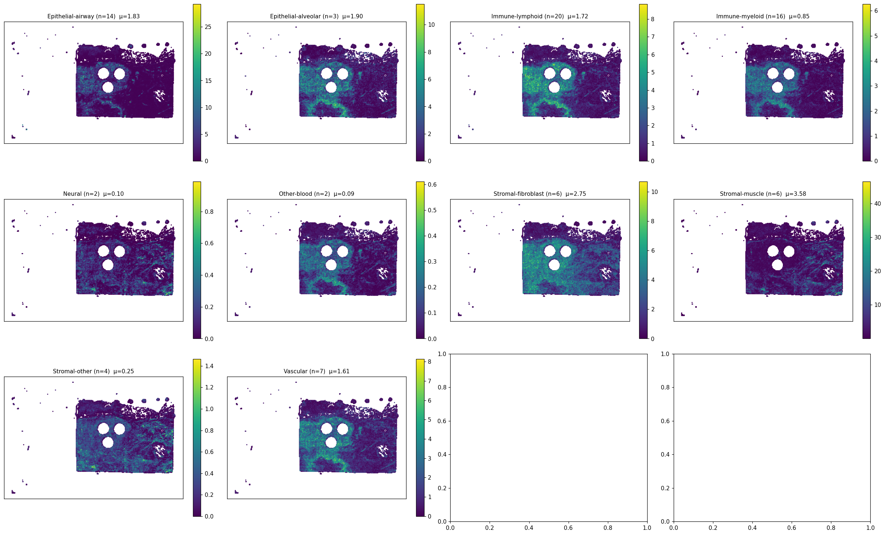
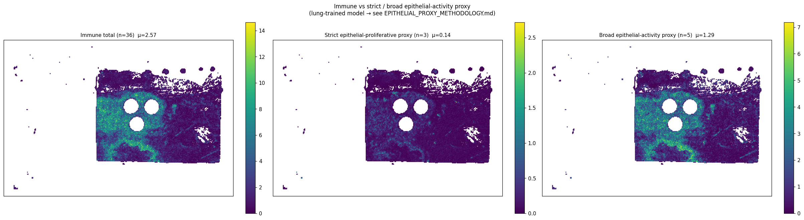
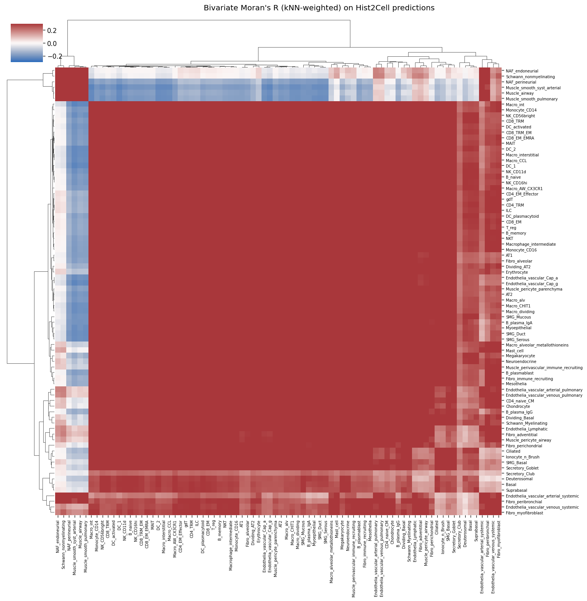

# slide1_085_12 (largest-blob X-range filtered) — 통합 분석 소견

> **이 문서는 무엇인가**
> 원본 v2 spot 35,821 중 가장 큰 connected blob 의 [Xmin, Xmax] = [12,600, 137,400] 범위 spot 21,659 (60.5%) 만 남기고 동일한 `analyze.py` 를 재실행한 결과. 원본 분석: `../../analysis/slide1_085_12_v2/findings.md`. 본 슬라이드는 필터 후에도 결론 보존 (robust).
>
> **⚠️ caveat**
> Hist2Cell 가중치는 healthy human lung 학습본, KBSMC breast 슬라이드에 적용. 80개 cell type 은 lung 라벨 — 절대값/sub-type 해석 불가. "epithelial-activity proxy" 는 lung-derived spatial proxy 로서 **breast tumor detector 가 아님** (`../EPITHELIAL_PROXY_METHODOLOGY.md` 의 strict/broad 2-score 설계 참조).

---

## 1. 필터링 결과 요약

| 항목 | 값 |
|---|---:|
| 원본 spot 수 | 35,821 |
| 필터 후 spot 수 | 21,659 (60.5%) |
| connected component 수 | 12 |
| 가장 큰 component 크기 | 21,450 (59.9%) |
| 가장 큰 component X 범위 (level-0 px) | [12,600, 137,400] |

슬라이드 1 은 원본 spot map 이 **3 개의 큰 분리된 조직 덩어리** (60% / 26% / 13%) 로 구성. 본 분석은 가장 큰 60% 덩어리의 X 범위만 사용.

---

## 2. Hist2Cell 공간 분석 결과 (필터링 후)

### 2.1 상위 10 cell type

| 순위 | cell type | mean | max |
|---:|---|---:|---:|
| 1 | Muscle_smooth_syst_arterial | 1.565 | 25.08 |
| 2 | Fibro_adventitial | 1.138 | 4.96 |
| 3 | AT2 | 1.075 | 6.57 |
| 4 | Muscle_airway | 0.924 | 13.27 |
| 5 | Fibro_alveolar | 0.849 | 5.96 |
| 6 | Muscle_smooth_pulmonary | 0.835 | 11.49 |
| 7 | AT1 | 0.803 | 5.27 |
| 8 | Fibro_myofibroblast | 0.649 | 3.03 |
| 9 | Endothelia_vascular_Cap_a | 0.596 | 4.22 |
| 10 | Ciliated | 0.535 | 17.91 |

원본과 비교: 상위 10 구성 동일, mean 값은 모두 +25~65% 상승 (denominator effect — 가장자리 저신호 spot 제거).

### 2.2 lineage group + 두 proxy score

| group / pseudo-group | n | mean / spot | (원본 비교) |
|---|---:|---:|---|
| Stromal-muscle | 6 | **3.576** | (orig 2.227, +60.6%) |
| Stromal-fibroblast | 6 | 2.745 | (1.814, +51.3%) |
| Epithelial-alveolar | 3 | 1.897 | (1.458, +30.1%) |
| Epithelial-airway | 14 | 1.826 | (1.215, +50.3%) |
| Immune-lymphoid | 20 | 1.717 | (1.245, +37.9%) |
| Vascular | 7 | 1.611 | (1.200, +34.2%) |
| **Broad epithelial-activity proxy** | 5 | **1.293** | (1.013, +27.6%) |
| Immune-myeloid | 16 | 0.853 | (0.619, +37.9%) |
| Stromal-other | 4 | 0.253 | (0.178, +42.1%) |
| **Strict epithelial-proliferative proxy** | 3 | **0.144** | (0.108, +33.3%) |
| Neural | 2 | 0.097 | (0.122, **-20.7%**) |
| Other-blood | 2 | 0.091 | (0.066, +37.4%) |

**그룹 순위 동일** — Stromal-muscle 1위 유지, broad-proxy / strict-proxy 비율도 보존. Neural 만 감소 (-20.7%) — 측부 덩어리에 Schwann 신호 집중.

### 2.3 immune vs strict / broad epithelial-activity proxy

| 지표 | 필터 후 | 원본 |
|---|---:|---:|
| immune mean / spot | 2.571 | 1.864 |
| strict proxy mean | 0.144 | 0.108 |
| broad proxy mean | 1.293 | 1.013 |
| ρ (immune ↔ strict) | **0.664** | 0.700 |
| ρ (immune ↔ broad) | **0.932** | 0.936 |
| strict-dominant spots | 0.59% | 0.35% |
| broad-dominant spots | 13.0% | 10.87% |

**핵심**: 두 score 모두 원본과 거의 동일한 패턴. ρ 가 약간 감소 (0.94→0.93, 0.70→0.66) 하지만 변화 미미. **slide1 의 결론은 필터 후에도 robust**.

### 2.4 80×80 cell-cell Moran R

**Strict proxy types**:

| label | R (필터) | (원본) |
|---|---:|---:|
| Dividing_AT2 | 0.679 | 0.749 |
| Dividing_Basal | 0.648 | 0.691 |
| Basal | 0.265 | 0.280 |

**Broad-only types**:

| label | R (필터) | (원본) |
|---|---:|---:|
| AT2 | 0.722 | 0.745 |
| Suprabasal | 0.300 | 0.333 |

→ 모두 약간 감소했으나 hot-spot 보존. 결론 큰 변화 없음.

**Top 5 positive Moran R**:
| A | B | R |
|---|---|---:|
| NK_CD16hi | NK_CD11d | 0.768 |
| Monocyte_CD16 | NKT | 0.765 |
| B_naive | NK_CD16hi | 0.765 |
| NK_CD16hi | NKT | 0.764 |
| B_naive | NK_CD11d | 0.763 |

→ 원본은 Monocyte_CD16/Macrophage_intermediate/B_memory ↔ NKT 중심이었는데 필터 후 NK 편향으로 community 재구성. 같은 immune-co-clustering 테마.

**Top 5 negative**: DC_1/Macro_int ↔ Muscle_smooth_syst_arterial — 면역-myeloid ↔ smooth-muscle anatomical 분리 (원본은 Deuterosomal ↔ stroma 였음).

---

## 3. 원본 vs 필터 — 결론 변화 요약

| 결론 항목 | 원본 | 필터 | 변화 |
|---|---|---|---|
| 그룹 순위 | Stromal-muscle 1위 | 동일 | **없음** |
| broad-proxy 비율 | 10.87% | 13.0% | 약간 증가 |
| strict-proxy 비율 | 0.35% | 0.59% | 거의 0 (변화 미미) |
| ρ(im↔broad) | 0.936 | 0.932 | 거의 동일 |
| ρ(im↔strict) | 0.700 | 0.664 | 약간 감소 |
| top immune cluster | Monocyte/Macro/B 중심 | NK 편향 | 재구성 |
| top mutual exclusion | Deuterosomal ↔ stroma | DC/Macro ↔ muscle | pivot |
| Dividing_AT2 / Basal Moran I | 0.75 / 0.69 | 0.68 / 0.65 | 약간 감소 |

**한 줄**: slide1 은 strict / broad 양쪽 모두 필터 후 결론 보존 — robust.

---

## 4. Proteomics 분석 (필터 영향 없음, 원본과 동일)

ROI / proteomics 는 슬라이드 단위 데이터라 본 필터 미적용.

### 4.1 ROI 추출 분포

low-risk Tumor (b=21) > high-risk (a=10) → 슬라이드 전반 quiescent dominant.

### 4.2 High vs Low risk: top discriminative protein

high-risk Tumor 마커: KIF20A/KIF22/INCENP (mitosis) + MYH11/TAGLN (smooth muscle).

### 4.3 UMAP

---

## 5. Hist2Cell × Proteomics 통합 해석 (필터 적용 후)

| 관점 | Hist2Cell (필터) | Proteomics | 일치 / 부분 |
|---|---|---|---|
| 활성도 | broad-proxy 13.0%, strict 0.59% | low-risk b:21 ≫ high-risk a:10 | **일치** — quiescent dominant |
| stromal context | Stromal-muscle 1위 μ=3.58 | high-risk 마커 MYH11/TAGLN | **일치** |
| proliferative signal | Dividing_AT2 / Basal blob Moran I 0.65-0.68 (strict) | high-risk 마커 KIF20A/22/INCENP (mitosis) | **정성 일치** — strict 의 cell-cycle 신호 ↔ proteomics mitosis |
| immune cluster | NK 편향 (NK_CD16hi/NK_CD11d/B_naive/Monocyte_CD16) | T-cell 분리 약함 | **부분 일치** |

→ 본 필터 분석에서 측부 덩어리 (전체의 39%) 가 제외되었음에도 두 modality 의 메시지 보존. **slide1 은 본 필터링 / 원본 / strict / broad 모든 조합에서 결론 robust**.

---

## 6. 한계

1. **lung→breast proxy** — 그룹/공간 단위만 신뢰.
2. **strict / broad 두 score 모두 일치하는 robust 사례** — 본 슬라이드는 다행스러운 케이스.
3. **AT2 cross-tissue 매핑 가설 (broad-only)** — broad-proxy 신호 중 AT2 의 의미는 CUCA her2st 후 검증.
4. **mean 의 일률 상승은 denominator effect** — 절대값 비교 금지.
5. **측부 덩어리 정보 손실** — 본 분석은 가장 큰 덩어리에 한정. 원본과 함께 봐야 완전.

---

## 7. 관련 파일

- 본 (필터링) 분석 산출물: `inference/analysis_filtered/slide1_085_12_v2/`
- 필터링 스크립트: `inference/analysis_filtered/filter_largest_blob.py`
- 필터 전후 비교: `inference/analysis_filtered/COMPARISON.md`
- 원본 (필터링 전): `inference/analysis/slide1_085_12_v2/findings.md`
- **방법론 근거 (필수)**: `inference/analysis/EPITHELIAL_PROXY_METHODOLOGY.md`
- ROI / Proteomics PDF: `inference/analysis/메테오바이오텍_1-085_12_ROI_추출_결과.pdf`, `proteomics_분석.pdf`
- KBSMC bulk (slide1=col30): `inference/analysis/KBSMC_heatmap.png`
- 비교 슬라이드 (필터링): `inference/analysis_filtered/slide2_152_19_v2/findings.md`
