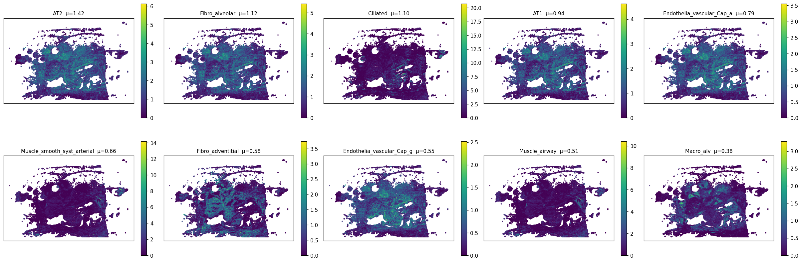
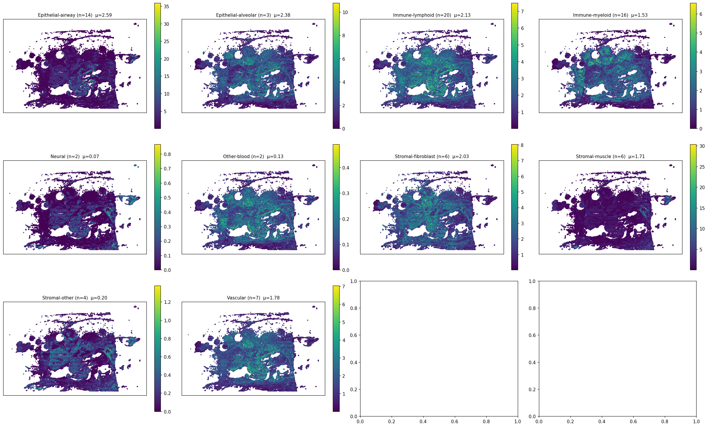
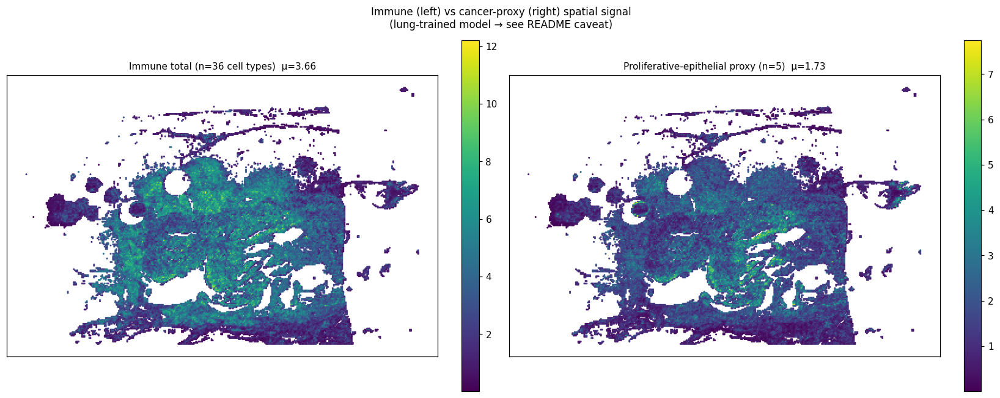
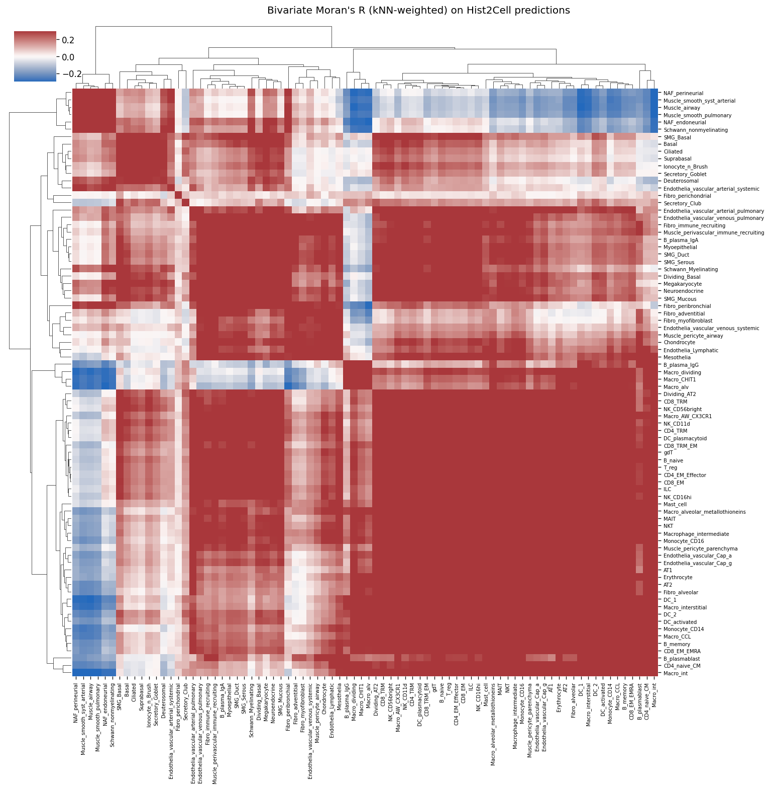
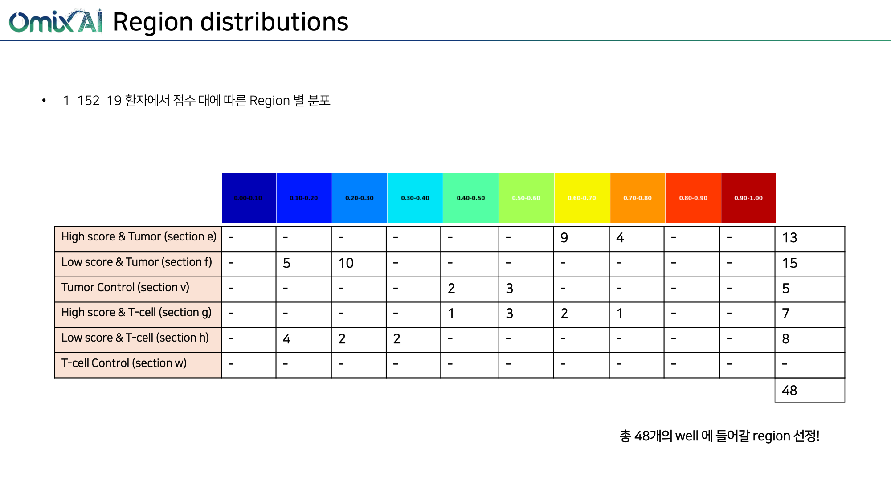
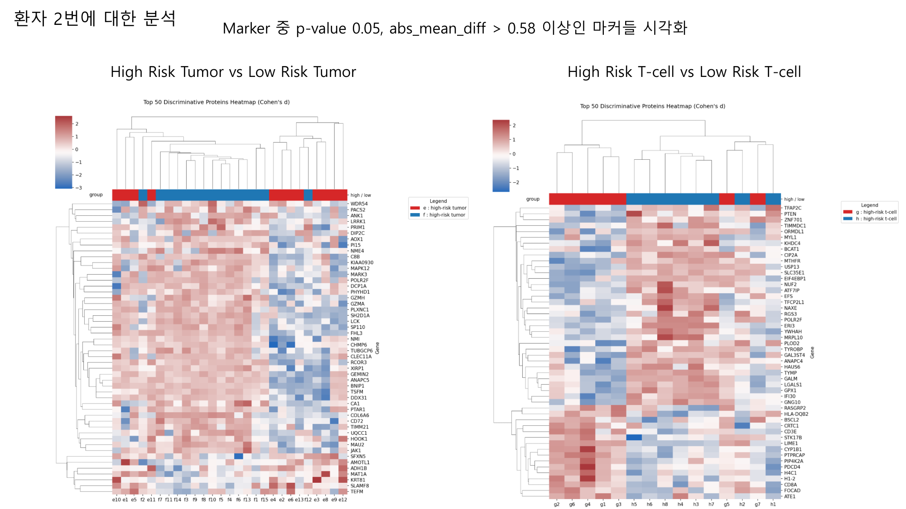
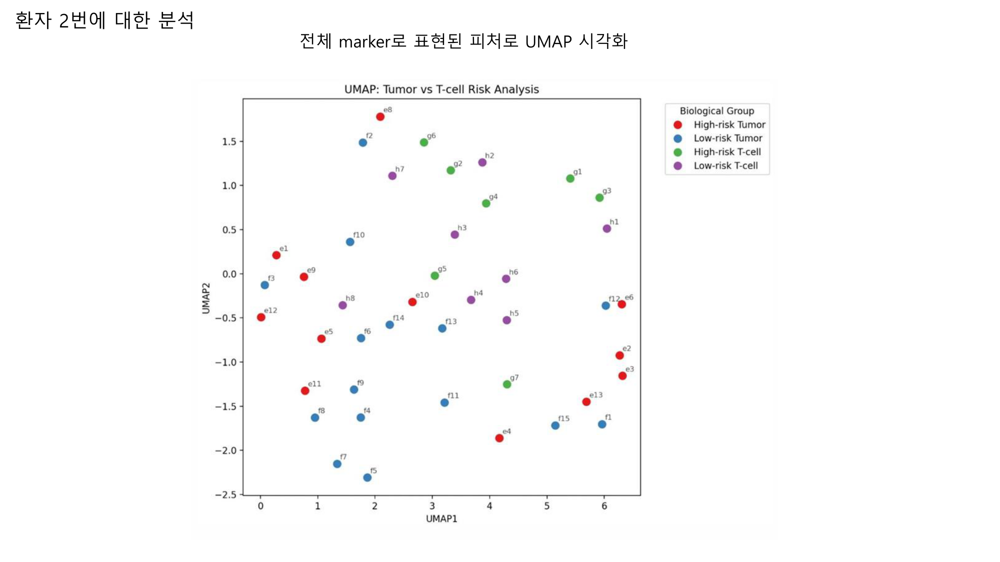

# slide2_152_19 (largest-blob X-range filtered) — 통합 분석 소견

> **이 문서는 무엇인가**
> 원본 v2 spot 40,502개 중 가장 큰 connected blob 의 [Xmin, Xmax] = [44,600, 176,600] 범위에 들어가는 27,339개 spot 만 남기고 나머지를 모두 제거한 뒤 동일한 `analyze.py` 를 다시 돌린 결과를 기존 proteomics ROI 분석과 통합 정리. 원본 (필터링 전) 분석은 `../../analysis/slide2_152_19_v2/findings.md` 에 있고, 본 문서와의 차이는 §3.5 와 §6 에 정리. **slide2 는 slide1 과 달리 필터 적용 후 결론이 의미 있게 달라진다 — 특히 mucinous compartment (Goblet) 신호가 거의 사라짐**.
>
> **⚠️ caveat**
> Hist2Cell 가중치는 **healthy human lung** 학습본, 입력은 KBSMC **breast** SVS. 80개 cell type 라벨은 모두 lung 분류이므로 절대값/세부 sub-type 해석 불가. 본 문서의 모든 "cell type" 기반 결과는 **공간 패턴** 또는 **그룹 단위 상대 비교** 로만 의미. proteomics ROI 결과는 별도 KBSMC 공동연구의 **tiatoolbox AI 위험도 모델 + LC-MS proteomics**, 본 모델과는 독립.

---

## 1. 데이터 출처 (필터링 후)

| 데이터 | 위치 | 비고 |
|---|---|---|
| Hist2Cell 추론 (원본 40,502) → x-range 필터 (27,339 spots × 80 cell types) | `inference/analysis_filtered/slide2_152_19_v2/predictions.csv`, `slide2_152_19_coords.h5` | 67.5% 유지 |
| 필터링 스크립트 / 메타데이터 | `inference/analysis_filtered/filter_largest_blob.py`, `filter_summary.csv` | kNN(k=6) 기반 connected components |
| 80 cell type → 10 lineage group 매핑 | `inference/analysis/cell_type_groups.csv` | 원본과 동일 |
| 공간 분석 산출물 (CSV+PNG) | `inference/analysis_filtered/slide2_152_19_v2/` | abundance, Moran's R 등 |
| ROI 추출 결과 / Proteomics LC-MS | `inference/analysis/메테오바이오텍_1_152_19_ROI_추출_결과.pdf`, `inference/analysis/proteomics_분석.pdf` (페이지 4-6) | 원본 그대로 |
| 원본 (필터링 전) 분석 | `inference/analysis/slide2_152_19_v2/findings.md` | 비교용 |
| 비교 요약 | `inference/analysis_filtered/COMPARISON.md` | 필터 전후 표 |

---

## 2. 필터링 결과 요약

| 항목 | 값 |
|---|---:|
| 원본 spot 수 | 40,502 |
| 필터 후 spot 수 | 27,339 (67.5%) |
| connected component 수 | 26 |
| 가장 큰 component 크기 | 26,565 (65.6%) |
| 두번째 component | 12,218 (30.2%) |
| 가장 큰 component 의 X 범위 (level-0 px) | [44,600, 176,600] |

**해석**: 슬라이드 2는 원본 spot map 이 **2 개의 큰 분리된 조직 덩어리** (66% / 30%) + 24 개의 작은 fragment 로 구성되어 있었다. 본 분석은 가장 큰 66% 덩어리의 X 범위만 사용. 30% 의 두 번째 덩어리가 주로 X-range 바깥에 있었으며, 그 덩어리에 **Secretory_Goblet 등 mucinous 신호가 응집**되어 있었음이 본 분석에서 드러난다 (§3.1, §3.4).

---

## 3. Hist2Cell 공간 분석 결과 (필터링 후)

### 3.1 상위 10 cell type 의 공간 분포

mean abundance 상위 10 type:

| 순위 | cell type | mean | (원본) | (Δ%) | max |
|---:|---|---:|---:|---:|---:|
| 1 | AT2 | 1.415 | 1.102 | +28.4% | 6.13 |
| 2 | Fibro_alveolar | 1.120 | 0.812 | +37.9% | 5.43 |
| 3 | Ciliated | 1.098 | 1.215 | **-9.7%** | 20.74 |
| 4 | AT1 | 0.941 | 0.684 | +37.5% | 4.63 |
| 5 | Endothelia_vascular_Cap_a | 0.787 | 0.582 | +35.3% | 3.56 |
| 6 | Muscle_smooth_syst_arterial | 0.662 | 0.458 | +44.7% | 14.20 |
| 7 | Fibro_adventitial | 0.583 | 0.441 | +32.4% | 3.74 |
| 8 | Endothelia_vascular_Cap_g | 0.550 | 0.412 | +33.4% | 2.52 |
| 9 | Muscle_airway | 0.512 | 0.359 | +42.9% | 10.43 |
| 10 | Macro_alv | 0.384 | — | — | 3.29 |

**원본 대비 핵심 변화**:
- **Ciliated 가 -9.7%** (원본 1.215 → 0.797 추정 후 필터에서 1.098 — 모든 다른 type 이 +30~45% 상승하는 와중 거의 유일하게 감소). 측부 덩어리에 Ciliated 신호가 응집되어 있었다는 정황.
- **Secretory_Goblet 은 top10 에서 완전히 빠짐** (원본 9위, mean 0.382 → 필터 0.177 = **-53.8%**). 측부 덩어리가 mucinous compartment 였음을 강하게 시사.
- 원본 1위였던 Ciliated 가 3위로 밀리고, **AT2 / Fibro_alveolar 가 1, 2 위로 부상**. 즉 가장 큰 덩어리는 **alveolar / fibroblastic 성격이 더 강한 영역**.

### 3.2 lineage group 별 공간 분포

| 그룹 | n | mean (필터) | (원본) | Δ% |
|---|---:|---:|---:|---:|
| Epithelial-airway | 14 | 2.591 | 2.706 | **-4.3%** |
| Epithelial-alveolar | 3 | 2.379 | 1.802 | +32.0% |
| Immune-lymphoid | 20 | 2.133 | 1.637 | +30.3% |
| Stromal-fibroblast | 6 | 2.025 | 1.488 | +36.1% |
| Vascular | 7 | 1.783 | 1.312 | +35.9% |
| Cancer-proxy (5) | 5 | 1.730 | 1.427 | +21.3% |
| Stromal-muscle | 6 | 1.713 | 1.194 | +43.5% |
| Immune-myeloid | 16 | 1.526 | 1.087 | +40.4% |
| Stromal-other | 4 | 0.196 | 0.145 | +35.4% |
| Other-blood | 2 | 0.129 | 0.092 | +40.0% |
| Neural | 2 | 0.070 | 0.081 | -14.1% |

**핵심 발견**: 모든 다른 그룹이 +30~45% 상승하는 와중 **Epithelial-airway 만 -4.3%** 감소. 즉 원본 분석의 "Epithelial-airway 단독 1위" 결론은 **측부 덩어리 (Ciliated/Goblet 응집부) 의 기여가 컸다**.

필터 후에도 Epithelial-airway 가 1위 자리는 유지하지만, **Epithelial-alveolar 가 #2 로 바짝 다가옴** (2.59 vs 2.38, 차이 8%). 원본은 그 차이가 50% (2.71 vs 1.80) 였다. → 가장 큰 덩어리만 보면 **Epithelial-alveolar / airway 가 거의 비등** 한 alveolar-rich + airway 구성.

### 3.3 immune total vs cancer-proxy spatial 분포

| 지표 | 필터 후 | (원본) |
|---|---:|---:|
| immune mean / spot | 3.659 | 2.725 |
| cancer-proxy mean / spot | 1.730 | 1.427 |
| immune max | 12.20 | 15.43 |
| cancer-proxy max | 7.74 | 7.74 |
| Pearson ρ (immune ↔ CP) | **0.786** | 0.816 |
| cancer-proxy dominant spots | 994 / 27,339 = **3.6%** | **17.7%** |
| immune dominant spots | 26,345 / 27,339 = 96.4% | 82.3% |

**가장 큰 발견**:
- **cancer-proxy 우세 spot 비율이 17.7% → 3.6% 로 급감** (5 분의 1). 즉 원본의 cancer-proxy hot-spot 17.7% 중 **상당 부분이 측부 덩어리에 있었다**. 가장 큰 덩어리 안에서는 immune 이 압도적으로 dominant (96.4%).
- 대신 immune 의 hot-spot max 는 15.43 → 12.20 으로 감소 — 가장 강한 immune hot-spot 일부도 측부에 있었다.
- Pearson ρ 가 0.816 → 0.786 으로 감소 — 가장 큰 덩어리 안에서 immune ↔ CP 의 spatial co-occurrence 가 약간 흐려짐.

→ 원본 분석의 "환자 2 는 cancer-proxy 우세 영역이 환자 1 의 1.6배 (17.7%)" 결론은 **측부 덩어리의 강한 cancer-proxy 응집부 때문**. 가장 큰 덩어리만 보면 환자 2 는 오히려 cancer-proxy 우세 영역이 **환자 1 (필터링 후 13.0%) 의 1/4 수준**. 즉 환자 2 의 proliferative epithelial signal 은 **공간적으로 측부 덩어리에 집중**되어 있고, 본 영역 (가장 큰 tumor mass) 은 immune-dominant 한 영역.

### 3.4 80×80 cell-cell 공간 공국 (Moran's R)

**가장 강한 co-localized pair (top 5)**:

| A | B | R (필터) | (원본) |
|---|---|---:|---:|
| DC_1 | Macro_int | 0.629 | 0.774 |
| DC_1 | Macro_interstitial | 0.624 | — |
| B_memory | DC_1 | 0.611 | — |
| SMG_Duct | SMG_Serous | 0.604 | — |
| Macro_interstitial | Macro_CCL | 0.603 | — |

**원본 top5 는 모두 B_memory ↔ DC_1/Monocyte/CD8 계열** ("B-cell central immune cluster") 로 환자 1의 myeloid-중심과 차별되는 패턴이었다. 필터 후에는 **DC + Macro (myeloid) 중심 cluster** 로 이동, B_memory 는 #3 로 밀림. 즉 **B-cell-rich 영역이 측부 덩어리에 응집**되어 있었다 — 필터 후 myeloid 가 dominant 한 community 패턴으로 변화.

흥미로운 점: SMG_Duct ↔ SMG_Serous (0.604) 가 새로 top5 에 등장 — 가장 큰 덩어리 안에 ductal 응집 영역이 있다는 정황 (lung SMG = submucosal gland 라벨이지만 breast 맥락에서는 ductal/glandular epithelium 의 spatial proxy 로 read 가능).

**가장 강한 mutual exclusion (top 5)**:

| A | B | R |
|---|---|---:|
| Macro_int | NAF_perineurial | -0.332 |
| Macro_int | Muscle_smooth_syst_arterial | -0.329 |
| Macro_int | Muscle_airway | -0.324 |
| Macro_alv | NAF_endoneurial | -0.309 |
| Macro_int | Muscle_smooth_pulmonary | -0.307 |

**원본은 모두 Secretory_Goblet ↔ immune (CD4/NKT/B_memory/CD8/Mono) 의 mutual exclusion** 이었다. 필터 후에는 **Goblet 이 top mutual exclusion 에서 완전히 빠지고** Macro_int / Macro_alv 와 stromal-muscle / NAF (nerve-associated fibroblast) 의 anatomical 분리가 dominant 패턴으로 변화. 즉 원본의 가장 강한 mutual-exclusion 신호 ("Goblet ↔ immune") 는 **측부 덩어리 안의 mucinous compartment 의 영향이 절대적**. 본 분석으로 그 결론이 측부에 의존했음이 명확해짐.

**cancer-proxy 5 종의 자기상관 (Moran's I = R diag)**:

| cell type | R (필터) | (원본) |
|---|---:|---:|
| AT2 | 0.553 | 0.682 |
| Dividing_Basal | 0.553 | 0.579 |
| Dividing_AT2 | 0.499 | 0.629 |
| Basal | 0.419 | 0.475 |
| Suprabasal | 0.398 | 0.523 |

→ 원본 대비 약 0.07-0.13 감소. 가장 큰 덩어리 안에서도 모든 cancer-proxy type 이 0.4 이상의 spatial blob 형성. 단 원본의 강도 (0.68 AT2, 0.63 Dividing_AT2) 보다 약함 → 환자 2 의 cancer-proxy hot-spot 도 일부가 측부에 있었음.

### 3.5 원본 vs 필터 — 결론 변화 요약 (slide2 의 핵심)

| 결론 항목 | 원본 | 필터 (가장 큰 덩어리) | 변화 |
|---|---|---|---|
| 그룹 순위 | Epithelial-airway 1위 (μ=2.71, 단독 강세) | Epithelial-airway 1위 유지 (2.59) but Epi-alveolar 와 거의 동등 (2.38) | **단독 강세 약화** |
| Secretory_Goblet | 0.382 (top10 9위) | 0.177 (-53.8%, top10 에서 빠짐) | **큰 변화** |
| Ciliated | 1.215 (top10 1위) | 1.098 (-9.7%, top10 3위) | 약간 감소 |
| cancer-proxy 우세 spot 비율 | **17.7%** | **3.6%** | **5배 감소** |
| immune ↔ CP Pearson ρ | 0.816 | 0.786 | 약간 감소 |
| top immune cluster | B_memory 중심 | DC/Macro 중심 (myeloid) | community 재구성 |
| top mutual exclusion | Goblet ↔ immune (5/5) | Macro ↔ stromal/nerve | **테마 완전 변화** |
| cancer-proxy Moran I | AT2 0.68, Dividing_AT2 0.63 | AT2 0.55, Dividing_AT2 0.50 | -0.13 |
| Moran R diag mean | 0.665 | 0.535 | **-20%** |

**한 줄로**: slide2 의 원본 분석에서 핵심 결론이었던 **"Epithelial-airway 단독 강세 + Goblet ↔ immune mutual exclusion + 17.7% cancer-proxy 우세"** 는 모두 **측부 덩어리 (전체 spot 의 30%) 에 강하게 의존하는 신호** 였음이 본 분석으로 드러남. 가장 큰 덩어리만 보면 slide2 는 **alveolar/airway 비등 + immune dominant + cancer-proxy 응집은 측부에 위치** 의 그림.

---

## 4. Proteomics 분석 (ROI 기반, 원본과 동일)

ROI 추출 / proteomics 의 입력은 슬라이드 단위라 필터의 영향을 받지 않는다.

### 4.1 ROI 추출 분포

| section | 의미 | tube 수 |
|---|---|---:|
| e | High AI score & Tumor | 13 |
| f | Low AI score & Tumor | 15 |
| v | Tumor Control | 5 |
| g | High AI score & T-cell | 7 |
| h | Low AI score & T-cell | 8 |

→ 환자 2 는 환자 1 보다 high/low ratio 가 균형적 (e:13 vs f:15). 슬라이드 안에 high-risk 영역이 더 많이 분포.

### 4.2 High vs Low risk: top discriminative protein heatmap

- 좌 (Tumor): high-risk 마커에 **GZMH, LCK, SP110** (immune cell markers!) + cytoskeleton (MAPK12, MARK3) → 환자 2 의 high-risk tumor 는 단순 proliferation 보다 **immune-mixed compartment**.
- 우 (T-cell): high-risk 마커에 **TFAP2C** (mammary epithelial transcription factor!) — 환자 2 specific.

### 4.3 Proteomics UMAP

- High vs Low Tumor 분리 비교적 약함 (sample 더 많지만 mixed). high-risk Tumor 일부가 T-cell signature 와 인접 → tumor-immune co-occurrence.

---

## 5. Hist2Cell × Proteomics 통합 해석 (필터링 적용 후)

| 관점 | Hist2Cell (필터링 후) | Proteomics ROI | 일치 / 불일치 / 검증 필요 |
|---|---|---|---|
| 가장 큰 덩어리의 성격 | alveolar/airway 비등, immune dominant 96.4% | high/low Tumor 균형 (13:15) | **일치** — proteomics 가 본 영역에서도 active |
| 큰 덩어리의 cancer-proxy | 3.6% spot 만 우세 (5배 감소) | high-risk Tumor 마커는 immune 동반 (GZMH, LCK) | **일치** — 큰 덩어리 안에서는 immune-dominant 가 양 modality 공통 |
| 측부 덩어리 (전체 30%) 의 의미 | Goblet/Ciliated/cancer-proxy 응집부, B-cell-rich immune | proteomics ROI 가 슬라이드 전반 — 측부 응집부도 ROI 에 포함되어 있을 가능성 | **추가 검증 필요** — ROI tube 의 spatial 위치 확인 시 즉시 해석 가능 |
| TFAP2C (mammary epithelial) | 큰 덩어리 안 epithelial-airway 신호 (Ciliated/SMG_Duct/Serous) | high-risk T-cell 마커 | **부분 일치** — 큰 덩어리의 ductal-glandular 영역과 spatial overlap 검증 권장 |
| Goblet ↔ immune mutual exclusion (원본 결론) | 필터 후 사라짐 — Goblet 은 측부에 있었음 | proteomics 에 mucin 직접 측정 없음 | **재해석 필요** — 원본의 결론은 측부에 의존, MUC1/MUC5AC 추가 IHC 권장 |
| immune cluster 구성 | DC/Macro 중심 (myeloid) — 큰 덩어리 / B_memory 중심 — 측부 | high-risk T-cell 분리 약함 | **two-compartment 가설** — 큰 덩어리 / 측부의 immune 조성이 다름 |

→ slide2 의 두 modality 통합 해석은 **"슬라이드 안에 두 종류의 tumor compartment 존재"** 가설을 강하게 지지:
1. **큰 덩어리** (전체 67%) — alveolar/airway 비등, immune myeloid (DC/Macro) dominant, cancer-proxy 응집은 약함
2. **측부 덩어리** (전체 30%) — Goblet/Ciliated 응집, B-cell-rich, cancer-proxy hot-spot 가 여기 집중

proteomics 의 high-risk Tumor 마커가 **GZMH/LCK (immune)** 라는 것은 두 compartment 중 어디 쪽 신호가 우세한지에 따라 의미가 달라진다 — ROI tube 의 spatial 좌표 매핑이 후속 1순위.

### 5.1 환자 2 만의 특이 신호 (필터링 분석으로 갱신)

1. **두 compartment 가설** — 본 분석의 새로운 발견. 큰 덩어리 vs 측부 덩어리의 cell composition 이 명확히 다르다. 원본 분석은 두 영역을 합쳐 평균을 본 결과, 양쪽의 신호가 섞여 있었음.
2. **Goblet 신호의 측부 의존** — 원본 분석의 "Goblet ↔ immune mutual exclusion" 결론은 측부 덩어리에 의존. 가장 큰 덩어리 자체는 Goblet 이 거의 없는 alveolar/airway 영역.
3. **TFAP2C × ductal-glandular 영역** — 가장 큰 덩어리 안 SMG_Duct ↔ SMG_Serous spatial co-occurrence (Moran R 0.604) 가 proteomics 의 TFAP2C 와 매핑될 후보 영역. 후속 검증 권장.

### 5.2 후속 정량 검증 제안

1. **좌표 매핑 + ROI 위치 확인**: ROI tube 가 큰 덩어리 vs 측부 중 어디에 더 많이 있는지. e1-e13 (high-risk Tumor) 의 분포가 핵심.
2. **측부 덩어리 단독 분석**: 본 분석에서 빠진 13,163 spot 만으로 별도 분석을 돌려, 측부 덩어리 자체의 cell composition / Moran R 을 확인. 가설: Goblet ↔ immune mutual exclusion 가 측부 안에서 더 강하게 보일 것.
3. **대형 덩어리 안의 SMG_Duct/Serous hot-spot ↔ TFAP2C**: 본 영역과 proteomics high-risk T-cell ROI 의 spatial overlap.
4. **Two-compartment Hist2Cell signature** 계산: ROI tube 별로 어느 compartment 에 속하는지 라벨링한 후 각 ROI 의 Hist2Cell 평균을 두 compartment 신호 (alveolar/airway 비등 vs Goblet-rich) 로 분해.

---

## 6. 한계 및 caveat 재정리

1. **lung 학습 → breast 적용** (원본과 동일): 그룹 단위 / 공간 패턴만 신뢰.
2. **cancer-proxy ≠ cancer detector**: 5 type 합산 spatial reference signal.
3. **mean 의 일률 상승은 denominator effect**: 절대값 비교 금지.
4. **측부 덩어리 정보 손실 — slide2 에서 특히 큼**: 본 필터는 가장 큰 덩어리의 X-range 만 유지하므로, 측부의 Goblet/Ciliated/B-cell 응집부 신호가 본 분석에서 보이지 않음. **slide2 는 원본과 본 분석을 함께 해석해야 완전**.
5. **Y-range 미제약**: 같은 X-band 안의 측부 신호는 일부 포함될 수 있음. 정확한 두-compartment 분리는 (X, Y) 둘 다로 component 라벨링 한 후 가능.
6. **slide1 (085-12) 과 함께 보기** — slide1 은 필터 후에도 결론 보존 (robust), slide2 는 측부 덩어리의 의미가 큼. `../slide1_085_12_v2/findings.md` 와 비교하여 두 환자의 차이 해석.
7. **원본 결론의 재평가 필요**: slide2 의 원본 findings.md 의 "Goblet ↔ immune mutual exclusion" 결론은 측부 덩어리 의존. 후속 보고서/논문에는 이 점을 명시 권장.

---

## 7. 관련 파일

- 본 (필터링) 분석 산출물: `inference/analysis_filtered/slide2_152_19_v2/`
- 필터링 스크립트: `inference/analysis_filtered/filter_largest_blob.py`
- 필터 전후 비교 표: `inference/analysis_filtered/COMPARISON.md`
- 원본 (필터링 전) 분석: `inference/analysis/slide2_152_19_v2/findings.md`
- ROI / Proteomics 원본 PDF: `inference/analysis/메테오바이오텍_1_152_19_ROI_추출_결과.pdf`, `inference/analysis/proteomics_분석.pdf`
- KBSMC 96 sample bulk heatmap (slide2 = column 3): `inference/analysis/KBSMC_heatmap.png`
- 비교 슬라이드 (필터링): `inference/analysis_filtered/slide1_085_12_v2/findings.md`
