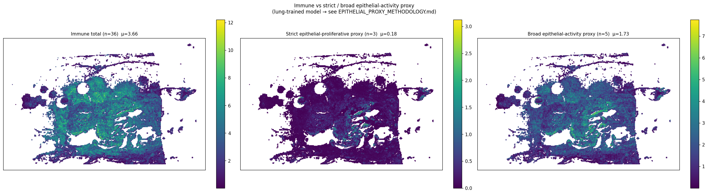

# slide2_152_19 (largest-blob X-range filtered) — 통합 분석 소견

> **이 문서는 무엇인가**
> 원본 v2 spot 40,502 중 가장 큰 connected blob 의 [Xmin, Xmax] = [44,600, 176,600] 범위 spot 27,339 (67.5%) 만 남기고 동일한 `analyze.py` 를 재실행한 결과. 원본 분석: `../../analysis/slide2_152_19_v2/findings.md`. **slide2 는 slide1 과 달리 필터 후 결론이 의미 있게 달라진다** — 특히 mucinous compartment (Goblet) 신호가 거의 사라짐.
>
> **⚠️ caveat**
> Hist2Cell 가중치는 healthy human lung 학습본, KBSMC breast 슬라이드에 적용. 80개 cell type 은 lung 라벨 — 절대값/sub-type 해석 불가. "epithelial-activity proxy" 는 lung-derived spatial proxy 로서 **breast tumor detector 가 아님** (`../EPITHELIAL_PROXY_METHODOLOGY.md` 의 strict/broad 2-score 설계 참조).

---

## 1. 필터링 결과 요약

| 항목 | 값 |
|---|---:|
| 원본 spot 수 | 40,502 |
| 필터 후 spot 수 | 27,339 (67.5%) |
| connected component 수 | 26 |
| 가장 큰 component 크기 | 26,565 (65.6%) |
| 두번째 component | 12,218 (30.2%) |
| 가장 큰 component X 범위 | [44,600, 176,600] |

슬라이드 2 는 원본 spot map 이 **2 개의 큰 분리된 조직 덩어리** (66% / 30%) + 24 개의 fragment. 본 분석은 가장 큰 66% 덩어리의 X 범위만 사용. 30% 덩어리에 mucinous 신호 (Goblet) 가 집중되어 있었음이 본 분석으로 명확해짐.

---

## 2. Hist2Cell 공간 분석 결과 (필터링 후)

### 2.1 상위 10 cell type

| 순위 | cell type | mean | (원본) | Δ% |
|---:|---|---:|---:|---:|
| 1 | AT2 | 1.415 | 1.102 | +28.4% |
| 2 | Fibro_alveolar | 1.120 | 0.812 | +37.9% |
| 3 | Ciliated | 1.098 | 1.215 | **-9.7%** |
| 4 | AT1 | 0.941 | 0.684 | +37.5% |
| 5 | Endothelia_vascular_Cap_a | 0.787 | 0.582 | +35.3% |
| 6 | Muscle_smooth_syst_arterial | 0.662 | 0.458 | +44.7% |
| 7 | Fibro_adventitial | 0.583 | 0.441 | +32.4% |
| 8 | Endothelia_vascular_Cap_g | 0.550 | 0.412 | +33.4% |
| 9 | Muscle_airway | 0.512 | 0.359 | +42.9% |
| 10 | Macro_alv | 0.384 | — | — |

**핵심 변화**:
- **Secretory_Goblet 이 top10 에서 빠짐** (원본 9위 0.382 → 필터 0.177, **-53.8%**). mucinous 신호의 측부 덩어리 집중.
- Ciliated 1위 → 3위로 밀림 (-9.7%, 다른 모든 type 이 +30~45% 상승하는 와중에 거의 유일하게 감소).
- **AT2 / Fibro_alveolar 가 1, 2 위로 부상** — 가장 큰 덩어리는 alveolar / fibroblastic 성격.

### 2.2 lineage group + 두 proxy score

| group / pseudo-group | n | mean / spot | (원본) | Δ% |
|---|---:|---:|---:|---:|
| Epithelial-airway | 14 | 2.591 | 2.706 | **-4.3%** |
| Epithelial-alveolar | 3 | 2.379 | 1.802 | +32.0% |
| Immune-lymphoid | 20 | 2.133 | 1.637 | +30.3% |
| Stromal-fibroblast | 6 | 2.025 | 1.488 | +36.1% |
| Vascular | 7 | 1.783 | 1.312 | +35.9% |
| **Broad epithelial-activity proxy** | 5 | **1.730** | 1.427 | +21.3% |
| Stromal-muscle | 6 | 1.713 | 1.194 | +43.5% |
| Immune-myeloid | 16 | 1.526 | 1.087 | +40.4% |
| Stromal-other | 4 | 0.196 | 0.145 | +35.4% |
| **Strict epithelial-proliferative proxy** | 3 | **0.175** | 0.168 | +4.2% |
| Other-blood | 2 | 0.129 | 0.092 | +40.0% |
| Neural | 2 | 0.070 | 0.081 | -14.1% |

**핵심**: 모든 그룹이 +30~45% 상승하는 와중 **Epithelial-airway 만 -4.3%** — 원본의 "Epi-airway 단독 강세" 가 측부 덩어리에 강하게 의존했음. 필터 후 **Epi-airway / Epi-alveolar 거의 비등** (2.59 vs 2.38, 차이 8%). strict 는 거의 변화 없음 (+4.2%).

### 2.3 immune vs strict / broad epithelial-activity proxy

| 지표 | 필터 후 | 원본 |
|---|---:|---:|
| immune mean / spot | 3.659 | 2.723 |
| strict proxy mean | 0.175 | 0.168 |
| broad proxy mean | 1.730 | 1.427 |
| ρ (immune ↔ strict) | **0.298** | 0.251 |
| ρ (immune ↔ broad) | **0.786** | 0.816 |
| **strict-dominant spots** | **0.03%** | 0.04% |
| **broad-dominant spots** | **3.64%** | **17.69%** |

**slide2 의 가장 큰 발견**:
- **broad-dominant 가 17.69% → 3.64% 로 5 배 감소** — 원본의 "환자 2 = cancer-proxy 17.7% 우세 (환자 1 의 1.6배)" 결론은 **측부 덩어리에 집중된 broad-proxy spot 의 영향**. 가장 큰 덩어리만 보면 immune 이 96.4% spot 에서 dominant.
- **strict-dominant 는 원본 0.04% → 필터 0.03%** — 양쪽 모두 거의 0. 즉 strict 한 정의로는 본 슬라이드의 cancer-proxy dominant 영역이 **사실상 없으며, 측부도 동일**. *strict 으로 검증한 결론은 robust*.
- ρ(im↔broad) 가 0.82 → 0.79 로 약간 감소, ρ(im↔strict) 는 0.25 → 0.30 으로 비슷.

→ **methodology 의 핵심 메시지가 본 슬라이드에서 강하게 나타남**: broad-proxy 결과는 측부 덩어리의 AT2/Suprabasal 신호에 강하게 의존, strict 으로 보면 본 슬라이드의 "cancer-proxy 우세" 영역은 0% 에 가깝다.

### 2.4 80×80 cell-cell Moran R

**Strict proxy types**:

| label | R (필터) | (원본) |
|---|---:|---:|
| Dividing_Basal | 0.553 | 0.579 |
| Dividing_AT2 | 0.499 | 0.629 |
| Basal | 0.419 | 0.475 |

**Broad-only types**:

| label | R (필터) | (원본) |
|---|---:|---:|
| AT2 | 0.553 | 0.682 |
| Suprabasal | 0.398 | 0.523 |

→ 모두 약 0.07-0.13 감소. AT2/Suprabasal 의 spatial blob 강도가 더 큰 감소폭 → 측부 덩어리에 있던 강한 blob 이 빠진 영향. strict 의 Dividing_AT2/Basal 도 감소했으나 보존.

**Top 5 positive Moran R**:
| A | B | R |
|---|---|---:|
| DC_1 | Macro_int | 0.629 |
| DC_1 | Macro_interstitial | 0.624 |
| B_memory | DC_1 | 0.611 |
| SMG_Duct | SMG_Serous | 0.604 |
| Macro_interstitial | Macro_CCL | 0.603 |

→ 원본은 **B_memory 중심** ("B_memory↔DC_1/Mono/CD8" 5 종 중 4 종), 필터 후 **DC/Macro 중심 (myeloid)** 으로 community 재구성. B-cell-rich 영역이 측부에 있었음.

**Top 5 negative**: 모두 Macro_int / Macro_alv ↔ NAF/Muscle — **원본의 Goblet ↔ immune mutual exclusion 이 top 5 에서 완전히 빠짐**. Goblet 자체가 측부 덩어리에 의존.

---

## 3. 원본 vs 필터 — 결론 변화 요약 (slide2 의 핵심)

| 결론 항목 | 원본 | 필터 | 변화 |
|---|---|---|---|
| 그룹 순위 | Epi-airway 1위 단독 강세 | 1위 유지, but Epi-alveolar 와 거의 동등 | **단독 강세 약화** |
| Secretory_Goblet | 0.382 (top10 9위) | 0.177 (-53.8%, top10 빠짐) | **큰 변화** |
| broad-proxy 비율 | 17.69% | 3.64% | **5배 감소** |
| strict-proxy 비율 | 0.04% | 0.03% | 변화 없음 (양쪽 0) |
| ρ(im↔broad) | 0.82 | 0.79 | 약간 감소 |
| top immune cluster | B_memory 중심 | DC/Macro 중심 (myeloid) | 재구성 |
| Goblet ↔ immune mutual exclusion | 5/5 | 0/5 | **신호 사라짐** |
| Dividing_AT2 Moran I | 0.629 | 0.499 | -0.13 |

**한 줄**: slide2 의 원본 결론 중 **"Epi-airway 단독 강세 + Goblet ↔ immune mutual exclusion + broad-proxy 17.7% 우세"** 는 측부 덩어리 (전체의 30%) 에 강하게 의존. 가장 큰 덩어리만 보면 **alveolar/airway 비등 + immune dominant + cancer-proxy 우세 영역은 측부에 위치** 의 그림. strict-proxy 는 양쪽 모두 거의 0 으로 같음.

---

## 4. Proteomics 분석 (필터 영향 없음, 원본과 동일)

### 4.1 ROI 추출 분포

환자 2 는 high/low 비율 균형적 (e:13 vs f:15).

### 4.2 High vs Low risk: top discriminative protein

high-risk Tumor 마커: GZMH/LCK/SP110 (immune!) + cytoskeleton (MAPK12/MARK3). high-risk T-cell 마커: TFAP2C (mammary epithelial!).

### 4.3 UMAP

---

## 5. Hist2Cell × Proteomics 통합 해석 (필터 적용 후)

| 관점 | Hist2Cell (필터) | Proteomics | 일치 / 부분 / 검증 |
|---|---|---|---|
| 큰 덩어리 성격 | alveolar/airway 비등, immune dominant 96.4%, strict-proxy 0.03% / broad 3.64% | high/low Tumor 균형 (13:15) | **부분 일치** — proteomics 가 본 영역에서 active 라고 보고하지만 Hist2Cell strict 는 cell-cycle dominant 영역 거의 없음 |
| 큰 덩어리의 epithelial 신호 | broad-proxy 의 핵심이 AT2 (μ=1.42), Ciliated (1.10), Fibro_alveolar (1.12) | high-risk T-cell 에 TFAP2C (mammary epithelial!) | **일치** — proteomics 의 epithelial 침윤과 Hist2Cell 의 alveolar/ductal-like 신호 같은 방향 |
| immune cluster | DC/Macro myeloid 중심 (B_memory 도 #3) | high-risk Tumor 마커 GZMH/LCK (immune!) | **일치** — proteomics 의 immune-mixed Tumor 와 Hist2Cell 의 myeloid-dominant 영역 spatial 매칭 후보 |
| 측부 덩어리 (전체 30%) | 원본 결론의 Goblet/B-cell-rich 부분 위치 | ROI tube 가 슬라이드 전반에 분포 — 측부 ROI 가 어떤 마커 보이는지 미확인 | **추가 검증 필요** — ROI 좌표 받으면 즉시 해석 가능 |

→ **slide2 의 핵심 메시지**: 두 modality 모두 본 슬라이드 = active + immune-mixed + epithelial-rich. 단 Hist2Cell 의 "broad-proxy 17.7%" 류 표현은 **외부 reader 에게 단순화시켜 전달 금지** — 본 분석으로 broad 가 측부 의존, strict 는 본 슬라이드 전체에서 거의 0% 임이 명백해짐. methodology 의 "broad-only 신뢰도 낮음" 이 본 슬라이드에서 직접 입증.

### 5.1 환자 2 만의 특이 신호 (필터링 분석 기반)

1. **Two-compartment 가설**: 큰 덩어리 (alveolar/airway/immune dominant) vs 측부 (mucinous Goblet + B-cell-rich) — 본 분석의 새로운 발견.
2. **broad-proxy 가 측부 의존** — methodology §3 의 broad-only 라벨 (AT2/Suprabasal) 의 cross-tissue 매핑 신뢰도 낮음과 일관.
3. **TFAP2C × ductal-glandular hot-spot** — 큰 덩어리 안 SMG_Duct ↔ SMG_Serous co-occurrence (Moran R 0.604) 가 proteomics 의 TFAP2C 와 매핑 후보.

### 5.2 후속 정량 검증 제안

1. **좌표 매핑 + ROI 위치 확인**: ROI tube 가 큰 덩어리 vs 측부 중 어디인지. high-risk Tumor (e1-e13) 의 분포가 핵심.
2. **측부 덩어리 단독 분석**: 본 분석에서 빠진 13,163 spot 만으로 별도 분석. 가설 — 측부에서 Goblet ↔ immune mutual exclusion 더 강하게 나타날 것.
3. **strict vs broad 양쪽으로 정량 검증**: Wilcoxon (e vs f) 에서 strict 가 broad 와 같은 방향이면 결론 robust, 다르면 broad 가 AT2/Suprabasal 의존 재확인.
4. **CUCA her2st 후 직접 검증**: mammary epithelial (3종) 합 score vs 본 strict/broad 의 spatial overlap.

---

## 6. 한계

1. **lung→breast proxy** — 그룹/공간 단위만 신뢰.
2. **broad-proxy 의 측부 의존이 본 슬라이드에서 명확**.
3. **strict 으로 양쪽 모두 0% — 본 슬라이드 cancer-proxy dominant 영역 없음**.
4. **mean 일률 상승은 denominator effect**.
5. **slide2 의 두 compartment 신호**: 측부 분리 단독 분석 권장. 본 분석 단독 결론 절대 금지.
6. **ROI 좌표 미포함** — 정량 검증은 좌표 후.
7. **n=2 환자** — generalization 불가.

---

## 7. 관련 파일

- 본 (필터링) 분석 산출물: `inference/analysis_filtered/slide2_152_19_v2/`
- 필터링 스크립트: `inference/analysis_filtered/filter_largest_blob.py`
- 필터 전후 비교: `inference/analysis_filtered/COMPARISON.md`
- 원본 (필터링 전): `inference/analysis/slide2_152_19_v2/findings.md`
- **방법론 근거 (필수)**: `inference/analysis/EPITHELIAL_PROXY_METHODOLOGY.md`
- ROI / Proteomics PDF: `inference/analysis/메테오바이오텍_1_152_19_ROI_추출_결과.pdf`, `proteomics_분석.pdf`
- KBSMC bulk (slide2=col3): `inference/analysis/KBSMC_heatmap.png`
- 비교 슬라이드 (필터링): `inference/analysis_filtered/slide1_085_12_v2/findings.md`
