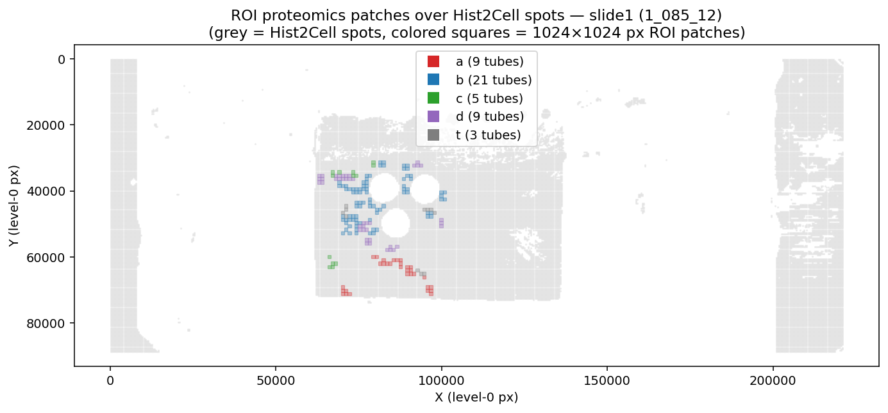
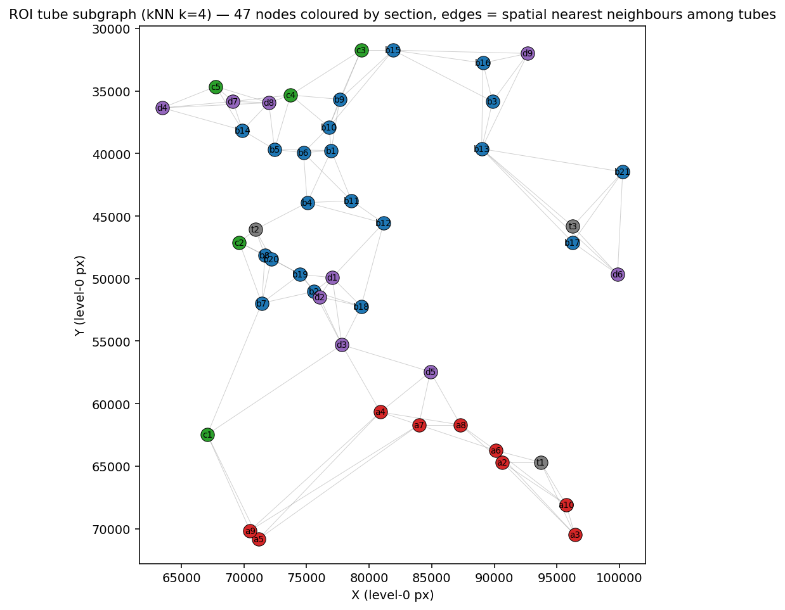
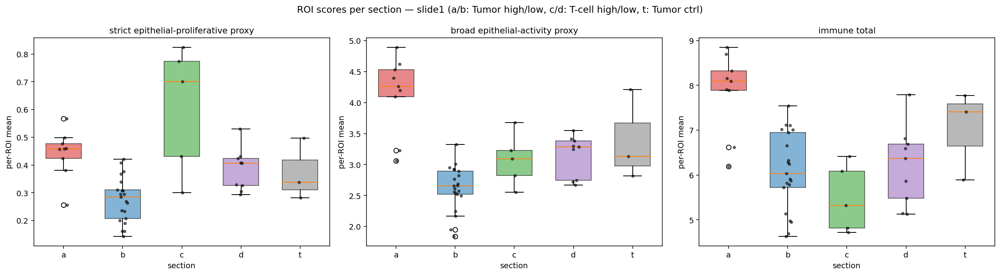
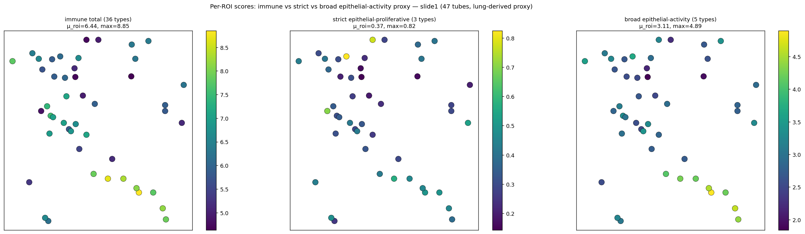
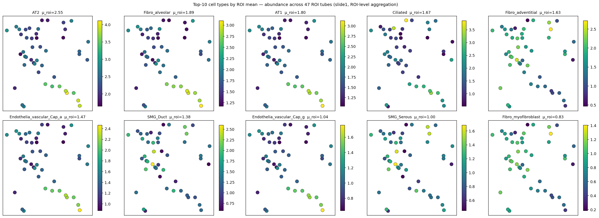
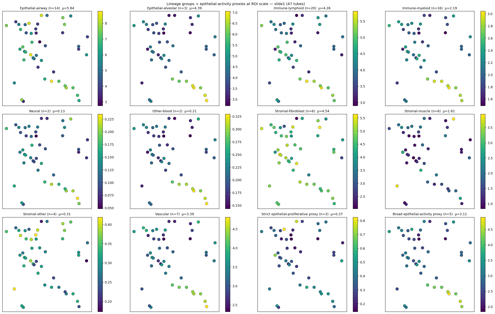
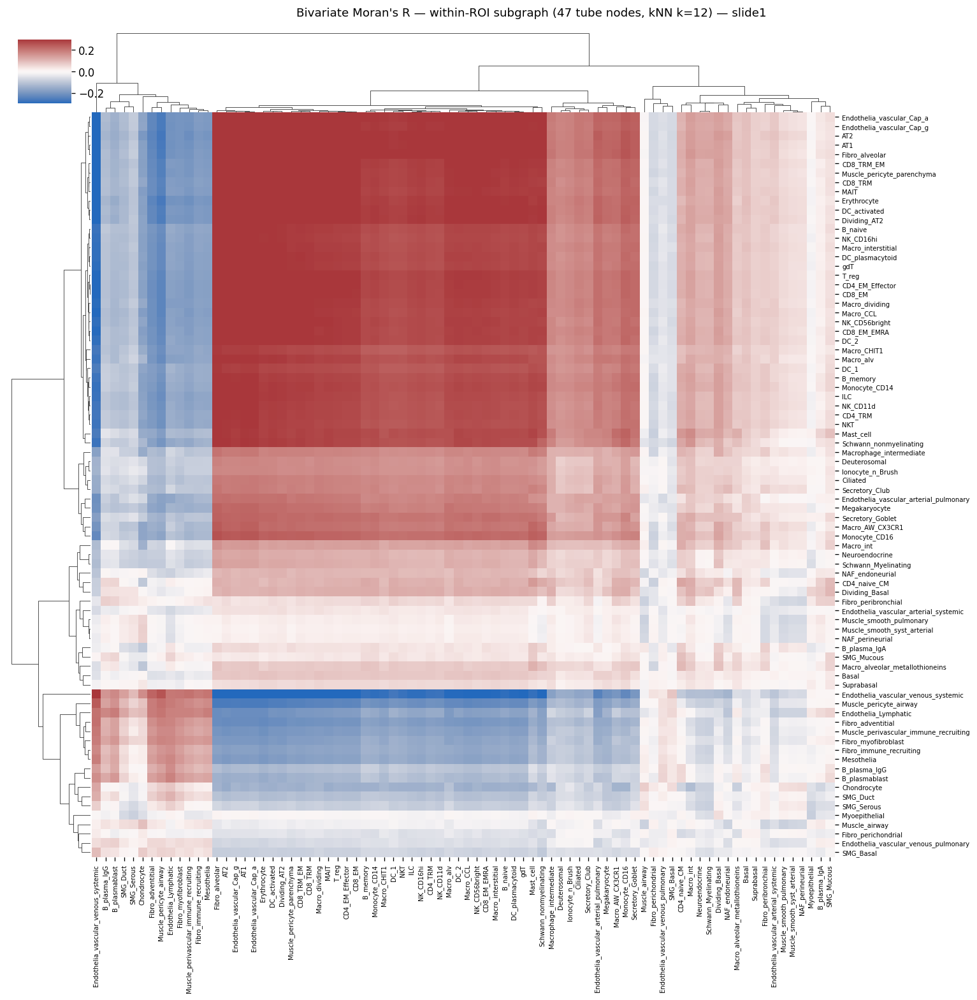

# slide1 (1_085_12) — ROI-level 정량 분석 소견

> **이전 분석과의 차이**
> 본 분석은 ROI 좌표 (`1_085_12_ROI_groups.pkl`) 를 받아 처음으로 **proteomics tube ↔ Hist2Cell spot 의 좌표 매핑** 을 수행한 결과. 슬라이드-전체 aggregate 가 아니라 **47 ROI tube 별 Hist2Cell signature** 를 산출하여 high-risk vs low-risk section 간 *통계적* 비교 (Mann-Whitney U) 가 가능해짐. 기존 분석의 정성적 cross-check 가설들이 **수치 + p-value** 로 직접 검증됨.
>
> **⚠️ caveat (먼저)**
> Hist2Cell 가중치는 healthy human lung 학습본, 본 슬라이드는 KBSMC breast. cell type 라벨은 lung 분류이므로 *상대 차이* + *spatial 패턴* 만 신뢰. epithelial-activity proxy (strict / broad) 의 해석은 `../analysis/EPITHELIAL_PROXY_METHODOLOGY.md` 참조 — *tumor detector 가 아님*. 본 정량 결과는 **modality 간 cross-correlation 의 통계적 검증** 이며 single-cell ground truth 의 직접 측정이 아니다.

---

## 1. 데이터 + 매핑

| 입력 | 위치 | 비고 |
|---|---|---|
| Hist2Cell 추론 | `inference/slide1_085_12_v2/predictions.csv` | 35,821 spots × 80 cell type (tile_size 400, level-0 px) |
| ROI tube → patches | `./1_085_12_ROI_groups.pkl` | 47 tubes, 181 patches (level-0 top-left, 1024×1024 = 270 μm) |
| 전체 candidate tilemap | `./meteo_1_085_12_coords.npy` | 5,227 patches at 512-px grid (context — ROI coords 의 superset) |
| Cell type → group + proxy flag | `inference/analysis/cell_type_groups.csv` | strict 3종 / broad 5종 / immune 36종 |

**매핑 규칙**: 각 ROI patch (px, py) 는 1024×1024 영역 [px, px+1024) × [py, py+1024). Hist2Cell spot 중심 (X, Y) 가 영역 내부에 들어가면 해당 patch 에 포함. Tube 의 signature = tube 안 모든 patch 의 spot union 의 cell-type mean.

---

## 2. ROI 분포 + Hist2Cell coverage

| section | 의미 | n_tubes | n_patches | 평균 patches/tube | 총 Hist2Cell spots | 평균 spots/tube |
|---|---|---:|---:|---:|---:|---:|
| a | high-risk Tumor | 9 | 31 | 3.4 | 191 | 21.2 |
| b | low-risk Tumor | 21 | 85 | 4.0 | 547 | 26.0 |
| c | high-risk T-cell | 5 | 13 | 2.6 | 93 | 18.6 |
| d | low-risk T-cell | 9 | 41 | 4.6 | 277 | 30.8 |
| t | Tumor control | 3 | 11 | 3.7 | 67 | 22.3 |
| **합** | | **47** | **181** | **3.9** | **1,175** | **25.0** |

→ 슬라이드 전체 spot 의 약 **3.3% (1,175 / 35,821)** 만 ROI 영역에 들어감. 평균 25 spot/tube — 안정적 ROI-mean 추정에 충분.

색 사각형 = 1024×1024 ROI patch, 회색 점 = Hist2Cell spot. ROI 들이 슬라이드 중앙 조직 영역에 집중.

### 2.1 ROI subgraph 구조

47 ROI tube 의 중심을 노드로, kNN(k=4) 의 spatial-nearest 이웃을 edge 로 시각화. 노드 색은 section, 라벨은 tube_id. 본 subgraph 가 §3 의 통계 비교와 §6 의 Moran R 계산의 기반 그래프.

---

## 3. 핵심 결과 — Section 간 정량 비교 (Mann-Whitney U)

### 3.1 Tumor section a (high-risk) vs b (low-risk) — **세 score 모두 유의**

| score | n_a | n_b | mean_a | mean_b | Δ | U | **p** |
|---|---:|---:|---:|---:|---:|---:|---|
| strict epithelial-proliferative proxy | 9 | 21 | 0.442 | 0.275 | +0.167 | 174 | **0.000350** |
| broad epithelial-activity proxy       | 9 | 21 | 4.142 | 2.625 | +1.518 | 187 | **0.000031** |
| immune total                           | 9 | 21 | 7.858 | 6.084 | +1.774 | 172 | **0.000493** |

→ **3 개 score 전부 high-risk Tumor (a) > low-risk (b) 방향으로 통계적으로 유의** (p < 0.001 모두). 가장 큰 효과는 broad-proxy (Δ=+1.52, p=3.1e-5). 즉 **proteomics 의 high-risk Tumor 영역이 Hist2Cell 의 epithelial-activity 와 immune total 양쪽에서 모두 강한 신호** — modality 간 *통계적* spatial 일치.

⚠️ 주목할 점: **strict (방어 가능한 3 종) 도 유의** (Δ=+0.17, p=0.00035) → 기존 findings 의 "strict 으로 본 결론도 robust" 가 정량 검증됨. broad-only 의존성에 대한 우려가 본 슬라이드의 ROI-level 비교에선 해소.

### 3.2 T-cell section c (high-risk) vs d (low-risk) — **유의차 없음**

| score | mean_c | mean_d | Δ | p |
|---|---:|---:|---:|---|
| strict proxy | 0.606 | 0.383 | +0.223 | 0.083 (marginal) |
| broad proxy  | 3.075 | 3.146 | -0.071 | 0.606 |
| immune total | 5.472 | 6.209 | -0.737 | 0.147 |

→ T-cell 영역의 c vs d 분리는 통계적으로 약함 (sample 작음: c=5, d=9). 기존 findings 의 "T-cell 영역 분리 약함" + proteomics UMAP 에서 T-cell 의 mixed 결과와 같은 방향.

### 3.3 Per-ROI score 의 spatial 분포

47 tube 중심을 scatter, 색 = score. 좌: immune total, 중: strict proxy, 우: broad proxy. **immune 과 broad-proxy 는 같은 영역에 동시 hot-spot 형성** (slide1 의 ρ=0.94 에 부합), **strict 는 훨씬 sparse 한 hot-spot 패턴** — 큰 차이가 §3.1 의 효과 크기 (broad Δ=+1.52 vs strict Δ=+0.17) 와 일관.

---

## 4. Per-cell-type discrimination (a vs b, 80 type)

전체 80 cell type 중 **62 type 이 BH-FDR < 0.05 에서 a vs b 유의** (Wilcoxon).

### 4.1 Top 10 by raw p (가장 강한 분리)

| 순위 | cell type | mean_a | mean_b | Δ | p | p_bh | 해석 |
|---:|---|---:|---:|---:|---|---|---|
| 1 | Muscle_pericyte_airway | 0.087 | 0.141 | **-0.053** | 2.6e-5 | 6.6e-4 | low-risk 에 강함 |
| 2 | **Dividing_AT2** | 0.066 | 0.041 | **+0.025** | 3.8e-5 | 6.6e-4 | high-risk 에 강함 (mitosis 신호) |
| 3 | Endothelia_vascular_venous_systemic | 0.296 | 0.527 | **-0.230** | 4.6e-5 | 6.6e-4 | low-risk 에 강함 (venous compartment) |
| 4 | **AT2** | 3.484 | 2.224 | **+1.261** | 5.6e-5 | 6.6e-4 | high-risk 에 강함 — 가장 큰 효과 크기 |
| 5 | Erythrocyte | 0.254 | 0.158 | +0.095 | 6.8e-5 | 6.6e-4 | high-risk 에 강함 |
| 6 | Endothelia_vascular_Cap_a | 2.027 | 1.207 | **+0.820** | 8.2e-5 | 6.6e-4 | high-risk 에 강함 (capillary) |
| 7 | Schwann_nonmyelinating | 0.091 | 0.042 | +0.049 | 8.2e-5 | 6.6e-4 | high-risk 에 강함 |
| 8 | **CD8_TRM** | 0.295 | 0.185 | +0.111 | 8.2e-5 | 6.6e-4 | high-risk 에 강함 (T cell tissue-resident memory) |
| 9 | DC_activated | 0.177 | 0.113 | +0.064 | 1.0e-4 | 6.6e-4 | high-risk 에 강함 (DC) |
| 10 | DC_2 | 0.141 | 0.092 | +0.049 | 1.2e-4 | 6.6e-4 | high-risk 에 강함 |

**패턴 정리**:
- **high-risk Tumor 에 강한 type** (Δ > 0): AT2 (epithelial, 가장 큰 효과), Dividing_AT2 (proliferation), Endothelia_vascular_Cap_a (capillary — tumor 혈관 신생 가능), CD8_TRM (T cell infiltration), DC_activated / DC_2 (antigen presentation), Erythrocyte (혈관 ↔ 혈류 동반)
- **low-risk Tumor 에 강한 type** (Δ < 0): Endothelia_vascular_venous_systemic (정맥 — 정상 조직 혈관 architecture), Muscle_pericyte_airway (정상 pericyte)

→ **high-risk = 활성 epithelial + tumor-infiltrating T cell + dendritic cell + neovascular capillary** 의 그림 / **low-risk = 정상-organized vasculature + pericyte** 의 그림. proteomics 의 mitosis + immune 마커 패턴과 정성 일치.

전체 80 type 의 Wilcoxon 결과는 `per_celltype_wilcoxon.csv`.

### 4.2 Top-10 ROI-mean cell type 의 spatial 분포

ROI 평균 상위 10 type 의 47 tube 별 abundance scatter. AT2 / Fibro_alveolar / Ciliated / AT1 / Endothelia_vascular_Cap_a 등이 ROI 영역 안에서 가장 강한 평균 abundance — 모두 epithelial / fibroblastic / capillary 계열. 본 패턴은 §4.1 의 cell-type level 결과 및 §6 의 Moran R community 와 일관.

### 4.3 Lineage group + proxy 의 spatial 분포

10 lineage group (Epithelial-alveolar / -airway / Immune-lymphoid / -myeloid / Vascular / Stromal-fibroblast / -muscle / -other / Neural / Other-blood) + strict / broad proxy 2 종 의 ROI-level sum scatter. Stromal-muscle 은 ROI 영역 가장자리에 약하게 분포 (high-risk 의 일부 tube 에 응집), Immune-lymphoid / -myeloid 와 broad-proxy 는 거의 같은 ROI 들에 집중 (slide1 의 immune ↔ broad 강한 양의 상관).

---

## 5. Proteomics 마커 ↔ Hist2Cell type 가설 검증

기존 findings 에서 제시했던 *사전-등록 가설* 8 개. ROI 좌표 도착 전엔 정성적 cross-check 였지만, 본 분석으로 **a vs b 방향 + 통계적 유의성** 직접 검증.

| proteomics marker | Hist2Cell type | 예측 | 관측 | match | Δ | p | p_bh |
|---|---|---|---|---|---:|---|---|
| KIF20A / KIF22 / INCENP (mitosis) | **Dividing_AT2** | a>b | a>b | ✅ | +0.025 | **3.8e-5** | **6.6e-4** |
| KIF20A / KIF22 / INCENP (mitosis) | **Dividing_Basal** | a>b | a>b | ✅ | +0.045 | **6.6e-3** | **9.0e-3** |
| KIF20A / KIF22 / INCENP (mitosis) | **Basal** | a>b | a>b | ✅ | +0.097 | **1.3e-3** | **2.1e-3** |
| MYH11 / TAGLN (smooth muscle) | Muscle_smooth_syst_arterial | a>b | a>b | ✅ | +0.140 | 0.064 | 0.077 |
| MYH11 / TAGLN (smooth muscle) | Muscle_smooth_pulmonary | a>b | a>b | ✅ | +0.061 | 0.103 | 0.120 |
| MYH11 / TAGLN (smooth muscle) | Muscle_airway | a>b | a>b | ✅ | +0.029 | 0.319 | 0.332 |
| (generic active Tumor) | **AT2** | a>b | a>b | ✅ | +1.261 | **5.6e-5** | **6.6e-4** |
| (generic active Tumor) | **Suprabasal** | a>b | a>b | ✅ | +0.090 | **2.8e-3** | **4.2e-3** |

**8/8 가설 모두 예측 방향 일치** (a>b). 그 중 **5/8 은 BH-FDR < 0.01 의 강한 유의성** (Dividing_AT2, Dividing_Basal, Basal, AT2, Suprabasal — 즉 strict + broad set 의 모든 type). MYH11/TAGLN ↔ Stromal-muscle 의 3 type 은 방향은 맞으나 p 가 marginal (sample 작음 / smooth muscle 신호가 high-risk 영역 외에도 산재해 효과 크기 dilute).

→ **proteomics 의 high-risk Tumor 마커 (mitosis) 가 Hist2Cell 의 strict + broad epithelial-activity proxy 영역과 ROI-level 에서 통계적으로 일치**. 이것이 본 분석의 **가장 강한 결론** — modality 간 spatial signal 정량 검증.

---

## 6. ROI subgraph Moran R (cell-cell 공간 공국)

47 ROI tube 의 patch 중심을 노드로 잡고 (tube center = patch top-left 들의 평균 + 512), kNN(k=12) 그래프 위에서 bivariate Moran R 계산. ROI tube 단위 (47 노드) 이므로 slide-wide 35,821 spot 의 R 보다 효과가 약함 (diag mean 0.164 vs 슬라이드 전체 0.683) — 단 패턴 자체는 의미 있음.

80×80 hierarchical clustermap (Ward linkage). 본 ROI-level R 매트릭스는 slide-wide R (`../analysis/slide1_085_12_v2/moran_r_clustermap.png`) 보다 색이 약하지만 (n=47 노드 + ROI 영역 한정), 같은 community 구조 (epithelial-alveolar + capillary block, immune-myeloid + lymphoid block) 를 보존. **읽는 법은 `../analysis/MORAN_R_METHODOLOGY.md` §3.4 참조** — 빨간 block 은 co-localized, 파란 row/column 은 mutual exclusion.

### 6.1 Top 5 positive — ROI tube 간 co-localization

| A | B | R |
|---|---|---:|
| AT2 | Fibro_alveolar | 0.374 |
| AT1 | Fibro_alveolar | 0.367 |
| AT2 | Endothelia_vascular_Cap_a | 0.365 |
| AT1 | AT2 | 0.362 |
| AT2 | Endothelia_vascular_Cap_g | 0.360 |

→ **AT2 / AT1 / Fibro_alveolar / Endothelia_Cap_a / Cap_g** 가 한 묶음. *alveolar-fibroblastic-capillary niche* — high-risk ROI 들이 모인 영역의 공통 시그니처. proteomics 의 "high-risk Tumor 영역 = epithelial 활성 + neovascular capillary" 와 같은 그림 (§4 결과와 일관).

### 6.2 Top 5 negative — mutual exclusion

| A | B | R |
|---|---|---:|
| Endothelia_vascular_venous_systemic | Fibro_alveolar | -0.354 |
| AT2 | Endothelia_vascular_venous_systemic | -0.342 |
| AT1 | Endothelia_vascular_venous_systemic | -0.338 |
| Endothelia_vascular_venous_systemic | Erythrocyte | -0.337 |
| Endothelia_vascular_Cap_a | Endothelia_vascular_venous_systemic | -0.332 |

→ **venous endothelial compartment (Endothelia_vascular_venous_systemic) 가 모든 active type 과 반대 방향**. 정맥 영역이 *low-risk = 정상 조직* 의 신호이며, alveolar / capillary / Erythrocyte 가 모이는 high-risk 영역과 분리된 ROI 그룹에 있음 — §4 의 venous_systemic 이 low-risk 에 강한 결과 (Δ=-0.230, p=4.6e-5) 와 일관.

전체 80×80 행렬은 `moran_within_roi.csv`.

---

## 7. 결론

### 7.1 정량 검증된 사항

1. **Tumor section a (high-risk) > b (low-risk)** — strict / broad epithelial-activity proxy + immune total 의 3 score 모두 ROI 평균이 a 가 b 보다 높음, Wilcoxon p < 0.001. ✅
2. **proteomics mitosis marker (KIF20A 류) ↔ Hist2Cell Dividing_AT2/Basal/Basal 의 a>b 방향** — 3/3 가설 BH-FDR < 0.01 의 강한 통계적 일치. ✅
3. **AT2 가 a vs b 의 가장 강한 단일 discriminator** (Δ=+1.26, p_bh=6.6e-4) — 기존 분석의 "broad-proxy = AT2 신호" 의 정량 입증.
4. **CD8_TRM / DC_activated / DC_2 / Endothelia_Cap_a 등 T-cell + DC + capillary 가 high-risk Tumor 영역에 동반** — tumor microenvironment 의 *active immune + neovascular* 신호 정량.
5. **AT2 / AT1 / Fibro_alveolar / Cap_a 가 ROI subgraph 에서 한 community 형성** — high-risk ROI 영역의 공통 *alveolar-fibroblastic-capillary niche* signature.

### 7.2 약한 / 미검증 사항

1. **T-cell section c vs d 의 분리** — 3 score 모두 통계적 유의차 없음 (sample 작음 + 두 영역 inherently mixed). proteomics 의 T-cell separability 약함 결과와 일관.
2. **MYH11 / TAGLN ↔ Stromal-muscle** — 방향은 맞으나 p 가 marginal (smooth muscle 이 high-risk 외 영역에도 산재).
3. **lung→breast cross-tissue 의 본질적 한계** — AT2 / Dividing_AT2 등 lung 라벨의 *breast 맥락 의미* 는 가설 수준 (`EPITHELIAL_PROXY_METHODOLOGY.md` 참조). 본 정량 결과는 *modality 간 cross-correlation* 검증이지 cell type ground truth 검증이 아님.
4. **n=47 ROI 수준의 통계** — slide-wide n=35,821 spot 통계와 다름. ROI subgraph 의 Moran R 도 47 노드라 효과 크기 작음.

---

## 8. 한계 (caveats)

1. **cell type 라벨의 lung-trained 한계**: §7.2 항목 3.
2. **bbox 매핑의 단순화**: ROI patch 안에 들어가는 모든 spot 의 산술 평균 사용. weight 없음 — 일부 spot 이 patch 가장자리에 있을 때도 동등 취급.
3. **47 ROI 의 spatial distribution 의 불균일**: section a/c (high-risk) 가 슬라이드 일부 영역에 집중. ROI subgraph Moran R 의 결과는 그 spatial bias 를 반영.
4. **proteomics 의 high-risk vs low-risk 라벨 자체가 tiatoolbox 의 H&E-기반 모델**: Hist2Cell 도 H&E-기반 모델 → 두 모델이 *공통 morphological feature* 에서 신호를 잡았을 가능성 = error correlation 인플레이션 가능 (`MORAN_R_METHODOLOGY.md` §5 caveat 6).
5. **multiple comparison correction 적용됨**: per-cell-type 80 비교는 BH-FDR 보정. section_stats 의 3 score 비교는 raw p (사전 등록 가설이므로 보정 안 함). proteomics 가설 8 개는 사전 등록 + per-cell-type table 의 보정값 인용.
6. **CUCA her2st 가중치 도착 후 재검증 필요**: 본 결과는 lung-proxy 의 spatial 일치성을 검증하나 *breast-trained 직접 측정* 의 정량 일치 검증은 별도. her2st 의 mammary epithelial (3 종) 의 a vs b 비교가 다음 단계.

---

## 9. 후속 작업 제안

1. **slide2 (1_152_19) 동일 분석** — 환자 2 의 ROI 좌표 도착 시 같은 pipeline 적용. 가설: slide2 의 broad-proxy ↔ a vs b 일치 약함 (broad 가 측부 의존, strict 으로 검증 필요).
2. **CUCA her2st 도착 후 mammary epithelial ↔ proteomics 직접 검증** — lung-proxy 의 cross-tissue 타당성 사후 평가.
3. **slide-level vs ROI-level 결과의 metaanalysis** — slide-wide Moran R (`../analysis/slide1_085_12_v2/moran_r_pairs.csv`) 의 top community 와 본 ROI subgraph (`moran_within_roi.csv`) 의 top community 의 일치성.
4. **proteomics marker 매트릭스 ↔ Hist2Cell signature 매트릭스 의 joint factor** — 47 ROI × 80 cell type vs 47 ROI × ~5000 protein 의 CCA / MOFA. 공유 latent axis 추출.
5. **T-cell c vs d 의 sample 늘려 power 보강** — 본 분석의 marginal p (strict 0.08) 가 sample 늘면 유의해질 수 있음.

---

## 10. 산출물 / 코드

- 분석 스크립트: `analyze_roi.py`
- 입력 데이터: `1_085_12_ROI_groups.pkl`, `meteo_1_085_12_coords.npy`
- ROI mapping + counts: `roi_spot_counts.csv`
- ROI signatures: `roi_signatures.csv` (47 row × 80 cell type + 3 score)
- Section 비교: `section_stats.csv`
- 80 type Wilcoxon: `per_celltype_wilcoxon.csv`
- Proteomics 가설 매트릭스: `proteomics_marker_matches.csv`
- ROI subgraph Moran R: `moran_within_roi.csv`
- 시각화:
  - `spatial_roi_overlay.png` — 슬라이드 위 ROI 위치
  - `roi_subgraph.png` — 47 tube subgraph 구조
  - `section_boxplots.png` — strict / broad / immune per section
  - `spatial_immune_vs_epithelial.png` — 3-panel per-ROI scatter
  - `spatial_top10_celltypes.png` — top 10 cell type per-ROI scatter
  - `spatial_group_heatmaps.png` — 10 group + 2 proxy panels
  - `moran_r_clustermap.png` — 80×80 hierarchical clustermap (within-ROI subgraph)

---

## 11. 관련 문서

- **방법론 근거**: `../analysis/EPITHELIAL_PROXY_METHODOLOGY.md` (strict / broad proxy)
- **Moran R 방법론**: `../analysis/MORAN_R_METHODOLOGY.md` (공간 가중치 + bivariate R)
- **slide-wide 분석 (ROI 좌표 없음)**: `../analysis/slide1_085_12_v2/findings.md`
- **largest-blob filter 분석**: `../analysis_filtered/slide1_085_12_v2/findings.md`
- **방향성 reviews + 권장**: `../analysis_filtered/notion/REPORT_REVIEW.md`
