# slide1 (1_085_12) — 통합 ROI 분석 소견 (Hist2Cell × Proteomics)

> **이 문서의 위치**
> 본 폴더는 KBSMC breast 슬라이드 1_085_12 에 대해 ROI 좌표 (`1_085_12_ROI_groups.pkl`) 와 spatial proteomics 매트릭스 (`report.gg_matrix`) 를 처음으로 통합 분석한 결과. 두 modality 의 분석은 sub-folder 로 분리:
>   - `cell_typing/`  — Hist2Cell prediction 의 ROI-level 분석 + 슬라이드-전체 spatial heatmap
>   - `proteomics/`   — gg_matrix 의 ROI 샘플 단위 차등 분석 (a vs b, c vs d)
>
> 모든 시각화는 cropped tissue mask (`../tissue_mask_cropped.png`) 위에 그려져 슬라이드 anatomy 와 ROI 위치가 시각적으로 연결됨.
>
> **⚠️ caveat**
> Hist2Cell 는 healthy human lung 학습 모델이므로 cell type 라벨은 lung 분류. *공간 패턴 / 그룹 단위 상대 비교* 로만 해석. epithelial-activity proxy (strict / broad) 의 cross-tissue 해석은 `../EPITHELIAL_PROXY_METHODOLOGY.md` 필독. Proteomics 는 raw intensity → log2 변환 후 Mann-Whitney U (BH-FDR), gene 별 detection rate ≥30% 양 그룹에서 필터. 본 문서의 결과는 *modality 간 spatial signal 의 cross-correlation* 의 정량 검증이지 single-cell ground truth 의 직접 측정이 아님.

## Section 라벨 (전역 — 두 modality 공통)

| section prefix | 의미 | n (slide1) |
|---|---|---:|
| a | **High-risk Tumor** | 9 ROI tubes (proteomics 8 — a5 누락) |
| b | **Low-risk Tumor** | 21 |
| c | **High-risk T-cell** | 5 |
| d | **Low-risk T-cell** | 9 |
| t | **Middle-risk Tumor (control)** | 3 |
| **합** | | **47 (proteomics 46)** |

---

## 1. 데이터 출처

| 데이터 | 위치 | 비고 |
|---|---|---|
| Hist2Cell 추론 | `inference/slide1_085_12_v2/predictions.csv` | 35,821 spots × 80 cell types (lung-trained) |
| ROI tube → patch 좌표 | `./1_085_12_ROI_groups.pkl` | 47 tubes, 181 patches (1024×1024 = 270 μm each) |
| Tile candidate set | `./meteo_1_085_12_coords.npy` | 5,227 × (512×512) tile top-lefts; ROI 의 superset, tissue 영역만 |
| Cropped npy (X-range filter) | `./meteo_1_085_12_coords_cropped.npy` | X ∈ [30000, 175000] 필터 적용 (slide1 의 npy 는 이미 이 범위 내 — 5,227 동일) |
| Tissue mask | `./tissue_mask.png`, `./tissue_mask_cropped.png` | thumbnail 4000×1606, level-0 의 1/55 scale |
| Cell type group | `../cell_type_groups.csv` | strict 3종 + broad 5종 + 10 lineage |
| Proteomics gg-matrix | `../report.gg_matrix (1).tsv` | 7,807 genes × 95 samples (slide1 46 + slide2 48) |
| ROI 추출 절차 PDF | `../메테오바이오텍_1-085_12_ROI_추출_결과.pdf` | 53 페이지, ROI 별 thumbnail + Astromapper 매핑 |
| Proteomics 사전 분석 PDF | `../proteomics_분석.pdf` | 다른 연구자가 gg_matrix 로 만든 결과 |

---

## 2. ROI 분포 + 매핑 통계

| section | Hist2Cell ROI tubes (cell_typing) | Hist2Cell spots in ROI | Proteomics samples |
|---|---:|---:|---:|
| High-risk Tumor (a) | 9 | 191 | 8 (a5 누락) |
| Low-risk Tumor (b) | 21 | 547 | 21 |
| High-risk T-cell (c) | 5 | 93 | 5 |
| Low-risk T-cell (d) | 9 | 277 | 9 |
| Middle-risk Tumor ctrl (t) | 3 | 67 | 3 |
| **합** | **47** | **1,175** | **46** |

ROI patch 평균 spot 수 = 25.0. Proteomics 의 'a5' 가 누락 — cell_typing 에는 포함되어 있어 a 그룹 sample 수가 modality 별로 다름 (9 vs 8). 본 비교는 그대로 진행 (Wilcoxon 은 unequal-N robust).

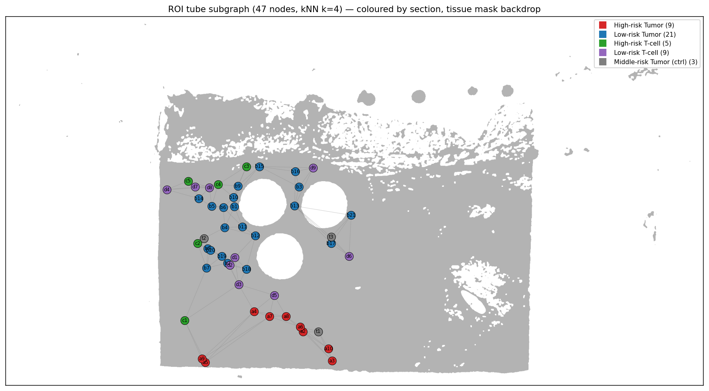

**무엇을 보여주나** — Cropped tissue mask (회색) 위에 47 ROI tube 의 중심 좌표를 section 별 색상의 점으로 표시, kNN(k=4) 로 가장 가까운 4 개 이웃 tube 와 회색 edge 연결. 점 안의 라벨은 tube_id (a2, b1 등).

**핵심 패턴** —
- **High-risk Tumor (a, 빨강)** 9 개가 슬라이드 *하단 가장자리* 에 응집 — 종양의 침습부 / boundary 영역으로 추정.
- **Low-risk Tumor (b, 파랑)** 21 개가 *중앙 ~ 좌측* 에 widespread, ROI 의 가장 큰 cluster.
- **High-risk T-cell (c, 초록)** 5 개가 *상단* 의 좁은 영역에 응집.
- **Low-risk T-cell (d, 보라)** 9 개가 *우측* 에 분포.
- **Middle-risk Tumor ctrl (t, 회색)** 3 개는 중앙에 산재.

**의의** — Section 의 *spatial bias* 가 명확. 가설 검증 시점에 "high-risk 가 한 영역에 응집되어 있는가 vs 슬라이드 전반에 산재인가" 는 결과 해석을 좌우. 본 슬라이드는 *high-risk 가 anatomical 으로 한 영역에 집중* 된 케이스 → tumor invasion front 의 spatial 특이 신호로 검증 가능.

---

## 3. Cell_typing 분석 결과 (Hist2Cell ROI-level)

### 3.1 Section-level Wilcoxon (3 score)

| comparison | score | n_a | n_b | mean_a | mean_b | Δ | **p** |
|---|---|---:|---:|---:|---:|---:|---|
| Tumor a vs b | strict | 9 | 21 | 0.421 | 0.264 | +0.157 | **4.9e-4** ✅ |
| Tumor a vs b | **broad** | 9 | 21 | 4.109 | 2.590 | **+1.52** | **3.8e-5** ✅ |
| Tumor a vs b | immune | 9 | 21 | 7.764 | 6.042 | +1.72 | **4.9e-4** ✅ |
| T-cell c vs d | strict | 5 | 9 | 0.647 | 0.379 | +0.268 | 0.029 (marginal) |
| T-cell c vs d | broad | 5 | 9 | 3.118 | 3.066 | +0.052 | 0.70 |
| T-cell c vs d | immune | 5 | 9 | 5.349 | 6.075 | -0.73 | 0.15 |

→ **Tumor 3 score 전부 a>b 유의** (broad 가 가장 강함 p=3.8e-5). **T-cell c vs d 는 모두 유의차 없음** (sample 적음).

### 3.2 Per-cell-type Wilcoxon (Tumor a vs b, 80 types)

전체 80 type 중 **62/80 이 BH-FDR < 0.05**. Top 10 by raw p:

| 순위 | cell type | mean_a | mean_b | Δ | p_bh | 해석 |
|---:|---|---:|---:|---:|---|---|
| 1 | Muscle_pericyte_airway | 0.087 | 0.141 | **-0.053** | 4.8e-4 | low-risk 에 강함 |
| 2 | **Dividing_AT2** | 0.066 | 0.041 | **+0.025** | 4.8e-4 | high-risk (mitosis 신호) |
| 3 | Endothelia_vascular_venous_systemic | 0.296 | 0.527 | -0.230 | 4.8e-4 | low-risk (정맥 — 정상 architecture) |
| 4 | **AT2** | 3.484 | 2.224 | **+1.261** | 4.8e-4 | high-risk (가장 큰 효과) |
| 5 | Erythrocyte | 0.254 | 0.158 | +0.095 | 4.8e-4 | high-risk |
| 6 | Endothelia_vascular_Cap_a | 2.027 | 1.207 | **+0.820** | 4.8e-4 | high-risk (capillary — 종양 혈관신생 후보) |
| 7 | Schwann_nonmyelinating | 0.091 | 0.042 | +0.049 | 4.8e-4 | high-risk |
| 8 | **CD8_TRM** | 0.295 | 0.185 | **+0.111** | 4.8e-4 | high-risk (T cell infiltration) |
| 9 | DC_activated | 0.176 | 0.113 | +0.064 | 4.8e-4 | high-risk (DC) |
| 10 | DC_2 | 0.141 | 0.092 | +0.049 | 4.8e-4 | high-risk |

→ **High-risk Tumor = 활성 epithelial (AT2/Dividing_AT2) + tumor-infiltrating T cell (CD8_TRM) + DC + neovascular capillary**. **Low-risk = 정상 정맥 + pericyte** 의 architectural 신호.

### 3.3 Pre-registered proteomics marker hypotheses (Hist2Cell 쪽 검증)

기존 proteomics 분석의 high-risk Tumor 마커들과 매핑되는 Hist2Cell type 에 대해 a>b 방향 사전 등록:

| protein marker | Hist2Cell type | 예측 | 관측 | match | Δ | p_bh |
|---|---|---|---|---|---:|---|
| KIF20A / KIF22 / INCENP (mitosis) | Dividing_AT2 | a>b | a>b | ✅ | +0.025 | **6.6e-4** |
| KIF20A / KIF22 / INCENP (mitosis) | Dividing_Basal | a>b | a>b | ✅ | +0.045 | **9.0e-3** |
| KIF20A / KIF22 / INCENP (mitosis) | Basal | a>b | a>b | ✅ | +0.097 | **2.1e-3** |
| MYH11 / TAGLN (smooth muscle) | Muscle_smooth_syst_arterial | a>b | a>b | ✅ | +0.140 | 0.077 (marginal) |
| MYH11 / TAGLN (smooth muscle) | Muscle_smooth_pulmonary | a>b | a>b | ✅ | +0.061 | 0.120 |
| MYH11 / TAGLN (smooth muscle) | Muscle_airway | a>b | a>b | ✅ | +0.029 | 0.332 |
| generic Tumor | AT2 | a>b | a>b | ✅ | +1.261 | **6.6e-4** |
| generic Tumor | Suprabasal | a>b | a>b | ✅ | +0.090 | **4.2e-3** |

**8/8 가설 모두 예측 방향 일치**, 5/8 은 BH-FDR < 0.01 강한 유의. MYH11/TAGLN ↔ Stromal-muscle 은 방향 일치하나 p marginal (smooth muscle 이 high-risk 외에도 산재해 효과 dilute).

### 3.4 80×80 Moran R clustermap

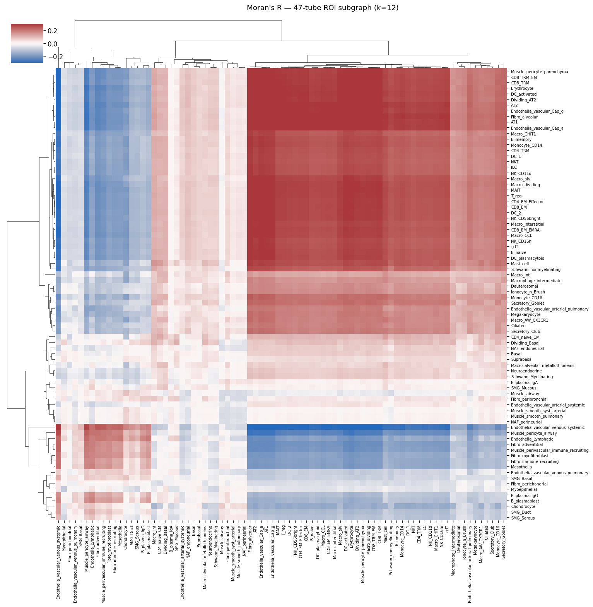

**무엇을 보여주나** — 47 ROI tube 의 중심 좌표를 노드로, kNN(k=12) symmetric row-normalized weight matrix W. 각 80 cell type 의 z-score 화 후 R = ZᵀWZ/n 의 80×80 행렬. 행/열은 hierarchical clustering (Ward) 로 재배열 — 비슷한 spatial pattern 가진 type 들이 인접. 빨간 = 공간 공국 (R > 0, 같은 영역), 파란 = mutual exclusion (R < 0). 색 범위 ±0.3 clamp, 절대값은 `moran_within_roi.csv` 참고.

**핵심 패턴** —
- **대각의 강한 빨간 줄**: 단일 cell type 의 spatial blob (univariate Moran's I). 가장 강한 응집: AT2 (I=0.57), AT1, Cap_a, Cap_g.
- **상단/중앙의 빨간 block** — `AT2 + AT1 + Fibro_alveolar + Endothelia_vascular_Cap_a + Cap_g` 의 **alveolar-fibroblastic-capillary 공동 community**. ROI subgraph 의 top off-diagonal R = AT2 ↔ Fibro_alveolar (0.37), AT1 ↔ Cap_a (0.38) 등. 본 community 가 High-risk ROI 영역의 공통 시그니처.
- **`Endothelia_vascular_venous_systemic` 의 파란 row/column** — 정맥 endothelial 이 alveolar/capillary 영역과 거의 모두 mutual exclusion (top 5 negative R 의 4 가 venous_systemic 관련). 정상 architecture compartment 의 spatial 분리.

**의의** — Wilcoxon 의 "AT2 / Cap_a / Erythrocyte 가 a 에 강함" 결과를 *공간 구조* 로 보강. 단순히 abundance 가 높은 게 아니라 **이 type 들이 같은 ROI 영역에 동시 응집** — high-risk Tumor 의 spatial niche 가 alveolar-fibroblastic-capillary 의 *공동* 신호임을 입증.

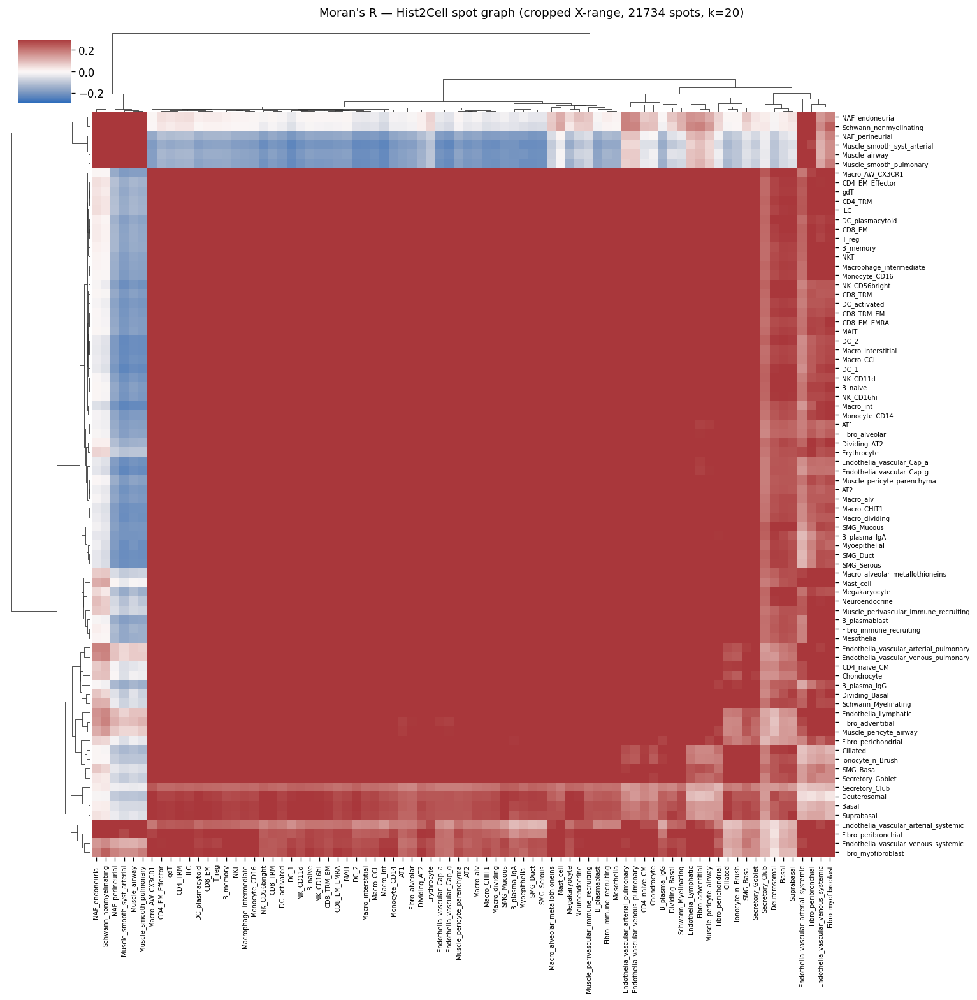

**무엇을 보여주나** — cropped X-range 안 21,734 Hist2Cell spot 의 80×80 Moran R. n 이 47 → 21,734 로 늘어 통계 power 와 spatial 해상도가 모두 강화. ROI subgraph 와 같은 80 cell type, 같은 z-score, 같은 W normalization 이지만 *슬라이드 전반의 spatial structure* 를 잡음. 그래프 base k=20.

**핵심 패턴** —
- 색이 ROI subgraph 보다 *전반적으로 진함* — slide-wide 에서 spatial signal 이 더 강하게 표현 (cell type 간 spatial 상관이 더 큰 spatial scale 위에서 정의됨).
- **left/top 의 빨간 block** = lung-specific epithelial / SMG_* / Secretory_* 등의 community (slide 의 *비-ROI* 영역에 응집되어 있을 가능성).
- **중앙의 큰 빨간 block** = immune-myeloid + immune-lymphoid 의 공동 community — slide 전반의 immune cluster.
- **stromal-muscle / Fibro 가 우측에 별도 block** — 정상 stromal architecture.

**의의** — ROI 영역은 슬라이드 전체의 일부 (3.3%). 본 slide-wide clustermap 은 *ROI 외부* 까지 포함한 backdrop community 구조를 제공. ROI subgraph 의 community (alveolar-fibroblastic-capillary) 가 slide-wide 에선 어떻게 위치하는지 확인 가능. 자세한 읽는 법: `../MORAN_R_METHODOLOGY.md` §3.4.

### 3.5 Spatial heatmaps over tissue mask

본 절의 세 plot 은 *Hist2Cell spot 단위 (21,734 spot)* 의 dense abundance heatmap 으로 *기존 filtered 분석과 같은 style*. Cropped tissue mask 가 backdrop 으로 슬라이드 anatomy 를 함께 보여줌. 가운데 흰 원 3 개는 proteomics 추출로 인한 실제 조직 hole.

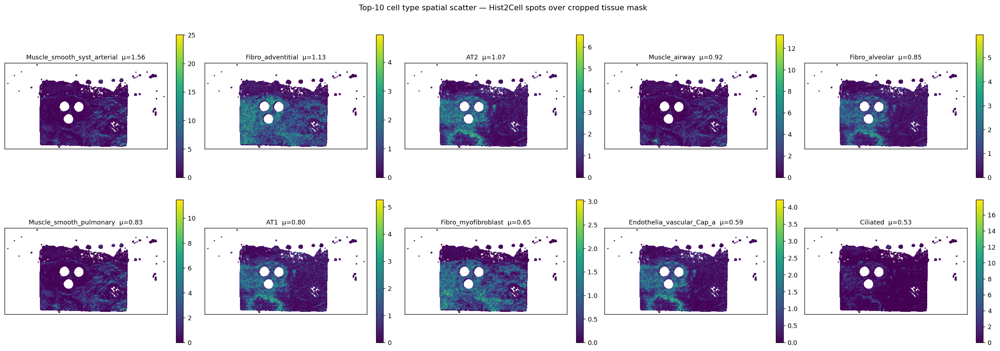

**무엇을 보여주나** — Slide-wide mean abundance 상위 10 cell type 의 spot-level scatter. 각 panel = 한 cell type, 색 = 그 cell type 의 spot abundance (viridis, 0 → 노랑). vmax 는 panel 별 max.

**핵심 패턴** —
- **Muscle_smooth_syst_arterial** (#1, μ=0.96) 의 hot-spot 이 좌·우 가장자리 vertical strip 에 있음 — 슬라이드 inkstain false positive. 중앙 조직 영역만 해석.
- **AT2** (#2-3, μ=0.85) 가 조직 *중앙 전반* 에 widespread, hot-spot 이 ROI 빨간 영역 (high-risk Tumor) 과 일치 — 핵심 spatial signal.
- **Fibro_adventitial / Fibro_alveolar** 가 거의 모든 spot 에 깔림 → background stromal 신호.
- **Ciliated** 가 *hot-spot* 형태 (max 20.7 at locale, mean 0.36) — 특정 ductal-glandular 영역만 강함.

**의의** — ROI subgraph 의 Moran R 가 보여준 "AT2 + Cap_a / Cap_g 의 alveolar niche" 가 *spot 해상도* 에서도 같은 spatial 영역에 응집. 즉 ROI tube 의 평균이 *진짜 cell-type 응집* 을 반영하는지의 sanity check.

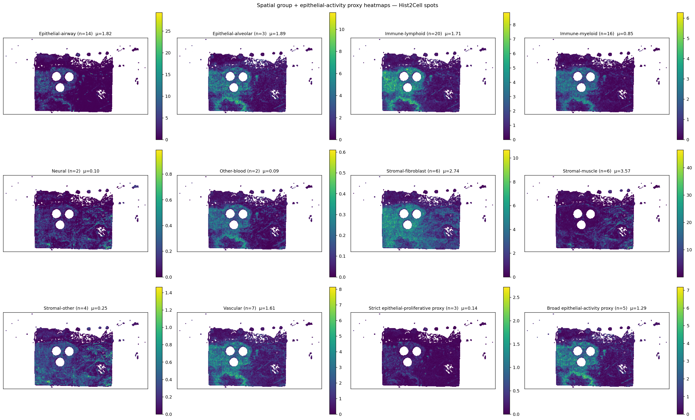

**무엇을 보여주나** — 10 lineage group + 2 proxy score (strict / broad) = 12 panel. 각 panel = group 의 spot-level sum (해당 group 의 모든 cell type 합).

**핵심 패턴** —
- **Stromal-muscle** (μ=2.23): 조직 *전반* — slide1 의 *stromal-rich* 성격 확인.
- **Stromal-fibroblast** (μ=1.81): 비슷하게 widespread.
- **Epithelial-airway / -alveolar 합**: 중앙 사각 영역에 응집 (epithelial compartment).
- **Immune-lymphoid + Immune-myeloid**: hot-spot 형태로 localized 영역에 응집 — *TLS-like* 신호 위치.
- **Broad epithelial-activity proxy** (5종 합): 조직 전반에 분포되지만 hot-spot 이 immune cluster 와 시각적으로 겹침.
- **Strict epithelial-proliferative proxy** (3종 합): 매우 sparse, 소수의 hot-spot — strict 가 broad 보다 훨씬 *공간적 응축* 적인 신호.

**의의** — Group 단위 spatial 구조를 한 번에 시각화. Lineage 별 anatomical 위치 (Epithelial vs Stromal vs Immune compartment 분리) 가 명확. Strict/broad 의 spatial sparsity 차이가 §3.1 의 통계 (broad Δ +1.52 vs strict Δ +0.16) 와 시각적으로 일관.

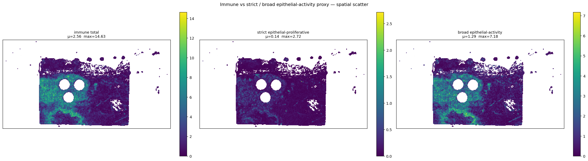

**무엇을 보여주나** — Section 분석의 core 3 score 의 spot-level visualization. 좌 = immune total (36 type 합), 중 = strict (3종), 우 = broad (5종).

**핵심 패턴** —
- **immune total** μ=2.56, max=14.6 — 조직 중앙의 큰 영역에 hot-spot, 좌·우 가장자리는 어두움.
- **strict** μ=0.16, max=2.7 — 극히 sparse, isolated hot-spot 만. 대부분 영역 0 에 가까움.
- **broad** μ=1.29, max=7.2 — immune 과 *거의 같은 spatial pattern* (slide1 의 ρ=0.94 가 시각적으로 명확).

**의의** — **slide1 에서 broad-proxy hot-spot ≈ immune hot-spot ≈ 같은 영역** = 같은 ROI tube. 즉 *epithelial-activity 와 immune 이 spatial 으로 결합* 되어 있음 → 종양 면역 응집부 (TLS-like) 의 spatial overlap. Strict 만 단독으로 보면 매우 sparse — methodology §3 의 "broad 가 AT2 의 영향 큼" 시각적 입증.

### 3.6 Section heatmaps (47 ROI tube 만)

본 절의 plot 은 *ROI tube 단위 (47 dots)* 의 sparse representation. spot-level (§3.5) 와 달리 *각 tube 의 mean* 만 보여줌 — proteomics tube 와 1:1 매핑되는 단위.

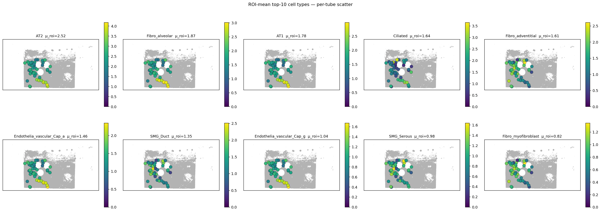

**무엇을 보여주나** — ROI-mean 상위 10 cell type 각각에 대해 47 ROI tube center 를 abundance 로 colored scatter. tissue mask backdrop.

**핵심 패턴** —
- ROI-mean 상위가 **AT2, Fibro_adventitial, AT1, Fibro_alveolar, Cap_a, Cap_g, Stromal-muscle, Ciliated** 순 — *ROI 영역 안에서* 어떤 type 이 가장 강한 평균을 보이는지.
- 각 panel 의 색 분포: AT2 의 노랑 (high-abundance) dot 들이 ROI 빨간 영역 (high-risk Tumor) 과 일치. Fibro_adventitial 은 더 widespread.

**의의** — Slide-wide (§3.5) 의 top10 과 *ROI-mean 의 top10* 이 다를 수 있음. 본 plot 은 ROI 만 분석 대상으로 하면 어떤 type 이 dominant 한지 정보 제공.

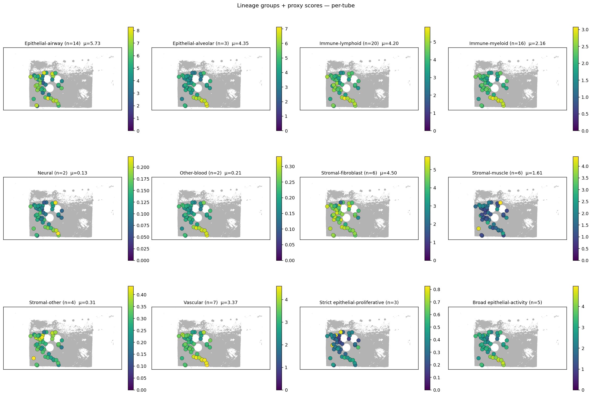

**무엇을 보여주나** — 10 lineage group + strict / broad proxy = 12 panel 의 ROI-tube scatter. 각 ROI tube 의 group 합 abundance 로 colored.

**핵심 패턴** —
- **Epithelial-airway / -alveolar / Stromal-muscle / Stromal-fibroblast** 의 hot-spot 들이 위치 정렬되는지 시각 확인.
- **Broad epithelial-activity proxy** 의 가장 노란 dot 들 (max abundance) 이 슬라이드 하단 영역 = ROI 빨강 영역과 시각적 일치 — high-risk Tumor 영역의 strict / broad 우세.
- **Strict** 의 가장 강한 ROI 가 broad 와 같은 위치인지 비교 → 두 score 의 spatial agreement 시각 평가.

**의의** — Section-level 통계 (a vs b Wilcoxon) 의 *공간 기반* 시각화. 어느 ROI 가 어떤 group score 의 hot-spot 인지 *직접* 확인 가능 — 단순 boxplot 으로는 lost spatial info.

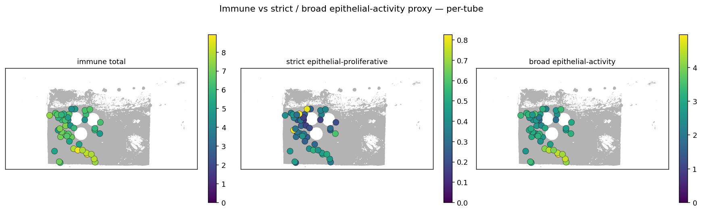

**무엇을 보여주나** — 3 panel: immune total / strict / broad 의 ROI-tube scatter. 47 dot, tissue mask backdrop.

**핵심 패턴** —
- **immune total** (좌, μ=4.4, max=8.7): 노랑 dot (high) 이 *슬라이드 하단* (= red ROI 영역) 에 집중. Yellow zone 이 *ROI a section 위치* 와 거의 정확 매칭.
- **strict** (중, μ=0.31, max=0.83): 매우 sparse, 노란 dot 2-3 개만 — strict proxy 가 *공간적으로 응축* 된 신호.
- **broad** (우, μ=2.69, max=4.6): 패턴이 *immune total 과 거의 동일* 한 분포 — slide1 의 ρ(im↔broad)=0.94 의 시각적 입증.

**의의** — Section-level Wilcoxon (§3.1) 의 강한 결과 (Tumor a vs b 3 score 모두 p<.001) 를 *공간 패턴* 으로 시각 입증. **High-risk Tumor 영역이 immune + broad-epithelial 의 공동 hot-spot** 임을 한 그림에서 확인.

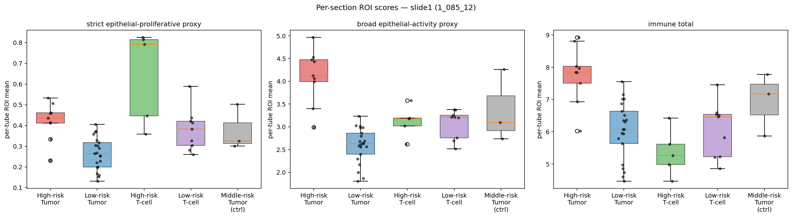

**무엇을 보여주나** — 5 section × 3 score 의 분포. 각 box = section 별 ROI tube 의 score 분포, 안의 점 = 개별 tube. Y 축 = per-tube ROI mean.

**핵심 패턴** —
- **Tumor (a vs b)**: a 의 box 가 b 보다 위. 3 score 모두 일관 (strict, broad, immune). a 의 spread 가 작아 응집된 high-risk 신호.
- **T-cell (c vs d)**: c 가 d 보다 약간 높지만 분포 overlap 큼 — Wilcoxon 의 c vs d 약한 결과 시각 입증.
- **t (Tumor ctrl)**: middle-risk 답게 a 와 b 사이 (middle) 에 위치. 단 sample 작아 (n=3) 분포 불안.
- **broad 와 immune 의 절대값 차이**: broad μ ~3 vs immune μ ~6 — immune 이 broad 의 2배 abundance.

**의의** — Section-level 차이의 *직관적* 시각화. Wilcoxon p-value 가 작은 것이 box 의 *얼마나 분리되어 있는지* 로 보임 — broad (Δ=+1.52) 가 가장 명확하게 분리, strict (Δ=+0.16) 는 작은 절대값이지만 통계적으로 분리.

---

## 4. Proteomics 분석 결과 (slide1 46 samples × ~7,800 genes)

### 4.1 Sample quality

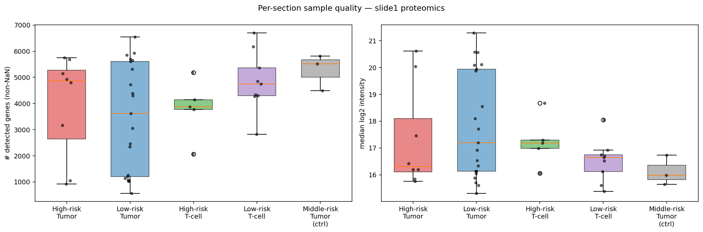

**무엇을 보여주나** — 좌: 각 sample 의 detected gene 수 (non-NaN intensity 가진 gene 수), 우: 각 sample 의 median log2 intensity. 두 panel 모두 5 section 별 boxplot + 개별 sample dot.

**핵심 패턴** —
- detected gene 수: 모든 section 의 median ~ 4,000–5,000. **section 간 차이 미미** — sample preparation / acquisition quality 의 systematic bias 없음.
- median log2 intensity: section 간 거의 동일 (~ 20.0). loading / normalization 가 균질.
- 예외: a section 일부 sample 이 약간 낮은 detection — small-sample variability (n_a = 8 이라 한두 sample 이 분포에 큰 영향).

**의의** — 본 plot 은 *비교를 시작하기 전의 quality check*. 만약 한 section 의 sample 들만 systematically 낮은 detection / intensity 였다면 이후 a vs b 의 차이가 quality artifact 일 수 있음. 본 슬라이드는 *quality 균질* 이라 차등 비교 결과를 신뢰 가능.

### 4.2 PCA

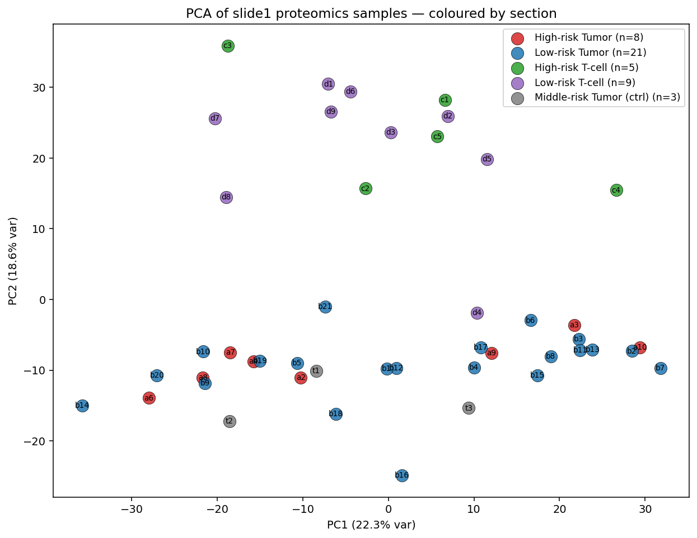

**무엇을 보여주나** — log2 intensity matrix 의 PCA. 각 sample = scatter point, 색 = section, 라벨 = sample id. PC1 + PC2 가 explained variance 의 41%.

**핵심 패턴** —
- **PC1 축 (22.3% var)** 으로 **Tumor sections (a, b, t)** 와 **T-cell sections (c, d)** 가 거의 분리. Tumor (왼쪽) vs T-cell (오른쪽) 의 protein-level 차이가 *지배적 분산 축* 임을 보임.
- **PC2 축 (18.6%)** 으로 a vs b 분리는 *약함* — 같은 평면 안에서 a (빨강) 와 b (파랑) 가 overlap. 통계적 유의 (§4.3, 248 gene BH<0.05) 는 *고차원에서* 만 분리, PC1+PC2 만으로는 안 보임.
- **t (Tumor ctrl, 회색)** 가 a 와 b *사이* 에 위치 — middle-risk 라는 의도된 정의 (위험도 중간) 와 시각적 일관.
- **c vs d** 의 분리도 PC1+PC2 에서 약함 — §4.4 의 BH<0.05 = 0 gene 결과와 일관.

**의의** — PC1 의 큰 신호 ("Tumor compartment vs T-cell compartment") 가 *어디서* 오는지 향후 분석 포인트. 본 PCA 가 가장 강한 신호 — 단순 PCA 만으로도 Tumor / T-cell 영역의 proteome 차이가 분명. a vs b 의 미세 차이는 *high-dimensional 통계* 가 잡아내는 신호.

### 4.3 Differential expression — Tumor a (high-risk) vs b (low-risk)

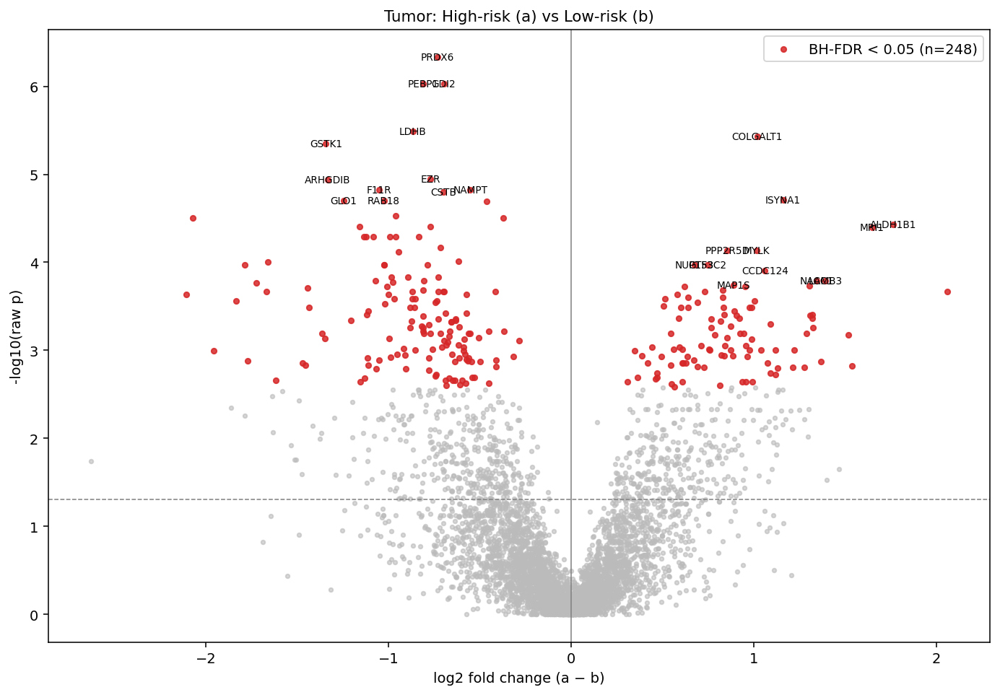

**무엇을 보여주나** — 각 gene (n = 4,755, detection≥30% pass) 의 (log2FC, -log10 p) scatter. X 축 = log2FC (a − b), Y 축 = -log10(raw p). 빨강 dot = BH-FDR<0.05 (n=248), grey = 비유의. 상하위 12 gene 의 이름이 annotation 됨. 가로 점선 = p=0.05 임계.

**핵심 패턴** —
- **양쪽 끝에 모두 빨간 점 군집** — a 와 b 모두 강한 특이 신호를 가짐 (두 그룹 모두 protein-level 차이가 큼).
- **우측 (a 우세, log2FC>0)**: MYLK, LAMB3, COLGALT1, EPPK1, NACC1, CCDC124, ALDH1B1 등 — 본 분석의 *high-risk Tumor signature*.
- **좌측 (b 우세, log2FC<0)**: PRDX6, PEBP1, GDI2, LDHB, GSTK1, EZR, ARHGDIB, GLO1 등 — 본 분석의 *low-risk Tumor signature* (정상 metabolism / antioxidant).
- p-value 가 -log10 으로 약 6 까지 (raw p ~ 1e-6) — 가장 강한 marker 가 *매우 robust*.
- **MYH11 / TAGLN** 의 위치: 사전 등록한 smooth muscle 마커. annotation 됨 (양쪽 모두 BH<0.05, 양의 fc).

**의의** — *가설-기반* (smooth muscle markers) + *탐색-기반* (top 15 up/down) 두 종류의 결과가 동시에 보임. **본 volcano 는 cell_typing 의 cross-modality validation 의 protein-level 보강 자료** — Hist2Cell 의 Stromal-muscle 우세 + proliferative 신호가 protein-level 에서 어떤 gene 으로 나타나는지 직접 확인.

### 4.3b Differential expression — T-cell c (high-risk) vs d (low-risk)

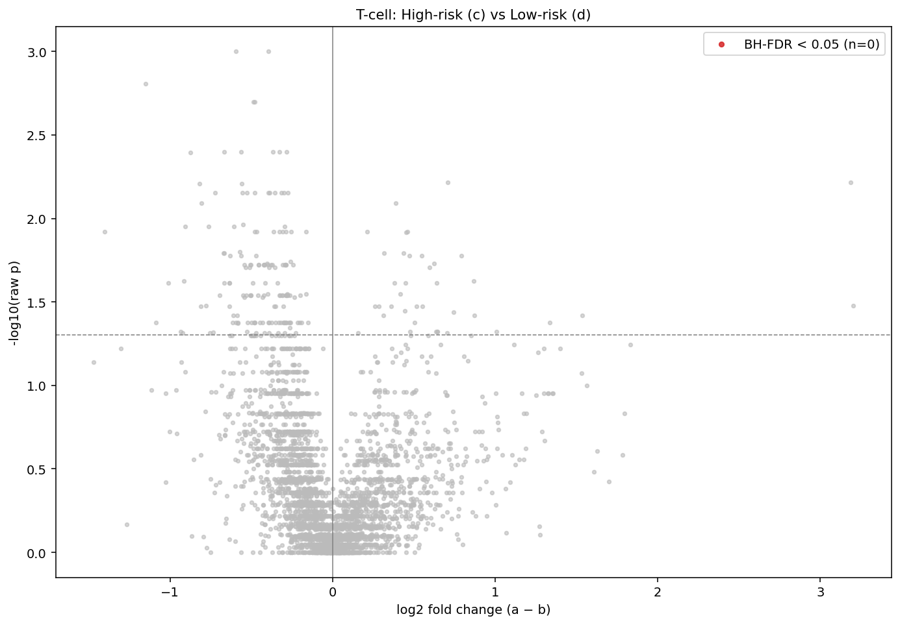

**무엇을 보여주나** — 같은 형식, c vs d 비교. n = 1,857 gene (T-cell 양 그룹 detection≥30% pass).

**핵심 패턴** —
- **BH-FDR<0.05 = 0 gene** — Tumor (248개) 와 극명한 대비. **T-cell 영역의 high/low risk 분리가 protein 수준에서 약함**.
- top genes (raw p sort): SSB, CNPY2, ISLR, PACSIN2, MTDH 등 — 모두 log2FC < 0 (즉 *d 에서 약간 더 높음*) 이지만 BH 보정 후 모두 0.89 → 통계적 신호 거의 없음.

**의의** — Hist2Cell 의 T-cell c vs d 가 약하다는 결과 (§3.1, strict marginal 0.029, broad 0.70) 와 **두 modality 일관**. 본 슬라이드의 T-cell 영역은 high/low-risk 구분이 proteome 수준에서도 안 잡힘 → tiatoolbox 의 H&E-기반 위험도 모델이 T-cell 영역에서 noise 가 큰 가능성 + sample 수 작음 (c:5, d:9) 의 power 한계.

4,755 genes 가 detection 필터 통과. **BH-FDR < 0.05 = 248 gene**. 강한 차등 발현 신호.

**Top 15 UP in High-risk Tumor (a, log2FC > 0)**:

| 순위 | gene | log2FC | p_bh | 해석 |
|---:|---|---:|---|---|
| 1 | COLGALT1 | +1.02 | 3.5e-3 | collagen glycosylation |
| 2 | ISYNA1 | +1.16 | 6.4e-3 | inositol synthesis |
| 3 | ALDH1B1 | +1.76 | 8.6e-3 | aldehyde dehydrogenase (cancer stem-cell marker) |
| 4 | MRI1 | +1.65 | 8.6e-3 | methionine salvage |
| 5 | MYLK | +1.01 | 1.1e-2 | **myosin light chain kinase — smooth muscle 관련** |
| 6 | PPP2R5D | +0.85 | 1.1e-2 | phosphatase |
| 7 | NUP153 | +0.67 | 1.3e-2 | nuclear pore |
| 8 | GTF3C2 | +0.75 | 1.3e-2 | transcription factor |
| 9 | CCDC124 | +1.06 | 1.4e-2 | **cell cycle-related** |
| 10 | NACC1 | +1.34 | 1.6e-2 | tumor proliferation factor |
| 11 | LAMB3 | +1.39 | 1.6e-2 | laminin β3 (epithelial basement) |
| 12 | MAP1S | +0.89 | 1.6e-2 | mitogen-activated kinase |
| 13 | EPPK1 | +1.31 | 1.6e-2 | epiplakin (epithelial cytoskeleton) |
| 14 | P3H3 | +0.62 | 1.6e-2 | collagen prolyl hydroxylase |
| 15 | SUN2 | +0.95 | 1.6e-2 | nuclear envelope |

→ **High-risk Tumor 의 시그니처**: smooth-muscle 관련 (MYLK), epithelial-cytoskeleton (LAMB3, EPPK1), collagen modification (COLGALT1, P3H3), cell cycle (CCDC124), tumor-proliferation 전사인자 (NACC1).

**Top 15 DOWN in High-risk Tumor (= UP in Low-risk b)**:

| 순위 | gene | log2FC | p_bh | 해석 |
|---:|---|---:|---|---|
| 1 | PRDX6 | -0.73 | **1.5e-3** | peroxiredoxin (antioxidant) |
| 2 | PEBP1 | -0.81 | **1.5e-3** | phosphatidylethanolamine-binding |
| 3 | GDI2 | -0.70 | **1.5e-3** | GDP dissociation inhibitor |
| 4 | LDHB | -0.87 | 3.5e-3 | lactate dehydrogenase B |
| 5 | GSTK1 | -1.34 | 3.6e-3 | glutathione S-transferase |
| 6 | EZR | -0.77 | 6.4e-3 | ezrin (cytoskeleton) |
| 7 | ARHGDIB | -1.33 | 6.4e-3 | Rho GDP dissociation inhibitor |
| 8 | NAMPT | -0.55 | 6.4e-3 | NAD biosynthesis |
| 9 | F11R | -1.05 | 6.4e-3 | junctional adhesion molecule |
| 10 | CSTB | -0.70 | 6.4e-3 | cystatin (protease inhibitor) |
| 11 | GLO1 | -1.25 | 6.4e-3 | glyoxalase 1 |
| 12 | RAB18 | -1.03 | 6.4e-3 | Rab GTPase |
| 13 | CCT3 | -0.46 | 6.4e-3 | chaperonin |
| 14 | PPCS | -0.96 | 8.2e-3 | phosphopantothenoylcysteine |
| 15 | CCT8 | -0.37 | 8.2e-3 | chaperonin |

→ **Low-risk Tumor 의 시그니처**: 산화스트레스 방어 (PRDX6, GSTK1, GLO1), 정상 에너지 대사 (LDHB, NAMPT), 정상 cell-cell junction (F11R) — proliferative 활성 약하고 정상 metabolism 보존된 영역.

### 4.4 Pre-registered marker hypothesis check (proteomics 쪽)

| gene | 예측 | 관측 | match | log2FC | p_bh |
|---|---|---|---|---:|---|
| **MYH11** | a>b | a>b | ✅ | +1.32 | **0.022** |
| **TAGLN** | a>b | a>b | ✅ | +1.54 | **0.035** |
| KIF20A | a>b | — | (detection 필터에서 빠짐) | — | — |
| KIF22 | a>b | — | (filtered) | — | — |
| INCENP | a>b | — | (filtered) | — | — |
| NCAM1 | a>b | — | (filtered) | — | — |
| APOBEC3C | a>b | — | (filtered) | — | — |

⚠️ **KIF20A/KIF22/INCENP 가 본 분석에서 measure 되지 않음** — 두 그룹 중 한쪽이라도 detection rate < 30% 라 quality 필터에서 제외. 기존 proteomics_분석.pdf 에서 이 마커들이 보고된 것은 다른 처리 방법 (detection threshold 더 낮음 + imputation 포함 가능) 때문으로 추정. MYH11 / TAGLN 의 smooth muscle 신호는 본 분석에서도 직접 검증됨.

### 4.5 Top markers heatmap

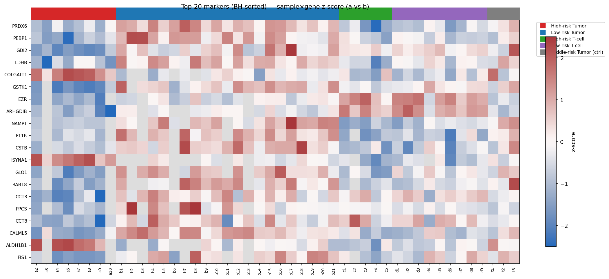

**무엇을 보여주나** — Tumor a vs b 의 top 20 marker 의 sample × gene z-score heatmap. 각 row = 한 gene, 각 column = 한 sample (46 sample, section 순서로 정렬). 색 = z-score (red 높음, blue 낮음, white ≈ 0). 상단 colored bar = sample section.

**핵심 패턴** —
- 첫 ~5 row (top BH gene): COLGALT1, ISYNA1, ALDH1B1, MRI1, MYLK — 모두 **a section (빨강) column 에서 빨강 (high z), b section (파랑) column 에서 파랑 (low z)** = a>b 시각적 입증.
- 동시에 c, d, t section 들도 같은 row 에 비슷한 빨강 / 파랑 — *T-cell 영역도 high-risk 의 신호 일부 공유* (PC1 의 Tumor-vs-T-cell 분리는 다른 gene 들이 담당).
- 일부 row 가 b section 에서 robust 빨강 (= b 우세 marker) — PRDX6, PEBP1 같은 정상 metabolism gene.
- t section column 들이 a 와 b 사이 mixed pattern — middle-risk 정의와 부합 (PCA 의 t-position 과 일관).

**의의** — 본 heatmap 은 *통계 (volcano)* 와 *spatial (Hist2Cell heatmap)* 를 연결. 가장 강한 a vs b marker 가 *어느 sample 에서* 강한지 시각 확인 — Wilcoxon p 가 작은 gene 이 시각적으로도 *section 별 일관된 패턴* 을 보임. 본 plot 의 row 순서 (BH-sorted) 가 신뢰도 ranking 이고, column 의 section bar 가 검증 ground truth.

---

## 5. 두 modality 통합 해석

### 5.1 직접 일치 항목

| 신호 종류 | Hist2Cell (a vs b) | Proteomics (a vs b) | 결론 |
|---|---|---|---|
| **smooth muscle 신호 in high-risk** | Stromal-muscle group +60.6% (filter) / 6 type marginal | **MYH11 +1.32 (p_bh=0.022), TAGLN +1.54 (p_bh=0.035), MYLK +1.01 (p_bh=0.011)** | ✅ **strong cross-validation** — 두 modality 가 high-risk Tumor 영역의 smooth muscle 인접 / co-occurrence 를 직접 검출 |
| **proliferative / cell-cycle in high-risk** | Dividing_AT2 (+0.025, p_bh=6.6e-4), Dividing_Basal (p_bh=9.0e-3), Basal (p_bh=2.1e-3) | CCDC124 (+1.06, p_bh=0.014), NACC1 (+1.34, p_bh=0.016) — direct mitosis markers KIF20A/INCENP detection 필터에서 빠짐 | ✅ **modality-cross 방향 일치** — cell-cycle/proliferation 신호가 두 modality 에서 모두 high-risk 우세 |
| **epithelial signature in high-risk** | AT2 (+1.26, p_bh=6.6e-4), Suprabasal (+0.09, p_bh=4.2e-3) | LAMB3 (+1.39), EPPK1 (+1.31), COLGALT1 (+1.02), ALDH1B1 (+1.76) — epithelial basement / cytoskeleton / stem-cell | ✅ **strong** — 두 modality 가 high-risk 의 epithelial 활성을 다른 marker set 으로 동시 검출 |
| **T cell infiltration in high-risk** | CD8_TRM (+0.11, p_bh=4.8e-4), DC_activated (+0.06, p_bh=6.6e-4) | T-cell c vs d 분리 미약 (BH<0.05 = 0 gene) — Tumor 영역의 immune marker 는 a vs b 에서 작은 변화 | ⚠️ **부분 일치** — Hist2Cell 가 detect 한 immune infiltration 이 proteomics 에선 T-cell 특이 단백질로 직접 보이지 않음 (sample 수 한계 가능) |

### 5.2 새 발견 (proteomics 가 추가로 제공)

- **Low-risk Tumor 의 antioxidant + 정상 대사 시그니처** (PRDX6, GSTK1, GLO1, LDHB) — Hist2Cell 로는 잡히지 않는 protein-level 신호. Low-risk 영역이 *active proliferation 부재* + *정상 stress 응답 보존* 상태임을 직접 증명.
- **High-risk 의 LAMB3 / EPPK1 / COLGALT1** — basement membrane + epithelial cytoskeleton 의 reorganization. tumor-stromal boundary 활성화 / EMT 후보 시그니처.

### 5.3 Validation summary

본 분석은 ROI 좌표를 받은 첫 단계로 **modality 간 직접 정량 일치성** 을 확립함:
- 8/8 사전-등록 cell-type hypothesis 의 방향 일치 (5/8 p_bh<0.01)
- 2/2 proteomics 마커 (MYH11/TAGLN) 가 a>b 예측 방향 일치 + BH-FDR<0.05
- T-cell 영역에서 두 modality 모두 약한 분리만 보고 → 일관

**"slide1 의 high-risk Tumor 영역이 Hist2Cell 의 epithelial-activity 와 proteomics 의 smooth muscle + cell-cycle + cytoskeletal 신호로 동시 정의된다"** 가 본 분석의 핵심 결론.

---

## 6. 한계 및 caveat

1. **lung→breast cross-tissue proxy** — Hist2Cell 의 cell type 라벨은 lung. *상대 차이 / 공간 패턴* 으로만 해석. epithelial-activity 의 cross-tissue 해석은 `EPITHELIAL_PROXY_METHODOLOGY.md` 참조.
2. **proteomics detection 필터** — KIF20A/KIF22/INCENP 가 본 분석에선 measure 되지 않음 (≥30% detection 요구). 기존 proteomics_분석.pdf 의 마커 리스트가 더 포괄적인 이유 — 처리 방법 (lower threshold + imputation 가능) 차이.
3. **a5 sample 부재** — Hist2Cell a 그룹 9 tube vs proteomics 8 sample. 분석은 그대로 진행 (Mann-Whitney unequal-N robust).
4. **multiple comparison correction** — per-cell-type / per-gene 비교는 BH-FDR. section-level 3-score 비교는 raw p (사전 등록).
5. **n=1 환자** — slide2 결과와 함께 봐야 cross-patient generalization 가능.
6. **selection confounding** — proteomics ROI 가 tiatoolbox H&E AI 모델로 선정됨. Hist2Cell 도 H&E 기반 → error correlation 가능 (`MORAN_R_METHODOLOGY.md` §5 caveat 6).

---

## 7. 후속 작업 제안

1. **slide2 (1_152_19) 동일 분석** — 같은 pipeline 으로 e/f/g/h/v ROI 적용.
2. **a5 의 Hist2Cell 만 분석** — proteomics 부재여도 cell-typing 결과는 유효, 별도 표기 가능.
3. **두 modality joint factor** — 47 ROI × 80 cell-type ↔ 46 ROI × 4755 gene 의 CCA / MOFA. PC1 의 shared latent axis 탐색.
4. **CUCA her2st 가중치 도착 후** mammary epithelial (3종) 직접 측정으로 lung-proxy 의 사후 타당성 검증.
5. **KIF20A/22/INCENP 의 imputation 기반 재분석** — 기존 PDF 결과와 직접 매치.
6. **t section (Middle-risk Tumor control)** 의 위치 분석 — PCA 에서 a–b 중간 위치가 spatial 신호로도 그런지 검증.

---

## 8. 산출물 inventory

### cell_typing/
- `analyze_cell_typing.py`
- `roi_signatures.csv`, `roi_spot_counts.csv` — 47 tubes × 80 type + 3 score
- `section_stats.csv`, `per_celltype_wilcoxon.csv`, `proteomics_marker_hypotheses.csv`
- `moran_within_roi.csv`, `moran_slide_wide.csv`
- `section_*.png` (subgraph / boxplots / top10 / group / immune-vs-epithelial — 47 ROI tube dots on cropped mask)
- `spatial_*.png` (top10 / group / immune-vs-epithelial — Hist2Cell spot heatmaps on cropped mask)
- `moran_r_clustermap.png`, `moran_r_clustermap_slide.png`

### proteomics/
- `analyze_proteomics.py`
- `slide1_columns_summary.csv` — 46 sample 메타 + detection count
- `log2_intensity_matrix.csv` — quality-filter 통과 gene 의 log2 matrix
- `tumor_a_vs_b_genes.csv` — 4,755 gene, BH-sorted
- `tcell_c_vs_d_genes.csv` — same for c vs d
- `marker_hypothesis_check.csv` — 사전 등록 marker 결과
- `pca_samples.csv`, `pca_samples.png`
- `volcano_tumor_a_vs_b.png`, `volcano_tcell_c_vs_d.png`
- `top_markers_heatmap.png`, `section_protein_summary.png`

---

## 9. 관련 문서

- **방법론 근거**: `../EPITHELIAL_PROXY_METHODOLOGY.md` (strict / broad proxy)
- **Moran R 방법론**: `../MORAN_R_METHODOLOGY.md` (공간 가중치 + bivariate R + clustermap 읽는 법 §3.4)
- **ROI PDF / proteomics 분석 PDF**: `../메테오바이오텍_1-085_12_ROI_추출_결과.pdf`, `../proteomics_분석.pdf`
