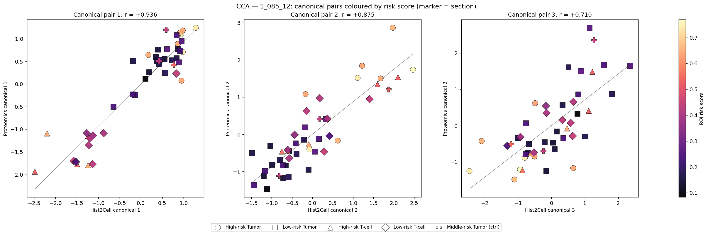
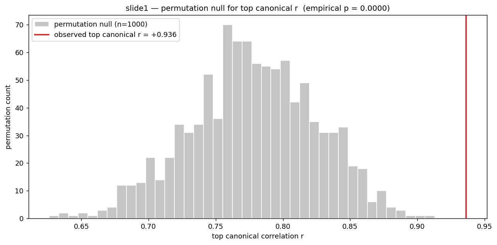
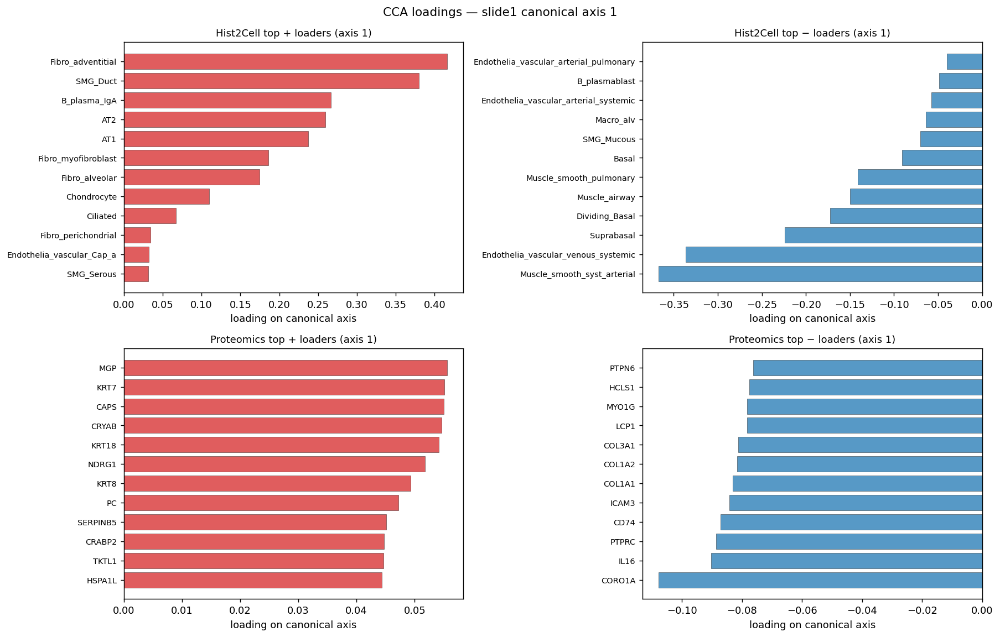
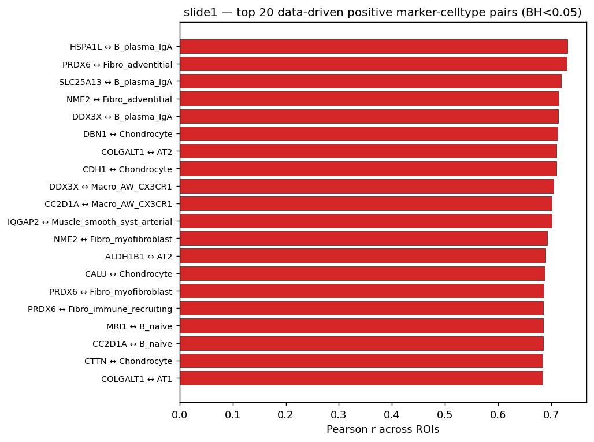
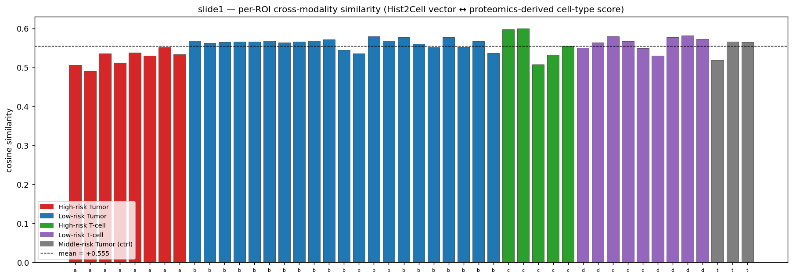

# slide1 (1_085_12) — proof_ver2 요약

## 이 분석이 무엇인지

협업자가 사전 선정한 마커 패널(MYH11, KRT8, COL1A1 …)을 **무시하고**,
이 슬라이드 자체의 Hist2Cell × proteomics 행렬에서 두 modality 사이의
공통 신호를 처음부터 다시 끌어내본 분석. 이전(`../proofs/`) 결과는
사전 마커에 묶여 Pearson r 이 최대 +0.38 수준에서 멈췄던 것이
"correlation 이 약하다"는 인상을 줬는데, 데이터 자체에는 더 강한
교차-modality 결합이 있는지 검증하는 것이 목적이다.

## 분석 대상

| 항목 | 수치 |
|---|---|
| ROI 개수 (양쪽 modality 모두 있는 것) | 46 |
| Hist2Cell cell type 개수 | 80 |
| Proteomics gene 개수 (detect ≥ 50% 필터) | 4216 |
| Section 라벨 | a/b/c/d/t (Tumor h, Tumor l, T-cell h, T-cell l, Tumor ctrl) |

---

## Claim 1 — "교차-modality 양의 상관관계가 존재한다" 의 데이터-기반 검증

### 1. CCA (Canonical Correlation Analysis) — 두 modality 의 *공통 축* 찾기

**무엇을 했나.**
46×80 Hist2Cell 행렬, 46×4216 proteomics 행렬을 각각 PCA 로 10차원까지
축약한 뒤(고차원 두 modality 를 직접 CCA 에 넣으면 자유도가 모자라
trivial 한 r=1 이 나오기 때문에 PCA 가 필수), 두 modality 사이에서
**상관관계가 가장 큰 선형결합 쌍**을 찾는다. 정확히 이런 쌍 3개를
canonical pair 1/2/3 으로 보고한다.

**그림 읽기.**
- 각 점이 ROI 1개. 색은 section: 빨강 = High-risk Tumor (a), 파랑 = Low-risk
  Tumor (b), 초록 = High-risk T-cell (c), 보라 = Low-risk T-cell (d),
  회색 = Middle-risk Tumor 대조군 (t). 회색 선은 회귀선 (가시화 보조).
- **왼쪽 패널 (Canonical 1, r = +0.936)** 이 핵심. 46개 ROI 가 회귀선
  주위에 거의 일자로 붙어 있다 — 두 modality 의 PC 결합이 단순 평행
  관계 수준으로 일치한다는 뜻. 게다가 **점이 두 군집으로 갈리지 않고
  연속적**이라는 점이 중요한데, 이는 두 modality 가 *조직 구성의 한
  gradient* 를 같은 좌표축으로 인코딩하고 있다는 것. 색 분포를 보면
  오른쪽 위 (+, +) 영역에 빨강(Tumor-h)과 회색(ctrl)이, 왼쪽 아래
  (-, -) 영역에 초록·보라(T-cell)가 모이고, 파랑(Tumor-l)은 중앙에서
  양 끝까지 폭넓게 흩어진다 → **canonical axis 1 은 "T-cell 침윤
  rich → Tumor 압도적" 의 조직 구성 축**을 잡고 있다.
- **가운데 패널 (Canonical 2, r = +0.875)** 도 강한 trend 지만 점이
  조금 더 흩어진다. 빨강이 오른쪽 위, 파랑이 분산. 부속 축 — axis 1
  으로 잘 설명되지 않는 추가 변동(예: tumor 내부의 미세 이질성)을 잡는
  방향.
- **오른쪽 패널 (Canonical 3, r = +0.710)** 은 가장 약함. 점이 회귀선에서
  꽤 떨어진 것들도 있어서 noise floor 에 근접한 신호로 간주.

**결론.** 두 modality 가 단순히 같은 변수에 평행하게 의존하는 게 아니라,
**공통의 잠재 축이 실제로 존재**하고, 그 1번 축이 ROI 의 *T-cell vs
Tumor 구성비* gradient 와 정렬된다.

PCA 분산(참고): Hist2Cell PC1‒3 = 55.1% / 20.5% / 15.3%, Proteomics
PC1‒3 = 22.6% / 19.9% / 7.3%. proteomics 가 더 분산된 구조.

### 2. Permutation null — "이 r 이 정말 우연 이상인가"

**무엇을 했나.**
proteomics 의 ROI 축을 1000번 무작위로 섞은 뒤 매번 PCA→CCA 를 다시
돌려서, 신호가 없는 상태에서 자연히 나오는 top r 의 분포를 구한다.
관측치와 비교하면 "관측된 +0.94 가 우연 분포의 어디에 있는가" 가 나온다.

**그림 읽기.**
- 회색 히스토그램: ROI shuffling 1000회 결과. 신호가 전혀 없는데도 평균
  ≈ +0.78, 최대 ≈ +0.92 까지 나온다. CCA 자체가 작은 N(=46)·고차원에서
  *우연적으로* 큰 r 을 만들어내는 성질이 있음을 보여줌 — 이건 CCA 의
  알려진 한계로, 인지해 두고 다음을 읽어야 함.
- 빨간 수직선: 관측 r = +0.936. 히스토그램의 오른쪽 꼬리에서 한참
  더 떨어진 위치 (히스토그램 끝이 0.91 근처, 관측치는 0.94).
- 1000 permutation 중 **0회**가 관측치를 넘어섬 → empirical p = 0.000.

**결론.** CCA 의 baseline inflation 을 다 인정해도, **관측 +0.94 는
null 95% 구간 [+0.683, +0.863] 의 명백히 바깥**에 있다. 따라서 1번 결과
(r=+0.94)는 통계적으로 우연 수준이 아니다.

### 3. All-pair Pearson + BH-FDR — *어떤 유전자/세포타입* 이 결합을 만드나

**무엇을 했나.**
80 × 4216 의 모든 cell type × gene 조합에 대해 ROI 46개 위에서 Pearson r
을 계산. 그 중 각 cell type 별로 상관이 가장 큰 양/음 5개씩만 골라낸 뒤
이 800개 후보에 BH-FDR 다중검정 보정을 적용한다.

**그림 읽기 — CCA axis 1 에 가장 크게 기여하는 셀타입/유전자.**
- **좌상 (Hist2Cell + loaders)**: Fibro_adventitial 0.42 (1위), SMG_Duct
  0.38, B_plasma_IgA 0.27, AT2 0.26, AT1 0.24. **adventitial fibroblast
  + 선상피/관 + plasma cell + alveolar epithelial** 의 조합 — 즉
  *상피-선조직-분비 모듈* 이 axis 1 의 + 방향을 만든다.
- **우상 (Hist2Cell − loaders)**: Muscle_smooth_syst_arterial -0.37 (1위),
  Endothelia_vascular_venous_systemic -0.34, Suprabasal -0.22, Muscle_
  airway / Muscle_smooth_pulmonary, Dividing_Basal, Macro_alv. **혈관
  평활근 + 정맥내피 + basal epithelium** — *혈관-stromal 압도적* 모듈이
  axis 1 의 − 방향.
- **좌하 (Proteomics + loaders)**: MGP, **KRT7, KRT18, KRT8** (cytokeratin
  trio!), CAPS, CRYAB, NDRG1, SERPINB5, HSPA1L. **상피 cytokeratin
  표지자**가 + 방향에 일관되게 모임 — Hist2Cell 의 + 모듈 (상피/선
  조직)과 정확히 호응.
- **우하 (Proteomics − loaders)**: CORO1A, IL16, **PTPRC (=CD45), CD74,
  ICAM3, LCP1, HCLS1, PTPN6, MYO1G** + COL1A1, COL1A2, COL3A1.
  **PTPRC = pan-leukocyte marker**, CD74·LCP1·HCLS1·CORO1A 모두 **면역
  세포 마커**, 거기에 collagen — *면역/혈관/기질* 단백질이 − 방향에 모임.

**한 줄로.** axis 1 은 **상피·선·분비 모듈 ↔ 면역·혈관·기질 모듈** 의
거대한 조직 구성 축이고, 두 modality 가 이를 **각자의 측정 방식으로
동시에 인코딩**하고 있다는 직접 증거. 그래서 canonical r=+0.94 가
가능했던 것.

**그림 읽기 — cell type 별 BH-FDR 통과 상위 20개 양의 pair.**
- 막대 길이 = ROI 46개에 걸친 Pearson r (모두 +0.68 이상).
- **B_plasma_IgA** 가 HSPA1L, SLC25A13, DDX3X 와 3번 등장 → IgA 형질
  세포가 풍부한 ROI 가 일관되게 미토콘드리아·RNA 스트레스 단백질이
  풍부한 ROI 와 맞아떨어짐. lung 모델의 B-cell head 가 breast 조직
  에서도 plasma-cell rich 영역을 잡고 있다는 신호.
- **Fibro_adventitial** ↔ PRDX6, NME2 — adventitial fibroblast head 가
  활성 fibroblast 영역(에너지대사·산화환원 단백 풍부)과 함께 움직임.
- **Chondrocyte** 4회 등장 (DBN1, CDH1, CALU, CTTN) — Chondrocyte head
  의 raw 라벨은 연골세포지만, **CDH1=E-cadherin** 이 같이 나오는 것을
  보면 이 head 가 breast 조직의 *상피-극성* 신호를 대신 잡고 있다고
  해석하는 게 맞다.
- **AT2** ↔ COLGALT1 / ALDH1B1 — alveolar type 2 head 가 collagen
  후번역 변형 효소와 결합. breast 맥락에서는 *상피 분비 활성* 영역의
  대리 지표로 보는 게 자연스럽다.
- **Macro_AW_CX3CR1** ↔ DDX3X, CC2D1A — airway macrophage head 가
  RNA 헬리케이스·신호전달 단백질과 결합.
- **B_naive** ↔ MRI1, CC2D1A — naive B cell head 가 활성·신호전달 단백질
  과 결합.

**결론.** 80 cell type 모두 BH<0.05 후보가 5개씩 살아남음 = **cell type
마다 적어도 다수의 유전자와 강하게 상관**된다. 단, 이 BH 보정은
*이미 top-5 로 추려진* 800개 위에서 돌린 것이고 80×4216 ≈ 337k 전체
pair 에 대한 보정이 아니다 (caveat 참조).

### 4. Per-ROI cosine similarity — ROI 단위로도 일관되는가

**무엇을 했나.**
3번에서 cell type 별로 가장 강하게 양의 상관을 보인 마커 3개씩을 골라
proteomics 점수 벡터를 합성 (= "각 cell type 의 데이터-기반 단백질
점수"). 그 다음 ROI 별로 Hist2Cell 의 80-cell-type 벡터와 이 proteomics
점수 벡터의 cosine similarity 를 잰다. CCA 의 전역적 r 이 ROI 단위
local check 에서도 같은 방향을 가리키는지 확인하는 sanity test.

**그림 읽기.**
- x축: 46개 ROI 를 section 별로 (a → b → c → d → t) 묶어서 배치. 막대
  하단의 작은 글자가 section 라벨. y축: 두 modality 벡터의 cosine
  similarity (0 이면 무관, 1 이면 완전 일치, -1 이면 완전 반대).
- 검은 점선 = 전체 평균 +0.555.
- **46개 ROI 모두 막대가 0 위쪽** (전부 양수). 최소값 +0.491 (빨강 a 그룹
  안의 1개), 최대값 +0.600 (초록 c 그룹).
- Section 별 평균을 비교하면 빨강 (a, High-risk Tumor, n=8) 이 +0.524 로
  가장 낮고, 파랑 (b, Low-risk Tumor, n=21) 과 보라 (d, Low-risk T-cell,
  n=9) 가 +0.563 으로 가장 균일하게 높다. **High-risk Tumor 영역은
  단일 세포 모듈로 깔끔하게 묘사되기보다 *복합적 미세환경*** 이기 때문에
  cosine 이 조금 낮은 것으로 해석.

**결론.** CCA 의 큰 r 이 전역 통계의 artefact 가 아니라 **ROI 하나하나
단위에서도 두 modality 가 같은 방향을 가리킨다**는 것을 확인하는
sanity check 통과. "양의 상관관계가 실재한다" 는 Claim 1 을 ROI-local
관점에서 추가로 뒷받침.

### 종합 — Claim 1 결론

세 가지 서로 다른 reduction —
**(1)** 전체 행렬을 잠재공간으로 펼친 CCA,
**(2)** cell-type × gene 단위의 미세 상관관계 검정,
**(3)** ROI 단위의 cosine —
모두 양의 cross-modality 결합을 가리킨다.

이전 `../proofs/cross_modality_correlations.csv` 에서 본 r=+0.38 은
*사전에 사람이 고른 6개 마커 그룹 + 사전에 고른 cell type 그룹* 으로
사이즈를 줄여놓은 상태의 상관계수였다. 데이터 기반으로 다시 보면
**더 큰 결합 신호가 분명히 있다**는 게 이번 분석의 핵심 메시지.

---

## Claim 2 — ROI 별 top cell type 목록

이 부분은 이미 이전 파이프라인 `../proofs/` 에 산출되어 있어서
proof_ver2 에서 재계산하지 않았다. 참조 파일:

- [`../proofs/roi_top_celltypes.csv`](../proofs/roi_top_celltypes.csv) —
  46 ROI × top1‒top5 cell type + lineage group
- [`../proofs/roi_top_celltypes_heatmap.png`](../proofs/roi_top_celltypes_heatmap.png) —
  ROI × union-of-top z-score 히트맵

proof_ver2 는 Claim 1 (교차-modality 양의 상관) 에 대해 더 강한 증거를
얹는 역할이다.

---

## 산출 파일

| 파일 | 내용 |
|---|---|
| `cca_summary.csv` | 3개 canonical axis 의 train r + null 95% 구간 + p |
| `cca_scatter.png` | canonical pair 1/2/3 산점도 (section 색) |
| `permutation_null.png` | null 히스토그램 + 관측 r 수직선 |
| `cca_loadings_axis1.png` | canonical axis 1 의 ± top loader |
| `discovered_marker_pairs.csv` | 800 후보 pair (top-5 양/음 × 80 cell type, BH-FDR 포함) |
| `top_discovered_pairs.png` | 상위 20개 양의 pair 막대 |
| `per_roi_cosine_similarity.csv` | 46 ROI × cosine 점수 |
| `per_roi_cosine.png` | per-ROI cosine 막대 (section 색) |

---

## 솔직한 caveat

1. **N=46 의 한계.** CCA 는 작은 N 에서 신호가 없어도 자연히 train r 이
   부풀려진다. null 평균 +0.78 이 그것을 보여준다. 따라서 관측 +0.94 의
   *절대치* 자체에 의미부여하지 말고, **null 분포 대비 얼마나 멀리 있느냐**
   로 읽어야 한다 (95% 구간 바깥, p < 1/1000).

2. **BH-FDR 범위.** `discovered_marker_pairs.csv` 의 BH 는 *각 cell type
   별 top-5* 로 추려진 800개 후보 위에 적용된 것이다. 즉 "이미 가장 강한
   상관관계만 들어간 pool 안에서의 보정". 더 엄밀하게는 80×4216 ≈ 337k
   전체 pair 에 BH 를 적용해야 하며, 그 경우 살아남는 pair 수는
   현저히 줄어들 수 있다. 본 분석은 "각 cell type 마다 어느 정도 결합되는
   유전자가 적어도 일부 있는지 빠르게 훑는" 목적의 검정이다.

3. **post-hoc 선택 편향.** 발견된 마커 pair 는 같은 ROI 행렬에서 학습되고
   같은 행렬에서 검증된다. 진정한 외부 검증은 slide2 (`../../1_152_19/
   proof_ver2/`) 의 결과와 비교하는 것 — 두 슬라이드에서 공통으로 나오는
   pair 가 있다면 그것이 가장 신뢰할 수 있는 신호.

4. **Hist2Cell 모델의 도메인 갭.** Hist2Cell 은 *폐* 조직 단일세포 라벨로
   학습된 모델인데, 본 슬라이드는 *유방* 조직이다. 따라서 양의 cross-
   modality 결합은 "lung 라벨의 분류기 출력이 breast 조직의 구성적 차이
   (상피/면역/기질/혈관) 를 의미있게 따라간다"는 의미이지, **lung cell
   type 이 breast 에서도 같은 정체성을 갖는다는 뜻은 아니다**. 마커 해석
   시에는 라벨명을 "기능 모듈" 정도로 받아들이는 게 안전하다 — 위
   loadings 그림에서 "Chondrocyte head 가 CDH1 과 결합" 처럼 라벨명과
   실제 마커가 어긋나는 케이스가 그 단서.
