# slide1 (1_085_12) — 연관성 분석

## 이 문서가 무엇인지

`summary.md` 의 CCA·per-ROI cosine 결과를 바탕으로 한 발 더 들어가
**"두 modality 가 같은 ROI 구조를 본다"** 라는 직관 자체를 여러 각도에서
정량 검정한 보조 보고서.

`summary.md` 의 핵심 주장이 *전역 잠재 신호의 일치* 였다면, 본 문서는
**ROI-수준의 거리·cluster 일치도** 를 본다.

검정 4가지:

1. **Side-by-side UMAP** — 두 modality 가 같은 section 그룹화 패턴을 보는가
2. **Joint UMAP (CCA 정렬 후)** — 같은 ROI 의 두 점이 같은 위치로 떨어지는가
3. **Silhouette + intra/inter ratio** — section 라벨이 양쪽 modality 에서 cluster 를 만드는가
4. **Mantel test** — 두 modality 의 ROI×ROI 거리 행렬이 서로 일치하는가

---

## 1. Side-by-side UMAP — 가장 직관적

같은 46 ROI 를 두 modality 로 각각 PCA(10) → UMAP(2) 으로 그린 그림.
같은 ROI 가 양쪽에서 어디에 떨어지는지 직접 비교 가능.

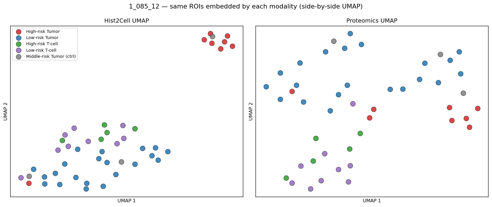

**그림 읽기.**
- 점 = ROI, 색 = section (빨강=High-risk Tumor, 파랑=Low-risk Tumor,
  초록=High-risk T-cell, 보라=Low-risk T-cell, 회색=Middle-risk Tumor ctrl).
- **왼쪽 (Hist2Cell UMAP)** — section 별 cluster 가 매우 깨끗:
  빨강(Tumor-h) 이 우상단에 별도 cluster, 초록·보라(T-cell) 가 중상단,
  파랑(Tumor-l) 이 아래쪽 큰 cluster 로 분리.
- **오른쪽 (Proteomics UMAP)** — 같은 section 들끼리 모이는 *경향* 은
  보이지만 Hist2Cell 만큼 깔끔하지는 않음. 빨강이 우측, 초록·보라가
  좌하단, 파랑이 전체에 분산.

**결론.** 양쪽 UMAP 에서 *section 별 cluster 가 형성된다는 사실*은 공통
이지만, *분리 강도*는 Hist2Cell > Proteomics. 두 modality 가 같은
조직 구조를 *대체로* 본다는 직관적 증거.

---

## 2. Joint UMAP after CCA alignment — borderline

PC10 공간에서 CCA 로 두 modality 를 같은 좌표계로 정렬한 뒤 함께 UMAP.
같은 ROI 가 ○(Hist2Cell) 와 △(Proteomics) 두 점으로 표시되고, 회색 선
으로 짝을 이음. 짝이 가까이 떨어지면 modality 가 일치한다는 메시지.

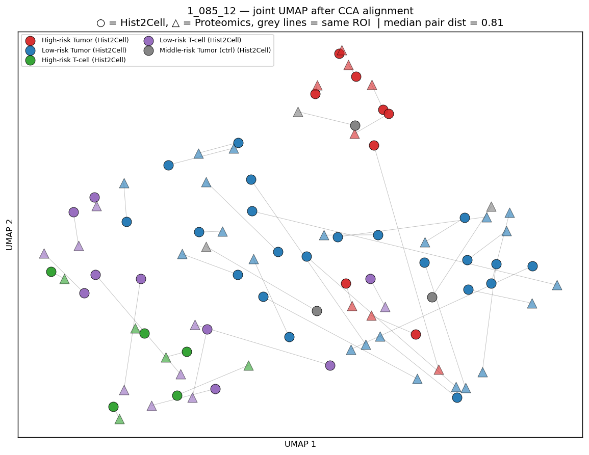

**그림 읽기.**
- median pair distance = **0.81** (UMAP 좌표 단위).
- section 색 cluster 는 형성됨 — 빨강 ○△ 가 한쪽 끝에, 초록·보라 ○△
  가 반대쪽에 모임.
- **하지만 같은 ROI 의 ○ 와 △ 가 깔끔히 겹치지는 않음** — 회색 선이
  꽤 길게 가로지르는 짝이 다수.

**한계.** "0.81 이 작은 거리다" 라고 주장하려면 ROI 라벨을 섞었을 때
짝 거리 분포 (permutation null) 와 비교해야 함. 본 그림 단독으로는
**정량 주장에 충분하지 않고**, *modality 와 무관하게 section cluster
가 동시에 형성된다* 는 정성적 패턴만 보여주는 것이 안전.

**해석 시 주의.**
- ✓ "section 별로 modality 가 같이 cluster 를 만든다"
- ✗ "같은 ROI 의 두 점이 정확히 겹친다"
- ✗ "0.81 이 우연 대비 작다" (검증 없음)

---

## 3. Silhouette score + intra/inter distance ratio

PC10 공간에서:
- **Silhouette score** — 각 ROI 가 자기 section 의 다른 ROI 들과
  얼마나 가깝고, 다른 section ROI 와 얼마나 먼지를 −1~+1 점수로 계산.
  > 0 이면 section 내가 더 가까움, < 0 이면 반대.
- **Intra/inter distance ratio** — section 내 ROI 쌍 평균 거리 /
  section 간 ROI 쌍 평균 거리. < 1 이면 section 내가 더 가까움.

### 거리 행렬 히트맵

ROI×ROI Euclidean distance 를 section 순서로 정렬한 행렬. 깔끔한
경우 block-diagonal 패턴 (= 같은 section 끼리는 밝은 사각형).

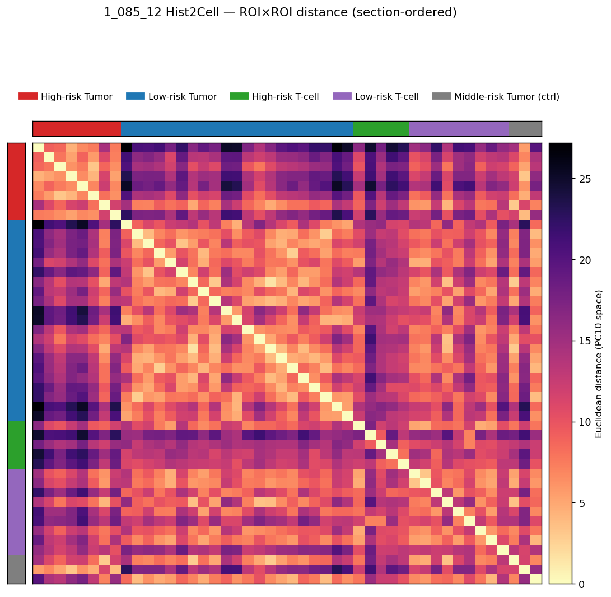

**Hist2Cell 그림 읽기.**
- 색조: 노랑 → 빨강 → 보라 → 검정 순으로 거리 증가. 대각선은 자기
  자신이라 노랑.
- 좌상단 빨강(a, n=8) 블록이 비교적 밝음 (= section 내 ROI 들끼리
  가까움). 빨강-초록(c)·빨강-보라(d) 영역은 어두움 (= section 간
  멀음). **a vs T-cell 분리는 깨끗**.
- 파랑(b, n=21) 블록이 가장 큰데, 그 안에 어두운 spot 이 섞여 있어
  *b 자체가 이질적* 임을 시사 — Low-risk Tumor 안에서도 ROI 마다
  조성이 꽤 다르다는 의미.

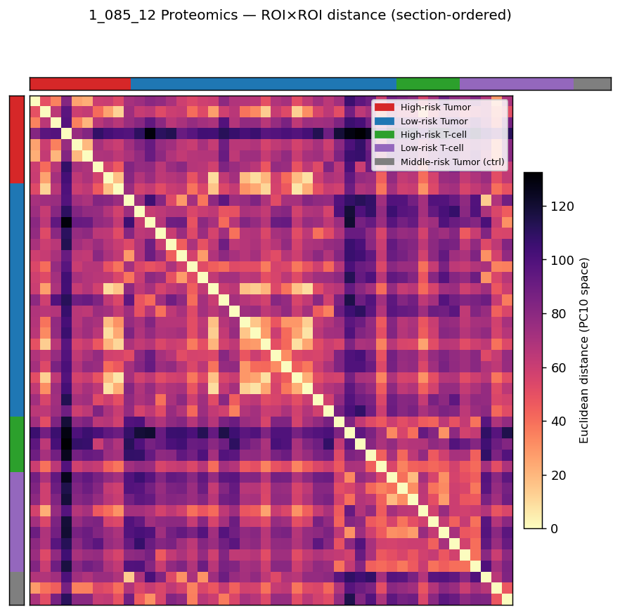

**Proteomics 그림 읽기.**
- 빨강(a) 두 번째 ROI 가 *모든* 다른 ROI 와 매우 먼 outlier — 수직
  검은 띠로 보임. 파랑(b) 안에도 비슷한 outlier 1개.
- 전반적으로 block 패턴이 흐릿함. section 내 거리와 section 간 거리의
  대비가 Hist2Cell 보다 약함 → 아래 silhouette = +0.016 이라는 숫자에
  부합.

### Silhouette null 검정

section 라벨을 1000회 무작위로 섞었을 때 silhouette 분포 vs 관측치.

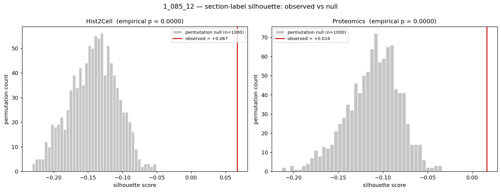

**그림 읽기.**
- 회색 분포: random 라벨에서의 silhouette. **두 modality 모두 평균이
  음수쪽**(−0.13 근처) — 5개 section · 작은 N 에서 라벨 랜덤이면
  silhouette 가 음수로 깔리는 게 정상.
- 빨간 선 (관측치): Hist2Cell +0.067, Proteomics +0.016. **둘 다 null
  분포 오른쪽 꼬리에서 한참 떨어진 위치** → empirical p = 0.000.

### 숫자 종합

| modality | silhouette | intra mean | inter mean | intra/inter ratio | p (silhouette) | p (intra/inter) |
|---|---|---|---|---|---|---|
| Hist2Cell | **+0.067** | 8.69 | 12.93 | **0.672** | <0.001 | <0.001 |
| Proteomics | +0.016 | 57.66 | 73.50 | 0.785 | <0.001 | <0.001 |

**해석.**
- intra/inter ratio 가 두 modality 모두 < 1 → **section 내 < section 간**
  방향성은 확실.
- 단, silhouette 의 *절대값*은 작음 (관용적으로 > 0.5 가 깨끗한
  cluster). 즉 *통계적으로는 유의* 하지만 *분리 강도는 약함*.
- Hist2Cell 이 Proteomics 보다 silhouette 가 4배 높음 — section 라벨이
  Hist2Cell 공간에서 더 잘 묶임. 이는 *학습 자체가 section-level 구조에
  맞춰져 있을* 가능성도 있어서 완전 독립 증거라고 보기 어려운 부분.

---

## 4. Mantel test — 가장 직접적인 cross-modality 검정

> "Hist2Cell 의 ROI×ROI 거리 행렬과 proteomics 의 ROI×ROI 거리 행렬이
> 서로 상관되어 있는가?"

이게 section 라벨을 거치지 않고 **두 modality 가 ROI 들의 닮음/다름 패턴
자체를 비슷하게 보는지**를 묻는 가장 직접적인 통계.

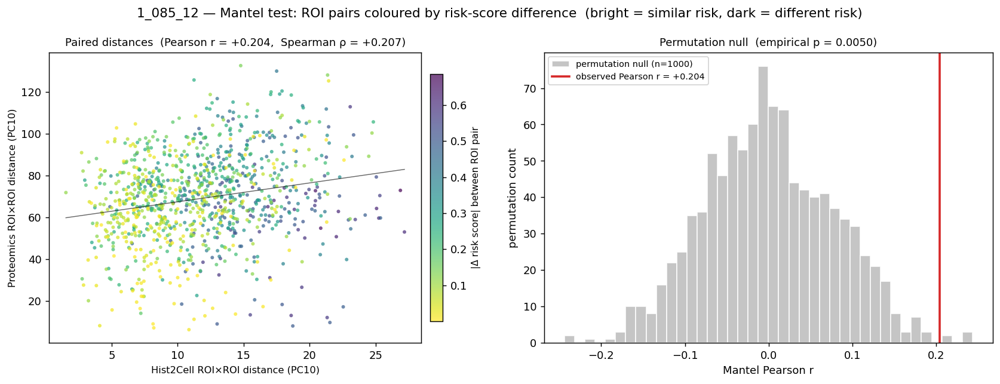

**그림 읽기 (왼쪽 패널).**
- 점 1개 = ROI 쌍 1개 (46 ROI 면 1035 쌍). x = Hist2Cell 거리, y =
  proteomics 거리.
- **빨강 = 같은 section 의 ROI 쌍, 회색 = 다른 section 의 ROI 쌍**.
  빨강 점들이 좌하단 (양쪽 거리 모두 작음) 에 분명히 모임.
- 회귀선이 양의 기울기 → 두 거리가 같이 움직임.

**그림 읽기 (오른쪽 패널).**
- 회색 히스토그램: ROI 라벨을 1000회 섞었을 때 나오는 Mantel r 분포.
  평균 +0.001, 95% [−0.15, +0.15].
- 빨간 선 +0.204 → **null 분포 오른쪽 꼬리 바깥**. empirical p = 0.005.

### 숫자

| 지표 | 값 | 영가설 95% 구간 | empirical p |
|---|---|---|---|
| Pearson r | **+0.204** | [−0.147, +0.148] | 0.005 |
| Spearman ρ | **+0.207** | — | 0.003 |

**해석.**
- 두 modality 의 거리 행렬이 **유의하게 양의 상관관계** — 즉 "A 와 B 가
  Hist2Cell 에서 멀면 proteomics 에서도 먼 경향". 사용자가 원했던
  "두 modality 가 같은 ROI 구조를 본다" 의 가장 직접 증거.
- 단 r ≈ 0.2 의 절대 크기는 **모더릿** 수준 — 강한 일치가 아니라 "양의
  방향성은 분명히 있다" 정도.

---

## 4가지 검정 + summary.md 의 결과 종합

| 검정 | 측정하는 것 | slide1 결과 | 강도 |
|---|---|---|---|
| CCA top r (summary.md) | 두 modality 의 *잠재 축* 일치 | +0.94 | **매우 강함** |
| Per-ROI cosine (summary.md) | 두 modality *벡터* 일치 | +0.555 | 강함 |
| **Mantel r** | 두 modality 의 *상대 거리 구조* 일치 | **+0.204** | 모더릿 |
| Silhouette (Hist2Cell / Proteomics) | section 라벨 *cluster 강도* | +0.067 / +0.016 | 약함 |

→ **측정 수준에 따라 신호 강도가 다르다**.
- *큰 그림* (CCA): 강한 일치.
- *벡터 패턴* (cosine): 강한 일치.
- *fine-grained 거리 구조* (Mantel): 모더릿한 일치.
- *section 라벨 cluster*: 약함 (라벨 자체가 ROI 들을 단일 cluster 로
  묶는 강도가 약하다는 사실 자체에 더 가까운 메시지).

모든 지표가 통계적으로는 유의 (p < 0.05).

---

## 5. CCA 축의 샘플 단위 해석 (axis 1 / 2 / 3)

각 canonical axis 의 ± 방향이 어떤 조직 모듈인지 loadings 로 라벨링하고,
각 section 의 ROI 들이 그 축 위 어느 방향으로 치우치는지 정량적으로 본다.
axis 별 dumbbell plot 은 ○ (Hist2Cell score) 와 △ (Proteomics score) 짝의
거리로 두 modality 의 ROI-level 일치도를 보여주고, loadings 그림은
각 축의 ± 극단을 만드는 상위 cell type / gene 을 나열한다.

→ ROI 한 개의 axis 1/2/3 score 만 보면, 그 ROI 가 어떤 조직 구성인지
즉시 읽을 수 있게 된다.

`cca_section_means.png` 는 3개 axis 의 section 평균 ± 1 SD 를 한 장에
모은 overview:

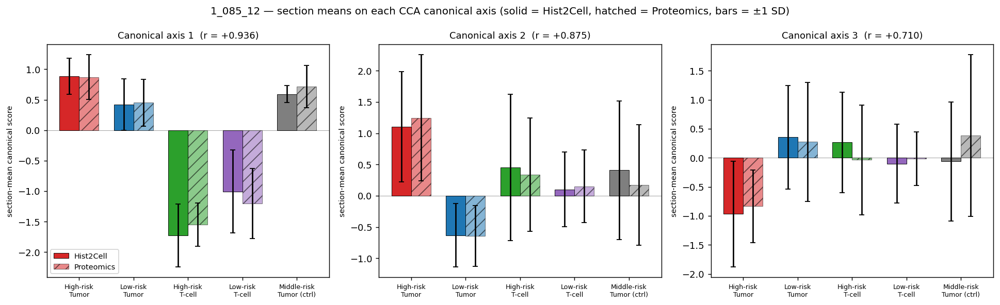

---

### Axis 1 (r = +0.936) — 상피·선조직 ↔ 면역·혈관·기질

**loadings (axis 1 ± 모듈 라벨)**

| 방향 | Hist2Cell 상위 loader | Proteomics 상위 loader | 모듈 해석 |
|---|---|---|---|
| **axis 1 +** | Fibro_adventitial, SMG_Duct, B_plasma_IgA, AT1/AT2 | **KRT7/8/18** (cytokeratin trio), MGP, CRYAB, HSPA1L | **상피·선조직·plasma 분비** |
| **axis 1 −** | Muscle_smooth_syst_arterial, Endothelia_vascular_venous, Suprabasal | **PTPRC = CD45**, CD74, IL16, ICAM3, CORO1A, COL1A1/3A1 | **면역(범백혈구)·혈관·기질** |

(원본 그림: `cca_loadings_axis1.png` — `summary.md §3` 참조)

**ROI 단위 위치**

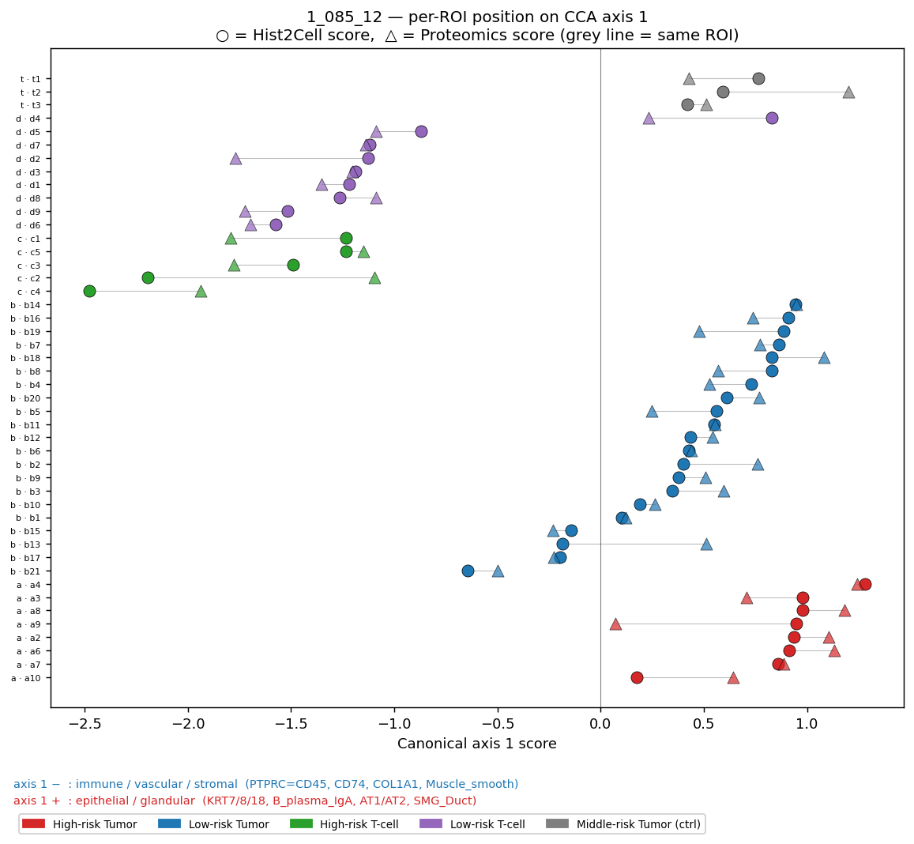

**Section 별 axis 1 평균** (H2C / Pro, n)

| section | label | n | H2C | Pro | 격차 |
|---|---|---|---|---|---|
| a | High-risk Tumor | 8 | **+0.88** | **+0.87** | 0.01 |
| b | Low-risk Tumor | 21 | +0.42 | +0.45 | 0.03 |
| c | High-risk T-cell | 5 | **−1.73** | **−1.55** | 0.18 |
| d | Low-risk T-cell | 9 | −1.01 | −1.20 | 0.19 |
| t | Middle-risk Tumor (ctrl) | 3 | +0.59 | +0.71 | 0.12 |

**해석**

- **Tumor 계열 ROI 들 (a / b / t, 합 32개) 은 axis 1 의 양의 방향으로
  치우치는 경향을 보였고, 이 방향은 loading 기준으로 *상피·선조직·plasma
  분비* 관련 feature** (KRT7/8/18, B_plasma_IgA, AT1/AT2, SMG_Duct, MGP)
  **와 연관되어 있었다.**
- **T-cell 계열 ROI 들 (c / d, 합 14개) 은 axis 1 의 음의 방향으로
  치우치는 경향을 보였고, 이 방향은 loading 기준으로 *면역·혈관·기질
  collagen* 관련 feature** (PTPRC=CD45, CD74, IL16, COL1A1, Muscle_smooth)
  **와 연관되어 있었다.**
- 5개 section 모두에서 Hist2Cell ↔ proteomics 의 axis 1 평균 격차가
  0.20 이하로, 두 modality 가 axis 1 위에서 section 위치를 거의 동일
  하게 인코딩한다.
- ROI 단위로 봐도 c4 가 −2.5 로 본 슬라이드에서 가장 *면역 압도적*
  ROI 임을 두 modality 가 동일하게 잡았다.

---

### Axis 2 (r = +0.875) — 섬모상피·폐포·모세혈관 ↔ adventitial fibroblast·분비선

**loadings (axis 2 ± 모듈 라벨)**

| 방향 | Hist2Cell 상위 loader | Proteomics 상위 loader | 모듈 해석 |
|---|---|---|---|
| **axis 2 +** | **Ciliated (+0.72)**, Fibro_alveolar, Secretory_Goblet, AT1/AT2, Endothelia_Cap_a/g | CNN1, MRI1, **HBA1/HBB** (헤모글로빈), ZNF185, EPPK1 | **섬모상피·폐포 + 모세혈관·혈액** |
| **axis 2 −** | Fibro_adventitial, SMG_Serous, Fibro_myofibroblast, Endothelia_venous | CALML5, SDC1, PTX3, PRSS3, SOD3, SLPI | **adventitial fibroblast·분비선** |

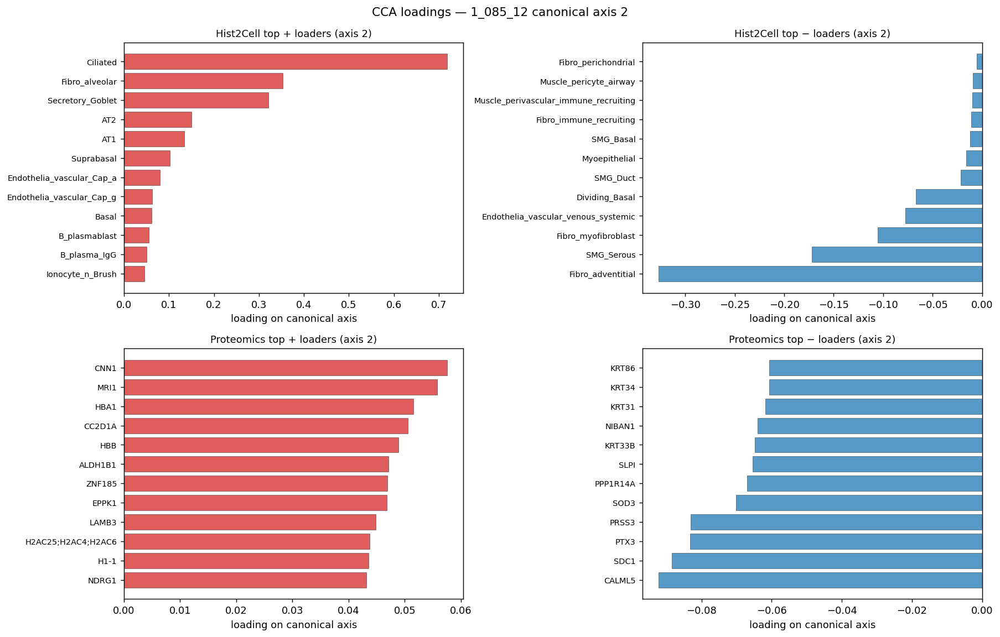

**ROI 단위 위치**

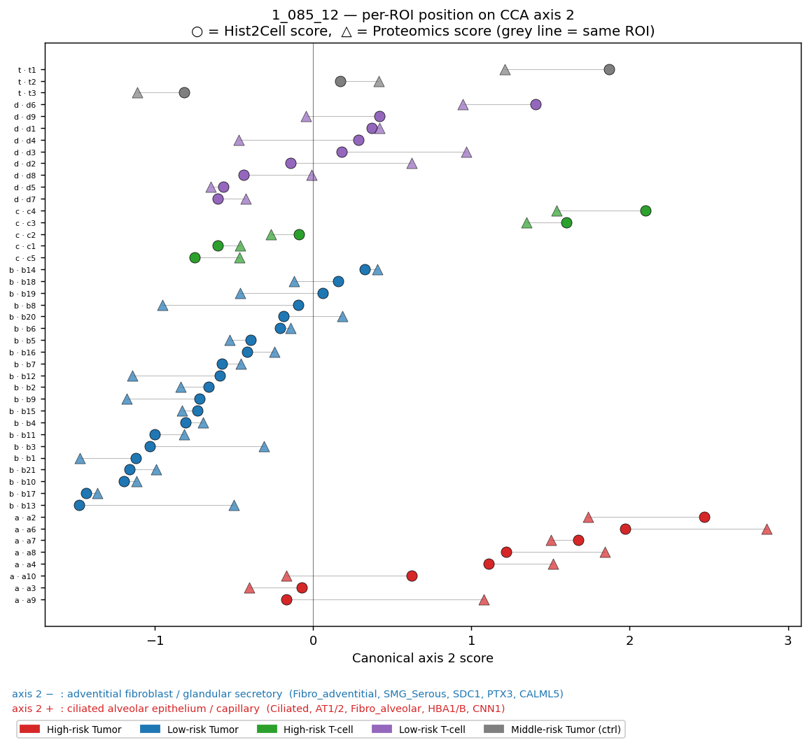

**Section 별 axis 2 평균**

| section | label | n | H2C | Pro | 격차 |
|---|---|---|---|---|---|
| a | High-risk Tumor | 8 | **+1.10** | **+1.25** | 0.15 |
| b | Low-risk Tumor | 21 | −0.63 | −0.64 | 0.01 |
| c | High-risk T-cell | 5 | +0.45 | +0.34 | 0.11 |
| d | Low-risk T-cell | 9 | +0.10 | +0.15 | 0.05 |
| t | Middle-risk Tumor (ctrl) | 3 | +0.41 | +0.17 | 0.24 |

**해석**

- **High-risk Tumor (a, n=8) 는 axis 2 의 양의 방향 극단으로 치우치는
  경향을 보였고, 이 방향은 loading 기준으로 *섬모상피·폐포·모세혈관*
  관련 feature** (Ciliated, AT1/2, Fibro_alveolar + HBA1/B, CNN1) **와
  연관되어 있었다.**
- **Low-risk Tumor (b, n=21) 는 axis 2 의 음의 방향으로 치우치는 경향
  을 보였고, 이 방향은 loading 기준으로 *adventitial fibroblast·분비선*
  관련 feature** (Fibro_adventitial, SMG_Serous + SDC1, PTX3, CALML5)
  **와 연관되어 있었다.**
- T-cell 계열 (c, d) 과 ctrl (t) 은 axis 2 에서 약한 +, 즉 중간 영역.
- → axis 2 는 *Tumor 내부 이질성 (High-risk vs Low-risk)* 을 잡는 축으
  로 해석되며, 두 modality 모두 동일하게 a 와 b 를 양 극단으로 갈라낸다.
  단 t 의 H2C ↔ Pro 격차가 0.24 로 axis 1 보다 약간 큼 (n=3 의 한계).

---

### Axis 3 (r = +0.710) — plasma B·분비선 ↔ 폐포상피·basal stress keratin

**loadings (axis 3 ± 모듈 라벨)**

| 방향 | Hist2Cell 상위 loader | Proteomics 상위 loader | 모듈 해석 |
|---|---|---|---|
| **axis 3 +** | SMG_Duct, B_plasmablast, B_plasma_IgA, Secretory_Goblet, SMG_Mucous | TUBB2B, **S100P, S100A6**, PTX3, DDAH1, FMOD, DSG3, APOD | **plasma B·점액 분비선·S100 family** |
| **axis 3 −** | **AT2 (−0.51), AT1 (−0.41)**, Muscle_smooth_syst_arterial, Endothelia_Cap_a, Muscle_airway | **KRT6A/B, KRT72/75, KRT16, KRT3**, TAGLN, AGR2 | **폐포상피 + basal stress keratin** |

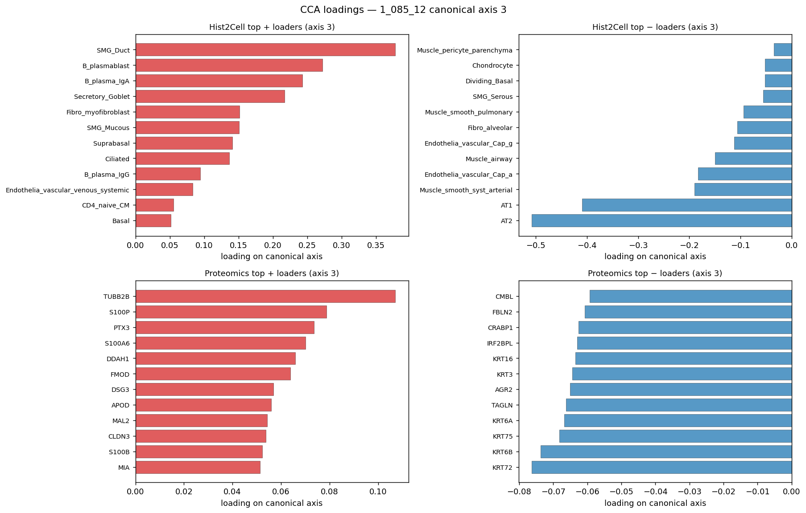

**ROI 단위 위치**

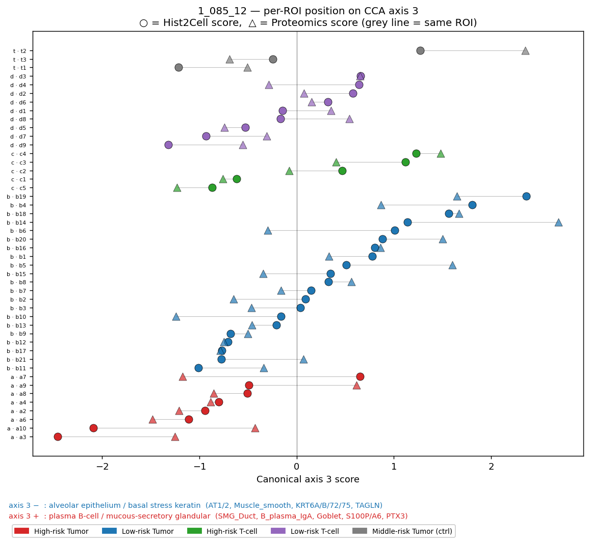

**Section 별 axis 3 평균**

| section | label | n | H2C | Pro | 격차 |
|---|---|---|---|---|---|
| a | High-risk Tumor | 8 | **−0.97** | **−0.83** | 0.14 |
| b | Low-risk Tumor | 21 | **+0.36** | **+0.28** | 0.08 |
| c | High-risk T-cell | 5 | +0.27 | −0.04 | 0.31 |
| d | Low-risk T-cell | 9 | −0.10 | −0.01 | 0.09 |
| t | Middle-risk Tumor (ctrl) | 3 | −0.06 | +0.38 | 0.44 |

**해석**

- **High-risk Tumor (a, n=8) 는 axis 3 의 음의 방향으로 치우치는 경향
  을 보였고, 이 방향은 loading 기준으로 *폐포상피 + basal stress
  keratin* 관련 feature** (AT1/2, Muscle_smooth + KRT6A/B/72/75, TAGLN)
  **와 연관되어 있었다.**
- **Low-risk Tumor (b, n=21) 는 axis 3 의 양의 방향으로 치우치는 경향
  을 보였고, 이 방향은 loading 기준으로 *plasma B·점액 분비선·S100*
  관련 feature** (SMG_Duct, B_plasma_IgA, Goblet + S100P/A6, PTX3) **와
  연관되어 있었다.**
- 단 axis 3 는 r=+0.71 로 axis 1/2 대비 신호가 약하고, c (격차 0.31)
  와 t (격차 0.44) 에서 두 modality 의 부호가 갈리므로 *noise floor 에
  근접한 축*. → axis 3 단독으로 강한 주장을 만들지는 말 것.

---

### Axis 1/2/3 종합 보고 문장

> "두 modality 의 CCA canonical axis 1 은 *상피·선조직 ↔ 면역·혈관·기질*
> 의 main gradient 를 잡았고 (Tumor 계열은 axis 1 +, T-cell 계열은
> axis 1 −), axis 2 는 *Tumor 내부 이질성* (High-risk 는 axis 2 +,
> Low-risk 는 axis 2 −) 을 추가로 분리하며, axis 3 는 Tumor 내부의
> *상피 분화 결*  (High-risk 는 alveolar/basal stress keratin 쪽,
> Low-risk 는 plasma-B/mucous 쪽) 에 대응한다. axis 1·2 는 두 modality
> 가 section 평균 위치를 0.25 이하 격차로 일치시키며, axis 3 는 일부
> section 에서 modality 부호가 갈리므로 보수적으로 해석한다."

### 산출 파일 (이 섹션)

- `cca_dumbbell_axis1.png`, `cca_dumbbell_axis2.png`, `cca_dumbbell_axis3.png` — axis 별 ROI dumbbell
- `cca_loadings_axis2.png`, `cca_loadings_axis3.png` — axis 2/3 의 ± top loaders
  (axis 1 의 loadings 는 `summary.md` 에서 이미 다룬 `cca_loadings_axis1.png`)
- `cca_section_means.png` — axis 1/2/3 의 section 평균 ± SD
- `cca_scores_per_roi.csv` — 46 ROI × {section, H2C_canon1/2/3, P_canon1/2/3}

---

## 솔직한 마무리

이번 보조 분석은 `summary.md` 의 강한 주장 (CCA r=+0.94) 을 **다른
관점** 에서 시험하고, 그 결과 "방향성은 일관되게 양의 일치, 단 측정
수준이 미세해질수록 신호 강도는 약해진다" 는 그림을 확인한 것.

권장 사용:
- **외부 보고 / 협업자 공유** — `summary.md` 의 CCA + cosine 결과만 인용.
- **방법론 robustness 확인 / 리뷰어 대비** — 본 문서의 Mantel test 가
  가장 직접적이고 비편향적인 cross-modality 일치 증거. 같이 보고하면
  설득력 보강.
- **반대 의견 대비** — silhouette 가 약하다는 사실은 *section 라벨이
  ROI 단위 구조를 강하게 묶지 못한다* 는 의미이지 *cross-modality
  일치가 약하다* 는 의미가 아님. 검정 4가지를 함께 봐야 그림이 깨끗함.

## 산출 파일

| 파일 | 내용 |
|---|---|
| `umap_side_by_side.png` | 두 modality 의 독립 UMAP (section 색) |
| `umap_joint_paired.png` | CCA 정렬 후 joint UMAP (○=H2C, △=Pro, 짝선) |
| `distance_heatmap_hist2cell.png` | Hist2Cell ROI×ROI 거리 행렬 |
| `distance_heatmap_proteomics.png` | Proteomics ROI×ROI 거리 행렬 |
| `silhouette_null.png` | silhouette 관측치 vs 1000-perm 영분포 |
| `intra_inter_summary.csv` | silhouette / intra-inter / p 표 |
| `mantel_scatter.png` | Mantel 산점도 + null 히스토그램 |
| `mantel_summary.csv` | Mantel r (Pearson/Spearman) + p |
| `cca_dumbbell_axis1.png` / `_axis2.png` / `_axis3.png` | ROI 단위 canonical score per axis (H2C vs Pro) |
| `cca_loadings_axis2.png` / `_axis3.png` | axis 2/3 ± top loaders (axis 1 은 summary.md) |
| `cca_section_means.png` | axis 1/2/3 section 평균 ± SD |
| `cca_scores_per_roi.csv` | 46 ROI × canonical score (axis 1/2/3) |
