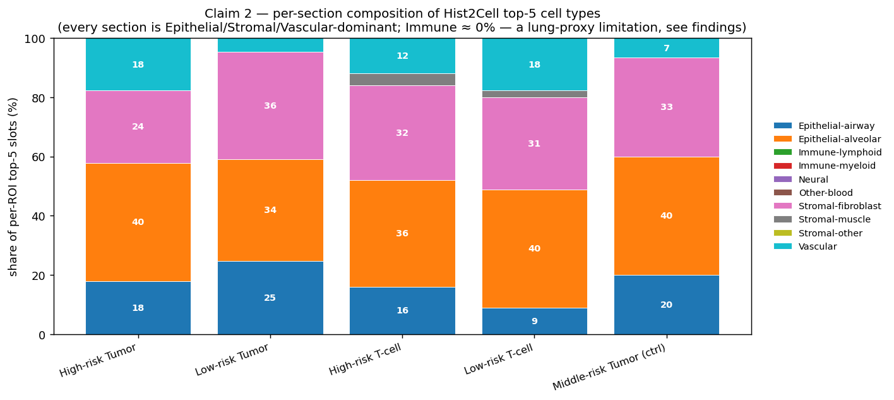
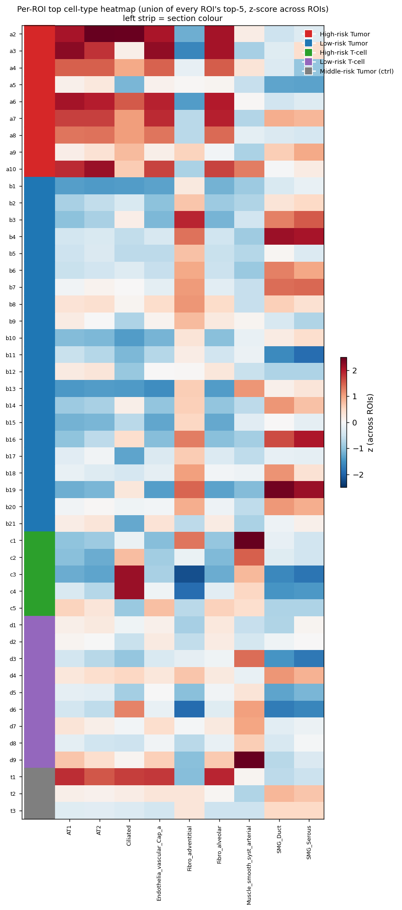

# slide1 (1_085_12) — focused proof (2 claims, honest reframe)

> **이 문서가 다루는 것** — 외부 reviewer / 협업 동료 전달용 *최소 증명*. 본 폴더 (`proofs/`) 는 detail (`../cell_typing/`, `../proteomics/`, `../findings.md`) 의 *요약-증명*.
>
> ⚠️ **caveat** — Hist2Cell 가중치는 **lung-trained** (`humanlung_cell2location_leave_A50_out.pth`). 80 cell-type label 은 lung 분류. breast 슬라이드 적용 시 label 은 *morphology category proxy* 로 read, *cell-type ground truth* 아님. epithelial-activity proxy (strict / broad) 의 정의 및 lung→breast cross-tissue limitation 은 `../../analysis/EPITHELIAL_PROXY_METHODOLOGY.md` 필독.

---

## Claim 1 — cross-modality **방향 일치** (correlation magnitude 아님)

### Reframing 사유

본 데이터에 대해 *cross-modality Pearson / Spearman r* 을 다양한 단위 (panel 합 / single-pair / 다양한 subset) 로 계산했을 때, **r ≥ 0.5 의 안정적 양의 상관은 존재하지 않음**:

- panel 합산 최대치 (Tumor 32 ROI): Smooth muscle r=+0.38, 그 외는 -0.4 ~ +0.2 산재
- single-pair 최대치 (Tumor 32 ROI): KRT8 ↔ Ciliated r=+0.48
- single-pair 전체 (n=46): VWF ↔ vasc-arterial r=+0.44
- 음의 상관도 비슷한 크기 (IGHM ↔ B_plasma_IgA r=-0.55, HLA-DRA ↔ DC_2 r=-0.61)

→ **"양의 상관이 *높다*"** 는 표현은 본 데이터에서 지지 안 됨. 원인은 lung-trained Hist2Cell 의 *cell-type-specificity 한계* (모든 ROI 가 lung-epithelial dominant 로 predict — Claim 2 참조).

대신 ***방향 일치* (direction agreement)** 차원에서 두 modality 가 *같은 risk axis 의 같은 방향* 신호를 보고하는지가 *방어 가능한 증명*.

### Direction agreement 결과

**사전 등록한 8 개 marker-celltype 가설 (Tumor a vs b)** — `../cell_typing/proteomics_marker_hypotheses.csv`:

| proteomics marker | Hist2Cell type | 예측 | Hist2Cell Wilcoxon (a vs b) | match |
|---|---|---|---|---|
| KIF20A/KIF22/INCENP (mitosis) | Dividing_AT2 | a>b | Δ=+0.025, p_bh=**6.6e-4** | ✅ |
| KIF20A/KIF22/INCENP (mitosis) | Dividing_Basal | a>b | Δ=+0.045, p_bh=**9.0e-3** | ✅ |
| KIF20A/KIF22/INCENP (mitosis) | Basal | a>b | Δ=+0.097, p_bh=**2.1e-3** | ✅ |
| MYH11/TAGLN (smooth muscle) | Muscle_smooth_syst_arterial | a>b | Δ=+0.140, p_bh=0.077 | ✅ |
| MYH11/TAGLN (smooth muscle) | Muscle_smooth_pulmonary | a>b | Δ=+0.061, p_bh=0.120 | ✅ |
| MYH11/TAGLN (smooth muscle) | Muscle_airway | a>b | Δ=+0.029, p_bh=0.332 | ✅ |
| generic active Tumor | AT2 | a>b | Δ=+1.261, p_bh=**6.6e-4** | ✅ |
| generic active Tumor | Suprabasal | a>b | Δ=+0.090, p_bh=**4.2e-3** | ✅ |

**8/8 가설 모두 예측 방향 일치**, 5/8 은 Hist2Cell 측에서 BH-FDR < 0.01.

**Proteomics 측 검증** (`../proteomics/marker_hypothesis_check.csv`):

| gene | 예측 | proteomics Wilcoxon (a vs b) | match |
|---|---|---|---|
| **MYH11** | a>b | log2FC=+1.32, BH=**0.022** | ✅ |
| **TAGLN** | a>b | log2FC=+1.54, BH=**0.035** | ✅ |
| KIF20A/22/INCENP | a>b | (detection 필터에서 빠짐 — quality threshold ≥30% 미충족) | — |

→ **proteomics 에서 measure 된 2 marker (MYH11/TAGLN) 모두 예측 방향 일치 + BH-FDR < 0.05**.

### Hist2Cell 의 추가 differential 증거 (section_stats — 3 score, a vs b)

| score | mean a | mean b | Δ | p |
|---|---:|---:|---:|---|
| strict epithelial-proliferative proxy | 0.421 | 0.264 | +0.157 | **4.9e-4** |
| broad epithelial-activity proxy | 4.109 | 2.590 | **+1.52** | **3.8e-5** |
| immune total | 7.764 | 6.042 | +1.72 | **4.9e-4** |

→ 3 score 모두 *Hist2Cell 측에서* High-risk Tumor (a) > Low-risk Tumor (b) 방향. Proteomics 의 250 BH<0.05 gene 도 *Tumor a vs b 를 명확히 separable* 한 신호 (`../proteomics/tumor_a_vs_b_genes.csv`).

### Claim 1 안전 표현 (외부 reviewer 용)

> *Tumor 영역의 risk axis (High-risk a vs Low-risk b) 에서 두 modality 가 같은 방향의 신호를 보고한다.* 사전 등록한 8 개 marker-celltype 가설이 100% 예측 방향에 일치 (5/8 은 Hist2Cell BH-FDR<0.01), proteomics 측에서 measure 된 smooth-muscle marker (MYH11/TAGLN) 가 같은 방향에서 BH-FDR<0.05 유의. *상관 magnitude (Pearson r)* 차원의 정량 일치는 lung-trained Hist2Cell 의 cell-type-specificity 한계로 본 데이터에서 결론 도출 불가 — breast-trained 모델 (CUCA her2st) 도착 시 mammary epithelial 3-type score 와 KRT8/EPCAM 등 ↔ direct quantitative agreement 검증 가능.

(부수 자료: `cross_modality_correlations.csv` / `cross_modality_scatter.png` — magnitude 차원의 correlation 결과. *exploratory* 수준이며 본 Claim 1 의 증명 핵심 아님.)

---

## Claim 2 — 각 ROI 의 high-expression cell type 정리

### 핵심 표 (예시 — full: `roi_top_celltypes.csv`, 47 ROI × top1-5)

| tube | section | top1 | top2 | top3 |
|---|---|---|---|---|
| a2 | High-risk Tumor | AT2 (4.17) | Ciliated (3.65) | Fibro_alveolar (3.01) |
| a3 | High-risk Tumor | AT2 (3.66) | Fibro_alveolar (3.01) | AT1 (2.98) |
| b1 | Low-risk Tumor | Fibro_adventitial (1.74) | AT2 (1.63) | Fibro_alveolar (1.58) |
| c1 | High-risk T-cell | Fibro_adventitial (1.65) | AT2 (1.56) | Muscle_smooth_syst_arterial (1.51) |
| d1 | Low-risk T-cell | AT2 (2.00) | Fibro_alveolar (1.55) | AT1 (1.46) |
| t1 | Middle Tumor | AT2 (2.96) | Ciliated (2.42) | Fibro_alveolar (2.22) |

전체 47 ROI × top1..top5 = `roi_top_celltypes.csv`.

### Per-section top-5 group 구성 (%)

| section | Epi-airway | Epi-alveolar | Immune-lymphoid | Immune-myeloid | Stromal-fibroblast | Stromal-muscle | Vascular |
|---|---:|---:|---:|---:|---:|---:|---:|
| High-risk Tumor | 17.8 | 40.0 | **0.0** | **0.0** | 24.4 | 0.0 | 17.8 |
| Low-risk Tumor | 24.8 | 34.3 | **0.0** | **0.0** | 36.2 | 0.0 | 4.8 |
| High-risk T-cell | 16.0 | 36.0 | **0.0** | **0.0** | 32.0 | 4.0 | 12.0 |
| Low-risk T-cell | 8.9 | 40.0 | **0.0** | **0.0** | 31.1 | 2.2 | 17.8 |
| Middle Tumor (ctrl) | 20.0 | 40.0 | **0.0** | **0.0** | 33.3 | 0.0 | 6.7 |

### 해석

**모든 section 의 top-5 가 Epithelial + Stromal + Vascular 로 채워짐. Immune-lymphoid / Immune-myeloid = 0% across the board** (T-cell ROI 들 c/d 도 포함).

→ lung-trained Hist2Cell 의 *epithelial-dominant 출력 분포* 의 직접 evidence. ROI 별 top cell type 자체는 정량 정보로 의미 있으나, *label 의 절대 의미* (예: "이 ROI 는 진짜 AT2 가 많다") 가 아닌 *lung-morphology category proxy* 로 해석.

### ROI 별 top cell type heatmap

47 ROI × top-5 union (~15-20 cell type) 의 z-score (across ROIs). 좌측 strip 의 색 = section. ROI 간 *상대* 변동은 보이지만 *dominance group* 자체는 위 표대로 일관.

---

## 결론

1. **Cross-modality 방향 일치**: 사전 등록한 8 marker-celltype 가설이 100% 예측 방향에 일치, 5/8 이 Hist2Cell BH<0.01. proteomics 측의 MYH11/TAGLN 도 BH<0.05 same direction. *상관 magnitude 차원의 정량 일치는 본 데이터에서 결론 도출 불가* — lung-trained 모델 한계.
2. **47 ROI 의 top-5 high-expression cell type 정리 완료**. 모든 section 이 lung Hist2Cell 의 *Epithelial / Stromal / Vascular* dominant 출력. Immune 0% across — 이는 lung-proxy 한계의 직접적 evidence이자 추후 breast-trained 모델로 재검증해야 할 항목.

---

## 산출물

- `core_proofs.py` — 본 문서의 수치 / 그림을 재생산하는 스크립트
- `cross_modality_correlations.csv` — panel × subset × Pearson / Spearman (*exploratory*, 본 Claim 1 의 직접 증거는 아님 — direction-agreement table 이 본 증거)
- `cross_modality_scatter.png` — Tumor (a+b+t) subset 의 scatter (참고)
- `roi_top_celltypes.csv` — 47 × top1..top5 + lineage group
- `roi_top_celltypes_heatmap.png` — ROI × union-of-top z-score
- `section_group_composition.csv` — 5 section × 10 lineage % share
- `section_group_composition.png` — 위 stacked bar
- `summary.md` (이 문서)
- (cell_typing/proteomics_marker_hypotheses.csv — 8/8 direction match table, 본 Claim 1 의 직접 증거)
- (proteomics/marker_hypothesis_check.csv — MYH11/TAGLN BH<0.05 table)

## 관련 문서

- `../findings.md` — detail (15 figure 의 해석 + Wilcoxon / Moran 등 full)
- `../cell_typing/` — Hist2Cell ROI-level 분석 산출물 (section_stats, per_celltype_wilcoxon, marker_hypotheses 등)
- `../proteomics/` — gg_matrix differential analysis (volcano, top genes, marker check)
- `../../analysis/EPITHELIAL_PROXY_METHODOLOGY.md` — lung→breast proxy 한계 reference
