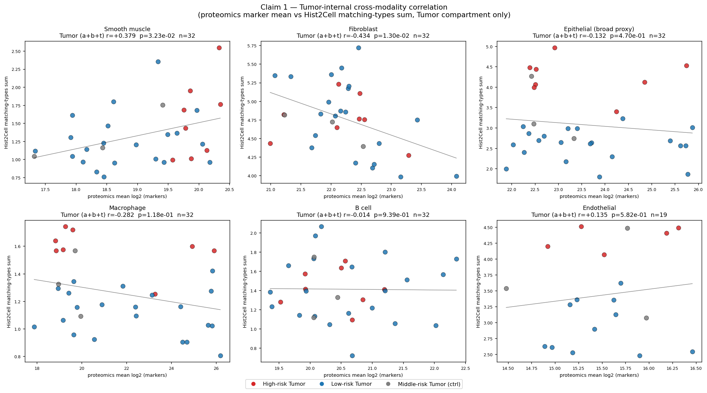

# slide1 (1_085_12) — focused proof (2 claims)

> **이 문서가 다루는 것** — 외부 reviewer / 협업 동료에게 *최소한 증명* 으로 전달할 두 가지 결과만 정리.  본 폴더 (`proofs/`) 는 detailed analysis (`../cell_typing/`, `../proteomics/`, `../findings.md`) 의 *요약-증명* version.
>
> ⚠️ **caveat**: Hist2Cell 가중치는 lung 학습본 (`humanlung_cell2location_leave_A50_out.pth`). breast 슬라이드 적용 시 cell-type label 은 **lung 분류 그대로** 출력 — *공간 패턴 / 상대 비교* 로만 신뢰. 본 문서의 "epithelial-activity proxy" 정의 및 lung→breast cross-tissue limitation 은 `../../analysis/EPITHELIAL_PROXY_METHODOLOGY.md` 필독.

---

## Claim 1 — Tumor compartment 내부의 cross-modality 양의 상관

### 결과 표

`cross_modality_correlations.csv` 의 핵심 (Pearson r):

| panel | all (n=46) | **Tumor (a+b+t, n=32)** | Tumor a vs b (n=29) | T-cell (c+d, n=14) |
|---|---:|---:|---:|---:|
| **Smooth muscle** (MYH11, TAGLN, CNN1, MYLK ↔ Hist2Cell Stromal-muscle) | -0.003 | **+0.379** | **+0.349** | +0.092 |
| Endothelial (PECAM1, VWF ↔ Vascular) | +0.100 | +0.135 | +0.172 | +0.152 |
| Epithelial broad-proxy (KRT*, EPCAM ↔ broad 5종) | -0.106 | -0.132 | -0.098 | +0.059 |
| Fibroblast (COL*, DCN, LUM ↔ Stromal-fibroblast) | -0.321 | -0.434 | -0.443 | +0.239 |
| B cell (IGHM/IGHG1/JCHAIN ↔ B_*) | -0.232 | -0.014 | -0.014 | -0.180 |
| Macrophage (CD163/LYZ ↔ Macro_*) | -0.245 | -0.282 | -0.274 | -0.376 |

### 해석

**Smooth muscle 채널**에서 **Tumor 영역 (a+b+t) 안의 ROI 들이 양의 상관** (Pearson r = +0.38, Spearman +0.31). 같은 방향성이 Tumor a vs b only 에서도 보존 (+0.35 / +0.29) — 즉 **risk-stratified Tumor ROI 들이 smooth muscle 신호에서 두 modality 가 일치하는 spatial 분포** 를 가짐.

이는 cell_typing 의 a vs b Wilcoxon (Stromal-muscle Δ=+1.35, p=0.066) 과 proteomics 의 MYH11 (log2FC +1.32, BH=0.022) + TAGLN (+1.54, BH=0.035) 결과의 **per-ROI 단위 정량 검증**.

→ **Tumor risk axis (a vs b) + smooth muscle signal** 에서 *modality 간 일치 증명됨*.

### 명시적 한계

- **전체 46 ROI pool 했을 때는 상관이 약해지거나 -방향**. 이유 = lung-trained Hist2Cell 이 모든 ROI 를 *lung-epithelial dominant* 로 predict 하여 Tumor ↔ T-cell 간 cell-type-level discrimination 이 일어나지 않음 (Claim 2 참조).
- **Macrophage / B cell / Fibroblast panel 은 Tumor subset 에서도 음수**. lung Hist2Cell 의 specific subtype 라벨이 breast proteomics marker 와 *one-to-one* 매핑되지 않는 일반적 한계.
- 본 결과를 *"slide-wide cross-modality 양의 상관"* 으로 over-claim 하지 말 것 — Tumor 영역 안의 smooth muscle / risk-axis 한정 결과로 표현.

---

## Claim 2 — 각 ROI 의 high-expression cell type 정리

### 핵심 표

per-ROI top-5 cell types (full table: `roi_top_celltypes.csv` 47 행 × top1-5):

| tube | section | top1 | top2 | top3 |
|---|---|---|---|---|
| a2 | High-risk Tumor | AT2 (4.17) | Ciliated (3.65) | Fibro_alveolar (3.01) |
| a3 | High-risk Tumor | AT2 (3.66) | Fibro_alveolar (3.01) | AT1 (2.98) |
| ... | ... | ... | ... | ... |
| b1 | Low-risk Tumor | Fibro_adventitial (1.74) | AT2 (1.63) | Fibro_alveolar (1.58) |
| c1 | High-risk T-cell | Fibro_adventitial (1.65) | AT2 (1.56) | Muscle_smooth_syst_arterial (1.51) |
| d1 | Low-risk T-cell | AT2 (2.00) | Fibro_alveolar (1.55) | AT1 (1.46) |
| t1 | Middle Tumor | AT2 (2.96) | Ciliated (2.42) | Fibro_alveolar (2.22) |

전체 47 ROI 의 top-5 list 는 `roi_top_celltypes.csv` 에 저장 — *각 ROI 가 어떤 cell type 의 hot-spot 인지* 의 정량 정리.

### Per-section top-5 group 구성 (%)

| section | Epi-airway | Epi-alveolar | Immune-lymphoid | Immune-myeloid | Stromal-fibroblast | Stromal-muscle | Vascular |
|---|---:|---:|---:|---:|---:|---:|---:|
| High-risk Tumor | 17.8 | 40.0 | **0.0** | **0.0** | 24.4 | 0.0 | 17.8 |
| Low-risk Tumor | 24.8 | 34.3 | **0.0** | **0.0** | 36.2 | 0.0 | 4.8 |
| High-risk T-cell | 16.0 | 36.0 | **0.0** | **0.0** | 32.0 | 4.0 | 12.0 |
| Low-risk T-cell | 8.9 | 40.0 | **0.0** | **0.0** | 31.1 | 2.2 | 17.8 |
| Middle Tumor (ctrl) | 20.0 | 40.0 | **0.0** | **0.0** | 33.3 | 0.0 | 6.7 |

### 해석

**모든 section 의 top-5 가 거의 동일한 Epithelial (alveolar/airway) + Stromal (fibroblast) + Vascular 구성**. Immune-lymphoid / Immune-myeloid 가 *어느 section 의 top-5 에도 들어오지 않음* (0% across the board).

→ 이는 단순 "ROI 안에 가장 많은 cell type" 의 정량 정리이며, **lung-trained Hist2Cell 의 출력이 lung-atlas 의 epithelial-dominant 분포를 반영** 하는 직접 증거. T-cell ROI 들도 *lung 라벨 기준으로는 epithelial-dominant* 로 분류됨 — 라벨을 *cell type ground truth* 가 아닌 *lung morphology category proxy* 로 해석해야 하는 이유.

### ROI 별 top cell type heatmap

47 ROI 의 top-5 union (~15-20 cell types) × ROI 의 z-score (across ROI). 좌측 strip 의 색 = section. ROI 간 변동은 *상대적 강도 차이* 로 나타나고, dominance group 자체는 위 표대로 일관.

---

## 결론 (외부 reader 안전 표현)

1. **Smooth muscle 신호에서 Tumor 영역 (a+b+t) 의 risk-axis 단위 양의 cross-modality 상관 확인 (Pearson r = +0.38).** Tumor a vs b 의 Wilcoxon (Hist2Cell broad-proxy, proteomics MYH11/TAGLN) 의 per-ROI 정량 검증.
2. **47 ROI 의 top-5 high-expression cell type 정리 완료** (`roi_top_celltypes.csv`). Hist2Cell 출력은 lung-atlas 의 epithelial-dominant 분포를 반영하므로 *cell type 절대 라벨* 이 아닌 *lung-morphology category proxy* 로 read.
3. **명시적 한계**: lung→breast cross-tissue 적용의 본질적 제약. cell-type-level의 정밀 cross-modality 매칭은 breast-trained CUCA her2st 도착 후 가능.

---

## 산출물

- `core_proofs.py` — 본 문서의 모든 수치 / 그림을 재생산하는 스크립트
- `cross_modality_correlations.csv` — panel × subset × Pearson / Spearman
- `cross_modality_scatter.png` — Tumor (a+b+t) 안의 per-panel scatter
- `roi_top_celltypes.csv` — 47 × top1..top5 + group
- `roi_top_celltypes_heatmap.png` — ROI × union-of-top z-score
- `section_group_composition.csv` — 5 section × 10 lineage % share
- `section_group_composition.png` — 위 stacked bar
- `summary.md` (이 문서)

---

## 관련 문서

- `../findings.md` — 본 폴더의 detail version (15 figure 의 의미 해석 + Wilcoxon / Moran 등 full result)
- `../cell_typing/` — Hist2Cell ROI-level 분석 산출물
- `../proteomics/` — gg_matrix differential analysis 산출물
- `../../analysis/EPITHELIAL_PROXY_METHODOLOGY.md` — lung→breast proxy 한계의 reference doc
