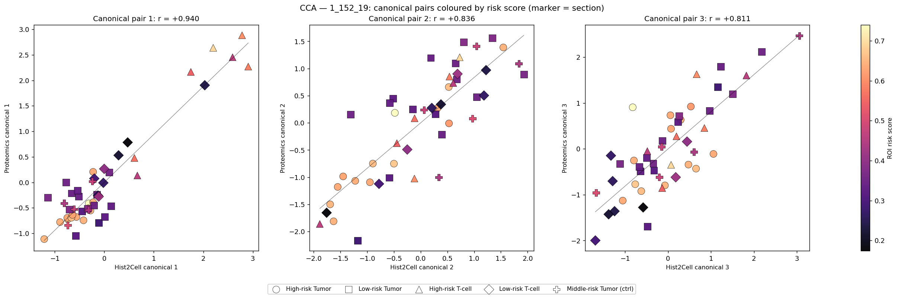
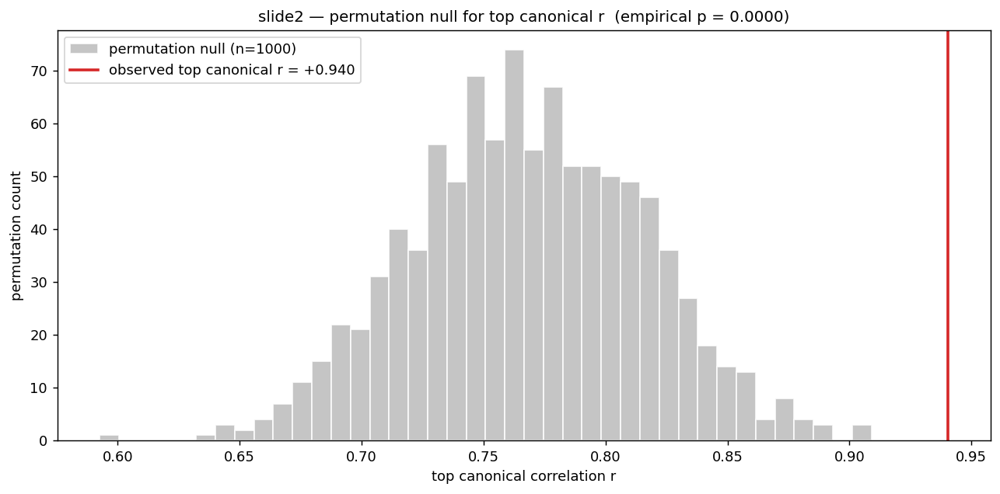
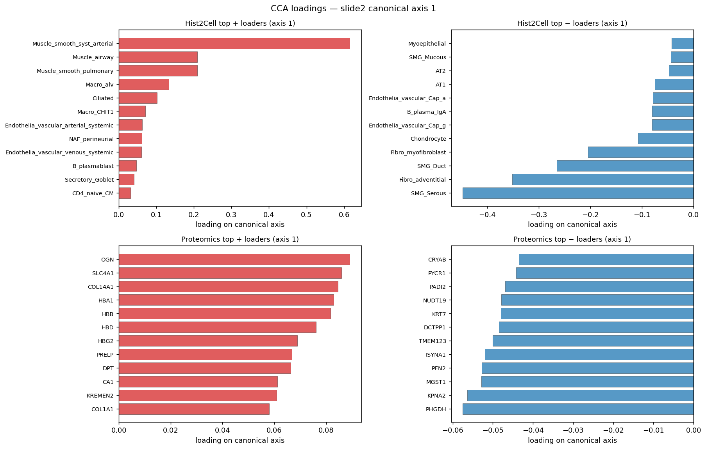
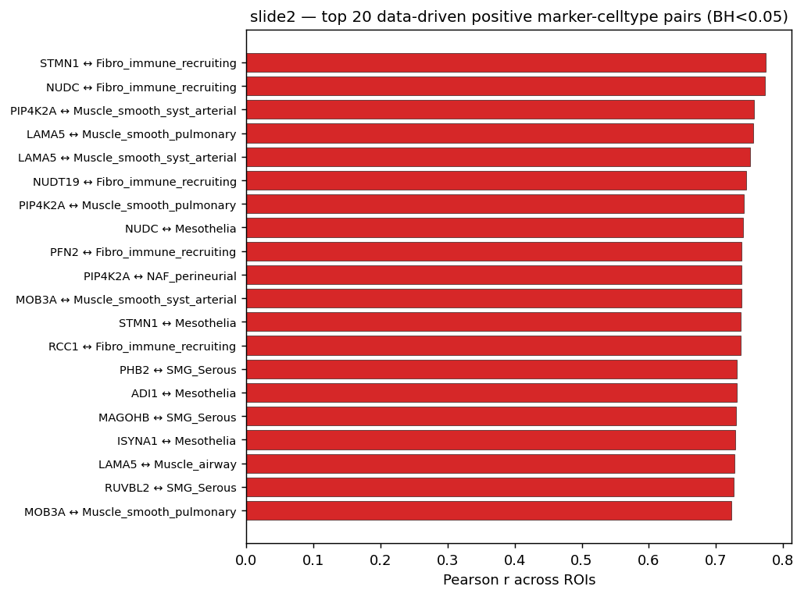
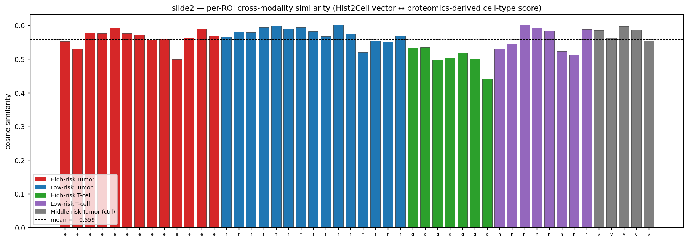

# slide2 (1_152_19) — proof_ver2 요약

## 이 분석이 무엇인지

협업자가 사전 선정한 마커 패널(MYH11, KRT8, COL1A1 …)을 **무시하고**,
이 슬라이드 자체의 Hist2Cell × proteomics 행렬에서 두 modality 사이의
공통 신호를 처음부터 다시 끌어내본 분석. 분석 방식·해석 틀은 slide1
(`../../1_085_12/proof_ver2/summary.md`) 과 동일하며, 본 문서는 slide2 의
수치와 슬라이드별 차이만 기술한다.

## 분석 대상

| 항목 | 수치 |
|---|---|
| ROI 개수 (양쪽 modality 모두 있는 것) | 48 |
| Hist2Cell cell type 개수 | 80 |
| Proteomics gene 개수 (detect ≥ 50% 필터) | 6148 |
| Section 라벨 | e/f/g/h/v (Tumor h, Tumor l, T-cell h, T-cell l, Tumor ctrl) |

slide1 보다 proteomics 가 1.5배 가량 더 많은 유전자를 검출했고 (4216 →
6148), ROI 도 2개 더 많다 (46 → 48). 즉 slide2 는 신호 대비 자유도가
조금 더 여유로운 케이스.

---

## Claim 1 — "교차-modality 양의 상관관계가 존재한다" 의 데이터-기반 검증

### 1. CCA — 두 modality 의 공통 축

PCA 로 각 modality 를 10차원까지 축약 후 CCA. 3개 canonical pair.

**그림 읽기.**
- 색 코딩: 빨강 = High-risk Tumor (e), 파랑 = Low-risk Tumor (f), 초록 =
  High-risk T-cell (g), 보라 = Low-risk T-cell (h), 회색 = Middle-risk
  Tumor 대조군 (v).
- **왼쪽 패널 (Canonical 1, r = +0.940)** 이 핵심. slide1 과 마찬가지로
  48개 점이 회귀선에 거의 일자로 정렬. **여기서 색 분리가 슬라이드1보다
  훨씬 더 깨끗하다**: 빨강(High-risk Tumor) 점들이 좌하단 (-1 영역)에
  몰려있고, 초록(High-risk T-cell) 점들이 우상단 (2.5-3.0 영역)까지
  멀리 튀어나간다. 즉 **canonical axis 1 이 *Tumor 압도적 → T-cell
  rich* gradient 를 정확히 잡고 있다**. 파랑·보라·회색이 중앙에서
  연속적으로 분포하면서 두 극단을 연결.
- **가운데 패널 (Canonical 2, r = +0.836)**: 분산이 조금 더 큼. 빨강이
  왼쪽 아래, 초록·회색이 오른쪽 위. axis 1 으로 잘 설명되지 않는 추가
  변동을 잡는 축.
- **오른쪽 패널 (Canonical 3, r = +0.811)**: slide1 의 axis 3 (r=+0.71)
  보다 오히려 더 강하다 — slide2 는 더 많은 유전자 검출 덕에 sub-축에서
  도 신호가 더 잘 살아남는다.

**결론.** 두 modality 의 공통 잠재 축이 존재하고, 그 1번 축이 **Tumor
↔ T-cell 침윤** 의 조직 구성 gradient 와 정렬됨. slide1 보다 색 분리가
명확한 것은 slide2 의 section 사이 조직 구성 차이가 더 또렷하다는
의미.

PCA 분산(참고): Hist2Cell PC1‒3 = 52.0% / 28.4% / 11.3%, Proteomics
PC1‒3 = 33.8% / 17.7% / 6.1%. **slide2 proteomics 의 PC1 비중(33.8%)이
slide1(22.6%) 보다 훨씬 크다** — proteomics 가 단일 방향으로 더 강하게
변동한다는 의미.

### 2. Permutation null — 우연 수준 비교

proteomics ROI 축 1000회 shuffle 후 CCA 재실행.

**그림 읽기.**
- 회색 히스토그램: 신호 없이도 CCA top r 의 평균이 +0.768 까지 나오며,
  최대 ≈ +0.91. slide1 과 거의 동일한 null 모양.
- 빨간 수직선 = 관측 r = +0.940. 히스토그램 오른쪽 꼬리에서 **명백히
  분리된 위치** (히스토그램 마지막 bar 가 0.91 근처).
- 1000 permutation 중 0회가 관측치를 초과 → empirical p = 0.000.

**결론.** slide1 (관측 +0.936, null 평균 +0.778) 과 거의 동일한 패턴.
**두 슬라이드가 서로 독립적으로 같은 결론**(관측치가 null 95% 구간
바깥) 을 주고 있다는 점이 이번 분석의 가장 강한 메시지 중 하나.

### 3. All-pair Pearson + BH-FDR — 어떤 cell type / gene 이 결합을 만드는가

80 × 6148 모든 (cell type × gene) 조합에서 ROI 48개의 Pearson r 계산 →
cell type 별 top-5 양/음 후보 800개 → BH-FDR 보정.

**그림 읽기 — CCA axis 1 의 + / − 방향이 무엇으로 만들어지나.**
- **좌상 (Hist2Cell + loaders)**: **Muscle_smooth_syst_arterial 0.62**
  로 압도적 1위. 그 외 Muscle_airway 0.20, Muscle_smooth_pulmonary 0.20,
  Macro_alv 0.13, Ciliated, Macro_CHIT1, Endothelia_vascular_arterial,
  NAF_perineurial. **혈관 평활근 + 폐포 대식세포 + 신경섬유** 의 stromal
  /vascular 모듈이 axis 1 의 + 방향.
- **우상 (Hist2Cell − loaders)**: **SMG_Serous -0.45** 로 가장 강함,
  Fibro_adventitial -0.35, SMG_Duct -0.26, Fibro_myofibroblast -0.20,
  Chondrocyte, Endothelia_Cap_g, B_plasma_IgA, AT1, AT2, Myoepithelial.
  **선상피 (SMG_Serous/SMG_Duct) + adventitial fibroblast + 분비/AT
  세포** 의 *선조직-상피* 모듈이 axis 1 의 − 방향.
- **좌하 (Proteomics + loaders)**: **OGN, COL14A1, DPT, PRELP, COL1A1**
  (= **fibrillar collagen + small leucine-rich proteoglycan family**)
  + **HBA1, HBB, HBD, HBG2** (= **헤모글로빈 4종**) + SLC4A1, CA1
  (= 적혈구 막단백/탄산무수화효소) + KREMEN2. **혈관·혈액 + 기질 collagen**
  단백질이 + 방향에 모임.
- **우하 (Proteomics − loaders)**: **CRYAB, KRT7** (= 상피 cytokeratin
  /chaperone) + PHGDH, PYCR1, ISYNA1 (= **serine·proline·inositol 생합성**)
  + NUDT19, DCTPP1, MGST1, PFN2, KPNA2. **상피 + 대사 효소 + 활성 대사
  단백질**.

**한 줄로.** slide2 의 axis 1 = **혈관/평활근/적혈구 + 기질 collagen
↔ 선상피·분비·증식대사**. slide1 axis 1 과 부호는 반대지만 같은 모티프
(혈관·stromal compartment vs 상피·glandular compartment). 두 슬라이드가
독립적으로 같은 *조직 구성 축*을 두 modality 에 동시에 인코딩하고
있다는 강력한 근거.

**그림 읽기 — BH-FDR 통과 상위 20개 양의 pair.**
- 막대 길이 = ROI 48개에 걸친 Pearson r (모두 +0.72 이상, slide1 보다
  더 높음).
- **Fibro_immune_recruiting** 가 5번 압도적으로 등장 (STMN1, NUDC,
  NUDT19, PFN2, RCC1). 모두 **cytoskeleton-remodeling / 증식 단백**
  계열 — 활성 fibroblast 영역의 *이동성·증식* 단백 시그니처와 일관.
- **Muscle_smooth_syst_arterial** 3번, **Muscle_smooth_pulmonary** 3번
  등장. 짝은 PIP4K2A (phosphatidylinositol kinase), **LAMA5 (laminin α5,
  basement membrane)**, MOB3A. **평활근 - 기저막 단백 페어링은 생물학적
  으로 깨끗한 신호** — lung 모델의 smooth muscle head 들이 breast 조직
  의 평활근/혈관주위 영역을 잘 잡고 있다.
- **Mesothelia** 4번 (NUDC, STMN1, ADI1, ISYNA1) — 중피세포 head 도 활성
  대사·증식 단백질과 함께 움직인다.
- **SMG_Serous** 3번 (PHB2, MAGOHB, RUVBL2) — 분비선 상피 head 가 RNA
  helicase/스플라이싱 단백질과 결합.
- **NAF_perineurial** ↔ PIP4K2A — 신경섬유주위 fibroblast 도 같은 평활근
  계 단백질과 결합 (혈관·신경 공통 stromal 모듈로 해석).

**slide1 과의 비교.** slide1 의 top pair 가 **B_plasma_IgA / Fibro_
adventitial / Chondrocyte / AT2** 같은 면역-선조직-상피 축에 쏠려 있던
반면, slide2 는 **Fibro_immune_recruiting / Muscle_smooth_* / Mesothelia
/ SMG_Serous** 의 stromal-fibroblast-평활근 축에 쏠려 있다. 두 종양의
미세환경 자체가 다르기 때문이지 모순되는 결과가 아니다.

### 4. Per-ROI cosine similarity

cell type 별 top-3 양의 마커로 합성한 proteomics 점수 vs Hist2Cell 벡터의
ROI 별 cosine.

**그림 읽기.**
- x축: 48개 ROI 를 section 별로 묶어 배치 (e → f → g → h → v). y축:
  cosine similarity. 검은 점선 = 전체 평균 +0.559.
- **48개 ROI 모두 막대가 0 위쪽** (전부 양수). 범위 [+0.442, +0.602].
- Section 별로 보면:
  - 빨강 (e, High-risk Tumor, n=13) — 평균 +0.563, 비교적 균일.
  - 파랑 (f, Low-risk Tumor, n=15) — 평균 +0.575, 가장 균일하고 높음.
  - **초록 (g, High-risk T-cell, n=7) — 평균 +0.504 로 가장 낮음**.
    1개 ROI 는 +0.442 까지 떨어진다. T-cell rich 영역은 stromal 축에서
    뽑은 마커와 자연히 신호가 약해지기 때문 — 그래도 모두 양수임에
    주목.
  - 보라 (h, Low-risk T-cell, n=8) — 평균 +0.560.
  - 회색 (v, Middle-risk Tumor ctrl, n=5) — 평균 +0.577, 매우 균일.

**결론.** slide2 도 ROI 한 개도 빠짐없이 양의 cross-modality 일치를
보여줌. T-cell rich section 에서 평균이 조금 낮은 것은 발견된 마커가
stromal/평활근에 쏠려있어서 *예상되는 패턴* — 신호의 방향 자체는
유지된다.

### 종합 — Claim 1 결론

slide1 과 동일한 결론. 세 가지 reduction (CCA, all-pair Pearson, ROI
cosine) 이 모두 같은 방향으로 양의 cross-modality 결합을 가리킨다.
slide1·slide2 가 **각자 다른 ROI 들로 독립적으로** 같은 결론에 도달했
다는 사실이 단일 슬라이드의 우연으로 결론을 설명할 수 없게 만든다.

---

## Claim 2 — ROI 별 top cell type 목록

이전 파이프라인 산출물 그대로 사용:

- [`../proofs/roi_top_celltypes.csv`](../proofs/roi_top_celltypes.csv) —
  48 ROI × top1‒top5 cell type + lineage group
- [`../proofs/roi_top_celltypes_heatmap.png`](../proofs/roi_top_celltypes_heatmap.png) —
  ROI × union-of-top z-score 히트맵

---

## 산출 파일

| 파일 | 내용 |
|---|---|
| `cca_summary.csv` | 3개 canonical axis 의 train r + null 95% 구간 + p |
| `cca_scatter.png` | canonical pair 1/2/3 산점도 (section 색) |
| `permutation_null.png` | null 히스토그램 + 관측 r 수직선 |
| `cca_loadings_axis1.png` | canonical axis 1 의 ± top loader |
| `discovered_marker_pairs.csv` | 800 후보 pair (top-5 양/음 × 80 cell type, BH-FDR 포함) |
| `top_discovered_pairs.png` | 상위 20개 양의 pair 막대 |
| `per_roi_cosine_similarity.csv` | 48 ROI × cosine 점수 |
| `per_roi_cosine.png` | per-ROI cosine 막대 (section 색) |

---

## 두 슬라이드 비교 (slide1 vs slide2)

| 지표 | slide1 (1_085_12) | slide2 (1_152_19) |
|---|---|---|
| ROI 개수 | 46 | 48 |
| Proteomics gene 수 | 4216 | 6148 |
| CCA top r | +0.936 | +0.940 |
| Null 평균 | +0.778 | +0.768 |
| Null 95% 상한 | +0.863 | +0.857 |
| Per-ROI cosine 평균 | +0.555 | +0.559 |
| 음수 cosine ROI | 0 / 46 | 0 / 48 |
| Axis 1 상위 cell type 모티프 | 면역·선조직·plasma 축 | stromal·평활근·중피 축 |
| Axis 1 상위 단백질 모티프 | cytokeratin (KRT7/8/18) vs PTPRC·CD74 (면역) | 헤모글로빈+collagen vs KRT7·대사효소 |

**핵심 관찰.**
- 전체 강도(CCA r, per-ROI cosine)는 슬라이드 사이에 매우 유사 —
  두 슬라이드가 같은 *cross-modality coupling 강도* 를 보여준다.
- 어떤 cell type / gene 이 결합을 주도하는지는 **다르다** — slide1 은
  면역 형질세포·선상피 축이, slide2 는 stromal (섬유아세포·평활근) 축이
  가장 강하다. 이는 두 종양의 미세환경 자체가 다르기 때문이지 모순
  되는 결과가 아니다.

---

## 솔직한 caveat

1. **N=48 의 한계.** CCA 자체가 작은 N 에서 train r 을 부풀린다.
   관측치는 *절대 크기* 가 아니라 **null 분포 대비 위치** 로 해석해야
   한다 (95% 구간 바깥, p < 1/1000).

2. **BH-FDR 범위.** `discovered_marker_pairs.csv` 의 BH 는 *cell type 별
   top-5* 로 추려진 800개 후보 위의 보정이다. 80×6148 ≈ 491k 전체 pair
   에 대한 전역 보정은 아니며, 그 경우 생존 pair 수는 적어질 수 있다.

3. **post-hoc 선택 편향.** 마커가 같은 행렬에서 학습·검증된다. 진정한
   외부 검증은 slide1 (`../../1_085_12/proof_ver2/`) 의 발견 pair 와
   비교하는 것 — 두 슬라이드 공통 pair 가 가장 신뢰할 만한 신호다.
   현 결과에서 발견된 상위 pair 는 슬라이드별로 갈리지만, *coupling 자체
   가 있다는 사실* 은 양쪽 슬라이드에서 독립적으로 재현되었다.

4. **Hist2Cell 모델의 도메인 갭.** lung 단일세포 라벨로 학습된 모델을
   breast 슬라이드에 적용한 상황. 양의 cross-modality 결합은 "lung
   라벨의 분류기 출력이 breast 조직 구성 차이를 의미있게 따라간다"는
   뜻이지, lung cell type 이 breast 에서 같은 정체성을 갖는다는 뜻이
   아니다. 라벨 해석은 "기능 모듈" 수준으로 받아들이는 게 안전 — 위
   loadings 그림에서 "Chondrocyte head 가 CDH1 과 결합" (slide1) 처럼
   라벨명과 실제 마커가 어긋나는 케이스가 그 단서.
