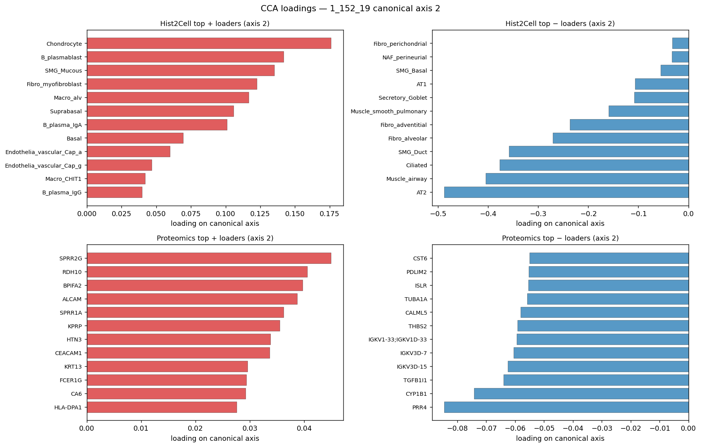
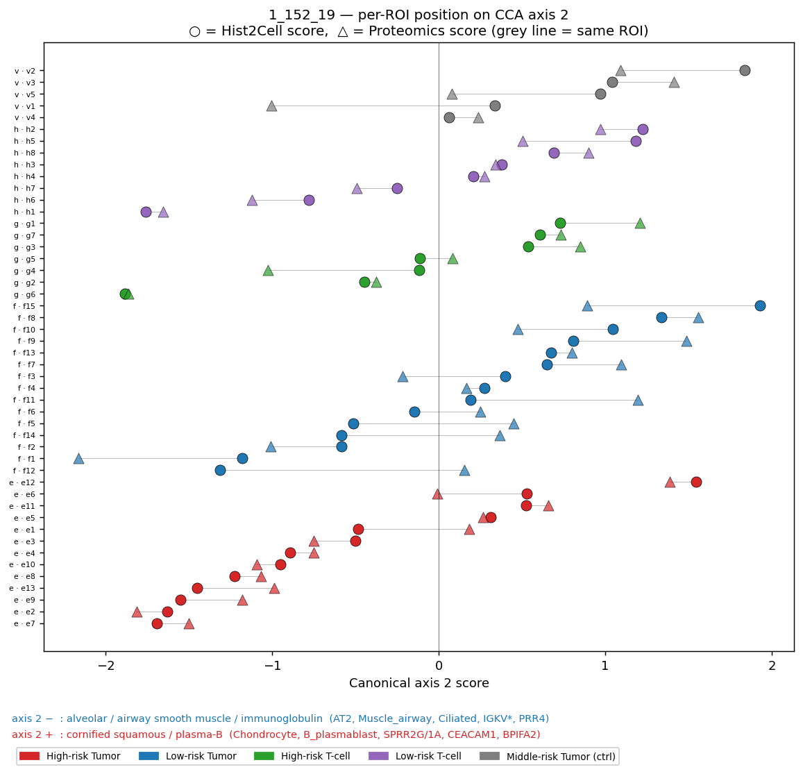
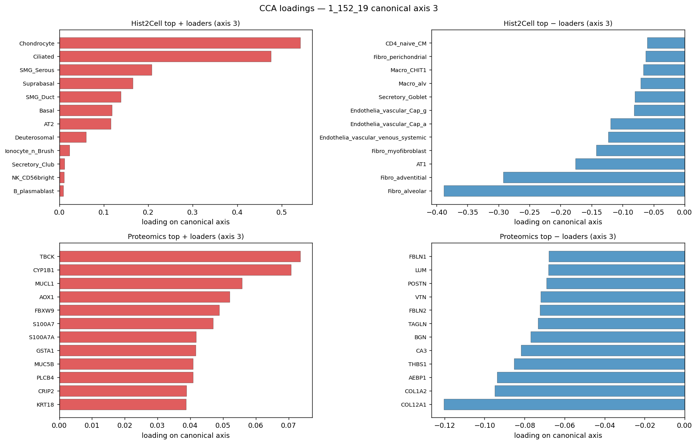
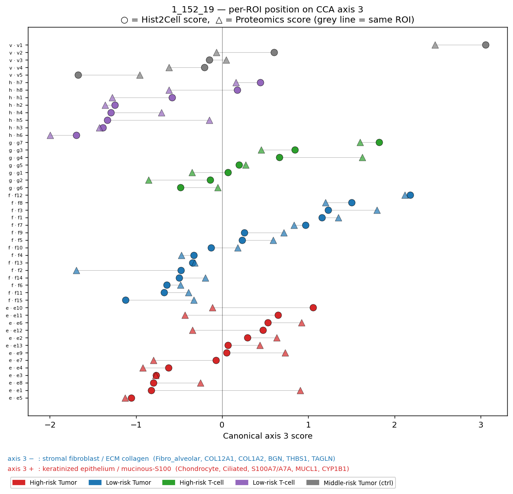

# slide2 (1_152_19) — 연관성 분석

## 이 문서가 무엇인지

`summary.md` 의 CCA·per-ROI cosine 결과를 바탕으로 한 발 더 들어가
**"두 modality 가 같은 ROI 구조를 본다"** 라는 직관 자체를 여러 각도에서
정량 검정한 보조 보고서.

검정 4가지:
1. **Side-by-side UMAP** — 두 modality 가 같은 section 그룹화 패턴을 보는가
2. **Joint UMAP (CCA 정렬 후)** — 같은 ROI 의 두 점이 같은 위치로 떨어지는가
3. **Silhouette + intra/inter ratio** — section 라벨이 양쪽 modality 에서 cluster 를 만드는가
4. **Mantel test** — 두 modality 의 ROI×ROI 거리 행렬이 서로 일치하는가

분석 방식·해석 틀은 slide1
(`../../1_085_12/proof_ver2/연관성_분석.md`) 과 동일. 본 문서는 slide2
의 수치·그림과 슬라이드별 차이만 기술.

---

## 1. Side-by-side UMAP — 가장 직관적

**그림 읽기.**
- 색 코딩: 빨강=High-risk Tumor(e), 파랑=Low-risk Tumor(f),
  초록=High-risk T-cell(g), 보라=Low-risk T-cell(h), 회색=Middle-risk
  Tumor 대조군(v).
- **왼쪽 (Hist2Cell UMAP)** — 빨강(e)은 좌측·아래에 흩어지고, 초록(g)
  이 우상단에 별도 cluster, 보라(h) 가 가운데 위쪽, 파랑(f) 이 전체에
  분포. **e ↔ g 분리는 또렷**.
- **오른쪽 (Proteomics UMAP)** — 빨강(e) 이 오른쪽 위에 모이고, 초록(g)
  이 아래 cluster, 보라(h) 가 왼쪽 아래. **양쪽 UMAP 모두 e/g 분리는
  공통적으로 잘 잡힌다**.

**결론.** slide1 과 비교해도 **양쪽 UMAP 사이 구조 일치가 더 명확**.
두 modality 가 비슷한 section 그룹화 패턴을 본다는 직관 증거.

---

## 2. Joint UMAP after CCA alignment — borderline

**그림 읽기.**
- median pair distance = **0.75** (slide1 의 0.81 보다 조금 가까움).
- 초록(g)·보라(h) ○△ 짝이 왼쪽 아래 영역에 비교적 가까이 모임. 빨강(e)
  ·파랑(f)·회색(v) 짝은 우측에 모이는데 일부 짝이 멀리 떨어진다.

**한계.** slide1 과 동일 — "0.75 가 작은 거리다" 라는 정량 주장에는
permutation null 이 별도로 필요하고, 본 그림 단독으로는 정성적 패턴만
보여주는 게 안전.

---

## 3. Silhouette score + intra/inter distance ratio

### 거리 행렬 히트맵

**Hist2Cell 그림 읽기.**
- 빨강(e, n=13) 블록의 좌상단이 비교적 밝음 (= section 내 ROI 가까움).
- **파랑(f) 안에 2개 ROI 가 outlier** — 그 행/열이 다른 모든 ROI 와
  매우 멀어서 검은 가로/세로 띠를 만듦. Low-risk Tumor 안에서도 이질성.
- 초록(g)·보라(h) 영역은 비교적 균등한 색조.

**Proteomics 그림 읽기.**
- 빨강(e) 좌상단은 비교적 밝음.
- **초록(g, High-risk T-cell) 행 전체가 모든 ROI 와 어두움** = g ROI 들이
  proteomics 공간에서 *outlier 처럼* 행동.
- 이 outlier 행 덕에 g ROI 들 사이의 거리도 결국 평균보다 크고, "같은
  section 내가 더 가깝다" 는 통상적 기대가 깨짐 → 아래 silhouette =
  **−0.058** (음수) 의 정체.

### Silhouette null 검정

**그림 읽기.**
- Hist2Cell (왼쪽): null 분포 평균 ≈ −0.11, 빨간 선 +0.036 이 **null
  의 오른쪽 꼬리 바깥**에 명확히 떨어짐 → p = 0.000.
- **Proteomics (오른쪽): 관측 −0.058 이 null 분포 (−0.20~−0.05) 오른쪽
  꼬리 안쪽에 위치**. 시각적으로는 분포에 거의 들어가 있지만, 1000회
  중 4회만이 관측치 이상 → p = 0.004.
- 즉 proteomics 의 신호는 "절대값으로는 음수이지만 우연 대비로는 유의"
  라는 미묘한 케이스.

### 숫자 종합

| modality | silhouette | intra mean | inter mean | intra/inter ratio | p (silhouette) | p (intra/inter) |
|---|---|---|---|---|---|---|
| Hist2Cell | **+0.036** | 9.64 | 12.34 | **0.781** | <0.001 | <0.001 |
| Proteomics | **−0.058** | 69.15 | 83.53 | 0.828 | 0.004 | <0.001 |

**해석.**
- intra/inter ratio 는 두 modality 모두 < 1 → section 내가 section 간
  보다 가깝다는 *방향성* 은 양쪽에서 유지됨.
- 하지만 **proteomics silhouette 가 음수** = ROI 단위로 보면 같은
  section 의 ROI 들이 *오히려 평균적으로 더 멀다*. 이는 위 거리 히트맵
  에서 본 g 행 outlier 와 일치.
- 즉 slide2 의 proteomics 는 **section 라벨 자체가 cluster 를 만들지
  못함** — 단, 우연 분포와 비교하면 그 약한 신호조차 우연 이상.
- Hist2Cell 은 slide1 (+0.067) 보다 약간 약하지만 (+0.036) 여전히 명확
  히 양수 + 유의.

---

## 4. Mantel test — 가장 직접적인 cross-modality 검정

**그림 읽기 (왼쪽 패널).**
- 1128 ROI 쌍의 (Hist2Cell 거리, proteomics 거리) 산점도.
- 빨강 = 같은 section, 회색 = 다른 section. **빨강이 좌하단에 모이긴
  하지만 slide1 보다는 분산이 더 큼** — 회귀선의 기울기도 slide1 보다
  완만함.

**그림 읽기 (오른쪽 패널).**
- null 분포: 평균 −0.003, 95% [−0.140, +0.164].
- 관측 Pearson r = +0.163 → **null 95% 상한 (+0.164) 과 거의 같은 위치**.
  empirical p = 0.027 (보더라인).
- Spearman ρ = +0.212 → 단조 관계 기준으로는 더 명확히 유의 (p=0.003).

### 숫자

| 지표 | 값 | 영가설 95% 구간 | empirical p |
|---|---|---|---|
| Pearson r | **+0.163** | [−0.140, +0.164] | 0.027 |
| Spearman ρ | **+0.212** | — | 0.003 |

**해석.**
- 두 modality 거리가 양의 상관 — 같은 방향성. 단 **Pearson 은 보더
  라인** (p=0.027, null 95% 상한과 거의 동일).
- Spearman 이 더 분명히 유의 → 두 modality 의 거리는 *비례 관계는
  약하지만 단조 증가 관계* 가 더 명확. 즉 "거리 자체의 값이 비례"
  하지는 않아도 "어느 쌍이 더 가까운지의 *순서*"는 더 잘 일치.

---

## 4가지 검정 + summary.md 의 결과 종합

| 검정 | 측정하는 것 | slide2 결과 | 강도 |
|---|---|---|---|
| CCA top r (summary.md) | 두 modality 의 *잠재 축* 일치 | +0.94 | **매우 강함** |
| Per-ROI cosine (summary.md) | 두 modality *벡터* 일치 | +0.559 | 강함 |
| **Mantel r** | 두 modality 의 *상대 거리 구조* 일치 | **+0.163 (Pearson) / +0.212 (Spearman)** | 모더릿 (보더라인) |
| Silhouette (Hist2Cell / Proteomics) | section 라벨 *cluster 강도* | +0.036 / **−0.058** | 약함 |

→ slide1 과 비교했을 때 **CCA·cosine 의 강한 신호는 동일하게 재현되고,
fine-grained Mantel·silhouette 의 신호는 slide1 보다 더 약함**. 특히
proteomics silhouette 가 음수가 된 것은 g(High-risk T-cell) ROI 가
outlier 로 행동하는 것이 큰 원인.

---

## slide1 과의 비교

| 지표 | slide1 (1_085_12) | slide2 (1_152_19) |
|---|---|---|
| N ROIs | 46 | 48 |
| H2C silhouette | +0.067 | +0.036 |
| Pro silhouette | +0.016 | **−0.058** |
| H2C intra/inter | 0.672 | 0.781 |
| Pro intra/inter | 0.785 | 0.828 |
| Mantel Pearson r | +0.204 | +0.163 |
| Mantel Spearman ρ | +0.207 | +0.212 |

**관찰.** 모든 fine-grained 지표에서 slide2 < slide1. 가장 큰 차이는
slide2 proteomics 의 silhouette 가 음수가 된 것 — slide2 의 High-risk
T-cell (g) 영역이 proteomics 측에서 *내부적으로도 이질적인* 양상.

단 CCA / per-ROI cosine 같은 *전역·벡터 수준* 신호는 두 슬라이드가
거의 동일 (r=+0.94, cosine=+0.56). 즉 **큰 그림은 두 슬라이드에서 일관
되게 유지되지만, ROI 수준의 fine-grained 일치 강도는 슬라이드마다
다르다**.

---

## 5. CCA 축의 샘플 단위 해석 (axis 1 / 2 / 3)

각 canonical axis 의 ± 방향이 어떤 조직 모듈인지 loadings 로 라벨링하고,
각 section 의 ROI 들이 그 축 위 어느 방향으로 치우치는지 정량적으로 본다.
axis 별 dumbbell plot 은 ○ (Hist2Cell score) 와 △ (Proteomics score) 짝의
거리로 두 modality 의 ROI-level 일치도를 보여주고, loadings 그림은
각 축의 ± 극단을 만드는 상위 cell type / gene 을 나열한다.

`cca_section_means.png` 는 3개 axis 의 section 평균 ± 1 SD 를 한 장에
모은 overview:

**slide1 과의 부호 관계 (참고).** slide1 의 axis 1 + (상피·선) 이
slide2 의 axis 1 − (선상피·분비) 과 같은 모듈, slide1 의 axis 1 −
(면역·혈관·기질) 이 slide2 의 axis 1 + (혈관·평활근·혈액) 과 같은 모듈.
즉 두 슬라이드가 같은 조직 구성 main axis 를 인코딩하되 부호만 반대.

---

### Axis 1 (r = +0.940) — 선상피·분비·대사 ↔ 혈관·평활근·혈액

**loadings (axis 1 ± 모듈 라벨)**

| 방향 | Hist2Cell 상위 loader | Proteomics 상위 loader | 모듈 해석 |
|---|---|---|---|
| **axis 1 +** | **Muscle_smooth_syst_arterial (+0.62)**, Muscle_airway, Muscle_smooth_pulmonary, Macro_alv, Ciliated, NAF_perineurial | **OGN, COL14A1, DPT, PRELP, COL1A1** (collagen + SLRP) + **HBA1/HBB/HBD/HBG2** (헤모글로빈) + SLC4A1, CA1 | **혈관·평활근·혈액 + 기질 collagen** |
| **axis 1 −** | **SMG_Serous (−0.45)**, Fibro_adventitial, SMG_Duct, Fibro_myofibroblast, Myoepithelial, AT1/AT2 | **CRYAB, KRT7** (상피 cytokeratin/chaperone) + **PHGDH, PYCR1, ISYNA1** (serine/proline/inositol 생합성) + NUDT19, MGST1 | **선상피·분비·증식대사** |

(원본 그림: `cca_loadings_axis1.png` — `summary.md §3` 참조)

**ROI 단위 위치**

**Section 별 axis 1 평균** (H2C / Pro, n)

| section | label | n | H2C | Pro | 격차 |
|---|---|---|---|---|---|
| e | High-risk Tumor | 13 | **−0.56** | **−0.59** | 0.03 |
| f | Low-risk Tumor | 15 | −0.39 | −0.40 | 0.01 |
| g | High-risk T-cell | 7 | **+1.93** | **+1.86** | 0.07 |
| h | Low-risk T-cell | 8 | +0.29 | +0.38 | 0.09 |
| v | Middle-risk Tumor (ctrl) | 5 | −0.54 | −0.46 | 0.08 |

**해석**

- **Tumor 계열 ROI 들 (e / f / v, 합 33개) 은 axis 1 의 음의 방향으로
  치우치는 경향을 보였고, 이 방향은 loading 기준으로 *선상피·분비·대사*
  관련 feature** (SMG_Serous/Duct, KRT7 + PHGDH, PYCR1, ISYNA1) **와
  연관되어 있었다.**
- **T-cell 계열 ROI 들 (g / h, 합 15개) 은 axis 1 의 양의 방향으로
  치우치는 경향을 보였고, 이 방향은 loading 기준으로 *혈관·평활근·혈액
  + 기질 collagen* 관련 feature** (Muscle_smooth_*, OGN/COL14A1 + HBA1/B/D)
  **와 연관되어 있었다.**
- 특히 **g (High-risk T-cell) 는 +1.93 / +1.86 으로 axis 1 + 극단에
  압도적으로 몰린다** — 본 라벨이 단순 면역 침윤이 아니라 *혈관·평활근
  압도적인 종양 가장자리* 를 잡았을 가능성을 시사.
- 5개 section 모두에서 Hist2Cell ↔ proteomics 의 axis 1 평균 격차는
  0.10 이하 (slide1 의 ~0.20 보다 더 깨끗한 일치).

---

### Axis 2 (r = +0.836) — 폐포·기도 평활근·항체 ↔ 각질화 편평·plasma-B

**loadings (axis 2 ± 모듈 라벨)**

| 방향 | Hist2Cell 상위 loader | Proteomics 상위 loader | 모듈 해석 |
|---|---|---|---|
| **axis 2 +** | Chondrocyte, B_plasmablast, SMG_Mucous, Fibro_myofibroblast, Macro_alv | **SPRR2G, SPRR1A** (cornified envelope), RDH10, BPIFA2, ALCAM, KPRP, HTN3, CEACAM1 | **각질화 편평상피·plasma-B·점액 분비** |
| **axis 2 −** | **AT2 (−0.49)**, Muscle_airway, Ciliated, SMG_Duct, Fibro_alveolar, Fibro_adventitial | PRR4, CYP1B1, TGFB1I1, **IGKV3D-15 / IGKV3D-7 / IGKV1-33** (immunoglobulin κ chain), THBS2, CALML5 | **폐포·기도 평활근·항체 (IgG/IgK)** |

**ROI 단위 위치**

**Section 별 axis 2 평균**

| section | label | n | H2C | Pro | 격차 |
|---|---|---|---|---|---|
| e | High-risk Tumor | 13 | **−0.57** | **−0.51** | 0.06 |
| f | Low-risk Tumor | 15 | +0.20 | +0.37 | 0.17 |
| g | High-risk T-cell | 7 | −0.10 | −0.05 | 0.05 |
| h | Low-risk T-cell | 8 | +0.11 | −0.03 | 0.14 |
| v | Middle-risk Tumor (ctrl) | 5 | **+0.85** | +0.36 | 0.49 |

**해석**

- **High-risk Tumor (e, n=13) 는 axis 2 의 음의 방향으로 치우치는 경향
  을 보였고, 이 방향은 loading 기준으로 *폐포·기도 평활근 + 면역
  globulin κ chain* 관련 feature** (AT2, Muscle_airway, Ciliated +
  IGKV* chain, PRR4) **와 연관되어 있었다.**
- **Middle-risk Tumor ctrl (v, n=5) 는 axis 2 의 양의 방향 극단으로
  치우치는 경향을 보였고, 이 방향은 loading 기준으로 *각질화 편평상피·
  plasma-B·점액 분비* 관련 feature** (Chondrocyte, B_plasmablast +
  SPRR2G/1A, BPIFA2, CEACAM1) **와 연관되어 있었다.** 단 v 는 n=5 로
  표본이 작고 SD 가 큼 (그림에서도 v 의 error bar 가 가장 길다) — 결과
  를 단정적으로 일반화하지 말 것.
- → axis 2 는 *대조군 (v) 과 High-risk Tumor (e) 를 정반대 방향으로
  갈라내는 축*. 다만 v 의 H2C ↔ Pro 격차가 0.49 로 axis 1 보다 훨씬
  크므로, "방향성 일치" 까지만 보고하고 magnitude 비교는 피할 것.

---

### Axis 3 (r = +0.811) — 기질·콜라겐 ↔ 각질화·점액·S100

**loadings (axis 3 ± 모듈 라벨)**

| 방향 | Hist2Cell 상위 loader | Proteomics 상위 loader | 모듈 해석 |
|---|---|---|---|
| **axis 3 +** | **Chondrocyte (+0.54)**, **Ciliated (+0.48)**, SMG_Serous, Suprabasal, SMG_Duct, Basal | TBCK, CYP1B1, MUCL1, AOX1, FBXW9, **S100A7 / S100A7A**, GSTA1 | **각질화 상피·점액 + S100 family** |
| **axis 3 −** | **Fibro_alveolar (−0.39), Fibro_adventitial (−0.29)**, AT1, Fibro_myofibroblast, Endothelia_venous, Endothelia_Cap_a/g | **COL12A1 (−0.12), COL1A2, AEBP1, THBS1, CA3, BGN, TAGLN, FBLN2** (모두 stromal/ECM) | **stromal fibroblast·ECM collagen** |

**ROI 단위 위치**

**Section 별 axis 3 평균**

| section | label | n | H2C | Pro | 격차 |
|---|---|---|---|---|---|
| e | High-risk Tumor | 13 | −0.08 | −0.09 | 0.01 |
| f | Low-risk Tumor | 15 | +0.22 | +0.33 | 0.11 |
| g | High-risk T-cell | 7 | **+0.43** | **+0.39** | 0.04 |
| h | Low-risk T-cell | 8 | **−0.86** | **−0.92** | 0.06 |
| v | Middle-risk Tumor (ctrl) | 5 | +0.33 | +0.18 | 0.15 |

**해석**

- **Low-risk T-cell (h, n=8) 는 axis 3 의 음의 방향 극단으로 치우치는
  경향을 보였고, 이 방향은 loading 기준으로 *stromal fibroblast·ECM
  collagen* 관련 feature** (Fibro_alveolar/_adventitial + COL12A1, COL1A2,
  BGN, THBS1, TAGLN) **와 연관되어 있었다.**
- **High-risk T-cell (g, n=7) 와 Low-risk Tumor (f), ctrl (v) 는 axis 3
  의 약한 양의 방향으로 치우치는 경향을 보였고, 이 방향은 loading 기준
  으로 *각질화 상피·점액 + S100 family* 관련 feature** (Chondrocyte,
  Ciliated, SMG_Serous + S100A7/A7A, MUCL1, CYP1B1) **와 연관되어 있었
  다.**
- → axis 3 의 핵심 발견은 **h (Low-risk T-cell) 가 stromal/ECM 풍부한
  영역으로 분리** 된다는 사실. h 는 axis 1 에서는 약한 + (≈ vascular)
  였지만 axis 3 에서는 강한 − (= ECM-rich) 으로, *low-risk T-cell 영역
  이 콜라겐·기질 단백질에 둘러싸인 특성* 을 가짐.
- axis 3 는 r=+0.81 로 axis 2 와 비슷한 강도이며, 모든 section 에서
  H2C ↔ Pro 격차가 0.15 이하로 안정적으로 일치.

---

### Axis 1/2/3 종합 보고 문장

> "두 modality 의 CCA canonical axis 1 은 *선상피·분비·대사 ↔ 혈관·
> 평활근·혈액* 의 main gradient 를 잡았고 (Tumor 계열은 axis 1 −,
> T-cell 계열은 axis 1 +; 특히 g 가 +1.9 로 압도적), axis 2 는 *대조군
> (v) 과 High-risk Tumor (e)* 를 정반대 방향으로 분리하며, axis 3 는
> *Low-risk T-cell (h) 영역이 stromal/ECM 풍부* 하다는 새로운 분리를
> 보여준다. axis 1·3 는 두 modality 가 section 평균 위치를 0.15 이하
> 격차로 일치시키며, axis 2 는 v 에서 격차 0.49 로 보더라인이므로
> magnitude 보다 *방향성 일치* 수준으로 해석한다."

### 산출 파일 (이 섹션)

- `cca_dumbbell_axis1.png`, `cca_dumbbell_axis2.png`, `cca_dumbbell_axis3.png` — axis 별 ROI dumbbell
- `cca_loadings_axis2.png`, `cca_loadings_axis3.png` — axis 2/3 의 ± top loaders
  (axis 1 의 loadings 는 `summary.md` 에서 다룬 `cca_loadings_axis1.png`)
- `cca_section_means.png` — axis 1/2/3 의 section 평균 ± SD
- `cca_scores_per_roi.csv` — 48 ROI × {section, H2C_canon1/2/3, P_canon1/2/3}

---

## 솔직한 마무리

slide1 과 동일한 결론. 측정 수준이 미세해질수록 신호 강도가 약해지는
패턴이 slide2 에서 더 두드러진다.

권장 사용:
- **외부 보고 / 협업자 공유** — `summary.md` 의 CCA + cosine 결과만 인용.
- **방법론 robustness 확인 / 리뷰어 대비** — 본 문서의 Mantel test 가
  가장 직접적인 cross-modality 일치 증거. 단 slide2 의 Pearson 은 보더
  라인이므로 Spearman 까지 같이 보고하는 것이 정직.
- **slide2 의 g (High-risk T-cell) outlier 행동** — proteomics 측에서
  특별히 살펴봐야 할 영역. 향후 추가 분석 시 g ROI 들의 단백질 발현
  outlier 가 무엇인지 점검 가능.

## 산출 파일

| 파일 | 내용 |
|---|---|
| `umap_side_by_side.png` | 두 modality 의 독립 UMAP (section 색) |
| `umap_joint_paired.png` | CCA 정렬 후 joint UMAP (○=H2C, △=Pro, 짝선) |
| `distance_heatmap_hist2cell.png` | Hist2Cell ROI×ROI 거리 행렬 |
| `distance_heatmap_proteomics.png` | Proteomics ROI×ROI 거리 행렬 |
| `silhouette_null.png` | silhouette 관측치 vs 1000-perm 영분포 |
| `intra_inter_summary.csv` | silhouette / intra-inter / p 표 |
| `mantel_scatter.png` | Mantel 산점도 + null 히스토그램 |
| `mantel_summary.csv` | Mantel r (Pearson/Spearman) + p |
| `cca_dumbbell_axis1.png` / `_axis2.png` / `_axis3.png` | ROI 단위 canonical score per axis (H2C vs Pro) |
| `cca_loadings_axis2.png` / `_axis3.png` | axis 2/3 ± top loaders (axis 1 은 summary.md) |
| `cca_section_means.png` | axis 1/2/3 section 평균 ± SD |
| `cca_scores_per_roi.csv` | 48 ROI × canonical score (axis 1/2/3) |
