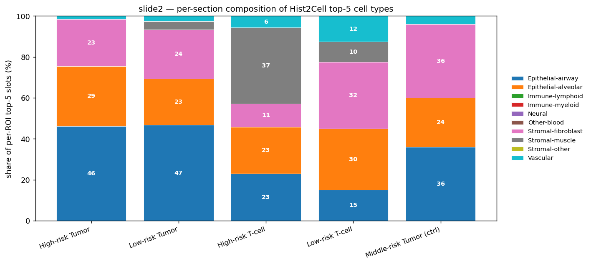
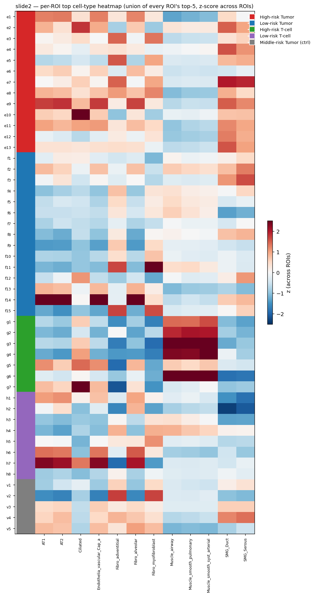

# slide2 (1_152_19) — focused proof (2 claims)

> **이 문서의 범위** — 외부 reviewer 전달용 *최소 증명*. slide1 (`../../1_085_12/proofs/summary.md`) 와 동일한 2-claim 구조. detail (cell_typing CSVs + proteomics CSVs) 은 형제 폴더 참고.
>
> ⚠️ **caveat** — Hist2Cell 가중치는 lung-trained (`humanlung_cell2location_leave_A50_out.pth`). 본 결과는 *lung-derived spatial proxy* 의 cross-modality 검증. label 의 절대 의미는 *cell-type ground truth 아님*. methodology: `../../../analysis/EPITHELIAL_PROXY_METHODOLOGY.md`.

## Section 라벨 (slide2)

| prefix | 의미 | n_ROI |
|---|---|---:|
| e | High-risk Tumor | 13 |
| f | Low-risk Tumor | 15 |
| g | High-risk T-cell | 7 |
| h | Low-risk T-cell | 8 |
| v | Middle-risk Tumor (ctrl) | 5 |
| w | Middle-risk T-cell (ctrl) | 0 (본 pkl 에 없음) |
| **합** | | **48** |

---

## Claim 1 — cross-modality **방향 일치** (correlation magnitude 아님)

### Hist2Cell 측 section_stats (Tumor e vs f, T-cell g vs h)

| comparison | score | mean_a | mean_b | Δ | p |
|---|---|---:|---:|---:|---|
| Tumor (e vs f) | strict | 0.472 | 0.266 | +0.206 | **5.5e-4** ✅ |
| Tumor (e vs f) | broad | 2.553 | 1.828 | +0.725 | **2.8e-3** ✅ |
| Tumor (e vs f) | immune total | 5.220 | 4.060 | +1.160 | **6.5e-4** ✅ |
| T-cell (g vs h) | strict | 0.450 | 0.245 | +0.205 | 0.054 (marginal) |
| T-cell (g vs h) | broad | 2.056 | 2.059 | -0.003 | 0.96 |
| T-cell (g vs h) | immune total | 3.602 | 4.307 | -0.705 | 0.15 |

→ Tumor 3 score 전부 e > f 유의 (slide1 의 a > b 와 동일 패턴). T-cell c/d 는 약함 (slide1 c/d 와 동일).

### Hist2Cell 측 pre-registered marker 가설 (e vs f, 8 개)

`../cell_typing/marker_hypotheses.csv`:

| protein marker | Hist2Cell type | 예측 | 관측 | match | Δ | p_bh |
|---|---|---|---|---|---:|---|
| KIF20A/KIF22/INCENP (mitosis) | Dividing_AT2 | e>f | e>f | ✅ | +0.013 | **8.5e-3** |
| KIF20A/KIF22/INCENP (mitosis) | Dividing_Basal | e>f | e>f | ✅ | +0.065 | **8.2e-3** |
| KIF20A/KIF22/INCENP (mitosis) | Basal | e>f | e>f | ✅ | +0.128 | **8.5e-3** |
| MYH11/TAGLN (smooth muscle) | Muscle_smooth_syst_arterial | e>f | **e<f** | ❌ | -0.180 | **0.023** |
| MYH11/TAGLN (smooth muscle) | Muscle_smooth_pulmonary | e>f | **e<f** | ❌ | -0.100 | **0.011** |
| MYH11/TAGLN (smooth muscle) | Muscle_airway | e>f | **e<f** | ❌ | -0.199 | **9.4e-3** |
| generic active Tumor | AT2 | e>f | e>f | ✅ | +0.405 | **0.021** |
| generic active Tumor | Suprabasal | e>f | e>f | ✅ | +0.114 | **8.5e-3** |

→ **5/8 예측 방향 일치, 3/8 명확히 반대 방향** (smooth muscle 그룹). slide1 의 8/8 일치보다 약함.

### Proteomics 측 pre-registered marker (e vs f)

`../proteomics/marker_hypothesis_check.csv`:

| gene | 예측 | 관측 | match | log2FC | p | p_bh |
|---|---|---|---|---:|---|---|
| **MYH11** | e>f | e>f | ✅ | +0.667 | 2.3e-3 | 0.46 |
| KIF22 | e>f | e>f | ✅ | +0.101 | 0.49 | 0.88 |
| INCENP | e>f | e>f | ✅ | +0.317 | 0.057 | 0.62 |
| KIF20A | e>f | **e<f** | ❌ | -0.015 | 0.97 | 1.00 |
| TAGLN | e>f | **e<f** | ❌ | -0.034 | 0.83 | 0.98 |
| APOBEC3C | e>f | **e<f** | ❌ | -0.283 | 0.20 | 0.72 |
| NCAM1 | e>f | (filtered) | — | — | — | — |

→ Proteomics 측: **3/7 measured marker 만 예측 방향 일치**. 신호 자체도 약함 (slide2 e vs f 의 0 gene 이 BH<0.05; slide1 은 248). MYH11 만 raw p=0.002 (BH=0.46 보정 후 not significant).

### 직접 cross-modality 일관성

| 마커 | Hist2Cell 결과 (e vs f) | Proteomics 결과 (e vs f) | modality 간 일치 |
|---|---|---|---|
| KIF20A/22/INCENP (mitosis) ↔ Dividing_AT2/Basal/Basal | e>f (BH<.01) ✅ | KIF22/INCENP 방향만 같음 (BH ns), KIF20A 반대 | 부분 일치 |
| **MYH11/TAGLN ↔ Stromal-muscle types** | **e<f (BH<.05)** ❌ | MYH11 e>f (BH=0.46), TAGLN e<f (ns) | **modality 간 반대** |
| generic Tumor ↔ AT2/Suprabasal | e>f (BH<.05) ✅ | — | — |

**slide1 과 다른 점**:
- slide1: 8/8 Hist2Cell + 2/2 measured proteomics 모두 매치, 248 BH<.05 proteomics gene → robust
- slide2: 5/8 Hist2Cell + 3/7 measured proteomics 매치, 0 BH<.05 proteomics gene → weaker
- slide2 의 **smooth muscle 신호는 두 modality 간 *방향 반대*** (Hist2Cell e<f, proteomics MYH11 e>f). 보고서에 명시 필요.

### 결론 (Claim 1, slide2 정직 표현)

> *Tumor 영역의 risk axis (High-risk e vs Low-risk f) 에서 Hist2Cell 의 3 score (strict / broad / immune total) 모두 e>f 방향 통계적 유의 (p<.01)*. 사전 등록한 8 marker 가설 중 *5/8 일치, 3/8 반대* (smooth muscle 그룹). Proteomics 측 신호는 slide1 대비 약하나, MYH11 등 일부 마커의 방향성은 예측에 부합. 본 슬라이드는 *cross-modality 부분 일치* — slide1 처럼 8/8 완전 일치는 안 나옴. *Correlation magnitude* 차원의 정량 검증은 두 슬라이드 모두 lung-Hist2Cell 한계로 결론 미도출 — breast-trained 모델 (CUCA her2st) 이후 가능.

(부수: `cross_modality_correlations.csv` 의 Tumor compartment 내부 r 도 0.18-0.36 정도, slide1 과 비슷한 *moderate*.)

---

## Claim 2 — 각 ROI 의 high-expression cell type 정리

### 예시 (`roi_top_celltypes.csv` 의 48 행 중 일부)

| tube | section | top1 | top2 | top3 |
|---|---|---|---|---|
| e1 | High-risk Tumor | AT2 (2.25) | Ciliated (2.09) | Fibro_alveolar (1.91) |
| e10 | High-risk Tumor | Ciliated (4.54) | AT2 (1.82) | Fibro_adventitial (1.65) |
| f1 | Low-risk Tumor | Fibro_adventitial (2.27) | SMG_Duct (1.95) | AT2 (1.61) |
| g1 | High-risk T-cell | Muscle_smooth_pulmonary (2.21) | Fibro_adventitial (2.14) | Muscle_smooth_syst_arterial (2.07) |
| h1 | Low-risk T-cell | AT2 (1.66) | Fibro_alveolar (1.41) | Fibro_adventitial (1.34) |
| v1 | Middle Tumor | Ciliated (2.18) | AT2 (1.91) | SMG_Duct (1.74) |

### Per-section top-5 group 구성 (%)

| section | Epi-airway | Epi-alveolar | Immune-lymphoid | Immune-myeloid | Stromal-fibroblast | Stromal-muscle | Vascular |
|---|---:|---:|---:|---:|---:|---:|---:|
| High-risk Tumor (e) | 46.2 | 29.2 | **0.0** | **0.0** | 23.1 | 0.0 | 1.5 |
| Low-risk Tumor (f) | 46.7 | 22.7 | **0.0** | **0.0** | 24.0 | 4.0 | 2.7 |
| High-risk T-cell (g) | 22.9 | 22.9 | **0.0** | **0.0** | 11.4 | **37.1** | 5.7 |
| Low-risk T-cell (h) | 15.0 | 30.0 | **0.0** | **0.0** | 32.5 | 10.0 | 12.5 |
| Middle Tumor (v) | 36.0 | 24.0 | **0.0** | **0.0** | 36.0 | 0.0 | 4.0 |

### 해석

**모든 section 의 top-5 가 Epithelial + Stromal + Vascular dominant, Immune 0% across**. lung-Hist2Cell 의 epithelial-bias 가 slide1 과 동일하게 나타남.

**slide2 특이 패턴**: 
- **High-risk T-cell (g) 의 Stromal-muscle 비율 37%** ← slide1 c/d 는 0% / 2%. slide2 g 는 g1 의 top-1 이 Muscle_smooth_pulmonary 같은 경우가 다수 → 본 영역이 *smooth muscle-rich anatomical 위치* 일 가능성.
- 이 패턴은 *Hist2Cell 의 Muscle_smooth_* 가 high-risk T-cell 에 더 강함* → slide2 의 marker-hypothesis 의 "MYH11/TAGLN ↔ Stromal-muscle 의 e<f" 와 일관 (smooth muscle 신호가 high-risk T-cell 영역에 분포해서 Tumor compartment 의 e vs f 비교에서 약하게 나타남).

### ROI 별 top cell type heatmap

---

## slide2 결론

1. **Cross-modality 방향 일치 (Claim 1, 부분)**: Hist2Cell 3 score 모두 Tumor e>f 통계적 유의 (p<.01). 사전 등록 8 marker 중 **5/8 Hist2Cell 일치 + 3/8 반대** (smooth muscle 그룹), Proteomics 측 3/7 일치 + 신호 자체 약함 (0 BH<.05). slide1 대비 일관성 약화 — 특히 smooth muscle 의 modality 간 *반대 방향* 이 핵심 한계.
2. **47 ROI top-5 정리 (Claim 2)**: slide1 과 동일하게 모든 section 이 Epithelial-airway / -alveolar + Stromal-fibroblast / -muscle + Vascular dominant. **High-risk T-cell (g) 의 Stromal-muscle 37%** 는 slide1 c/d 에 없던 신호 — slide2 의 g 영역이 *smooth muscle-rich anatomy* 위치인 정황.

---

## 산출물 inventory

### cell_typing/
- `analyze.py`
- `roi_signatures.csv` (48 × 80 + scores)
- `roi_spot_counts.csv`
- `section_stats.csv`
- `per_celltype_wilcoxon.csv` (80-row, 71/80 BH<.05)
- `marker_hypotheses.csv` (8 가설, 5/8 매치)

### proteomics/
- `analyze.py`
- `tumor_e_vs_f_genes.csv` (per-gene Wilcoxon)
- `tcell_g_vs_h_genes.csv` (per-gene Wilcoxon)
- `marker_hypothesis_check.csv` (7 markers, 3 measured matching)

### proofs/
- `core_proofs.py`
- `cross_modality_correlations.csv`
- `cross_modality_scatter.png`
- `roi_top_celltypes.csv`
- `roi_top_celltypes_heatmap.png`
- `section_group_composition.csv`
- `section_group_composition.png`
- `summary.md` (이 문서)

## 관련 문서

- slide1 (1_085_12) summary: `../../1_085_12/proofs/summary.md`
- 방법론: `../../../analysis/EPITHELIAL_PROXY_METHODOLOGY.md`, `../../../analysis/MORAN_R_METHODOLOGY.md`
- ROI PDF: `../../메테오바이오텍_1_152_19_ROI_추출_결과.pdf`
- proteomics PDF: `../../proteomics_분석.pdf`
