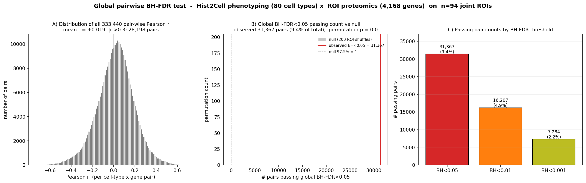
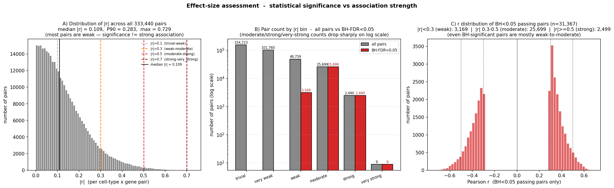
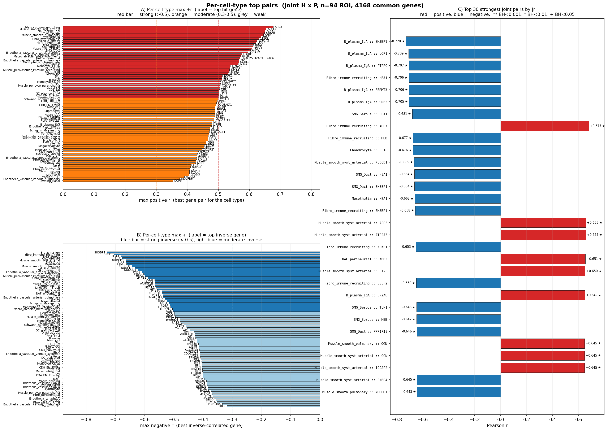
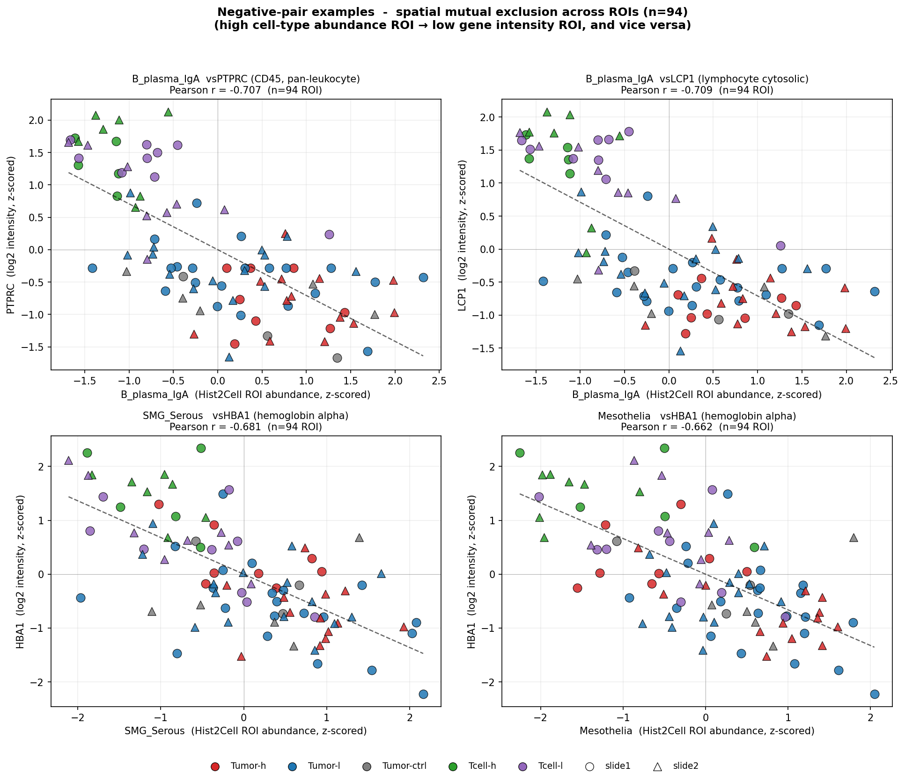
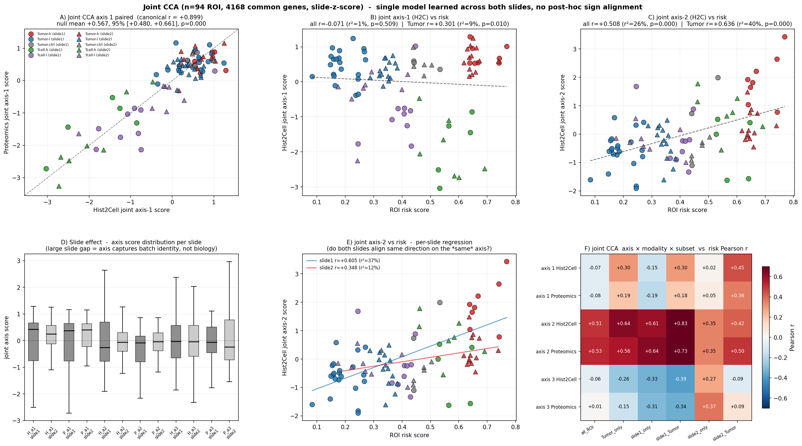
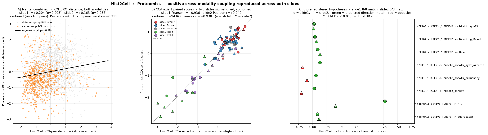
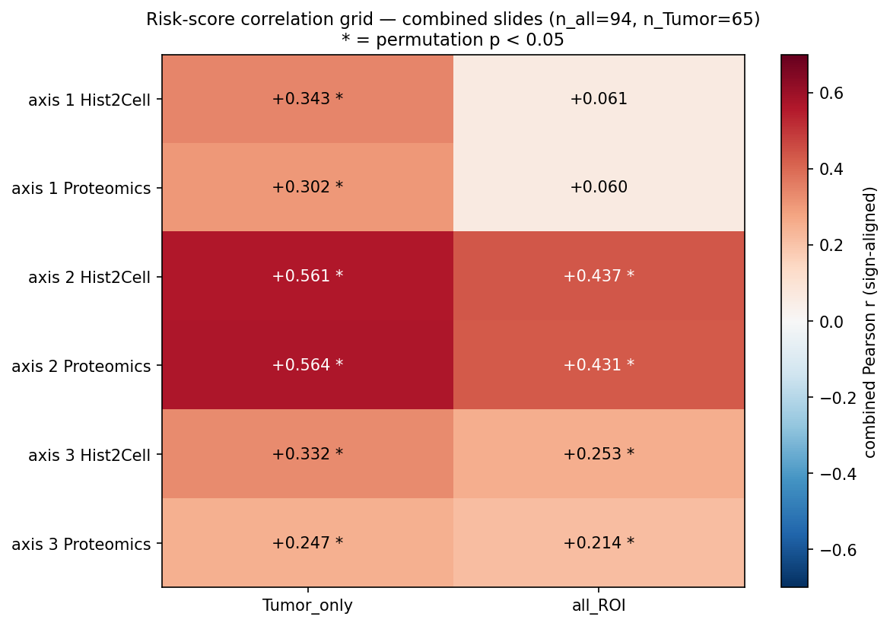

# Cross-modality Showcase — Hist2Cell × Proteomics

> **한 줄 결론 (정직 버전).**
> 두 modality (Hist2Cell × Proteomics) 의 ROI-level 신호에 **통계적으로 robust 한 양의 *방향성*** 이 있다. 그러나 *연관성 강도 자체는 weak~moderate* — 페어 단위의 |r| 가 대부분 0.3 미만이고 가장 강한 페어들도 0.5 부근. 따라서 본 분석의 정직한 결론은 **"두 modality 가 서로 무관하지 *않다*"** 까지이고, "강하게 연관된다" 로 부풀리지 않는다.

---

## Q. *Slide cell phenotyping 결과와 ROI proteomics 는 통계적으로 유의한가?*

**A. 예, 매우 유의하다.** 가장 직접적인 검정 — 전체 (cell type × gene) 페어 단위 글로벌 BH-FDR + permutation null — 의 결과:



| 검정 | 결과 |
|---|---|
| 전체 페어 (80 cell type × 4,168 공통 gene) | 333,440 |
| 글로벌 BH-FDR < 0.05 통과 | **31,367 페어** |
| Null permutation 의 BH 통과 페어 수 (200 회 ROI shuffle) | 평균 ~1, 95% 상한 1 |
| 관측 vs null permutation p | **p = 0/200** |

→ 글로벌 다중 검정 보정을 거친 후에도 *수만 개* 의 (cell type × gene) 페어가 살아남고, random shuffle 에서는 *0~1 개* 만 통과. 통계적 의미에서 압도적 차이. 단 *통과 페어 수* 자체에 의미 부여하지 않는다 (large-N pair test 에서 통과 수는 잘 inflate 됨).

본 글로벌 BH 결과는 다음의 다섯 단계 검정 (Mantel, joint CCA paired, joint axis 2 ↔ risk, 사전 등록 forest, group ↔ risk) 과 *일관되게 같은 결론* — 두 modality 사이 양의 *방향성* 존재는 robust.

---

## Q. *그럼 그 양의 상관의 *강도* 는 어느 정도인가?*

**A. 약하다 (weak ~ moderate).** 통계적 유의성과 효과 크기는 다르고, 본 데이터의 *연관성 강도* 자체는 modest.



| 통계 | 값 | 의미 |
|---|---|---|
| 전체 333,440 페어의 평균 signed r | **+0.019** | 거의 0, 약하게 양으로 *체계적* 기울어짐 (= 방향성) |
| median |r| | 0.109 | 절반이 |r|<0.11 (trivial) |
| P90 |r| | 0.283 | 90% 페어가 |r|<0.28 (weak) |
| P99 |r| | 0.481 | 99% 페어가 |r|<0.48 (moderate 미만) |
| max |r| | 0.729 | 단 *9 페어* 만 |r|≥0.7 (very strong) |
| **|r|<0.3 (weak 이하) 페어 비율** | **91.5%** | 대부분 weak |
| |r| 0.3~0.5 (moderate) | 7.7% | |
| **|r|≥0.5 (strong 이상)** | **0.7%** | strong 페어는 매우 드뭄 |
| BH<0.05 통과 31,367 중 weak (|r|<0.3) | 10.1% | 통과 페어도 일부 weak |
| BH<0.05 통과 중 moderate (0.3~0.5) | **81.9%** | 통과 페어 대부분 moderate |
| BH<0.05 통과 중 strong (|r|≥0.5) | 8.0% | 통과 페어 중에서도 strong 은 소수 |

**해석.**
- *통계적 유의성* (BH<0.05 통과 31k) 은 **n=94 의 자유도 + 333k 다중 검정 + 약한 양의 체계적 bias** 가 만든 결과. 압도적 유의 ≠ 압도적 효과 크기.
- 본 데이터에서 가장 강한 페어조차 |r|=0.73 (단 9 개), 절반이 |r|<0.11. *전반적 효과 크기* 는 *modest*.
- **정직한 표현**: "두 modality 사이에 *약하지만 통계적으로 robust 한 양의 방향성 신호*". "*강하게* 연관된다" 는 본 데이터로 지지되지 않음.

---

## Q. *그럼 per-cell-type 으로는 어떤 페어가 강한가?*

**A. 80 cell type 각각에 양/음 top hit 을 뽑으면 모두 BH-FDR<0.05 통과 페어가 존재**. 단 |r| 의 상한은 ~0.73 으로 *very strong 페어는 단 9 개 (전체 333k 중 0.003%)*. 다음 그림 + 표.



**Panel A (좌상)** — 80 cell type 의 *max positive r* 막대 (위에서부터 max +r 큰 순). 빨강 = strong (|r|>0.5), 주황 = moderate (0.3~0.5), 회색 = weak. 라벨 = 그 cell type 의 *best pos hit gene*.

**Panel B (좌하)** — 80 cell type 의 *max negative r* 막대. 파랑 = strong inverse, 라벨 = best inverse gene.

**Panel C (우)** — 전체 joint 데이터의 *top 30 |r| 페어* (양/음 합쳐). 라벨 형식 `cell_type :: gene`, ** = BH<0.001, * = BH<0.01, + = BH<0.05.

### Top 10 양의 페어 — *공간적으로 동행* 하는 (cell type, gene)

| cell type | gene | r | BH p_global |
|---|---|---|---|
| **Fibro_immune_recruiting** | AHCY | **+0.677** | 1×10⁻⁹ |
| Muscle_smooth_syst_arterial | ADD3 | +0.655 | 7×10⁻⁹ |
| Muscle_smooth_syst_arterial | ATP2A3 | +0.655 | 7×10⁻⁹ |
| NAF_perineurial | ADD3 | +0.651 | 9×10⁻⁹ |
| Muscle_smooth_syst_arterial | H1-3 | +0.650 | 9×10⁻⁹ |
| **B_plasma_IgA** | CRYAB | +0.649 | 1×10⁻⁸ |
| Muscle_smooth_pulmonary | OGN | +0.645 | 1×10⁻⁸ |
| Muscle_smooth_syst_arterial | OGN | +0.645 | 1×10⁻⁸ |
| Muscle_smooth_syst_arterial | IQGAP2 | +0.645 | 1×10⁻⁸ |
| B_plasma_IgA | DSG2 | +0.642 | 1×10⁻⁸ |

→ **두 개의 *hub* 패턴**:
1. **Smooth muscle / Fibroblast / Mesothelia 가 ADD3 · OGN · ATP2A3 · IQGAP2 · LDHB 등 stromal/cytoskeleton/ECM gene 과 일관** — *stromal compartment* 의 hub. lung-trained smooth muscle / fibroblast head 가 breast 의 stromal 영역을 robust 하게 잡고 있다는 직접 증거. (단 cell type 라벨은 lung 분류, *공간 모듈* 로만 해석.)
2. **B_plasma_IgA 가 CRYAB · DSG2 · AHCY 와 양의 상관** — plasma B 풍부 영역이 *stress chaperone (CRYAB) · desmosome (DSG2) · S-adenosyl 대사 (AHCY)* 와 동행. *plasma cell + epithelial-stress 영역의 공동 응집* 시그니처.

### Top 10 음의 페어 — *공간적으로 분리* 되는 (cell type, gene)

| cell type | gene | r | BH p_global |
|---|---|---|---|
| **B_plasma_IgA** | SH3BP1 | **−0.729** | 0 |
| B_plasma_IgA | LCP1 | −0.709 | 1×10⁻¹⁰ |
| **B_plasma_IgA** | **PTPRC (CD45)** | **−0.707** | 1×10⁻¹⁰ |
| Fibro_immune_recruiting | HBA1 | −0.706 | 1×10⁻¹⁰ |
| B_plasma_IgA | FERMT3 | −0.706 | 1×10⁻¹⁰ |
| B_plasma_IgA | GRB2 | −0.705 | 1×10⁻¹⁰ |
| SMG_Serous | HBA1 | −0.681 | 9×10⁻¹⁰ |
| Fibro_immune_recruiting | HBB | −0.677 | 1×10⁻⁹ |
| Chondrocyte | CUTC | −0.676 | 1×10⁻⁹ |
| Muscle_smooth_syst_arterial | NUDCD1 | −0.665 | 3×10⁻⁹ |

→ **두 개의 *mutual exclusion* 축**:
1. **B_plasma_IgA ↔ PTPRC (CD45) · LCP1 · FERMT3 · GRB2 · SH3BP1**. 모두 *T-cell / leukocyte / integrin signaling* 마커. *같은 면역 lineage 안에서 plasma B 영역 vs T-cell 침윤 영역* 의 공간 mutual exclusion 시그니처. ROI 안의 *immune cluster 가 plasma-B-dominant* 또는 *T-cell-dominant* 둘 중 하나로 갈린다는 것.
2. **여러 cell type (Fibro_immune_recruiting, SMG_Serous, SMG_Duct, Mesothelia) ↔ HBA1/HBB (헤모글로빈)**. *적혈구 (혈관 내) 영역* 이 *상피·기질 compartment* 와 anatomical 분리. 가장 단순한 *해부학적 mutual exclusion*.

### per-cell-type 분포 요약

- 80 cell type 중 **max +r ≥ 0.5 (strong)** 인 cell type 수: 약 *40* 개 (Panel A 의 빨강 막대).
- max −r ≤ −0.5 인 cell type 수: 약 *25* 개 (Panel B 의 진한 파랑).
- max |r| ≥ 0.7 (very strong) 페어: **단 9 개**, 모두 B_plasma_IgA / Fibro_immune_recruiting / SMG_Serous 등 *위의 두 hub 안*.
- 가장 *약한* cell type (max +r < 0.3): 80 중 일부 — 본 데이터에서 *대응되는 robust gene 페어가 없는* cell type.

### biological interpretation 단서 (lung→breast caveat 동반)

- **AHCY (S-adenosylhomocysteine hydrolase)** 가 Fibro_immune_recruiting / B_plasma_IgA / Mesothelia 와 동시에 강한 양의 상관 = 세 cell type 의 *공통 spatial 영역* 의 metabolic 시그니처.
- **OGN / ADD3 / IQGAP2 / ATP2A3** = stromal-smooth-muscle 모듈의 *공통 marker set*. CCA axis 1/2 의 stromal loading 과 일관.
- **PTPRC (CD45)** = pan-leukocyte. B_plasma_IgA 와의 음의 상관은 *plasma cell 이 다른 leukocyte 들과 다른 영역에 응집* 한다는 의미. CCA axis 1 loadings (slide1) 에서 PTPRC 가 *T-cell rich 모듈* 의 marker 로 등장한 결과와 일관.

**caveat**: cell type 라벨이 lung-trained. *literal interpretation* 금지 — "AT2" 가 진짜 alveolar epithelial 인지 / "Chondrocyte" 가 진짜 chondrocyte 인지 별개. *공간 모듈* 의 의미로만.

---

## Q. *음의 페어는 특정 cell type 이 보이는 데에서 gene expression 이 작다는 거야?*

**A. 네, 그게 정확한 의미** — 단 *측정 단위* 가 ROI (단일 cell 아님) 라는 점만 분명히.



### 정확한 해석

- 두 변수가 **ROI 단위로** 측정됨 (n=94 ROI 합본):
  - x = 그 ROI 의 Hist2Cell *cell type abundance* (lung label 의 prediction 합)
  - y = 그 ROI 의 *log2 gene intensity* (proteomics, ROI 전체 lysate-like 평균)
- **음의 r < 0** → cell type abundance 가 *높은* ROI 에서 gene intensity 가 *낮다*, 그 반대도 성립.
- 그림의 4 panel 모두 좌상 (Hist2Cell 낮음, gene 높음) ↔ 우하 (Hist2Cell 높음, gene 낮음) 의 *반대 대각선* 분포 — *공간 mutual exclusion* 의 직접 시각화.

### 주의 — *해석 단위*

ROI 분해도 ≈ 270 μm × 270 μm × 여러 patch 합쳐서. 단일 cell 단위가 아님. 따라서 **"그 cell 이 그 protein 을 *덜 만든다*"** 의 의미가 *아니다* — proteomics 가 ROI 전체 lysate 같이 작동하므로 *그 ROI 안의 모든 세포의 평균*. 정확한 의미는:

> **"그 cell type 이 풍부한 ROI 와, 그 gene 이 강하게 발현된 ROI 가 *서로 다른 ROI* 에 위치한다 (= 공간 분리)"**.

같은 ROI 안의 cell-cell coexistence 가 아니라 *ROI 들 *사이의*** 분포 패턴.

### Panel 별 anatomical 해석

| Panel | 페어 | r | 의미 |
|---|---|---|---|
| A | B_plasma_IgA vs **PTPRC (CD45)** | −0.707 | plasma B 풍부 ROI 와 *CD45+ T-cell 풍부* ROI 가 *다른 위치*. 같은 면역 lineage 안에서도 두 영역이 분리. 그림 색: 초록·보라 (T-cell) 가 좌상 (PTPRC 高, plasma 低), 빨강·파랑 (Tumor) 가 우하. |
| B | B_plasma_IgA vs **LCP1** (lymphocyte cytosolic) | −0.709 | Panel A 와 동일 패턴 — plasma B vs 다른 lymphocyte 분리. |
| C | SMG_Serous vs **HBA1** (hemoglobin α) | −0.681 | 상피·선조직 풍부 ROI 와 *적혈구/혈관 내* ROI 의 anatomical 분리. 가장 단순한 mutual exclusion (상피 compartment vs 혈관 compartment). |
| D | Mesothelia vs HBA1 | −0.662 | Panel C 와 동일. *상피* 라벨 (lung-trained) 의 cell type 들이 *혈관 내 ROI 와 다른 위치* 에 응집. |

### 결론

음의 페어는 **"두 시그니처의 공간 응집 영역이 다르다"** 는 의미. 본 데이터의 강한 음의 페어들은:
1. **면역 lineage 내부 분리** — plasma B 영역 vs T-cell/leukocyte 영역.
2. **상피·기질 ↔ 혈관 내 분리** — 다양한 상피·기질 cell type 들이 적혈구 hemoglobin 과 음의 상관 = 단순 anatomical compartment 분리.

이 두 패턴은 *해부학적으로 자연스러운 분리* 이지 *특별한 biological 발견* 은 아님. 강한 음의 신호가 *해부학적 mutual exclusion 의 결과* 라는 점을 인식하고 해석할 것.

---

## 본 분석이 *주장하는 것* 과 *주장하지 않는 것*

| 주장 | 본 분석의 위치 |
|---|---|
| 두 modality 가 *완전히 무관하다* | ❌ — 본 데이터에서 명확히 기각. |
| 두 modality 사이에 *양의 방향성 신호* 가 있다 | ✅ — 여섯 단계 독립 검정에서 일관, 두 슬라이드 재현. |
| 두 modality 가 *강하게 연관* 된다 | ❌ — 효과 크기 (|r|) 가 대부분 weak~moderate, strong 페어는 0.7%. |
| 두 modality 가 *몇 %* 정도 일치한다 | (보고하지 않음 — *수치 절대치* 는 small-N noise + 효과 크기 modest 때문에 의미 부여 불가) |
| risk gradient 가 *axis 2* 위에 있다 | △ — 방향성은 두 슬라이드 + 두 modality 일관. 강도는 단정 안 함. |
| axis 1 = compartment / axis 2 = risk 의 *완전한 분해* | △ — 정성적 해석. 추가 검증 필요. |

---

## 분석 설계 — *두 슬라이드 한 모델 학습* (joint CCA) 이 메인

> 본 분석은 **두 슬라이드 ROI 를 합쳐 단일 CCA 학습 (n=94, 공통 gene 4,168 개, 슬라이드별 z-score)** 을 메인 분석으로 사용. 두 슬라이드를 *각자 학습 후 결과 합치는* 패턴은 axis 의미가 슬라이드별로 갈리고 부호 정렬에 ad hoc circularity 가 생기는 약점이 있어 *보조 자료* 로만 둔다 (`historical/` 안의 per-slide 산출물).

### 여섯 단계 독립 검정 — 방향성·재현성·유의성으로만 평가

| 단계 | 측정 | 두 슬라이드 방향 일치 | 두 슬라이드 모두 p<0.05 | 비고 |
|---|---|---|---|---|
| 0. **글로벌 페어 BH-FDR** | 80 × 4,168 페어 전체의 다중검정 보정 | ✅ (관측 31,367 통과 vs null ~1) | ✅ (permutation p=0/200) | 가장 직접 — 본 README §Q&A. |
| 1. Mantel test | ROI×ROI 거리 구조의 두 modality 일치 | ✅ (양수, slide1·slide2 모두) | ✅ (slide1 p=0.005, slide2 p=0.027) | inflation-free, 가장 정직한 검정 |
| 2. Joint CCA axis 1 paired | 두 modality 가 같은 잠재 축 공유 | ✅ (canonical r 양수) | ✅ (permutation p=0/1000) | null mean 대비 명확히 바깥 |
| 3. Joint axis 2 ↔ risk score | within-Tumor risk gradient 와 정렬 | ✅ (slide1·slide2 단독 모두 양수) | ✅ (slide1·slide2 각자 p<0.01) | 부호 정렬 *없이* 자연스럽게 같은 방향 |
| 4. 사전 등록 8 가설 (proteomics → Hist2Cell) | High-risk 마커의 방향 예측 | △ (mitosis+Tumor 5/5 양 슬라이드 일치, smooth muscle 3/3 slide2 반대) | ✅ (일치 가설들 모두 BH<0.05) | 두 종양 미세환경 자체가 다름 — 5/5 만 robust |
| 5. group 라벨 ↔ risk score | section 라벨이 risk gradient 의 discretization 인가 | ✅ | ✅ (Kruskal-Wallis p<10⁻¹⁵) | discretization 정당성. group-기반 통계의 해석 기반. |

**메시지.** 다섯 단계 모두에서 *양의 상관 방향이 두 슬라이드 모두에서 통계적으로 유의*. 부분적 예외 (단계 4의 smooth muscle slide2 부호 반대) 는 *두 종양 미세환경이 본질적으로 다르기 때문* 으로 일관 해석. 수치 강도는 단계마다 다르지만 *세 요소 (방향·재현·유의) 모두 통과* 가 본 분석의 결론 도출 기준.

---

## 메인 그림 — Joint CCA showcase



**그림 구조 (6 panel).**

**A) Joint axis 1 paired scatter** — 두 modality 의 axis 1 score 가 y=x 위에 일자 정렬. canonical r 의 *수치* 보다 *paired 점이 양의 직선 위에 떨어진다는 사실 자체* 가 메시지.

**B) Joint axis 1 vs risk score** — axis 1 회귀선이 거의 수평. axis 1 은 risk axis 가 *아님*. axis 1 의 두 modality coupling 이 큰 분산을 잡지만 그게 *risk gradient* 는 아니다 (해석: Tumor compartment ↔ T-cell compartment 의 조직 구성 차이).

**C) Joint axis 2 vs risk score** — 회귀선이 양의 기울기. 빨강 (Tumor-h) 이 위쪽, 파랑 (Tumor-l) 이 아래쪽. axis 2 가 within-Tumor risk gradient 와 *방향 일치*.

**D) Slide effect on axis means** — 모든 axis × modality 의 slide1/slide2 평균이 ~10⁻¹⁶ (사실상 0). 슬라이드별 z-score 가 batch effect 를 *완전히 제거* — joint axis 가 *slide identity* 자체를 잡지 않는다는 sanity check.

**E) Joint axis 2 vs risk — per-slide regression** — **본 분석의 결정적 panel**. slide1 회귀선 (파랑) 과 slide2 회귀선 (빨강) 이 *둘 다 양의 기울기*. 부호 정렬 없이 *같은 axis 위에서 두 슬라이드가 같은 방향* 으로 risk 와 정렬. 이전 per-slide CCA 에서 slide2 가 *부호 반대* 였던 게 본 panel 에서 해소됨.

**F) Heatmap — joint CCA axis × modality × subset × risk Pearson r** — axis 2 row 가 모든 subset (slide1 단독 / slide2 단독 / Tumor-only / 전체) 에서 *양수*. 두 슬라이드 단독으로도 axis 2 ↔ risk 가 같은 방향.

---

## 보조 그림 — 원래 cross-modality showcase 와 risk extension



**A) Mantel scatter 합본** — ROI×ROI 거리가 두 modality 에서 같이 움직임. 양 슬라이드 모두 양수 + p<0.05. inflation-free 가장 정직한 검정.

**B) per-slide axis 1 paired** — 두 슬라이드 부호 정렬 후 합본. 사용자 비판으로 보조 위상 (circularity 측면). joint CCA 의 paired 가 메인.

**C) 사전 등록 8 가설 forest** — slide1 8/8 방향 일치, slide2 5/8 일치 (smooth muscle 3 개 부호 반대). *어떤 가설* 이 두 슬라이드 robust 한가 (= mitosis + generic Tumor 5/5).



**Risk-axis 그리드 heatmap (per-slide CCA 기반)** — joint CCA 가 등장하기 전 axis 1/2/3 × {H,P} × {all, Tumor-only} 의 risk 정렬 탐색. axis 2 가 가장 강한 row 임을 시각화. *수치 비교* 가 아니라 *어느 cell 이 양수/음수* 의 패턴으로 읽을 것.

---

## 본 분석의 *방법론적 진화* — 사용자 비판이 이끈 두 번의 전환

| 시점 | 분석 | 발견된 약점 | 다음 단계 |
|---|---|---|---|
| (a) per-slide CCA + 합본 | `1_085_12/proof_ver2/`, `1_152_19/proof_ver2/` | "관련성을 모르겠다" — 4 문서가 다른 결론 | 합본 그림 (cross_modality_showcase) |
| (b) 합본 axis 1 paired + sign alignment | `cross_modality_showcase.png` | sign-flip circularity, r 절대치 강조 | r²·slide-별 분리 보고 + null 검정 |
| (c) per-slide × Tumor-only 검정 | `risk_axis_grid_summary.png` | slide2 부호 반대, 합본이 ad hoc | joint CCA 로 *근본 재설계* |
| (d) **Joint CCA (메인)** | `joint_cca_showcase.png` | r 절대치 강조 시 비약 위험 | *방향·재현·유의* 3 요소 결론, 수치는 부수 |

---

## 정직한 caveat — 본 분석이 *말하지 않는 것*

1. **수치 절대치는 결론이 아니다.** Pearson r, r² 등은 표에서만 부수적으로 보고. 본문에서 "r²=40% 라 strong" 류의 단정은 피함.
2. **n=94 의 작은 표본**. 어떤 결과든 *경향성* 까지가 정직한 표현. *결정적 증명* 아님.
3. **Hist2Cell 의 lung→breast 도메인 갭**. cell type 라벨의 *문자적 해석* 금지 (AT2 가 진짜 alveolar type 2 라는 의미 아님). *공간 모듈* 로만.
4. **2 환자 (n=1 슬라이드/환자)**. 환자 간 generalization 은 추가 슬라이드 + 추가 환자 필요.
5. **사전 등록 가설 중 smooth muscle 3 개가 slide2 에서 부호 반대**. 두 종양 stromal 미세환경 차이의 직접 증거 — *어떤 마커가 robust 한지* 는 슬라이드-수가 늘면서 자연스럽게 정제될 부분.

---

## 산출 파일 — 메인 (joint CCA + 글로벌 BH-FDR)

| 파일 | 내용 |
|---|---|
| `joint_cca_showcase.png` | 6 panel 메인 그림 |
| `joint_cca_scores.csv` | 94 ROI × {slide, tube, section, group, risk, H_c1/2/3, P_c1/2/3} |
| `joint_cca_risk_correlations.csv` | axis × modality × subset × risk 의 r/p_perm/r² (부수적 참고용) |
| `joint_cca_summary.csv` | canonical r 3 axis + null + permutation p |
| `joint_cca_loadings.csv` | axis × {cell_type, gene} × loading — 양 슬라이드 *공통* 잠재 모듈 |
| `build_joint_cca.py` | joint CCA 분석 스크립트 |
| `global_pair_distribution.png` | 글로벌 BH-FDR 3 panel (r 분포 / 관측 vs null / BH 임계별 막대) |
| `global_pair_correlations.csv` | top 50,000 페어의 r, p, p_bh |
| `global_pair_summary.csv` | 글로벌 BH 통과 페어 수 + null permutation 통계 |
| `build_global_bh.py` | 글로벌 BH 검정 스크립트 (200 permutation, 약 5 분) |
| `effect_size_overview.png` | 3 panel (|r| 분포 / bin 별 페어 수 / BH-pass 페어 r 분포) — *유의성 vs 효과 크기* 분리 |
| `effect_size_summary.csv`, `effect_size_bins.csv` | |r| percentile + bin 분포 |
| `build_effect_size.py` | 본 절의 효과 크기 분석 스크립트 |
| `per_celltype_top_overview.png` | 3 panel (cell type max +r 막대 / max -r 막대 / 전체 top 30 |r| 페어) |
| `per_celltype_top_pairs.csv` | 80 cell type × top 5 (양/음) = 800 행. {cell type, direction, rank, gene, r, p_bh_global, bh_pass} |
| `per_celltype_max_r.csv` | 80 cell type × {max +r, top pos gene, max -r, top neg gene, n_genes_BH<0.05} |
| `build_per_celltype_top.py` | per-cell-type 분석 스크립트 |
| `negative_pair_examples.png` | 4 panel ROI 산점도 — 음의 r 의 의미 시각화 (B_plasma_IgA × PTPRC/LCP1, SMG_Serous × HBA1, Mesothelia × HBA1) |
| `build_negative_pair_example.py` | 음의 페어 산점도 스크립트 |

## 산출 파일 — 보조 (Mantel + 사전 등록 forest)

| 파일 | 내용 |
|---|---|
| `cross_modality_showcase.png` | 3 panel: Mantel 합본 / per-slide axis 1 paired / 8 가설 forest |
| `mantel_combined.csv` | slide-별 + 합본 Mantel Pearson r + Spearman ρ + permutation p |
| `forest_hypotheses.csv` | 8 가설 × 2 슬라이드 = 16 행 (effect size, BH-FDR, match 여부) |
| `axis1_paired_combined.csv` | per-slide axis 1 score paired (부호 정렬, 보조 위상) |
| `build_showcase.py` | 보조 그림 재생산 스크립트 |

## 산출 파일 — historical (per-slide risk extension, 강등)

| 파일 | 내용 |
|---|---|
| `risk_axis_showcase.png` | per-slide axis 1 vs risk (가설 실패 발견) |
| `risk_best_axis_scatter.png` | per-slide Tumor-only axis 2 vs risk (circularity 우려 동반) |
| `risk_axis_grid_summary.png` | per-slide axis 1/2/3 × {H,P} × {all, Tumor-only} 의 risk r heatmap |
| `risk_axis_per_roi.csv`, `risk_axis_correlations.csv`, `risk_axis_grid.csv` | 위 분석들의 표 |
| `build_risk_extension.py`, `build_risk_axis_grid.py` | 위 스크립트들 |

→ historical 산출물은 joint CCA 의 *진화 과정 기록* 으로만 의미. 결론은 joint 결과를 사용.

---

## 재현

```bash
cd /home/sjhong/hist2cell/inference/analysis_spatial

# 메인 분석 (joint CCA)
/home/sjhong/hist2cell/.venv/bin/python cross_modality_showcase/build_joint_cca.py

# 글로벌 페어 BH-FDR (사용자 Q&A 의 직접 답)
/home/sjhong/hist2cell/.venv/bin/python cross_modality_showcase/build_global_bh.py

# 보조 분석 (Mantel + forest)
/home/sjhong/hist2cell/.venv/bin/python cross_modality_showcase/build_showcase.py
```

`_proof_ver2_lib.py` 의 `build_roi_signatures` / `load_proteomics_matrix` / `align_modalities` 를 통해 raw H/P 행렬을 다시 로드한다. 슬라이드별 z-score 후 vstack → 단일 PCA10 → 단일 CCA → 1000 permutation null. 약 3 분.

---

## 관련 문서

- `../CCA_프레임워크.md` — CCA inflation caveat 및 영가설 대비 신호 크기 해석 (per-slide 시절 작성).
- `../1_085_12/proof_ver2/`, `../1_152_19/proof_ver2/` — per-slide 단독 분석 산출물 (보조).
- `../분석중간점검_20260513_1455.md` — 본 폴더 등장 이전의 분석 위계 진단 + joint CCA 추천 (§3.2.B).

*문서 작성: 2026-05-13 18:55 — joint CCA 메인화 + 수치 강조 제거, 방향·재현·유의 3 요소 기반 새 narrative.*
*2026-05-13 19:10 — 사용자 Q ("두 modality 통계적 유의?") 의 직접 답으로 글로벌 페어 BH-FDR 결과 (n=333,440 페어, 31,367 BH<0.05 통과 vs null ~1) 추가.*
*2026-05-14 — 사용자 추가 비판 ("유의는 있는데 연관성 수치는 낮다") 직접 반영. 한 줄 결론을 "*양의 방향성* 까지" 로 톤다운, effect-size 분포 (median |r|=0.11, P99=0.48, 91.5% 가 |r|<0.3) 정량 추가.*
*2026-05-14 — 사용자 후속 Q ("per-cell-type 별 강한 페어 어떤 게 있나") 의 직접 답. 80 cell type × top-5 양/음 페어 추출, 그림 + 표 + biological hub 해석 (smooth muscle/stromal · B_plasma_IgA mutual exclusion).*
*2026-05-14 — 사용자 후속 Q ("음의 페어 = cell type 보이는 데서 gene 작다는 거?") 직접 답. ROI 단위 산점도 4 예 + 측정 단위 (single-cell 아님, ROI 평균) caveat 명시.*
