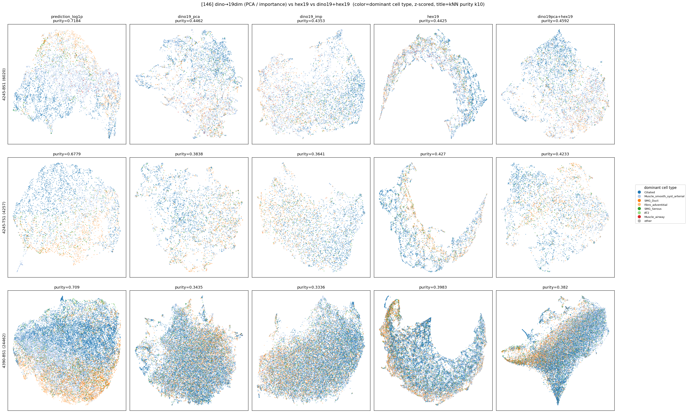

# dino→19dim 축소 후 hex 비교 (146, HEX FOV 73.2µm)

생성: 2026-06-01. 스크립트: `lung_pilot/hex_dino19_compare.py --label 146`.
방법·정의는 224 와 동일(`../hex_dino19_224/summary.md`). PCA19 가 dino 분산 **66.5%** 포착.

## kNN purity (k=10, dominant cell type = argmax Hist2Cell prediction)

| rep | dim | 4245-BS1 | 4245-TS1 | 4390-BS1 |
|---|---|---|---|---|
| prediction_log1p (ref) | 80 | 0.718 | 0.678 | 0.709 |
| dino768 | 768 | 0.466 | 0.395 | 0.365 |
| dino19_pca | 19 | 0.446 | 0.384 | 0.344 |
| dino19_imp | 19 | 0.435 | 0.364 | 0.334 |
| **hex19** | 19 | 0.443 | **0.427** | **0.398** |
| dino19pca+hex19 | 38 | **0.459** | 0.423 | 0.382 |
| dino19imp+hex19 | 38 | 0.447 | 0.418 | 0.381 |

## 146 의 특징 — hex 가 dino 보다 강하다

- **hex19 > dino19** (TS1 +0.043, 4390 +0.054; BS1 만 ≈). 심지어 **hex19 > dino768**(TS1 0.427 vs 0.395,
  4390 0.398 vs 0.365). 좁은 FOV(OOD)에서 DINO morphology 가 약해진 만큼 hex 가 우세.
- **dino19+hex19 vs dino19**: 3 슬라이드 모두 상승(+0.013~0.039) — hex 가 끌어올림.
- **dino19+hex19 vs hex19**: BS1 만 +0.016, TS1·4390 은 **−0.004 / −0.016** → 약화된 dino 를 더하면
  오히려 hex 를 깎음. 즉 146 의 best 단일 rep = **hex19** (TS1·4390).

## 용어 정의 — Q1 / Q2 / chance (224 summary 와 동일)

- **Q1** = representation *자체* 가 cell type 으로 뭉치나 (rep 단독 purity 의 **chance 대비 excess**).
- **Q2** = hex 가 dino 에 *추가* 정보를 주나 (**purity(dino+hex) − purity(dino)**).
- **Q1 ≠ Q2**: Q1 강해도 Q2 작을 수 있음(dino·hex 신호 겹침).
- **chance = ∑ᵢ pᵢ²** (size-weighted): 이웃을 라벨분포대로 무작위 추출 시 같은 cell type 일 기대확률.
  쏠린 분포라 uniform 1/k 대신 ∑p² 사용. **excess = purity − chance** = 우연 넘은 실제 clustering.

### Q1 결과 (146) — chance 대비 excess (dino19 = PCA)
| slide | chance(∑p²) | hex19 excess | dino19 excess | prediction(ceiling) |
|---|---|---|---|---|
| 4245-BS1 | 0.342 | +0.100 | +0.108 | +0.368 |
| 4245-TS1 | 0.284 | **+0.145** | +0.097 | +0.391 |
| 4390-BS1 | 0.297 | **+0.101** | +0.048 | +0.414 |

→ **146 에선 hex19 excess 가 dino19 를 추월**(TS1 +0.145 vs +0.097, 4390 +0.101 vs +0.048). 즉 좁은 FOV 로
DINO morphology 가 약해진 곳에서 **hex 의 marker 정보가 cell type 을 더 잘 잡음 (Q1: hex ≥ dino)**.

## 224 vs 146 종합 (차원 보수 후 결론)

| | 224 (in-domain, dino 강함) | 146 (OOD-FOV, dino 약함) |
|---|---|---|
| dino768→19 정보손실 | 거의 없음 (96~98%) | 거의 없음 |
| dino19 vs hex19 | **≈ 동등** | **hex19 우세** (TS1/4390) |
| 결합 효과 | dino19·hex19 **둘 다보다 +0.02**(3/3) | dino19 대비 ↑, 그러나 hex19 대비 BS1만 ↑(TS1/4390 ↓) |
| best 단일/결합 | dino19+hex19 ≈ dino768 | hex19 단독(2/3) |

**핵심**:
1. **차원을 맞추면(dino768→19) hex 가 cell-type 정보에서 dino 와 대등하거나(224) 우세(146)** —
   이전 768+19 concat 의 "hex 무의미" 는 **dino 차원 지배 아티팩트**였음이 확정.
2. **결합(dino19+hex19)의 이득은 dino 품질에 의존**: dino 가 좋을 때(224)는 보완적(+0.02),
   dino 가 OOD 로 약할 때(146)는 redundant/방해 → hex 단독이 나음.
3. **Q1(hex 가 cell type 을 담나) = YES**(146 은 hex ≥ dino, excess +0.10~0.15). **Q2(dino 에 추가 보탬)**
   는 dino 품질 의존(146 OOD 에선 결합이 hex 단독을 못 넘음). 정확한 한 줄: "동등 차원이면 hex 가 cell-type
   을 dino 만큼/그 이상 담고, 저품질 dino 는 hex 가 대체" — "dino+hex 가 항상 최고"가 아님.

## 정직한 한계 (224 와 공통)
- 라벨 = argmax(Hist2Cell prediction) = **H&E-형태 유래** → 지표가 morphology 에 유리하게 편향.
  그런데도 hex 가 146 에서 dino 를 이긴다는 건 hex 신호가 실재함을 시사(편향을 거스름).
- 단 146 은 라벨(Hist2Cell)도 OOD → purity 절대치 해석 주의. 결정적 판정은 실제 cell-type GT(Visium) 필요.
- 효과 크기 ±0.02~0.05 수준 — 방향·재현성 위주로 해석.

## 산출물
- `knn_purity.csv`, `knn_purity_pivot.csv`, `umap_dino19_vs_hex.png`, `embeddings/`
