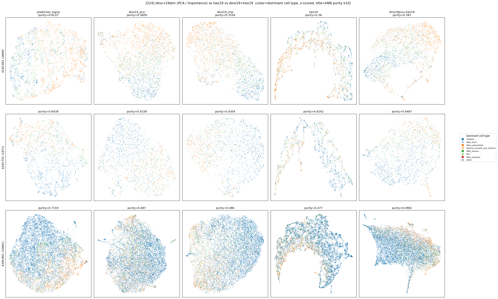

# dino→19dim 축소 후 hex 비교 (224) — 차원 지배 문제 보수

생성: 2026-06-01. 스크립트: `lung_pilot/hex_dino19_compare.py`.
이전 `hex_compare_224` 에서 agg=dino768⊕hex19 의 per-dim concat 은 dino 768차원이 hex(19=2.4%)를
압도해 hex 효과가 묻혔다. 여기선 **dino 를 19-dim 으로 줄여 hex 와 동등 차원**으로 맞춰 재비교.

## dino 19-dim 축소 2가지
- **PCA**: dino 768 → 19 주성분 (unsupervised). 19 PC 가 dino 분산의 **68.2%** 포착.
- **IMP**: dominant cell type 에 대한 ANOVA F-score 상위 19 원본 dim (supervised).
  ⚠️ 라벨=Hist2Cell prediction 으로 고른 것이라 dino 에 유리·circular.

라벨 = dominant cell type = argmax(Hist2Cell prediction). 모든 rep per-dim z-score 후 kNN purity(k=10).

## kNN purity (k=10, dominant cell type)

| rep | dim | 4245-BS1 | 4245-TS1 | 4390-BS1 |
|---|---|---|---|---|
| prediction_log1p (ref) | 80 | 0.612 | 0.644 | 0.732 |
| dino768 (원본) | 768 | 0.373 | 0.452 | 0.509 |
| dino19_pca | 19 | 0.361 | 0.434 | 0.487 |
| dino19_imp | 19 | 0.353 | 0.430 | 0.486 |
| hex19 | 19 | 0.360 | 0.424 | 0.477 |
| **dino19pca+hex19** | 38 | **0.381** | **0.449** | **0.498** |
| dino19imp+hex19 | 38 | 0.379 | 0.442 | 0.497 |

## 용어 정의 — Q1 / Q2 / chance (해석 전 반드시 구분)

- **Q1 — "representation 자체가 cell type 을 담나?"**: 그 rep 단독으로 spot 이 같은 cell type 끼리 뭉치는가.
  측정 = 그 rep 의 kNN purity 의 **chance 대비 excess**. ("hex 가 marker 정보로 cell type 을 뭉치게 하나"가 이것.)
- **Q2 — "hex 가 dino 에 *추가* 정보를 주나?"**: dino 에 hex 를 더하면(dino+hex) dino 단독보다 좋아지나.
  측정 = **purity(dino+hex) − purity(dino)** (보탬/상보성).
- **Q1 ≠ Q2**: Q1 은 절대 능력(rep vs 우연), Q2 는 증분(결합 vs dino). **Q1 이 강해도 Q2 는 작을 수 있다** —
  dino·hex 가 둘 다 H&E 유래라 cell-type 신호가 겹치면 합쳐도 증분이 작다. (이전 "hex 무의미"는 Q2 만 본 것.)
- **chance = size-weighted random baseline = ∑ᵢ pᵢ²** (pᵢ = 그 슬라이드 dominant type i 의 비율).
  의미: 이웃을 라벨분포대로 **무작위로** 뽑을 때 같은 cell type 일 기대확률(= 두 무작위 spot 이 같은 라벨일 확률).
  dominant 분포가 쏠려서(예: Ciliated 우세) **uniform 1/k 가 아니라 ∑p²** 를 써야 우연을 과소평가하지 않음.
  **excess = purity − chance** = 우연을 넘어선 *실제* cell-type clustering 능력.

### Q1 결과 — chance 대비 excess (dino19 = PCA)
| slide | chance(∑p²) | hex19 excess | dino19 excess | prediction(ceiling) |
|---|---|---|---|---|
| 4245-BS1 | 0.192 | **+0.168** | +0.165 | +0.418 |
| 4245-TS1 | 0.275 | **+0.150** | +0.159 | +0.371 |
| 4390-BS1 | 0.363 | **+0.114** | +0.125 | +0.367 |

→ **hex19 단독이 chance 보다 +0.11~0.17 위** = cell type 으로 **유의미하게 뭉침 (Q1 = YES)**. dino19 와 거의 동급.

## 핵심 결론 — 차원 맞추니 **hex 기여가 드러난다**

1. **dino 768→19 는 정보 거의 안 잃음**: dino19(pca) purity 가 dino768 의 96~98% (0.373→0.361 등).
   cell-type 관련 구조는 19-dim 에 대부분 담김 (PCA EVR 0.68).
2. **dino19 ≈ hex19**: 동일 19-dim 에서 둘이 비슷 (hex 가 근소하게 낮음). 한쪽이 압도하지 않음.
3. **dino19+hex19 가 dino19·hex19 둘 다보다 일관되게 높음** (3 슬라이드 전부):
   - vs dino19_pca: **+0.020 / +0.015 / +0.011**
   - vs hex19:     **+0.021 / +0.025 / +0.021**
   → 이전 768+19 concat 에서 **묻혀 있던 hex 의 보완 효과가, 차원을 맞추니 나타남.**
4. **dino19+hex19 ≈ dino768**: 38-dim 결합이 768-dim dino 성능에 근접/동률(BS1 은 +0.008 로 추월).
   즉 hex 19-dim 이 dino 차원 대폭 축소분을 메워준다.
5. PCA ≈ importance (PCA 가 근소 우세). supervised 선택(IMP)이 라벨을 썼는데도 PCA 보다 낫지 않음.

→ **Q1 (hex 가 cell type 을 담나) = 명백히 YES** — hex19 단독 excess +0.11~0.17 (chance 대비), dino19 와 대등.
즉 hex 의 marker 정보가 실제로 cell-type clustering 을 만든다.
→ **Q2 (dino 에 *추가* 보탬) = 작음(~+0.02)** — 단 이는 dino·hex 신호가 겹쳐서지 hex 가 약해서가 아니다.
이전 hex_compare 의 "hex 무의미"는 **Q2 만, 그것도 dino 차원 지배 상태로** 본 탓 — 차원을 맞추면 **Q1 은 강하고
Q2 증분도(작지만) 3/3 슬라이드·두 축소법에서 재현**된다.

> **146 과 종합 (`../hex_dino19_146/summary.md`)**: 224(dino 강함)에선 dino19≈hex19, 결합이 둘 다보다 +0.02.
> 146(OOD-FOV, dino 약함)에선 **hex19 가 dino 를 추월**(dino768 까지), 결합은 dino19 보단 낫지만 hex19 단독엔
> 못 미침. → 차원 맞추면 hex 가 dino 와 대등/우세이고, 결합 이득은 **dino 품질에 의존**.

## 정직한 한계
- 라벨이 **argmax(Hist2Cell prediction)** = H&E-형태 유래 → 지표가 morphology(dino)에 유리.
  따라서 hex 기여는 **과소평가** 가능 (실제 cell-type GT 면 더 클 수도). 결정적 판정엔 Visium GT 필요.
- dino19_imp 는 라벨로 dim 선택(circular)인데도 PCA 대비 이득 없음 → 특정 19 dim 이 특출나진 않음.
- 효과 +0.02 는 moderate 아님, 작음. 방향 일치·재현성으로 읽을 것(수치 절대치 보조).

## 산출물
- `knn_purity.csv`, `knn_purity_pivot.csv`, `umap_dino19_vs_hex.png`, `embeddings/`
- 146 도 동일 가능: `--infer-dir inference_output_146 --dino-dir .../dino_output_146 --agg-dir .../dino_hex_agg_146 --label 146`
