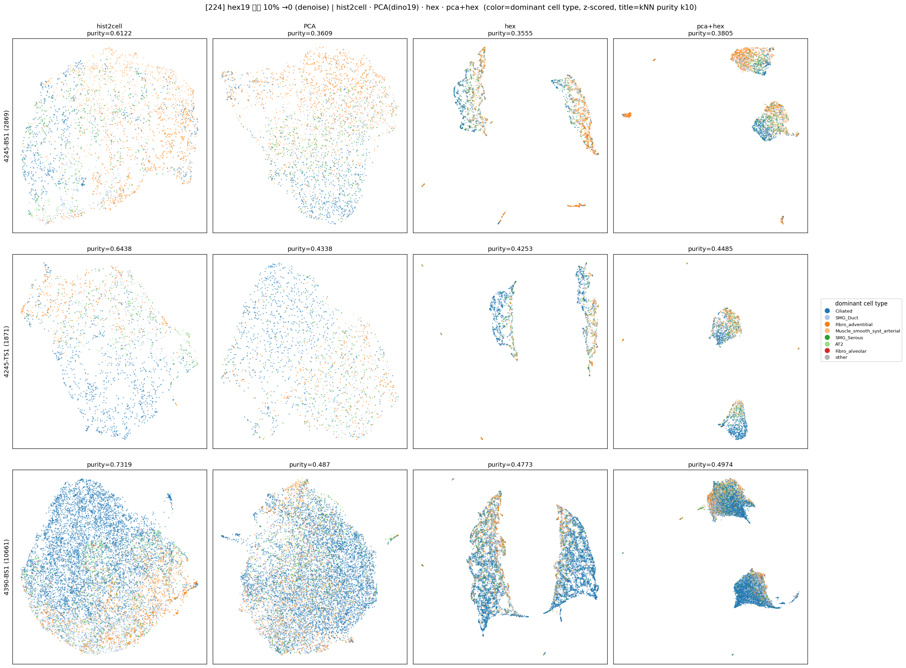

# hex19 패치별 하위 10% →0 (denoise) 후 비교 (224·146 통합)

생성: 2026-06-01. 스크립트: `lung_pilot/hex_dino19_denoise.py`.
`hex_dino19_*` 의 변형 — hex19 각 패치(행)에서 **그 행 하위 10% 값(19개 중 평균 2개)을 0** 으로 치환(저신호
marker = 노이즈 가정 제거) 후, dino768→19(PCA) 와 비교. 컬럼: **hist2cell · PCA(dino19) · hex(denoised) · pca+hex**.
denoise 효과 확인용으로 purity 표엔 원본(hex_orig, pca+hex_orig)도 포함. 라벨=dominant cell type(argmax pred).

## kNN purity (k=10) — denoise 영향

**224**
| rep | BS1 | TS1 | 4390 |
|---|---|---|---|
| hist2cell (ref) | 0.612 | 0.644 | 0.732 |
| PCA (dino19) | 0.361 | 0.434 | 0.487 |
| hex_orig | 0.360 | 0.424 | 0.477 |
| **hex (denoised)** | 0.356 | 0.425 | 0.477 |
| pca+hex_orig | 0.381 | 0.449 | 0.498 |
| **pca+hex (denoised)** | 0.381 | 0.449 | 0.497 |

**146**
| rep | BS1 | TS1 | 4390 |
|---|---|---|---|
| hist2cell (ref) | 0.718 | 0.678 | 0.709 |
| PCA (dino19) | 0.446 | 0.384 | 0.344 |
| hex_orig | 0.443 | 0.427 | 0.398 |
| **hex (denoised)** | 0.442 | 0.427 | 0.397 |
| pca+hex_orig | 0.459 | 0.423 | 0.382 |
| **pca+hex (denoised)** | 0.455 | 0.420 | 0.383 |

## 결론 — denoise 는 **purity 무영향** (≤0.004, 노이즈 수준)

하위 10%(행당 ~2/19) 를 0 으로 만들어도 cell-type 응집(purity)은 **거의 안 변한다** — 224·146 둘 다
hex·pca+hex 모두 |Δ| ≤ 0.004. 즉 "저신호 marker 제거" 가 cell-type 변별을 개선하지도 악화시키지도 않음.
(이유: 하위값은 이미 작아 z-score 후 기여 미미 + 이웃 구조는 상위 marker 가 지배.)

## 단, UMAP **모양은 크게 바뀜** (→ 앞 "모양 vs 정보" 논의의 실증)

denoise 전 hex19 는 매끈한 **호(arc, 1D intensity gradient)** 였는데, denoise 후엔 **분절된 섬(islands)/줄기**로
쪼개진다. 행마다 "어떤 marker 가 0인가"가 **이산 sparsity signature** 가 되어 manifold 가 갈라진 것 —
sparsification 아티팩트. **거시 모양은 완전히 달라졌지만 kNN purity 는 불변** → UMAP 전역 모양은
정보량과 직결되지 않음을 다시 확인(우열은 purity 로 판정).

## 정직한 한계
- 라벨 = argmax(Hist2Cell prediction) = H&E-형태 유래(앞 분석들과 동일 편향). 결정적 판정은 실제 cell-type GT 필요.
- 10% 고정 — 다른 임계(20/30%)나 글로벌 임계는 다를 수 있으나, 10% 에선 무영향이 분명.

## 산출물
- `hex_dino19_denoise_{224,146}/` : `knn_purity{,_pivot}.csv` + `umap_denoise.png` + `embeddings/`
