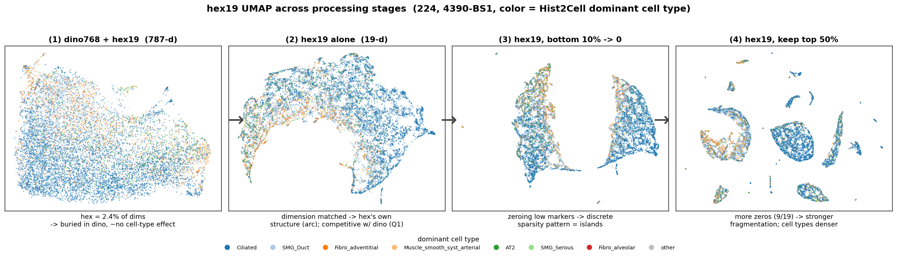
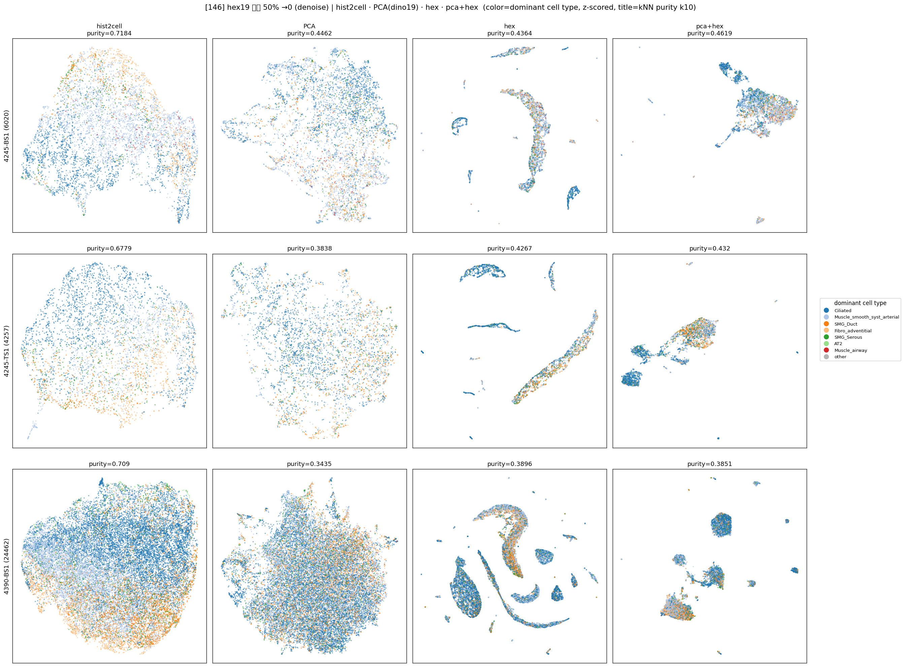

# hex19 패치당 상위 50%만 유지 (하위 50%→0) 후 비교 (224·146 통합)

생성: 2026-06-01. 스크립트: `lung_pilot/hex_dino19_denoise.py --pct 50`.
hex19 각 패치(행)에서 **중앙값 미만(하위 50%, 19개 중 9개)을 0** 으로 — 상위 절반 marker 만 사용.
앞 denoise(하위 10%→0)보다 공격적. 컬럼: hist2cell·PCA(dino19)·hex(top50)·pca+hex(top50).
purity 표엔 원본(hex_orig, pca+hex_orig)도 포함. 라벨=dominant cell type(argmax pred).

## 전체 경과 한눈에 (hex19 처리 단계별 UMAP)

hex19 를 처리하며 관찰된 경과 (224, 4390-BS1, 색=dominant cell type):
1. **dino768 ⊕ hex19 (787-d)** — hex 가 전체 차원의 2.4% 라 dino 에 묻혀 **cell-type 영향 거의 없음**.
2. **19-d 로 맞춤 (hex19 단독)** — 차원을 맞추니 hex 자체 구조(호)가 보이고 **dino 와 대등한 cell-type 기여 (Q1=YES)**.
3. **hex19 하위 10% → 0 (denoise)** — 저신호 marker 를 0 으로 만들면 "어느 marker 가 남나"가 이산 sparsity
   패턴이 되어 **섬(islands) 모양 군집** 출현. *단 purity 는 불변 → 모양 ≠ 정보.*
4. **hex19 상위 50%만 사용** — 더 많이(9/19) 0 처리 → **더 강하게 분절·일부 cell type 끼리 밀집**.
   *단 purity 는 약손해 → 자를수록 손해 쪽.*

> flow 이미지 캡션은 한글 폰트 부재로 영문. 정량 수치·한계는 아래 표와 "정직한 한계" 절 참고.

## kNN purity (k=10) — 상위50% 영향

**224**
| rep | BS1 | TS1 | 4390 |
|---|---|---|---|
| hist2cell (ref) | 0.612 | 0.644 | 0.732 |
| PCA (dino19) | 0.361 | 0.434 | 0.487 |
| hex_orig | 0.360 | 0.424 | 0.477 |
| **hex (top50)** | 0.342 | 0.424 | 0.473 |
| pca+hex_orig | 0.381 | 0.449 | 0.498 |
| **pca+hex (top50)** | 0.379 | 0.440 | 0.496 |

**146**
| rep | BS1 | TS1 | 4390 |
|---|---|---|---|
| hist2cell (ref) | 0.718 | 0.678 | 0.709 |
| PCA (dino19) | 0.446 | 0.384 | 0.344 |
| hex_orig | 0.443 | 0.427 | 0.398 |
| **hex (top50)** | 0.436 | 0.427 | 0.390 |
| pca+hex_orig | 0.459 | 0.423 | 0.382 |
| **pca+hex (top50)** | **0.462** | **0.432** | 0.385 |

## 결론 — 상위50%는 **약하게 손해(hex 단독), 146 결합만 소폭 이득**

- **hex 단독**: 대체로 살짝 **나빠짐** (224 BS1 −0.018, 146 4390 −0.009; 나머지 ≈). marker 절반을
  버리면 **하위값에 남아있던 신호도 같이 손실** → 하위 marker 가 순수 노이즈는 아님.
- **pca+hex**: 224 는 소폭 ↓, **146 은 소폭 ↑**(BS1 +0.003, TS1 +0.009, 4390 +0.003). dino19 가 약한
  146 에선 hex 를 상위만 남겨 약간 또렷해진 효과로 보이나 폭이 작음(≤0.009).
- 종합: 효과 **±0.02 이내**로 작고 방향도 혼재 → 상위50% truncation 에 **뚜렷한 이득 없음**.
  (하위10%→0 은 무영향, 하위50%→0 은 hex 단독 약손해 — 자를수록 손해 쪽.)

## UMAP 모양 — 더 강하게 분절

9/19 를 0 으로 만드니 "어떤 marker 가 남나"의 이산 조합이 더 강해져 hex·pca+hex 가 **잘게 쪼개진
줄기/섬**으로 나타남. 그래도 **purity 는 거의 그대로** → "UMAP 거시 모양 ≠ 정보량" 재확인.

## 정직한 한계
- 라벨 = argmax(Hist2Cell prediction) = H&E-형태 유래 편향(앞 분석들과 동일). 결정적 판정엔 실제 GT 필요.
- 임계 비교 정리: 하위 10%→0 = 무영향, 상위 50%만(=하위 50%→0) = hex 단독 약손해. 더 자르면 신호 손실 쪽.

## 산출물
- `hex_dino19_top50_{224,146}/` : `knn_purity{,_pivot}.csv` + `umap_denoise.png` + `embeddings/`
