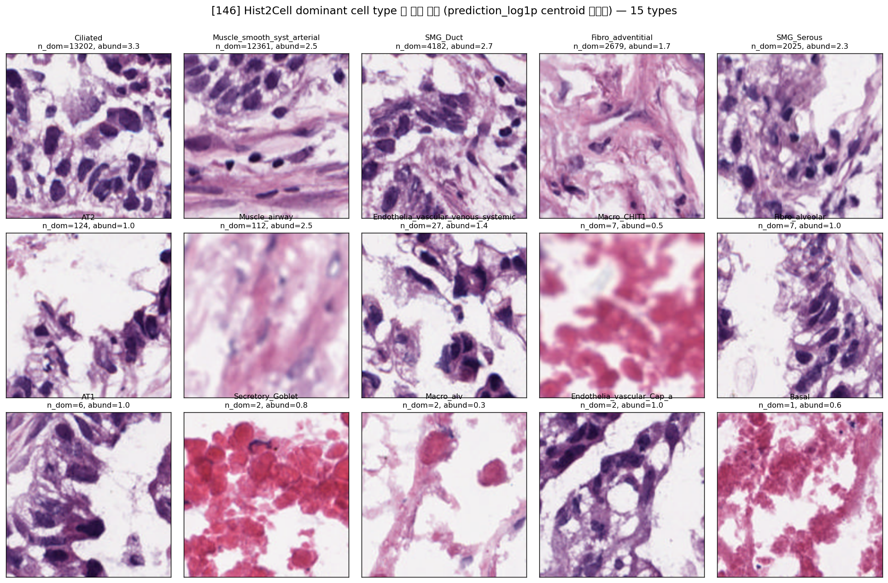

# Hist2Cell dominant cell type 별 대표 패치 (146, HEX FOV 73.2µm)

생성: 2026-06-01. 스크립트: `lung_pilot/celltype_examples.py --label 146`.

정의·방법은 224 와 동일 (각 dominant type 의 `prediction_log1p` centroid 최근접 spot 의 H&E 패치).
**cell type 가 무슨 세포인지 조직학 가이드 표는 `../celltype_examples_224/summary.md` 참조** (동일).

좌표·spot_id 는 `celltype_examples.csv`.

## 146 ↔ 224 차이 (FOV 효과)
146 distinct dominant types = **15** (224 는 18). 좁은 FOV(73.2µm)에서 dominant 분포가 이동:

- **Muscle_smooth_syst_arterial 이 #2 로 급증** (n_dom 12,361; 224 에선 1,472). Ciliated(13,202)와 함께
  두 type 이 전체의 ~73% — 좁은 시야가 기도/근육 같은 빽빽한 구조를 강하게 잡는 경향(앞 TOP10 분석과 일치).
- 224 에 있던 **Suprabasal·B_plasma_IgG·B_plasmablast 가 146 dominant set 에서 사라짐**, 대신 분포가
  상위 기도/근육/샘 type 에 더 쏠림.
- alveolar 계열(AT2 124, AT1 6, Fibro_alveolar 7)은 224(732/11/80)보다도 **더 줄어** dominant 로 거의 안 잡힘.

## 주의
- 146 은 Hist2Cell 학습 FOV(112µm)보다 좁은 **OOD 입력**(73.2µm→224 업샘플). 따라서 dominant type
  분포·예시 패치는 *모델-FOV 민감도* 가 섞인 결과로, 224(in-domain) 를 기준 해석으로 삼는 게 안전하다.
- 그 외 주의(예측 기준·종양 조직·n_dom 작은 type illustrative)는 `../celltype_examples_224/summary.md` 와 동일.
