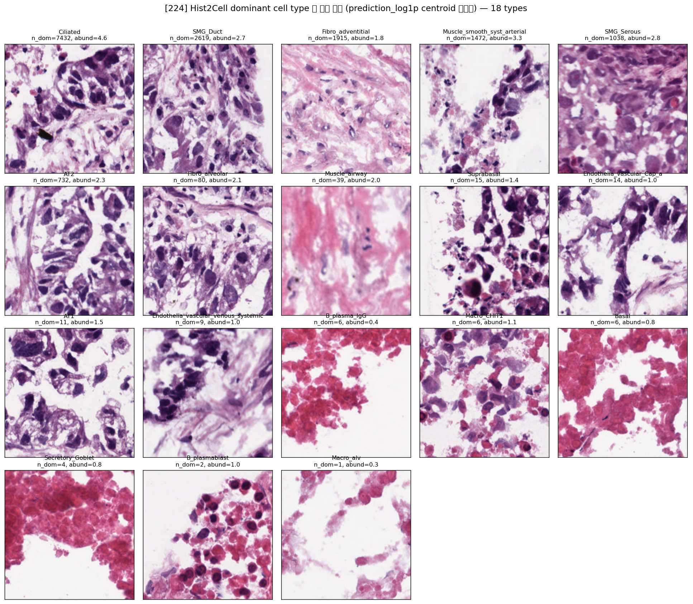

# Hist2Cell dominant cell type 별 대표 패치 (224) — 각 cell type 이 어떤 세포인지

생성: 2026-06-01. 스크립트: `lung_pilot/celltype_examples.py`.

각 dominant cell type(= `argmax(prediction)`)에 대해, 그 type 으로 분류된 spot 들 중
**`prediction_log1p`(80-d) centroid 에 가장 가까운 spot** = 가장 전형적인 예시를 골라 H&E 패치를 추출.
"Hist2Cell 이 그 cell type 이라고 가장 자신있게/전형적으로 본 패치" 다.

각 패널 제목: cell type / `n_dom`(그 type 이 dominant 인 spot 수) / `abund`(예시 spot 의 그 type abundance).
표는 spot 수 desc. 좌표·spot_id 는 `celltype_examples.csv`.

## cell type 가이드 (폐 조직학)

| cell type | n_dom | 무슨 세포인가 | H&E 에서 |
|---|---|---|---|
| **Ciliated** | 7432 | 전도성 기도(기관지) **섬모세포** — 표면 섬모로 점액·이물 배출 | 기도 내강 따라 줄지은 원주상피, 핵 조밀 |
| **SMG_Duct** | 2619 | 점막하샘 **도관 상피** — 샘 분비물을 기도로 운반 | 관상 구조의 입방/원주 상피 |
| **Fibro_adventitial** | 1915 | 혈관·기도 바깥 **외막 섬유아세포** | 분홍 교원질 바탕 + 방추형 핵 |
| **Muscle_smooth_syst_arterial** | 1472 | 체동맥 **혈관 평활근**(중막) | 호산성(분홍) 방추세포 다발 |
| **SMG_Serous** | 1038 | 점막하샘 **장액세포** — 묽은 단백질성 분비(라이소자임 등) | 진한 호염기성 세포질 샘세포 |
| **AT2** | 732 | 폐포 **2형 상피** — surfactant 분비 + 폐포 줄기세포 | 폐포벽의 입방형 세포 |
| **Fibro_alveolar** | 80 | **폐포 간질 섬유아세포** — 폐포벽 지지 | 얇은 폐포벽 내 방추세포 |
| **Muscle_airway** | 39 | **기도 평활근** — 기관지 수축 조절 | 기도 벽 따라 분홍 평활근 띠 |
| **Suprabasal** | 15 | 기도 상피 **기저상부 세포**(분화 중간) | 기저층 위 다층 상피 |
| **Endothelia_vascular_Cap_a** | 14 | **폐포 모세혈관 내피** — 가스교환 혈관 | 폐포벽 내 얇은 혈관 내피 |
| **AT1** | 11 | 폐포 **1형 상피** — 얇게 펴진 가스교환 표면 | 폐포벽을 덮는 극히 얇은 세포 |
| **Endothelia_vascular_venous_systemic** | 9 | 체순환 **정맥 내피** | 정맥벽 내피 |
| **B_plasma_IgG** | 6 | IgG 분비 **형질세포**(항체) | 편심핵·수레바퀴 크로마틴의 형질세포 |
| **Macro_CHIT1** | 6 | CHIT1+ **대식세포**(간질/섬유화 연관) | 풍부한 세포질의 큰 식세포 |
| **Basal** | 6 | 기도 상피 **기저세포**(줄기세포층, 재생) | 기저막 위 작은 입방세포층 |
| **Secretory_Goblet** | 4 | **술잔세포** — 기도 점액(mucin) 분비 | 점액으로 부푼 밝은 세포질 |
| **B_plasmablast** | 2 | **형질모세포**(형질세포 전구) | 형질세포 유사, 더 큰 핵 |
| **Macro_alv** | 1 | 폐포 **대식세포** — 폐포강 내 청소세포 | 폐포강 안 둥근 식세포 |

## 주의
- 라벨·centroid 는 **Hist2Cell 예측 기준**(정답 아님). 예시 패치 = "Hist2Cell 이 그 type 으로 가장 전형적이라
  본 H&E" 이지, 병리학적으로 검증된 cell 이 아니다.
- **TCGA-LUAD 는 폐선암(종양) 조직**. Hist2Cell 은 정상 사람 폐 Visium 으로 학습 → 위 type 명은 정상폐
  reference cell type 이고, 종양 영역에서는 형태가 신생물성일 수 있다. 상위 type(Ciliated 등)이 실제
  종양 상피에 매핑됐을 가능성도 감안.
- **n_dom 이 작은 type(<36, 예: AT1 11, Macro_alv 1)** 은 극소수 spot 의 예시라 illustrative 수준 —
  대표성 약함. 신뢰는 상위 6~8종(≥100~수천)에 둘 것.
- 같은 코드로 146 도 가능: `--graph-dir graph_output/146 --infer-dir inference_output_146 --label 146`.
