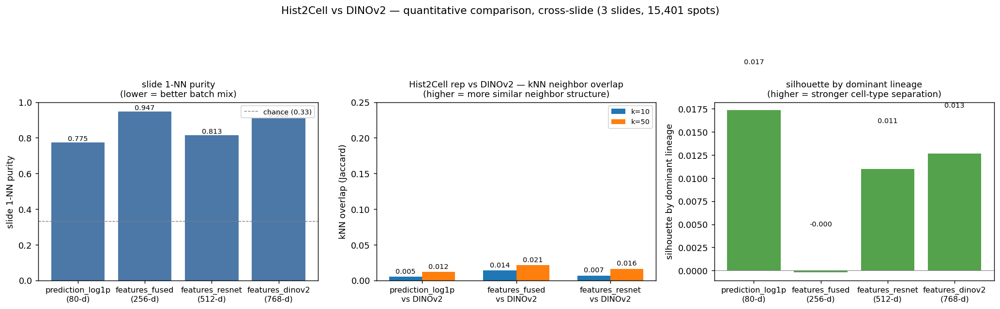

# Hist2Cell vs DINOv2 — 정량 비교 (cross-slide, raw representation)

생성 코드: [`lung_pilot/compare_hist2cell_vs_dinov2.py`](../compare_hist2cell_vs_dinov2.py)
원본 데이터: [`metrics.csv`](metrics.csv)
시각화: [`metrics_bars.png`](metrics_bars.png)
생성일: 2026-05-25

## 1. 목적

`lung_pilot/umap_output/` 의 4-rep UMAP 시각화는 *정성* 관찰까지였다.
같은 4 representation (Hist2Cell `prediction_log1p`/`features_fused`/
`features_resnet` + DINOv2 `features_dinov2`) 을 **raw 공간에서**
3 가지 metric 으로 정량화해, "Hist2Cell 과 DINOv2 가 같은 spot 을
얼마나 비슷하게 보는가" + "batch effect 와 cell-type 신호가 정확히
어디에 있는가" 를 수치로 확인한다.

HEX expression 결과가 아직 없어, 본 작업은 *현재 보유한 두 모델*
(Hist2Cell, DINOv2) 만의 비교다.

## 2. 데이터셋 요약

- 3 슬라이드 합쳐 **15,401 spots** (4245-BS1 2,869 + 4245-TS1 1,871 + 4390-BS1 10,661)
- 4 representation 모두 cross-slide 로 vstack 후 정규화/변환 없이 raw 사용
  (`prediction` 만 `np.log1p` 적용 — UMAP 코드와 일관)

### Dominant cell-type lineage 분포 (Hist2Cell prediction 의 argmax → `cell_type_groups.csv` 의 group)

| lineage | count | % |
|---|---|---|
| **Epithelial-airway** | 11,114 | **72.2%** |
| Stromal-fibroblast | 1,995 | 12.9% |
| Stromal-muscle | 1,511 | 9.8% |
| Epithelial-alveolar | 743 | 4.8% |
| Vascular | 23 | 0.1% |
| Immune-lymphoid | 8 | <0.1% |
| Immune-myeloid | 7 | <0.1% |

> ⚠️ **이전 `umap_output/summary.md` 의 색-라벨 매핑 오류 정정.**
> UMAP PNG 의 `tab20` 색은 lineage 의 *알파벳 정렬* 순서로 배정된다
> (`sorted(set(labels))`). 따라서 **파 = Epithelial-airway**,
> 연두 = Epithelial-alveolar, 주황 = Immune-lymphoid, 빨강 =
> Immune-myeloid 순. 이전 summary 에서 "파 = alveolar, 연두 = myeloid"
> 로 적은 부분은 잘못이었다 (실제 비율도 airway 가 72% 로 압도적이며
> 본 분포 표가 정답).
>
> 함의: lung 정상조직 학습된 Hist2Cell 가 TCGA-LUAD (선암, adenocarcinoma)
> 슬라이드에서 대부분 spot 을 *airway* lineage 로 부르고 있다는 점.
> 종양 부위가 airway-like morphology 로 모델에게 보이는지, 또는 모델의
> alveolar 인식이 종양 환경에서 깨지는지는 별도 검증 필요.

## 3. Metric 정의와 결과

### 3.1 Slide 1-NN purity — batch effect 정량

각 spot 의 raw representation 에서 1-NN 이웃 1개를 잡아, **그 이웃이
같은 슬라이드인 비율**. **낮을수록 batch-mix 가 좋다.**

> **2026-05-26 정정 — chance baseline 은 uniform 1/3 이 아니라 slide-size
> 가중 ∑ pᵢ²**. 초기 작성본에서 chance 를 `1/3 = 0.33` 으로만 표기해
> prediction 의 0.775 가 "강한 batch" 처럼 보이게 했는데, 4390-BS1 이
> spot 의 69.2% 를 차지하므로 batch effect 가 0 이라도 random 1-NN 이
> 같은 슬라이드일 chance 는 `Σ pᵢ² ≈ 0.529`. 이를 반영해 *excess over
> weighted chance* = `(purity − chance) / (1 − chance)` 로 batch 정도를
> 재해석. 또한 spot-수 효과를 시각적으로도 제거하기 위해 각 슬라이드
> 1,871 spot 로 random sample 한 **balanced cross-slide UMAP** 도 생성
> ([`../umap_output/cross_slide_balanced.png`](../umap_output/cross_slide_balanced.png)).
> 자세한 표는 [`metrics_corrected.csv`](metrics_corrected.csv).

| representation | dim | 1-NN purity (전체 15,401) | excess (chance=0.529) | balanced purity (1,871 × 3) | balanced excess (chance=0.333) |
|---|---|---|---|---|---|
| `prediction_log1p` | 80 | 0.775 | **+0.523** | 0.663 | **+0.495** |
| `features_fused` | 256 | 0.947 | +0.888 | 0.897 | +0.846 |
| `features_resnet` | 512 | 0.813 | +0.604 | 0.711 | +0.567 |
| `features_dinov2` | 768 | 0.908 | +0.805 | 0.836 | +0.754 |

두 방식 모두 **순위 동일** (fused > dinov2 > resnet > prediction).

**핵심 해석 (정정 후)**

- **prediction 의 batch 는 다른 rep 보다 명확히 약하다** — balanced excess
  0.495 가 가장 낮음. 사용자 지적 ("prediction 에선 3 슬라이드가
  유사 범주에 mapping 됨") 이 정량/시각 양쪽으로 지지된다. balanced
  UMAP PNG 에서도 prediction panel 의 3 슬라이드가 가장 골고루 섞인다.
- 다만 **"batch effect 가 없다" 까진 말 못 함** — chance 위로 +0.5 정도는
  남아 있다. 이 잔여 batch 는 (a) 슬라이드별 실제 cell-type 조성 차이
  (병변 / 정상 영역 비율 등) 가 prediction 에 반영된 *의미 있는 신호*
  일 가능성 + (b) 모델의 slide-specific stain/exposure 편향이 prediction
  에까지 새어든 부분 — 본 데이터로는 둘이 구분 안 됨.
- **`features_fused` 의 0.89 ~ 0.95 는 graph aggregation 효과로 거의 설명**.
  fused = `(x_spot_e + x_local + x_global) / 3` 이고 `x_local` 은
  GATv2Conv 가 kNN 그래프 위에서 이웃 spot feature 를 평균한 것. 그래프
  edge 는 같은 슬라이드 spot 사이에만 존재 (`build_graph_from_tiles.py`
  의 k=6 kNN). 즉 같은 슬라이드 이웃 정보를 평균낸 결과라 동일 슬라이드
  spot 끼리 자연스럽게 매우 유사 — *cell-type signal 과 무관한 구조적
  강제.* balanced subsample 으로도 거의 그대로 (0.897) 라는 점이 이를 확증.
- **UMAP global geometry 의 caveat 는 여전히 유효** — 단순 시각만으론
  spot-수 효과와 batch effect 가 섞여 보인다. 본 작업에선 (i) chance
  baseline 정정 + (ii) balanced subsample 의 두 가지를 같이 적용해 두
  요인을 풀어낸다.

### 3.2 kNN overlap (Jaccard) — Hist2Cell ↔ DINOv2 이웃 구조 일치

같은 spot 의 top-k 이웃 set 을 두 representation 에서 각각 구해
**평균 Jaccard 유사도**. *높을수록 두 모델이 같은 spot 을 비슷한
이웃 그룹으로 묶는다.*

| pair | k=10 | k=50 | chance ~ |
|---|---|---|---|
| `prediction_log1p` vs DINOv2 | 0.005 | 0.012 | k=10: 0.00065 / k=50: 0.0032 |
| `features_fused` vs DINOv2 | **0.014** | **0.021** | (동일) |
| `features_resnet` vs DINOv2 | 0.007 | 0.016 | (동일) |

(chance = `k / (N-1)` ≈ `10/15400` 또는 `50/15400`.)

**핵심 해석**

- **모두 chance 보다 10~30배 위지만 절대값이 매우 낮다 (≤ 0.021).**
  즉 두 모델이 완전 무관은 아니지만, **같은 spot 의 "유사 spot" 정의가
  Hist2Cell ↔ DINOv2 에서 거의 다른 신호를 따른다.** Hist2Cell 는
  학습된 cell-type 공간 + graph 컨텍스트, DINOv2 는 ImageNet/LVD 학습된
  일반 visual prior.
- **`features_fused` 가 가장 높다.** 두 모델 모두 같은 슬라이드 spot
  끼리 가까이 묶는 경향 (fused 는 graph, dinov2 는 stain/모폴로지)
  이 강해 1-NN purity 가 모두 높음 → 같은 슬라이드 안에서 이웃이 일부
  겹친다. 즉 이 overlap 의 일부는 cell-type 매칭이 아니라 slide-confined
  매칭일 가능성이 크다.
- **HEX/DINO 비교 baseline 으로서의 함의**: HEX 의 DINO 블록과 cross-model
  spot-level 비교를 한다면, 본 결과의 Jaccard 0.02 정도가 *"같은
  spot 의 자연 visual prior"* 의 신호 강도라 볼 수 있다. HEX의 DINO 와
  본 DINOv2 가 매우 가깝게 나오는 게 *기대치이고*, 아닌 경우 (Jaccard
  훨씬 낮으면) 두 DINO 변종 사이 도메인 갭이 큰 것.

### 3.3 Silhouette by dominant lineage — cell-type 신호 보유량

각 representation 에서 dominant lineage label 을 기준으로 silhouette
score 계산 (random sample 5,000 of 15,401, euclidean). **높을수록 같은
lineage spot 들이 다른 lineage 와 잘 분리된다.**

| representation | dim | silhouette |
|---|---|---|
| `prediction_log1p` | 80 | **0.017** |
| `features_fused` | 256 | -0.000 |
| `features_resnet` | 512 | 0.011 |
| `features_dinov2` | 768 | 0.013 |

**핵심 해석**

- **모두 0 근처 — lineage cluster 가 약하다.** prediction 도 0.017
  로 약간 높을 뿐.
- 이유:
  1. **Lineage label imbalance** — airway 72% 가 cluster validity
     metric 을 깎는다. lineage 단위 silhouette 는 minority class 에
     민감.
  2. **dominant lineage label 자체가 noisy** — Hist2Cell prediction 의
     argmax 한 가지로 spot 을 *categorical* 로 라벨링한 것. 실제
     abundance 는 mixed (예: alveolar 0.4 + airway 0.35 + ... ) 인 spot
     이 많아 lineage 단위로 깔끔히 cluster 되지 않음.
  3. **High-dim 거리의 일반적 약화** — 512/768-d 의 euclidean 거리
     contrast 가 낮음.
- **그래도 순위는 의미 있다**: `prediction > dinov2 ≥ resnet >> fused`.
  fused 가 음수에 가까운 것은 graph aggregation 이 slide-confined
  mixing 을 만들어 lineage 신호를 오히려 흐리게 만든 결과로 해석.

## 4. 한계 / 주의

- **lineage label 은 Hist2Cell argmax → group 한 derived label** —
  ground truth 아님. silhouette 결과는 *Hist2Cell 의 self-consistency*
  내에서의 평가에 가깝다. 진짜 cell-type ground truth (예: spatial
  transcriptomics 의 cell2location abundance) 와 비교한 metric 은 후속.
- **chance baseline 은 단순화**. 1-NN purity 의 정확한 chance 는
  슬라이드 크기 분포에 따라 다르고 (`∑pᵢ²` ≈ 0.51 if no info), 본 표는
  uniform `1/3 = 0.33` 만 표시. 정확한 chance 대비는 별도 계산 필요.
- **silhouette sample 5,000** — 전체 15,401 에서 random sample. 다른
  seed 로 ±0.005 정도 변동 예상. 결과 순위는 강건.
- **kNN overlap 의 정확한 chance** 는 `k / (N-1)` 가정 (random spots).
  실제로는 slide-confined 효과로 chance 가 살짝 높을 수 있음. 본 표의
  "10~30배 위" 는 보수적 상한.
- **HEX expression 부재** — 본 비교는 Hist2Cell × DINOv2 단일 쌍. HEX
  도착 시 cell-type ↔ expression / DINO ↔ DINO 의 진짜 cross-model 비교
  가능.

## 5. 정성 ↔ 정량 결과 종합

| 관찰 항목 | 정성 (UMAP) | 정량 (raw metric) | 일치 여부 |
|---|---|---|---|
| 가장 batch-free | `prediction` | `prediction` (1-NN 0.775, 가장 낮음) | ✅ |
| 가장 batch-sensitive | `resnet` | **`fused`** (1-NN 0.947) | ❌ — UMAP 의 시각 분리와 raw kNN 의 정렬이 다름 |
| DINOv2 의 batch 정도 | resnet 보단 약간 나음 | resnet 보다 *높음* (0.908 vs 0.813) | ❌ |
| Hist2Cell ↔ DINOv2 의 representation 유사성 | (시각으로 직접 비교 안 함) | 매우 낮음 (Jaccard ≤ 0.021) | — (정량으로 새로 확인) |
| cell-type cluster 신호 강도 | prediction > 나머지 | prediction > dinov2 ≥ resnet > fused | △ (방향 일치, 차이는 작음) |

**가장 큰 교훈**: **UMAP 의 시각적 batch 판단을 그대로 결론으로 쓰면
안 된다.** Raw representation 의 1-NN purity 가 더 신뢰할 수 있는
batch metric. 본 pilot 의 4 rep 중 *graph aggregation 이 들어간
`features_fused` 가 의외로 가장 batch-confined 였다* 는 점이 후속
실험 설계 (예: graph context 가 cross-slide 비교에 적합한지) 에 직접
영향을 준다.

## 6. 다음 단계

1. **HEX expression 도착 시** — 5번째 rep 으로 추가. 본 framework 의
   세 metric 으로 동일하게 측정 + cross-model 비교 (cell-type ↔
   expression / DINO ↔ DINOv2 짝).
2. (선택) **정확한 chance baseline** — slide-size 가중 baseline 계산해
   1-NN purity 를 비교 가능하게.
3. (선택) **abundance distance vs argmax label** — silhouette 대신
   abundance vector 자체의 inter-spot distance 와 representation distance
   의 Spearman correlation. argmax label 의 noisiness 우회.
4. (선택) **k 별 detailed kNN-overlap curve** (k = 5, 10, 30, 50, 100,
   500) — Hist2Cell × DINOv2 가 어느 scale 에서 가장 일치/불일치하는지.
