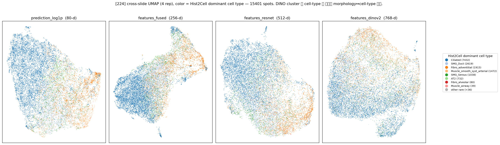
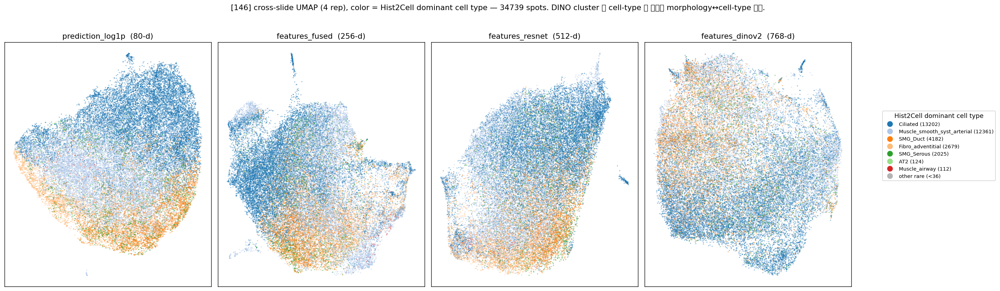
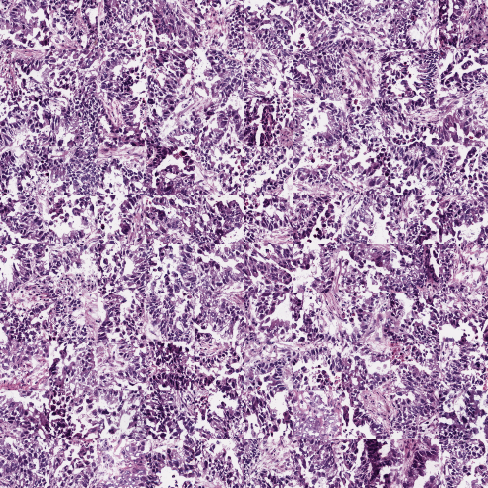
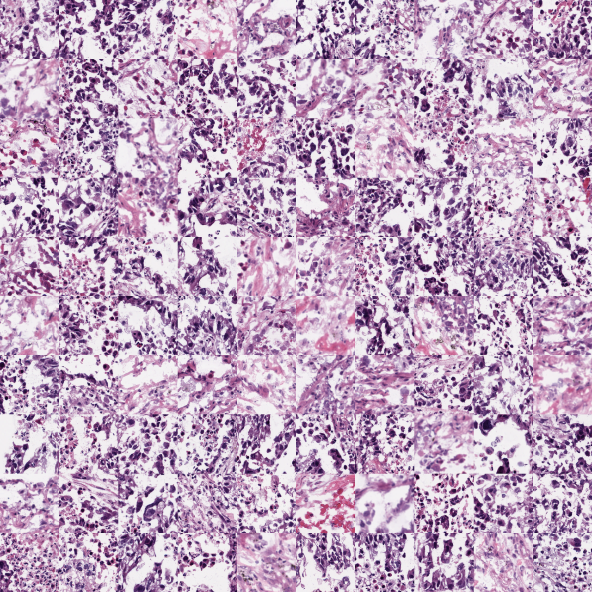

# DINO cluster(=Hist2Cell dominant cell type) 패치 grid + UMAP — 224 / 146

생성: 2026-05-29. 스크립트: `lung_pilot/dino_cluster_patches.py` (224·146 각각).

## 무엇을

해상도별(224 native 112µm / 146 HEX-FOV 73.2µm·OOD)로 3 슬라이드를 합쳐:

1. **dominant cell type** = `argmax(Hist2Cell prediction)` 으로 각 spot 에 cell-type 라벨 부여.
2. **4 representation cross-slide UMAP** (`prediction_log1p` / `features_fused` / `features_resnet` /
   `features_dinov2`) 을 그 dominant cell type 으로 **색칠** → DINO morphology cluster 가 Hist2Cell
   cell-type 과 **모이는지(일치)/분산되는지(불일치)** 확인.
3. cluster = dominant cell type (spot ≥36). 각 cluster 의 **`features_dinov2` centroid 최근접 100 패치**(부족하면
   최대한 정방형)를 **거리 오름차순(좌상단=가장 대표적)**으로 무간격 정방형 grid PNG.
4. 추적 CSV: `cluster, grid_index(좌상단→우하단), slide, spot_id, x, y, dist_to_centroid`.

| 해상도 | spots | grid cluster (≥36) | rare(<36, grid 생략) | PNG | CSV |
|---|---|---|---|---|---|
| 224 | 15,401 | 8 | 10 | `cluster_01~08_*.png` | `dino_clusters_224.csv` (719행) |
| 146 | 34,739 | 7 | 8 | `cluster_01~07_*.png` | `dino_clusters_146.csv` (700행) |

> ⚠️ 색이 `argmax(prediction)` 이라 **`prediction_log1p` 패널의 깔끔한 분리는 부분적으로 동어반복**(같은
> 벡터로 색과 좌표를 모두 정의). 정보가 있는 패널은 **`features_dinov2`·`features_resnet`·`features_fused`** —
> 즉 *morphology 임베딩이 cell-type 라벨을 복원하는가*.

## UMAP — dominant cell type overlay

### 224 (native 112µm)

- `prediction_log1p`: dominant type 별로 또렷한 영역(파랑 Ciliated 덩어리 ↔ 주황 AT2/alveolar). (동어반복 주의)
- `features_dinov2`/`resnet`/`fused`: 같은 cell-type 색이 **연속 gradient 로 퍼짐** — discrete cluster 가 아니라
  morphology 연속체. 즉 DINO morphology ↔ Hist2Cell cell-type 은 **부분 대응(soft)**, 1:1 아님.

### 146 (HEX FOV 73.2µm, OOD)

같은 경향. Ciliated·Muscle(파랑) ↔ alveolar(주황 하단) 축. DINO 패널은 224 보다도 cell-type 경계가 흐려,
좁은 FOV 에서 morphology 가 더 균질해짐(타일이 빽빽한 기도/근육 구조로 채워짐)을 시사.

## 패치 grid (cluster = dominant cell type, 좌상단=centroid 최근접)

클러스터 간 형태소가 실제로 구분되는지의 직접 증거.

### 224 Ciliated (#1, 100패치 10×10)

조밀한 청색(핵 풍부) 상피/종양성 조직이 일관 — DINO 가 같은 morphology 를 잘 모음.

### 224 Muscle_smooth_syst_arterial (#4, 100패치 10×10)

호산성 분홍(평활근/기질) + 적혈구가 섞인 패치 — Ciliated 와 **육안으로 명확히 다른** morphology.

(나머지: 224 `cluster_02_SMG_Duct` ~ `cluster_08_Muscle_airway`, 146 `cluster_01~07`. 폴더 참조.)

## 분석 포인트 — 모여있나 분산됐나

- **클러스터 내부**: centroid 최근접 100 패치는 cell-type 마다 형태소가 일관(Ciliated 청색 상피 vs Muscle
  분홍 근육) → DINO 의 "대표 패치" 는 morphology-coherent.
- **클러스터 간 (UMAP)**: `features_dinov2` 상에서 dominant cell type 들은 **완전히 분리되지 않고 연속적으로
  겹친다.** 특히 SMG_Serous/SMG_Duct(샘), Muscle 계열끼리는 morphology 가 가까워 UMAP 에서 인접·혼재.
  → DINO 는 cell-type 을 **이산 cluster 로 분리하지 않고 morphology 축으로 정렬**. Hist2Cell cell-type 과는
  부분 일치(같은 큰 계열은 모이나, 세부 type 경계는 morphology 로 안 갈림).
- **224 vs 146**: 146(좁은 FOV)에서 DINO morphology 가 더 균질 → cell-type 변별이 224 보다 약함.
  ⚠️ 단 146 은 Hist2Cell·DINO 모두 OOD 입력이므로(73.2µm 업샘플), 절대 비교가 아닌 경향으로만.

## 정직한 한계
- dominant type 은 argmax 1종만 — abundance 가 섞인 spot 의 실제 조성을 단순화. 색=argmax 이므로
  prediction 패널 해석은 circular.
- 146 prediction/feature 는 OOD-FOV 출력. cell-type 라벨 자체가 224 와 다를 수 있음(앞 TOP10 참조).
- rare dominant type(<36 spot)은 grid 생략 — UMAP·CSV 에는 'other rare' 로만 표기.

## 산출물
- `224/`, `146/`: `umap_4rep_by_dominant_ct.png` + `cluster_NN_<type>.png` + `dino_clusters_<res>.csv` + `embeddings/`
- CSV 로 각 grid 패치의 slide·spot_id·픽셀좌표(x,y) 역추적 가능 (grid_index 순 = 좌상단→우하단).
