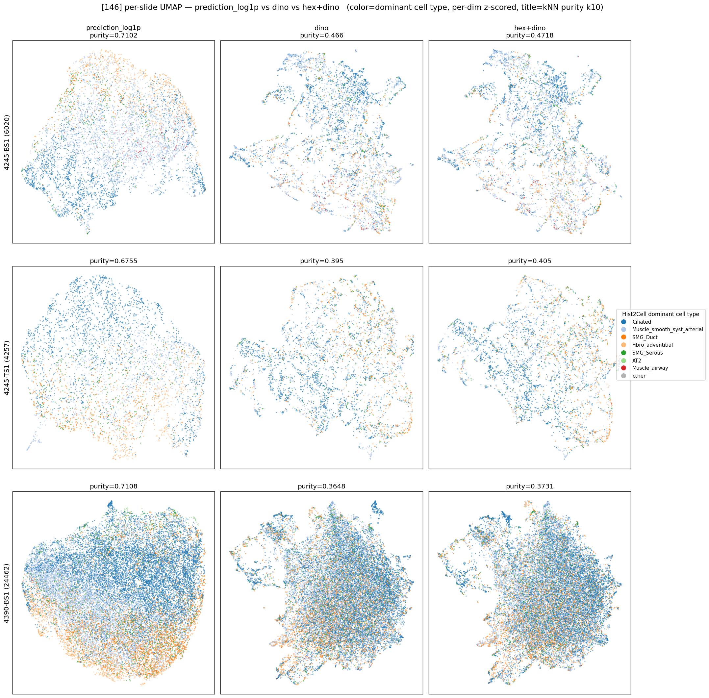

# 146 — prediction_log1p vs dino vs hex+dino, cell-type 근접성 비교

생성: 2026-06-01. 스크립트: `lung_pilot/hex_compare.py --label 146` (+ 가중 분석 inline).
데이터: prediction = `inference_output_146`, dino = `/mnt/fileserver/lung_pilot/dino_output_146`,
hex+dino(agg 768+19) = `/mnt/fileserver/lung_pilot/dino_hex_agg_146`.
**TS1 agg N버그(24462→4257) 정정 확인 완료** (2026-06-01 09:22 재생성) → 3 슬라이드 모두 정상.

방법·지표는 224 와 동일 (dominant cell type kNN purity k=10, per-dim z-score). 224 비교본:
`../hex_compare_224/summary.md`.

## 3×3 per-slide UMAP

## 정량 — kNN purity (k=10), 가중 방식별

| slide | dino_only | hex_only(19d) | hex+dino (per-dim z) | hex+dino (block-EQ) | prediction(circular) |
|---|---|---|---|---|---|
| 4245-BS1 | 0.466 | 0.442 | 0.472 | 0.473 | 0.710 |
| 4245-TS1 | 0.395 | **0.430** | 0.405 | **0.431** | 0.676 |
| 4390-BS1 | 0.365 | **0.398** | 0.373 | **0.391** | 0.711 |

- per-dim z-score: hex+dino > dino 3슬라이드 모두 (+0.006~0.010) — 224(+0.004~0.006)보다 약간 큼.
- **block-EQ (공정 가중)**: **TS1 +0.036, 4390 +0.027** 로 **의미있게 상승**, BS1 +0.007(flat).
- **hex_only(19d)**: TS1·4390 에서 **dino 보다 높음**(+0.035, +0.033). BS1 만 −0.024.

## 결론 — **224 와 상반: 146 에선 hex 가 2/3 슬라이드에서 도움**

224(Hist2Cell in-domain)에선 hex 가 무의미했으나, **146 에선 block-EQ 로 TS1·4390 이 dino 대비
+0.027~0.036, hex 단독도 dino 를 앞선다.** 가설(hex+dino > dino)이 **부분 지지**된다 — 단 BS1 은 예외라
완전 일관은 아님.

### 왜 224 와 다른가 (해석)
146 은 좁은 FOV(73.2µm·OOD)라 **DINO morphology 가 균질해져 cell-type 변별력이 떨어진다**
(dino purity 4390: 224 0.510 → 146 0.365). DINO 가 약해진 만큼 **HEX expression 블록이 상대적으로 더
기여** → hex 가 도움이 되는 regime. 즉 "morphology 가 약할 때 expression 이 보완한다" 는 그림.

## ⚠️ 146 특유의 해석 주의 (224 보다 더 조심)
- **라벨이 OOD**: 여기 "cell type" = Hist2Cell 이 **146 OOD 입력**에서 낸 prediction 의 argmax.
  분포가 Ciliated+Muscle 에 ~73% 쏠려(앞 TOP10·celltype_examples_146 참조) 라벨 자체가 불안정.
  purity 절대치·개선폭을 ground truth 로 읽으면 안 됨.
- **도메인 비대칭**: 146 에서 HEX 는 **in-domain**(eff. mpp 0.327≈학습 0.325)인데, Hist2Cell(라벨)·
  DINO 는 그렇지 않다. hex 가 dino 를 앞서는 건 "HEX 가 더 정확" 이기도 하지만 "DINO·라벨이 OOD 로
  무너진" 효과도 섞임 — 둘을 분리하려면 실제 cell-type GT 필요.
- 224 와 동일한 구조적 한계(라벨=H&E-형태 유래 prediction → morphology 편향)도 그대로 적용.

## 종합 (224 + 146)
- **in-domain(224)**: hex 추가 효과 **무의미**.
- **OOD-FOV(146)**: morphology 가 약해진 regime 에서 hex 가 **부분적으로 도움**(2/3 슬라이드, block-EQ).
- 방향은 사용자 직관과 일부 부합하나, **라벨이 Hist2Cell 예측(특히 146 은 OOD)** 이라 확정 결론은
  실제 cell-type ground truth 가 있어야 가능.

## 산출물
- `umap_3x3_pred_dino_hexdino.png`, `knn_purity.csv`, `knn_purity_weighting.csv`, `embeddings/`
