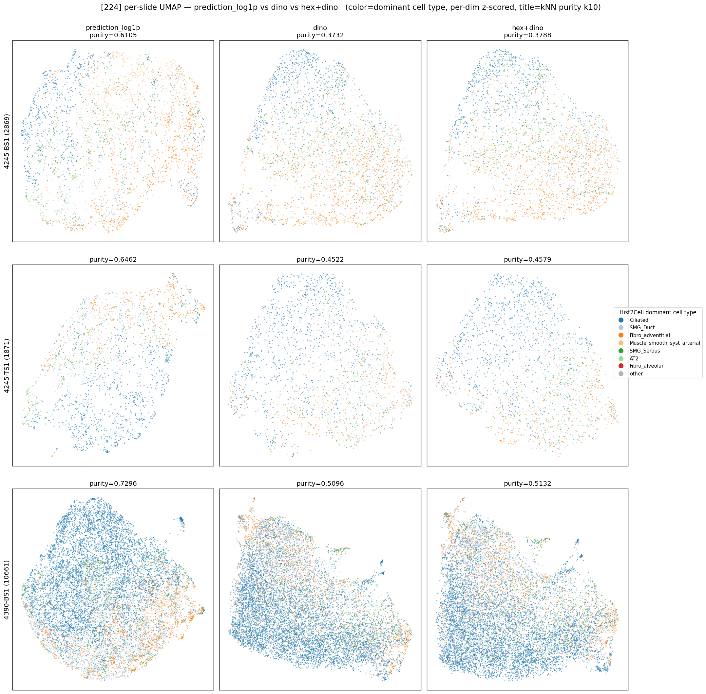

# 224 — prediction_log1p vs dino vs hex+dino, cell-type 근접성 비교

생성: 2026-06-01. 스크립트: `lung_pilot/hex_compare.py` (+ 가중 분석 inline).
데이터: prediction = `inference_output/<s>/predictions.npy`, dino = `/mnt/fileserver/lung_pilot/dino_output`,
hex+dino(agg 768+19) = `/mnt/fileserver/lung_pilot/dino_hex_agg`. (224 grid, 3 슬라이드 모두 N 정상)

## 질문 / 가설
사용자 가설: **hex+dino 가 dino 보다 Hist2Cell cell-type 으로 더 뭉친다.**
검증: 색 = Hist2Cell dominant cell type(argmax prediction), 지표 = **dominant-type kNN purity**
(k=10, 같은 type 이웃 비율; 높을수록 cell-type clustering). 전처리는 per-dim z-score(블록 스케일
~100배 차이 보정).

## 3×3 per-slide UMAP

행=슬라이드, 열=[prediction_log1p / dino / hex+dino]. prediction 열은 cell-type 별 영역이 또렷
(색이 argmax 출처라 **circular = 상한 기준**). **dino 와 hex+dino 열은 육안으로 거의 동일** — 색이
더 섞여 있고 둘 사이 차이가 안 보인다.

## 정량 — kNN purity (k=10), 가중 방식별

| slide | dino_only | hex_only(19d) | hex+dino (per-dim z) | hex+dino (block-EQ) | prediction(circular) |
|---|---|---|---|---|---|
| 4245-BS1 | 0.373 | 0.360 | 0.379 | **0.391** | 0.611 |
| 4245-TS1 | 0.452 | 0.425 | 0.458 | 0.455 | 0.646 |
| 4390-BS1 | 0.510 | 0.477 | 0.513 | 0.512 | 0.730 |

- **per-dim z-score**: hex+dino > dino 가 3슬라이드 모두 성립하나 **+0.004~0.006(≈1%)** — 무시할 수준.
  hex 가 787차원 중 19차원(2.4%)이라 희석됨.
- **block-EQ**(hex 블록 ↔ dino 블록 동등 가중, 공정 검증): 4245-BS1 만 +0.018, 나머지 +0.002~0.003.
  **일관되지 않고 미미**.
- **hex_only(19d) 단독**: dino 보다 **오히려 낮음** (Δ −0.013/−0.027/−0.032, 3슬라이드 모두).

## 결론 — 가설 **지지되지 않음** (224 in-domain, 이 지표 기준)

방향(per-dim)은 일관되게 +였지만 **효과 크기가 ~1% 로 무의미**하고, 공정 가중(block-EQ)에서도
3슬라이드 중 1개만 작게(+0.018) 올라 **재현성이 없다**. HEX 19-d 단독은 dino 보다 cell-type 응집이
낮다. 즉 **(224 에서는) HEX 를 더해도 Hist2Cell cell-type clustering 이 의미있게 좋아지지 않는다.**

> **146 과 대조 (`../hex_compare_146/summary.md`)**: 146(OOD-FOV)에선 DINO morphology 가 약해져
> hex 가 **2/3 슬라이드에서 도움**(block-EQ +0.027~0.036). 즉 효과가 **해상도 의존적** — morphology 가
> 강한 in-domain(224)에선 무의미, 약한 OOD(146)에선 부분 보완. 단 146 은 라벨도 OOD라 더 조심.

## ⚠️ 단, 지표의 구조적 한계 (negative 를 과신하지 말 것)
- 여기서 **"cell type" = `prediction_log1p` 의 argmax (Hist2Cell dominant cell type)** 다.
  그리고 `prediction_log1p` 자체가 **Hist2Cell 이 H&E 패치(형태)에서 예측**한 값이다
  (ResNet18 인코더→GAT→Transformer→head 가 모두 H&E 에서 출발). 즉 라벨이 **morphology 유래**.
  → morphology 임베딩인 **DINO 는 prediction 과 태생적으로 부분 정렬**된다.
  HEX 는 expression 모달리티라, 시각적으로 안 드러나는 cell-type 정보를 담더라도 이 지표(=H&E-유래
  prediction 과의 정렬)는 그것을 **크레딧하지 못한다**.
- 즉 이 결과는 "**HEX 가 Hist2Cell 의 H&E-기반 cell-type call 에 정렬되지 않는다**" 는 뜻이지,
  "HEX 가 진짜 cell type 정보를 못 담는다" 가 아니다. 공정한 판정엔 **실제 cell-type ground truth**
  (Visium cell2location 등)가 필요하나 TCGA-LUAD 엔 없다.
- 색=argmax 1종 단순화, kNN purity 는 국소 지표.

## 산출물
- `umap_3x3_pred_dino_hexdino.png`, `knn_purity.csv`(per-dim), `knn_purity_weighting.csv`(가중 비교), `embeddings/`
- 코드 `lung_pilot/hex_compare.py` (경로 인자형 — 146 TS1 agg 재생성되면 `--label 146` 으로 동일 실행).
