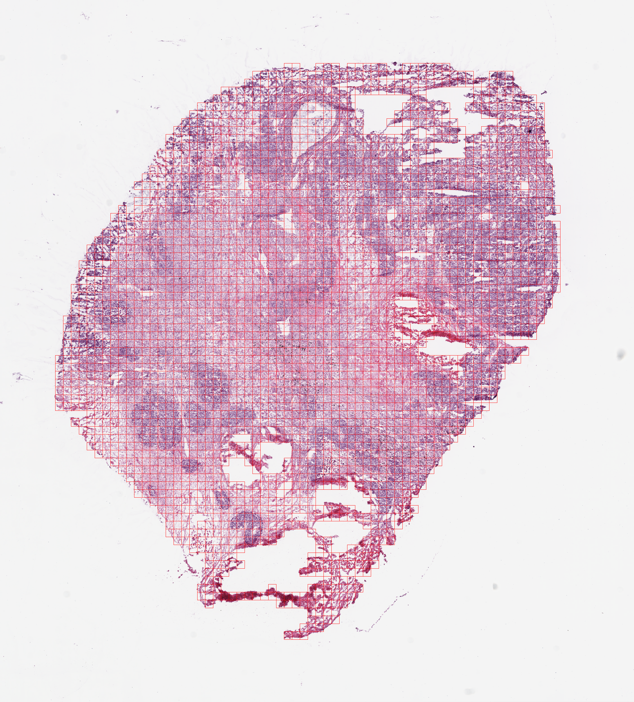
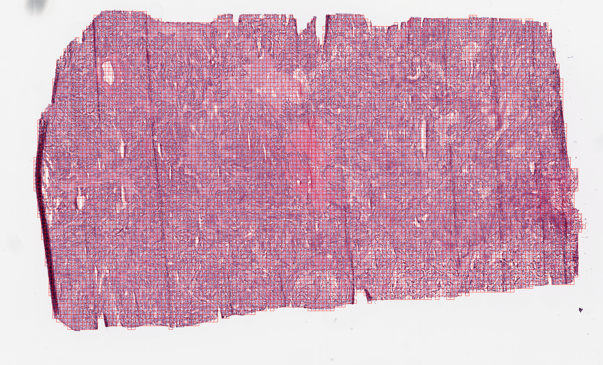

# TCGA-LUAD WSI 타일링 결과 (224×224)

`WSI_tile_sampling_framework` 의 `WSITileSampler` 로 TCGA-LUAD 슬라이드 3장을
224×224 px 타일로 분할한 결과입니다.

## 실행 방법

```bash
cd WSI_tile_sampling_framework
/home/sjhong/hist2cell/.venv/bin/python run_tiling_tcga_luad.py
```

`tile_processing.py` CLI 는 `WSITileSampler` 를 positional 인자로 호출하면서
`min_tiles` 가 `overlap` 슬롯에, `is_normalized` 가 `min_tiles` 슬롯에 들어가는
인자 오정렬 버그가 있어, 별도 드라이버(`run_tiling_tcga_luad.py`)에서
명시적 kwargs 로 `WSITileSampler` 를 생성해 사용했습니다.

## 파라미터

| 항목 | 값 | 설명 |
|---|---|---|
| `tile_size` | 224 | level-0(원본 해상도) 기준 타일 한 변 크기 |
| `overlap` | 0 | 타일 간 겹침 없음 (stride = 224) |
| `min_tiles` | 5 | 후처리: tissue contour 클러스터당 최소 타일 수(미만이면 제거) |
| `is_normalized` | False | stain normalization 미적용 |
| tissue mask | YUV 다채널 + HSV/Otsu | `ForegroundMasker` 기본값 |

원본 슬라이드는 모두 **20x (objective-power 20, mpp ≈ 0.502 µm/px)** 이므로
224 px 타일은 실제 약 **112 µm** 영역에 해당합니다. (40x 슬라이드라면 56 µm)
Hist2Cell 추론에 쓰려면 배율 차이를 고려해야 합니다 — 본 작업은 좌표 추출까지만 수행.

## 슬라이드별 결과

| 슬라이드 | 원본 크기 (px) | 썸네일 | scaler | 조직 비율 | 타일 수 |
|---|---|---|---|---|---|
| TCGA-05-4245-01A-01-BS1 | 18000 × 19921 | 2250 × 2490 | 8 | 40.2% | 2,869 |
| TCGA-05-4245-01A-01-TS1 | 14000 × 13527 | 1750 × 1690 | 8 | 49.7% | 1,871 |
| TCGA-05-4390-01A-01-BS1 | 36001 × 21855 | 2250 × 1365 | 16 | 68.1% | 10,661 |

(타일 수는 아래 "참고" 의 centroid 버그 수정 후 값. 수정 전: 2,525 / 1,567 / 9,117.)

- **scaler**: 원본 → 썸네일(=mask) 다운스케일 배수. 세 슬라이드 모두
  최소 피라미드 레벨이 1M 픽셀을 넘어 framework 의 `thumbnail_level=-1` 로직이
  정상 동작 → scaler 가 `level_downsamples[-1]` 과 일치.
- **조직 비율**: foreground mask 가 양성인 픽셀 비율(썸네일 기준).

## 산출물 구조

```
lung_pilot/tilitng_output/TCGA-LUAD/
├── <name>.h5                          # full-res 타일 좌표 + metadata
├── Thumbnails/<basename>.png          # 슬라이드 썸네일 (실제 배열 해상도, 드라이버 저장)
├── Masks/<name>_tissue_mask.png       # 조직(foreground) mask, 0/255
├── Overlays/<name>_tiles.png          # 썸네일 위 타일 위치 overlay (QA)
└── tiling_summary.md                  # 본 문서
```
Thumbnails·Masks·Overlays 는 모두 동일 해상도(2250×2490 등)라 서로 겹쳐 검수할 수 있습니다.

### HDF5 내용

```python
import h5py
with h5py.File("TCGA-05-4245-01A-01-BS1.h5") as hf:
    coords = hf["coords"][:]          # (N, 2) int64, full-res top-left (x, y)
    meta   = dict(hf["metadata"].attrs)  # {tile_size:224, overlap:0, total_tiles:N}
```

`coords` 는 **원본 해상도(level 0) 기준 타일 좌상단 (x, y)** 이며 모두 224 배수입니다.
패치를 실제로 잘라내려면:
`openslide.OpenSlide(svs).read_region((x, y), 0, (224, 224))`.

## QA — 타일 overlay

붉은 격자가 샘플링된 224×224 타일 위치입니다. 조직 영역만 조밀하게 덮이고
배경·찢김·빈 공간은 제외된 것을 확인할 수 있습니다.

**TCGA-05-4245-01A-01-BS1** (2,869 타일) — 조직 가장자리 빈 영역과 내부 구멍이
타일링에서 빠져 있어 mask 기반 필터가 정상 동작. centroid 버그 수정 후 격자가
우·하단 조직 경계까지 닿음.



**TCGA-05-4390-01A-01-BS1** (10,661 타일) — 조직 비율 68%로 가장 크며,
가장자리 찢김부를 제외하고 본체 전체가 균일하게 타일링됨.



## 참고 — centroid 버그 수정 (framework 코드 변경)

`Tiling.py` 의 `filter_tiles_by_boundary()` 는 타일 centroid 를 **썸네일 좌표계**에서
계산하는데, 타일 반 변을 더할 때 `round(self.tile_size)` (= 224, 다운스케일 미적용)
를 써서 centroid 가 우하단으로 약 112 px(썸네일 px) 치우쳤습니다. 그 결과 모든
조직 contour 의 우·하단 가장자리에서 ~112 px 폭 타일 띠가 누락 — 타일 격자가
좌상단 기준 대각으로 ~5–8% 축소돼 보였습니다 (타일 13–19% 누락).

→ `round(self.tile_size / self.downscale_factor)` 로 **수정 완료**
(`WSI_tile_sampling_framework/Tiling.py`). 수정 후 우하단 비대칭이 사라지고
타일 수가 2,525→2,869 / 1,567→1,871 / 9,117→10,661 로 회복됐습니다.
본 문서의 결과·overlay 는 모두 수정 후 재타일링한 값입니다.
