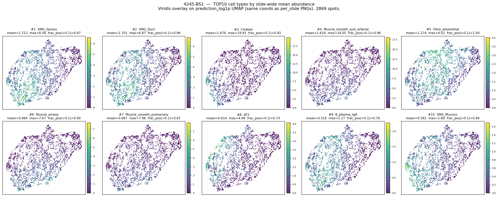
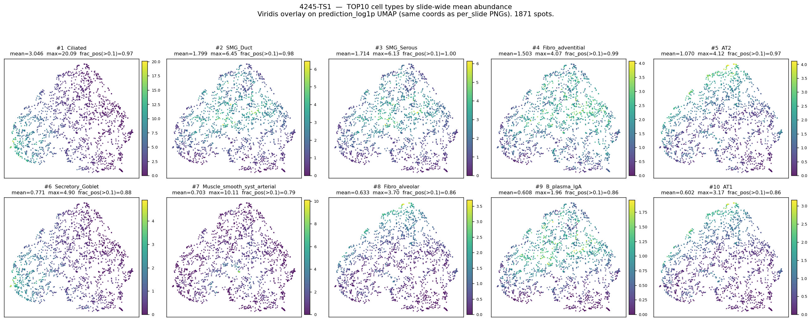
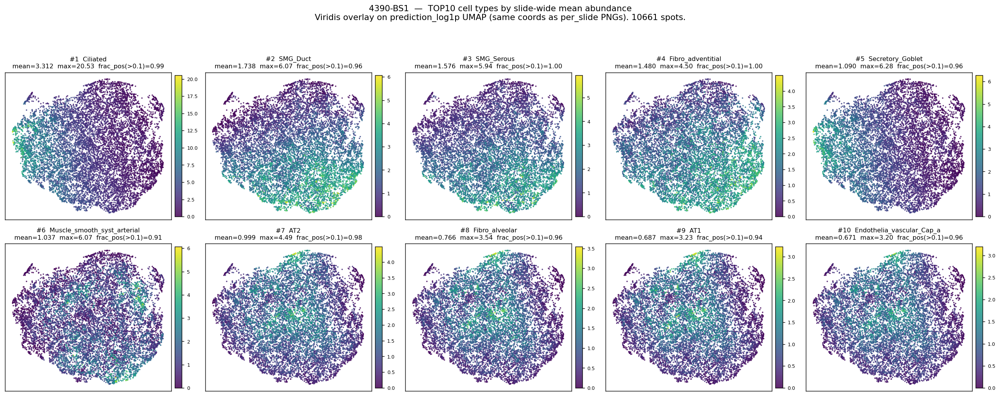

# Slide-별 TOP10 cell type — 통계 + UMAP overlay

생성 코드: [`lung_pilot/top10_umap.py`](../top10_umap.py)
원본 데이터: [`top10_stats.csv`](top10_stats.csv) / [`top10_union.csv`](top10_union.csv)
생성일: 2026-05-26

## 1. 정의

Breast 분석 ([`inference/analysis_spatial/1_085_12/cell_typing/analyze_cell_typing.py`](../../inference/analysis_spatial/1_085_12/cell_typing/analyze_cell_typing.py)
의 `plot_spatial_top10` / `ct_stats_df.head(10)`) 와 동일하게,
**슬라이드별 Hist2Cell prediction 의 spot-mean abundance 내림차순 상위
10 cell type** 을 TOP10 으로 정의. lung_pilot 3 슬라이드 각각에 적용.

각 cell type 별 보고 통계:
- `mean_abundance` = `predictions.npy[:, k].mean()` (slide 전체 spot 평균)
- `frac_pos_over_0.1` = abundance > 0.1 spot 비율 (얼마나 많은 spot 에서
  detectable 한가)
- `rank_in_slide` = mean abundance 기준 슬라이드 내 순위 (1 ~ 80)

UMAP 좌표는 `lung_pilot/umap_output/embeddings/<slide>_prediction_log1p_umap2d.npy`
의 캐시 재사용 — 기존 per-slide PNG 와 정확히 같은 좌표.

## 2. 슬라이드별 TOP10 표

### 2.1 TCGA-05-4245-01A-01-BS1 (2,869 spots)

| rank | cell type | mean_abundance | frac_pos > 0.1 |
|---|---|---|---|
| 1 | **SMG_Serous** | 1.712 | 0.972 |
| 2 | **SMG_Duct** | 1.701 | 0.957 |
| 3 | **Ciliated** | 1.676 | 0.915 |
| 4 | Muscle_smooth_syst_arterial | 1.618 | 0.960 |
| 5 | Fibro_adventitial | 1.274 | 0.998 |
| 6 | Muscle_airway | 0.964 | 0.896 |
| 7 | Muscle_smooth_pulmonary | 0.687 | 0.869 |
| 8 | AT2 | 0.614 | 0.727 |
| 9 | B_plasma_IgA | 0.516 | 0.782 |
| 10 | SMG_Mucous | 0.392 | 0.845 |

### 2.2 TCGA-05-4245-01A-01-TS1 (1,871 spots)

| rank | cell type | mean_abundance | frac_pos > 0.1 |
|---|---|---|---|
| 1 | **Ciliated** | 3.046 | 0.973 |
| 2 | SMG_Duct | 1.799 | 0.980 |
| 3 | SMG_Serous | 1.714 | 0.996 |
| 4 | Fibro_adventitial | 1.504 | 0.993 |
| 5 | AT2 | 1.070 | 0.974 |
| 6 | Secretory_Goblet | 0.771 | 0.876 |
| 7 | Muscle_smooth_syst_arterial | 0.703 | 0.793 |
| 8 | Fibro_alveolar | 0.633 | 0.858 |
| 9 | B_plasma_IgA | 0.608 | 0.862 |
| 10 | AT1 | 0.603 | 0.859 |

### 2.3 TCGA-05-4390-01A-01-BS1 (10,661 spots)

| rank | cell type | mean_abundance | frac_pos > 0.1 |
|---|---|---|---|
| 1 | **Ciliated** | 3.312 | 0.992 |
| 2 | SMG_Duct | 1.738 | 0.964 |
| 3 | SMG_Serous | 1.576 | 0.998 |
| 4 | Fibro_adventitial | 1.480 | 0.998 |
| 5 | Secretory_Goblet | 1.090 | 0.961 |
| 6 | Muscle_smooth_syst_arterial | 1.037 | 0.912 |
| 7 | AT2 | 0.999 | 0.980 |
| 8 | Fibro_alveolar | 0.766 | 0.959 |
| 9 | AT1 | 0.687 | 0.944 |
| 10 | **Endothelia_vascular_Cap_a** | 0.671 | 0.962 |

## 3. Cross-slide union / intersection

3 슬라이드 TOP10 의 **union = 14 type**, **intersection = 6 type**:

### 3.1 모든 슬라이드에서 TOP10 (intersection 6)

`AT2, Ciliated, Fibro_adventitial, Muscle_smooth_syst_arterial, SMG_Duct,
SMG_Serous`

→ 정상 폐의 *대기도/SMG/혈관-주변 평활근/AT2* 의 핵심 lineage 가 cross-slide
공통 high abundance. 종양 (LUAD) 슬라이드인데도 *모델이 보는 dominant
cell type 의 backbone* 은 정상 lung architecture 의 핵심 구성요소.

### 3.2 슬라이드별 unique TOP10 (intersection 외)

| cell type | 4245-BS1 | 4245-TS1 | 4390-BS1 | 해석 |
|---|---|---|---|---|
| SMG_Mucous | #10 | — | — | BS1 만; SMG 비중이 가장 높은 슬라이드 |
| Muscle_airway | #6 | — | — | BS1 만; 대기도 평활근 |
| Muscle_smooth_pulmonary | #7 | — | — | BS1 만; pulmonary smooth muscle |
| B_plasma_IgA | #9 | #9 | — | 4245 두 슬라이드만; immune-lymphoid 의 유일 cross-slide hit |
| Secretory_Goblet | — | #6 | #5 | 4390 + TS1; airway secretory |
| AT1 | — | #10 | #9 | 4390 + TS1; alveolar type 1 (BS1 은 11위 밖) |
| Fibro_alveolar | — | #8 | #8 | 4390 + TS1; alveolar fibroblast |
| **Endothelia_vascular_Cap_a** | — | — | #10 | 4390-BS1 만; capillary endothelia. 이전 UMAP 의 vascular cluster (좌하단) 와 일치 |

## 4. UMAP abundance overlay (slide-별 2×5)

각 panel = 한 TOP10 cell type 의 spot abundance, viridis (panel별 vmax).
좌표는 `prediction_log1p` UMAP (per-slide PNG 와 동일).

### 4.1 TCGA-05-4245-01A-01-BS1

SMG_Serous / SMG_Duct (TOP1-2) 의 high-abundance spot 들이 만들어내는
영역이 거의 동일 — 두 SMG sub-type 이 함께 잡힘 (실제 SMG 조직에는 두
세포가 같이 있는 것이 자연스럽다). Muscle 계열 3종 (#4, #6, #7) 도
slide 의 비슷한 region 을 공유. Fibro_adventitial 은 manifold 전반에
고르게 (frac_pos 0.998).

### 4.2 TCGA-05-4245-01A-01-TS1

Ciliated 가 압도적 (mean 3.0) — 거의 모든 spot 에서 high. SMG_Duct/Serous
도 거의 전 영역에서 detectable (frac_pos > 0.98). AT1/AT2 가 한쪽에
모이는 cluster 가 약하게 형성 (alveolar 영역). spot 수가 적어 cluster
structure 가 다른 두 슬라이드보다 흐릿.

### 4.3 TCGA-05-4390-01A-01-BS1

Ciliated (mean 3.3) 의 분포가 우측 큰 region 을 dominate. AT1/AT2 가
중앙-우상단 alveolar cluster 형성. **Endothelia_vascular_Cap_a (#10) 의
high-abundance spot 들이 좌하단에 명확한 cluster** — 이전 per-slide
UMAP (dominant lineage 색칠) 에서 본 vascular cluster 와 정확히 같은
위치. lineage-단위 (Vascular = 7 sub-types) 의 시각 효과의 *어느 sub-type*
이 그 cluster 를 형성하는지 본 figure 가 답해줌: capillary endothelia.

## 5. 핵심 관찰

1. **SMG 계열 (SMG_Serous, SMG_Duct, SMG_Mucous) 가 모든 슬라이드에서 매우 높음**
   — 정상 폐의 SMG 는 *대형 기관지 점막하* 에만 있는 작은 분비샘인데,
   본 데이터 3 슬라이드 모두에서 TOP10 안. 두 가지 가능성:
   - (a) 슬라이드에 실제 대형 기관지 cross-section 이 포함됨 (TCGA-LUAD
     의 일부 종양 옆 정상 구역).
   - (b) **Hist2Cell 의 SMG cell type representation 이 LUAD 의 신생
     epithelial / glandular morphology 와 시각적으로 유사 → 종양 영역도
     SMG 로 부른다**. (LUAD 가 acinar / lepidic / papillary 등 glandular
     subtype 이 많아 SMG morphology 와 겹친다는 가설.)
   - 본 데이터로 두 가능성 구분 불가. 원본 H&E 의 SMG region 직접
     확인 + 종양/정상 영역 라벨링 필요.
2. **Ciliated 는 모든 슬라이드에서 high**, 4245-TS1·4390-BS1 에선 1위
   (mean 3.0–3.3). dominant lineage 분포에서 Epithelial-airway 72%
   였던 결과와 정합 — airway lineage 의 대표.
3. **AT2/AT1 (alveolar epithelial) 는 TS1·4390-BS1 의 TOP10 에 들어가지만
   순위는 낮음** (5위 / 9위 / 10위 등). 정상 폐의 majority 인 alveolar
   가 본 슬라이드에선 *abundance scale 로는 SMG/Ciliated 보다 낮음*.
4. **Vascular** (Endothelia_vascular_Cap_a) 는 *4390-BS1 만* TOP10 진입 (#10).
   이전 per-slide UMAP 의 vascular cluster (좌하단) 와 정량으로 일치.
5. **Stromal-fibroblast / Stromal-muscle 의 sub-type 들이 cross-slide
   공통 TOP10** (Fibro_adventitial, Muscle_smooth_syst_arterial) — 종양
   slide 에서도 정상 stromal architecture (혈관-주변 평활근, 외막 섬유아세포)
   가 일관 detectable.
6. **Immune 계열은 거의 안 보임** — B_plasma_IgA 만 4245 두 슬라이드의 #9
   에 있고 나머지 (T cell, Macrophage, NK 등) 는 80 type 의 mean 으로
   계산 시 TOP10 진입 못 함. cell2location 학습이 lung "정상" 기준이라
   종양 미세환경의 면역 침윤 패턴은 abundance scale 로는 약함.

## 6. 한계 / 주의

- **mean abundance 는 cell2location scale** — *확률 아님, 단위 spot 당
  cell count 비례 추정값*. 슬라이드 간 absolute mean 비교는 신중 (preprocessing /
  patch 분포 / tissue area 차이 영향).
- **TOP10 정의는 mean 기반** — `frac_pos > 0.1` (얼마나 광범위) 와 다를
  수 있음. 예: 일부 cell type 은 일부 region 에서 매우 높지만 전 영역으론
  중간 (mean 작음). 본 표의 frac_pos 칼럼이 그 차이 보여줌.
- **`Hist2Cell 가 lung 정상조직 학습 모델`** — TCGA-LUAD 의 종양 영역에서
  abundance 가 어떻게 distort 되는지는 별도 검증 필요. 정상 reference 와의
  비교 없이 cross-tissue 적용한 결과.
- **TOP10 의 cell type 식별이 자동으로 ground truth 는 아님** — Hist2Cell
  prediction 의 self-consistency 안에서의 "이 모델이 본 가장 풍부한 cell".
  실측 검증 (IHC, spatial transcriptomics) 필요.

## 7. 다음 단계

1. **HEX/expression 결과 도착 시** — TOP10 cell type 의 paired 분석 (cell
   type X spatial pattern vs gene expression).
2. (선택) **TOP10 의 spatial scatter** (breast 방식) — UMAP 이 아닌 실제
   tissue mask 위에서의 spot 좌표 (data.pos) 로 abundance overlay.
   `lung_pilot/tilitng_output/<slide>/Masks/` 의 tissue mask 활용.
3. (선택) **종양/정상 영역 manual annotation** — SMG_* dominance 가 진짜
   SMG 인지 LUAD glandular morphology 인지 구분.
