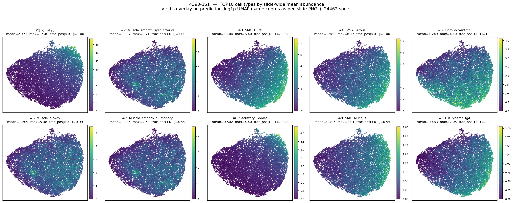
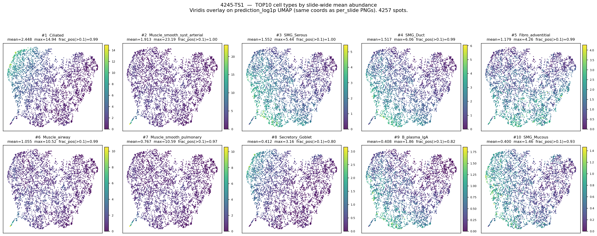
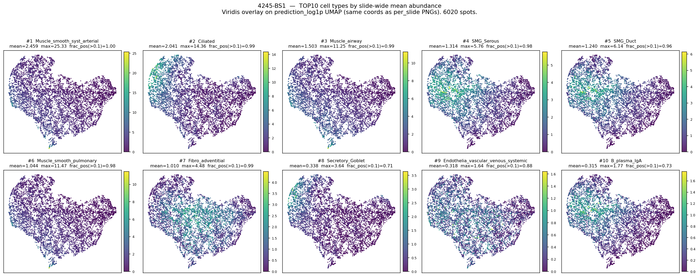

# 146-grid Slide-별 TOP10 cell type (HEX FOV 73.2µm) — 224 대비

생성: 2026-05-29. 스크립트: `lung_pilot/top10_umap.py --infer-dir inference_output_146 --emb-dir umap_output_146/embeddings --out-dir top10_output_146`

정의(224 와 동일): 슬라이드별 **mean abundance 상위 10 cell type**. overlay 는 prediction_log1p UMAP 좌표
(146 per_slide PNG 와 동일 좌표, deterministic UMAP) 위 viridis. 입력은 146px(73.2µm)→224 resize 그래프.

> ⚠️ **FOV-OOD 전제**: 146 은 Hist2Cell 학습 FOV(112µm)보다 좁은 입력이다. 슬라이드(조직)는 224 와
> **동일** — 따라서 아래 224↔146 TOP10 변화는 *조직 조성의 변화가 아니라 입력 FOV 가 좁아질 때
> Hist2Cell 예측이 어떻게 이동하는가* 라는 **모델 민감도** 신호다. abundance 절대치는 OOD 출력이므로
> 보조 정보로만 읽는다.

## 핵심: 224 → 146 TOP10 변화 (intersection 6 → 9 종)

| cell type | 계열 | 224 (n_slides) | 146 (n_slides) | 변화 |
|---|---|---|---|---|
| Ciliated | airway | 3 | 3 | 유지 (146 #1 우세) |
| Muscle_smooth_syst_arterial | muscle | 3 | 3 | 유지 |
| SMG_Serous / SMG_Duct | glandular | 3 | 3 | 유지 |
| Fibro_adventitial | stromal(기도주변) | 3 | 3 | 유지 |
| **Muscle_airway** | airway-muscle | 1 | **3** | ▲ 상승 |
| **Muscle_smooth_pulmonary** | muscle | 1 | **3** | ▲ 상승 |
| **Secretory_Goblet** | airway-secretory | 2 | **3** | ▲ 상승 |
| **B_plasma_IgA** | 점막 면역 | 2 | **3** | ▲ 상승 |
| **AT2** | **alveolar** | 3 | **0** | ▼ TOP10 탈락 |
| **AT1** | **alveolar** | 2 | 0 | ▼ 탈락 |
| **Fibro_alveolar** | **alveolar** | 2 | 0 | ▼ 탈락 |
| **Endothelia_vascular_Cap_a** | 폐포 모세혈관 | 1 | 0 | ▼ 탈락 |

**방향이 일관**: 좁은 FOV(73.2µm)에서 **alveolar 폐포 실질(AT1·AT2·Fibro_alveolar·모세혈관)이 일제히 하락**,
**기도/분비샘/평활근(Muscle_airway·Goblet·SMG·Muscle_pulmonary)이 일제히 상승**.
해석(가설): 작은 시야는 조직이 빽빽이 차는 **전도성 기도벽·샘·근육** 구조를 더 강하게 잡고, 공기 공간이 많아
넓은 시야가 필요한 **폐포 실질**은 덜 등록된다. 세 슬라이드에서 같은 방향 → 재현성 있는 FOV 효과.

## Per-slide TOP10 overlay

각 패널 = 한 cell type, viridis = 그 type 의 abundance(spot). 제목에 mean·max·frac_pos(>0.1).

### 4390-BS1 (24,462 spots)

상단의 분리된 작은 군집이 Ciliated 등 기도 type 에서 일관되게 high → 기도(airway) 영역. 근육/샘 type 은 다른 호.

### 4245-TS1 (4,257 spots)

### 4245-BS1 (6,020 spots)

## 산출물
- `top10_stats.csv` — 3 슬라이드 × 80 cell type 의 mean/std/frac_pos/rank
- `top10_union.csv` — 3 슬라이드 TOP10 union(11종)/rank/mean. intersection 9종:
  Ciliated, Muscle_smooth_syst_arterial, Muscle_airway, SMG_Serous, SMG_Duct,
  Muscle_smooth_pulmonary, Fibro_adventitial, Secretory_Goblet, B_plasma_IgA
- `top10_<slide>.png` ×3 — overlay

## 정리
- 224 TOP10 과 **상위 골격(Ciliated·SMG·arterial muscle·Fibro_adventitial)은 공유**, 단 alveolar↔airway
  비중이 FOV 에 따라 체계적으로 이동.
- 이 표는 **HEX(같은 146 FOV)** 와 비교할 때 "동일 FOV 에서 Hist2Cell 이 강조하는 cell type" 기준선이 된다.
- 224 vs 146 의 차이는 모델-FOV 민감도이지 조직 차이가 아님 — biology 결론으로 직행 금지.
