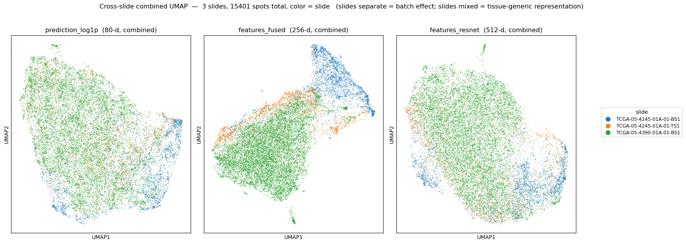
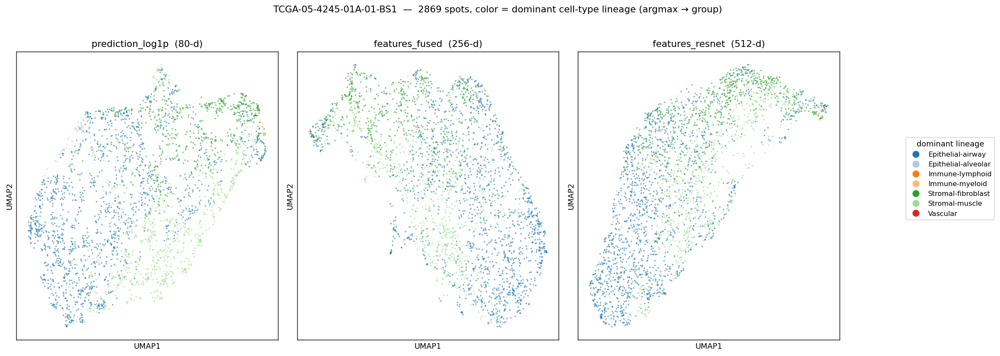
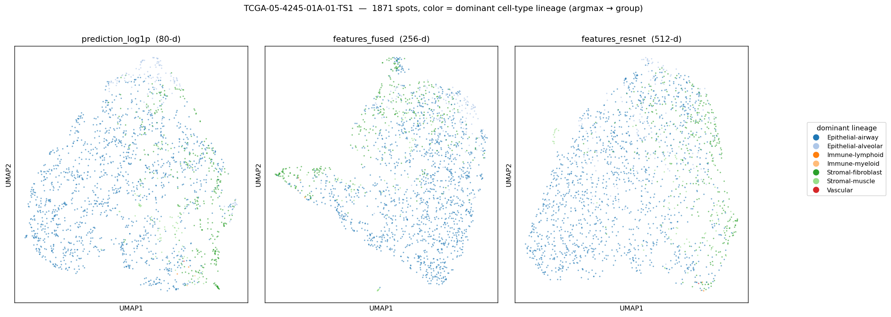
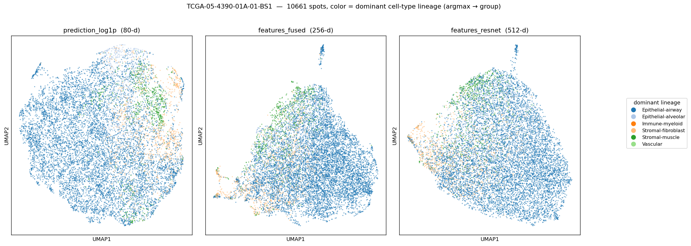

# UMAP 비교 — Hist2Cell 의 3 representation × 3 슬라이드

생성 코드: [`lung_pilot/umap_compare.py`](../umap_compare.py)
생성일: 2026-05-24

## 1. 목적

`lung_pilot` 의 TCGA-LUAD 3장 슬라이드 (4245-BS1/TS1, 4390-BS1) 에서
**Hist2Cell 의 어떤 layer 의 representation 이 cell-type 분리에
유리한지**, 그리고 **얼마나 tissue-generic vs slide-specific 한지**
를 UMAP 으로 살펴보기 위한 사전 비교.

이후 HEX/DINO 모델 결과가 도착하면 같은 spot 단위에서 두 모델의
임베딩을 비교할 때 "Hist2Cell 쪽에서 어느 representation 을 쓸 것인가"
의 기준선을 만든다.

## 2. 입력 — Hist2Cell 의 세 representation

`inference/infer.py` 의 `Hist2Cell.forward(..., return_features=True)` 가
prediction 외에 두 layer 의 representation 을 함께 반환하도록 확장
(commit `49c1406`). 3 슬라이드 모두 다음 세 가지를 저장.

| 이름 | 차원 | 의미 |
|---|---|---|
| `prediction_log1p` | 80 | `predictions.npy` 에 `np.log1p` 적용. 80 cell-type abundance 자체. row_sum 1.3–62.8 의 큰 scale 차이를 누른다. |
| `features_fused` | 256 | `(x_spot_e + x_local + x_global) / 3`. fused_head 직전, visual + GAT graph + Transformer 가 합쳐진 spot representation. prediction 의 직접 precursor. |
| `features_resnet` | 512 | ResNet18 backbone 출력. graph 정보 미포함, ReLU 후 비음수. HEX 의 DINO 벡터와 가장 직접 대응되는 순수 visual feature. |

UMAP 파라미터 (3 representation 공통): `n_neighbors=15, min_dist=0.1,
metric='euclidean', random_state=42`. 색칠 기준은 두 가지.

- **Per-slide PNG (3장)** — color = 각 spot 의 dominant cell-type lineage
  (`predictions.argmax` → `cell_type_groups.csv` 의 `group`).
  10개 lineage 카테고리 (Epithelial-{alveolar, airway}, Immune-{lymphoid,
  myeloid}, Stromal-{fibroblast, muscle}, Vascular 등).
- **Cross-slide PNG (1장)** — 3 슬라이드 모든 spot 을 합쳐 한 UMAP 에
  fit. color = slide ID. **슬라이드별로 잘 섞이면 tissue-generic
  representation, 분리되면 batch / slide-specific signal 이 강함.**

## 3. 결과

### 3.1 Cross-slide combined — representation 별 batch effect

3 슬라이드 (총 15,401 spots) 를 합쳐 representation 별로 따로 UMAP 을
fit. 점 색은 slide ID (파 = 4245-BS1, 주 = 4245-TS1, 초 = 4390-BS1).

- **prediction_log1p (80-d)** — 세 슬라이드가 거의 완전히 뒤섞여
  같은 manifold 위에 분포. 즉 Hist2Cell 의 cell-type 예측 공간은
  슬라이드 간 비교가 가능한 **tissue-generic 좌표계**. 슬라이드 사이즈
  차이 (TS1 1.9k vs 4390-BS1 10.7k) 가 색 밀도에 보일 뿐 cluster
  구조는 슬라이드별로 분리되지 않음.
- **features_fused (256-d)** — 4390-BS1 (초록) 이 왼쪽 큰 region 을,
  4245-TS1 (주황) 이 우측 상단 일부를 점유하는 등 **부분적 슬라이드별
  cluster** 가 나타남. 단 중앙부는 여전히 섞임. graph context 가
  cell-type-like 신호를 일부 보존하면서도 slide-specific 한
  visual/구조 패턴이 더 살아남.
- **features_resnet (512-d)** — 4245 두 슬라이드 (파, 주) 가 함께
  좌측, 4390-BS1 (초록) 이 우측 별도 region 으로 **가장 강한 슬라이드별
  분리**. raw visual feature 가 환자/슬라이드별 stain/조직 morphology
  차이를 직접 반영하기 때문. (TCGA-LUAD 같은 multi-batch 데이터에서는
  resnet feature 만 쓸 경우 batch 가 cell-type 신호를 가릴 위험.)

**함의** — HEX/DINO 와 비교할 때, "두 모델이 cell-type 공간에서 어떻게
대응하는가" 가 핵심이면 `prediction_log1p` 가 가장 깨끗한 출발점.
"두 모델의 통합 representation 이 얼마나 일치하는가" 가 핵심이면
`features_fused` 가 자연스럽고 (HEX expression + DINO 의 통합과 같은
abstraction level), DINO 와 직접 1:1 대응이 필요하면 `features_resnet`
↔ DINO 쌍 비교.

### 3.2 Per-slide — dominant cell-type lineage

각 슬라이드 별로 3 representation 의 UMAP 을 같은 색칠 (dominant
lineage) 로 비교. 슬라이드별로 dominant lineage 가 어떤 분포인지,
representation 이 그 분포를 cluster 로 잡아주는지 확인.

#### 3.2.1 TCGA-05-4245-01A-01-BS1 (2,869 spots)

대부분 spot 의 dominant lineage 는 **Epithelial-alveolar (파)** 와
**Immune-myeloid (연두)** 두 가지. 세 representation 모두 두 lineage
가 부분적으로 영역을 나누지만 cluster 가 깨끗하게 분리되진 않음
(혼재 영역 多). `prediction_log1p` 에서 cluster 구분이 가장 직관적이고,
`features_resnet` 으로 갈수록 cell-type 보다는 morphology-smooth gradient
가 두드러진다.

#### 3.2.2 TCGA-05-4245-01A-01-TS1 (1,871 spots)

TS1 도 alveolar (파) 우세 + 작은 myeloid (연두) pocket.
spot 수가 가장 적어 cluster structure 가 다른 두 슬라이드보다 약하다.
세 representation 모두 단일 큰 blob 형태로 cell-type별 명확한 분리는
보이지 않음 — TS1 자체가 조직학적으로 비교적 동질적인 영역을 다루는
section 일 가능성.

#### 3.2.3 TCGA-05-4390-01A-01-BS1 (10,661 spots)

가장 큰 슬라이드. `prediction_log1p` 에서 **Vascular (남색) cluster**
가 좌측 하단에 두드러지게 분리됨 — cell-type 공간에서 vasculature 영역이
명확. `features_fused` / `features_resnet` 으로 갈수록 vascular cluster
도 다른 spot 들과 다시 섞이고, cell-type 별 cluster 보단 광범위한
모폴로지 gradient 가 dominant. **여기가 prediction (cell-type) 공간과
backbone feature (모폴로지) 공간의 차이를 가장 잘 보여주는 슬라이드.**

## 4. 한계 / 주의

- **dominant lineage 만 색칠** — 한 spot 에서 두 lineage 가 비슷한 abundance
  여도 argmax 하나만 색이 됨. mixed spot 정보 손실. 정량 비교 (예: 두 모델의
  spot 별 cell-type composition 거리) 는 abundance vector 전체로 따로 측정 필요.
- **UMAP 의 global geometry 는 신뢰 X** — 점 사이의 *local neighborhood* 만
  신뢰. 슬라이드 간 cluster "거리" 를 정량적으로 읽지 말 것. batch effect 의
  강도도 본 PNG 만으로는 정성 판단; kNN overlap, silhouette by slide,
  scIB-style metric 등으로 정량화가 가능.
- **lung 학습 모델** — Hist2Cell 가중치는 healthy human lung 학습 (cell2location
  leave-A50-out). TCGA-LUAD 는 lung 도메인이라 OK 이지만 종양/정상 mix 인
  점, cell2location 자체가 abundance scale (확률 X) 인 점은 해석 시 명시.
- **UMAP 의 random state / 파라미터 의존성** — `n_neighbors=15, min_dist=0.1` 의
  default. 다른 hyperparameter 에서 cluster 모양이 꽤 다를 수 있음 — 본
  PNG 의 모양 자체를 "정답" 으로 쓰지 말 것.
- **결과 PNG 의 batch-effect 강약은 정성 관찰** — `resnet` 이 batch 강하다는
  관찰은 정성적 (눈으로 본 분리). 정량 metric (예: slide 에 대한 1-NN purity)
  은 후속 작업.

## 5. 다음 단계

1. **HEX/DINO 결과 도착 시** — `lung_pilot/graph_output/112/*.pt` 입력의
   HEX expression + DINO 벡터가 들어오면, 본 figure 와 동일한 framework
   으로 비교 UMAP 생성 (cross-slide + per-slide × cell-type).
2. **정량 metric 추가** (선택):
   - slide 1-NN purity (낮을수록 batch-mix 좋음) per representation.
   - representation 간 kNN overlap (Hist2Cell prediction vs features_fused vs
     features_resnet 의 같은 spot 이웃 일치도).
   - HEX/DINO 도착 후: Procrustes / CCA / kNN overlap 으로 두 모델의
     spot 임베딩 정합성 정량.
3. **prediction normalize 옵션 비교** (선택): 현재는 `log1p` 만 — row-normalize
   (abundance fraction) 와 비교해서 어느 쪽이 cell-type cluster 를 더 잘 잡는지.
