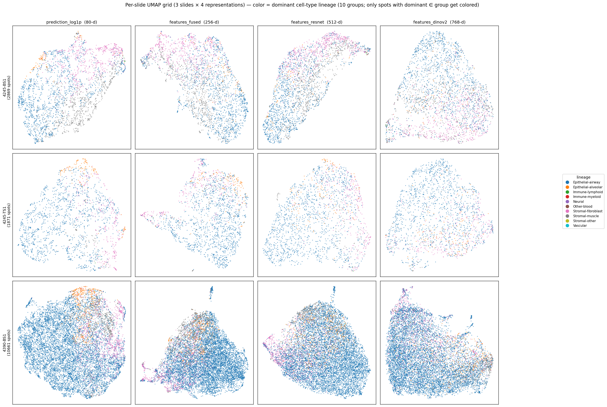
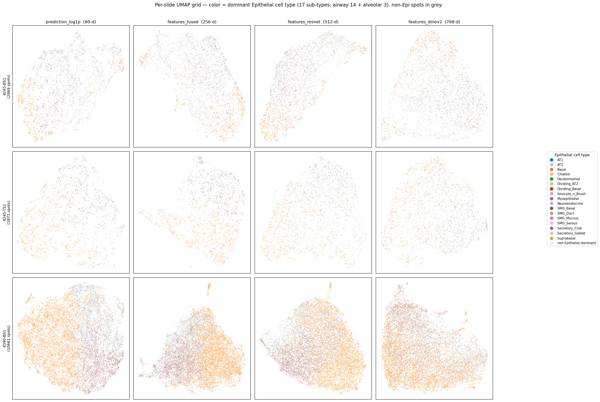
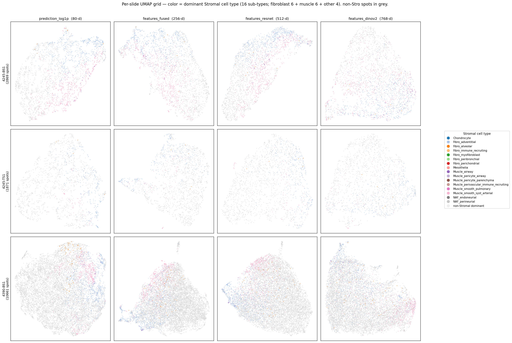

# UMAP 비교 — Hist2Cell 3 rep + DINOv2 ViT-B/14, 3 슬라이드

생성 코드: [`lung_pilot/umap_compare.py`](../umap_compare.py)
DINOv2 추론 코드: [`lung_pilot/dino_infer.py`](../dino_infer.py)
생성일: 2026-05-24 (Hist2Cell 3 rep) → 2026-05-25 (DINOv2 추가, 4 rep 으로 확장)

## 1. 목적

`lung_pilot` 의 TCGA-LUAD 3장 슬라이드 (4245-BS1/TS1, 4390-BS1) 에서
**Hist2Cell 의 어떤 layer 의 representation 이 cell-type 분리에
유리한지**, 그리고 **얼마나 tissue-generic vs slide-specific 한지**
를 UMAP 으로 살펴보기 위한 비교. 같은 patch (224×224, ImageNet-norm)
에 대해 **외부 self-supervised foundation model 인 DINOv2 ViT-B/14**
를 통과시킨 CLS feature 도 4번째 representation 으로 추가해, supervised
cell-type 학습 (Hist2Cell) vs self-supervised general visual encoder
(DINOv2) 의 spot 임베딩 양상을 직접 대조한다.

## 2. 입력 — 4 representation

`inference/infer.py` 의 `Hist2Cell.forward(..., return_features=True)` 가
prediction 외에 두 layer 의 representation 을 함께 반환하도록 확장
(commit `49c1406`). DINOv2 는 `lung_pilot/dino_infer.py` 가 같은
224 패치에 ViT-B/14 (CLS) 를 통과시켜 추출 (commit 예정).

| 이름 | 차원 | 모델 / layer | 의미 |
|---|---|---|---|
| `prediction_log1p` | 80 | Hist2Cell 출력 + `log1p` | 80 cell-type abundance (cell2location scale). row_sum 1.3–62.8 의 큰 차이를 누름. |
| `features_fused` | 256 | Hist2Cell, fused_head 직전 | `(x_spot_e + x_local + x_global) / 3`. visual + GAT graph + Transformer 통합 — prediction 의 직접 precursor. |
| `features_resnet` | 512 | Hist2Cell, ResNet18 backbone | graph 정보 미포함, ReLU 후 비음수. Hist2Cell 의 가장 raw 한 visual layer. |
| `features_dinov2` | 768 | DINOv2 ViT-B/14, CLS token | Meta 의 self-supervised foundation model (LVD-142M 학습). cell-type 정보 학습 없음, 일반 visual representation. ImageNet-norm 224 patch 직접 호환 (224 = 14 × 16, patch grid 16×16). |

UMAP 파라미터 (3 representation 공통): `n_neighbors=15, min_dist=0.1,
metric='euclidean', random_state=42`. 색칠 기준은 두 가지.

- **Per-slide PNG (3장)** — color = 각 spot 의 dominant cell-type lineage
  (`predictions.argmax` → `cell_type_groups.csv` 의 `group`).
  10개 lineage 카테고리 (Epithelial-{alveolar, airway}, Immune-{lymphoid,
  myeloid}, Stromal-{fibroblast, muscle}, Vascular 등).
- **Cross-slide PNG (1장)** — 3 슬라이드 모든 spot 을 합쳐 한 UMAP 에
  fit. color = slide ID. **슬라이드별로 잘 섞이면 tissue-generic
  representation, 분리되면 batch / slide-specific signal 이 강함.**

## 3. 결과

### 3.1 Cross-slide combined — representation 별 batch effect

3 슬라이드 (총 15,401 spots) 를 합쳐 representation 별로 따로 UMAP 을
fit. 점 색은 slide ID (파 = 4245-BS1, 주 = 4245-TS1, 초 = 4390-BS1).

- **prediction_log1p (80-d)** — 세 슬라이드가 거의 완전히 뒤섞여
  같은 manifold 위에 분포. 즉 Hist2Cell 의 cell-type 예측 공간은
  슬라이드 간 비교가 가능한 **tissue-generic 좌표계**. 슬라이드 사이즈
  차이 (TS1 1.9k vs 4390-BS1 10.7k) 가 색 밀도에 보일 뿐 cluster
  구조는 슬라이드별로 분리되지 않음.
- **features_fused (256-d)** — 4390-BS1 (초록) 이 왼쪽 큰 region 을,
  4245-TS1 (주황) 이 우측 상단 일부를 점유하는 등 **부분적 슬라이드별
  cluster** 가 나타남. 단 중앙부는 여전히 섞임. graph context 가
  cell-type-like 신호를 일부 보존하면서도 slide-specific 한
  visual/구조 패턴이 더 살아남.
- **features_resnet (512-d)** — 4245 두 슬라이드 (파, 주) 가 함께
  좌측, 4390-BS1 (초록) 이 우측 별도 region 으로 **가장 강한 슬라이드별
  분리**. Hist2Cell ResNet18 raw 출력이 환자/슬라이드별 stain/조직
  morphology 차이를 직접 반영하기 때문. (TCGA-LUAD 같은 multi-batch
  데이터에서는 resnet feature 만 쓸 경우 batch 가 cell-type 신호를
  가릴 위험.)
- **features_dinov2 (768-d)** — Hist2Cell ResNet 보다는 약하지만 **여전히
  슬라이드별 부분 분리** 가 관찰됨 (4390-BS1 초록이 한쪽으로 모임).
  cell-type 신호를 안 배운 일반 visual encoder 이므로 cluster 형태가
  cell-type lineage 와 정렬되지 않고, 슬라이드/stain/모폴로지 일반 텍스처
  축으로 spot 을 정리한다. *self-supervised 라 cell-type explicit signal
  은 없지만, 그렇다고 batch-free 도 아님* 이 핵심 관찰.

**함의 — 4 representation 의 관계**

| 비교 축 | Hist2Cell prediction | Hist2Cell features_fused | Hist2Cell features_resnet | DINOv2 |
|---|---|---|---|---|
| cell-type 정보 학습 | ✅ supervised, 80 type | ✅ pre-head, semantic | △ semantic 일부 | ✗ none (self-supervised) |
| graph 정보 | ✅ (head 단계 융합) | ✅ (GAT + TF) | ✗ | ✗ |
| slide batch 섞임 | 가장 잘 섞임 | 중간 | 약함 | 약함~중간 (Hist2Cell ResNet 보다 약간 나음) |
| HEX 비교 시 자연 대응 | HEX expression (prediction-like) | HEX expression ⊕ DINO 의 fused | — | HEX 의 외부 DINO 대응 — *본 figure 의 DINOv2 가 그 baseline* |

→ HEX⊕DINO concat 의 비교 baseline 으로는 **본 figure 의
`features_dinov2`** 이 사실상 "DINO 단독" 결과이고, **Hist2Cell prediction
↔ HEX expression**, **DINOv2 ↔ HEX 의 DINO 블록** 의 두 짝이 가장 자연스러운
대응 쌍이다. 본 figure 에서 DINOv2 가 slide-batch 를 일부 반영한다는 점은
HEX⊕DINO 비교 해석 시 DINO 블록이 cell-type 신호가 아닌 batch/morphology
방향으로 분산을 차지할 수 있음을 시사 — concat 전 블록별 정규화/PCA 가
중요한 이유.

### 3.2 Per-slide — dominant cell-type lineage

각 슬라이드 별로 4 representation 의 UMAP 을 같은 색칠 (dominant
lineage, Hist2Cell prediction 의 argmax → group) 로 비교. 슬라이드별로
dominant lineage 가 어떤 분포인지, representation 이 그 분포를
cluster 로 잡아주는지 확인. 색칠 자체는 Hist2Cell prediction 기반이라
DINOv2 panel 은 *DINOv2 자체의 cluster 가 Hist2Cell 의 cell-type 라벨과
공간적으로 얼마나 align 되는지* 를 보는 것이지, DINOv2 가 cell-type 을
"맞춘다" 는 뜻은 아님.

> **참고: 10 lineage 중 7개만 실제로 등장.** Hist2Cell prediction 의
> argmax 한 cell type 의 group 으로 라벨링하면, 3 슬라이드 합쳐 등장한
> dominant lineage 는 7개 (Epithelial-airway / Epithelial-alveolar /
> Immune-lymphoid / Immune-myeloid / Stromal-fibroblast / Stromal-muscle /
> Vascular). 나머지 3개 (Stromal-other / Neural / Other-blood) 의
> cell type 들은 어떤 spot 에서도 abundance 1위가 아니라 색이 안 보인다.
> 분포 자체는 **Epithelial-airway 가 72%** 로 압도적 (자세한 표:
> `../compare_output/summary.md` §2).

#### 3.2.1 TCGA-05-4245-01A-01-BS1 (2,869 spots)

> ⚠️ **색-라벨 매핑 정정 (2026-05-25)**: `tab20` 색은 lineage 의 알파벳
> 정렬 순서로 배정된다 (`sorted(set(labels))`). 따라서 **파 =
> Epithelial-airway, 연두 = Epithelial-alveolar**, 주황/빨강 = Immune-*
> 순. 이전 작성본에서 "파 = alveolar, 연두 = myeloid" 로 쓴 것은 잘못이며,
> 정량 비교 결과 cross-slide 의 dominant lineage 는 **Epithelial-airway
> 가 72%** 로 압도적 (자세한 분포: `compare_output/summary.md`).

대부분 spot 이 **Epithelial-airway (파)** 이며, 작은 비율의 alveolar
(연두) 와 stromal 계열이 섞임. 네 representation 모두 lineage cluster
가 깨끗하게 분리되진 않음 (혼재 영역 多). `prediction_log1p` 에서
cluster 구분이 가장 직관적이고, `features_resnet` 으로 갈수록 cell-type
보다는 morphology-smooth gradient 가 두드러진다. `features_dinov2`
도 비슷한 morphology-smooth 패턴 — self-supervised 라 cell-type lineage
색이 manifold 의 한 방향과 조용히 정렬되는 정도 (강한 cluster 형성 X).

#### 3.2.2 TCGA-05-4245-01A-01-TS1 (1,871 spots)

TS1 도 **Epithelial-airway (파)** 우세 + 작은 alveolar (연두) pocket
+ stromal 계열 점들. spot 수가 가장 적어 cluster structure 가 다른 두
슬라이드보다 약하다. 네 representation 모두 단일 큰 blob 형태로
cell-type 별 명확한 분리는 보이지 않음 — TS1 자체가 조직학적으로
비교적 동질적인 영역을 다루는 section 일 가능성. DINOv2 도 마찬가지로
manifold 전체가 비교적 평탄.

#### 3.2.3 TCGA-05-4390-01A-01-BS1 (10,661 spots)

가장 큰 슬라이드. `prediction_log1p` 에서 **Vascular (남색) cluster**
가 좌측 하단에 두드러지게 분리됨 — cell-type 공간에서 vasculature 영역이
명확. `features_fused` / `features_resnet` 으로 갈수록 vascular cluster
도 다른 spot 들과 다시 섞이고, cell-type 별 cluster 보단 광범위한
모폴로지 gradient 가 dominant. `features_dinov2` 에서도 vascular spot
들이 한쪽으로 모이는 약한 cluster 가 보이지만 prediction 만큼 깨끗하진
않음. **여기가 supervised prediction (cell-type) 공간과 self-/un-supervised
feature (모폴로지) 공간의 차이를 가장 잘 보여주는 슬라이드.**

### 3.3 3×4 grid — 3 슬라이드 × 4 representation 한 PNG (lineage / Epithelial / Stromal)

같은 12 UMAP 좌표 (1×4 per-slide PNG 와 동일 좌표, `embeddings/`
캐시 .npy 재사용) 위에 색칠만 바꾼 3 종 grid. dominant lineage
색칠로는 airway 가 압도적이라 *sub-type 다양성* 이 안 보이는 문제를
해결하기 위해 Epithelial / Stromal 각 lineage 내부 cell type 별
색칠을 추가했다. 코드: [`../umap_subtype_grid.py`](../umap_subtype_grid.py).

#### 3.3.1 per_slide_grid_lineage.png — 10 lineage 색

기존 per-slide PNG (1×4) 를 3 슬라이드 한 PNG 로 통합. legend 에 10
lineage 모두 표시 (실제 spot 이 없는 Stromal-other / Neural / Other-blood
도 anchor 만). 가장 먼 4390-BS1 (3행) 의 좌하단 vascular cluster (갈색)
가 prediction 에서 명확히 분리되는 것이 가장 잘 보인다.

#### 3.3.2 per_slide_grid_epithelial.png — Epithelial 17 sub-type

색칠 정책: spot 의 dominant cell type 의 lineage 가 Epithelial-airway
또는 Epithelial-alveolar 이면 그 cell type 별로 색 (17 sub-type, tab20),
그 외 lineage 가 dominant 인 spot 은 옅은 grey background. 즉
*epithelial 이 우세한 spot 들의 sub-type 다양성* 을 본다.

Sub-type 구성:
- **airway 14** : Basal, Ciliated, Deuterosomal, Dividing_Basal, Ionocyte_n_Brush,
  Myoepithelial, Neuroendocrine, SMG_Basal, SMG_Duct, SMG_Mucous, SMG_Serous,
  Secretory_Club, Secretory_Goblet, Suprabasal
- **alveolar 3** : AT1, AT2, Dividing_AT2

관찰:
- `prediction_log1p` (1열) 에서 epithelial sub-type 별 cluster 가 비교적
  뚜렷. 특히 4390-BS1 (3행) 의 좌하·중앙·우측이 각각 다른 sub-type 들
  ( Basal/Ciliated/Secretory 계열 vs AT1/AT2 ) 로 cluster 형성.
- `features_fused` / `features_resnet` / `features_dinov2` 로 갈수록 sub-type
  cluster 가 약해지고 morphology-smooth gradient 가 dominant.
- 17 sub-type 색이 비슷한 게 많아 (tab20 의 인접 색) 한 점 단위 식별은
  어렵지만 *cluster 영역의 색조* 차이로 grouping 은 보인다.

#### 3.3.3 per_slide_grid_stromal.png — Stromal 16 sub-type

같은 정책으로 Stromal 계열 (-fibroblast 6 + -muscle 6 + -other 4 = 16
sub-type) 만 색칠, 나머지 grey. Stromal-other (Chondrocyte, Mesothelia,
NAF_endoneurial, NAF_perineurial) 는 본 데이터에서 dominant 가 거의
없어 색 거의 안 보임.

관찰:
- Stromal-dominant spot 자체가 전체의 ~23% 라 grey 가 압도적.
- 4245-BS1 (1행) 와 4390-BS1 (3행) 의 `prediction_log1p` 에서 stromal
  sub-type 들이 epithelial cluster 와 *공간적으로 분리된 영역* (UMAP 의
  가장자리/별도 lobe) 에 모이는 게 보인다.
- `features_fused` / `features_resnet` / `features_dinov2` 로 갈수록
  stromal 색이 epithelial 영역과 더 섞임 — feature 공간에선 cell-type
  분리가 약해지고 모폴로지가 dominant. Hist2Cell prediction 만이
  stromal cell-type signal 을 깨끗이 잡고 있음을 시사.

> 단, 이 모든 관찰은 **dominant (argmax) 라벨** 기준의 *시각적* 정성.
> abundance 가 mixed 인 spot 의 정보는 잃었고, 정량 batch-effect 평가는
> `../compare_output/summary.md` (1-NN purity 등) 참조.

## 4. 한계 / 주의

- **dominant lineage 만 색칠** — 한 spot 에서 두 lineage 가 비슷한 abundance
  여도 argmax 하나만 색이 됨. mixed spot 정보 손실. 정량 비교 (예: 두 모델의
  spot 별 cell-type composition 거리) 는 abundance vector 전체로 따로 측정 필요.
- **UMAP 의 global geometry 는 신뢰 X** — 점 사이의 *local neighborhood* 만
  신뢰. 슬라이드 간 cluster "거리" 를 정량적으로 읽지 말 것. batch effect 의
  강도도 본 PNG 만으로는 정성 판단; kNN overlap, silhouette by slide,
  scIB-style metric 등으로 정량화가 가능. (→ 정량 검증 완료:
  [`../compare_output/summary.md`](../compare_output/summary.md). UMAP 의
  시각적 "잘 섞임" 과 raw 1-NN purity 가 *순위가 달라진다* 는 점이 확인됨
  — 특히 `features_fused` 가 UMAP 에선 중간 batch 였지만 raw 에서는
  1-NN purity 0.947 로 가장 batch-confined.)
- **lung 학습 모델** — Hist2Cell 가중치는 healthy human lung 학습 (cell2location
  leave-A50-out). TCGA-LUAD 는 lung 도메인이라 OK 이지만 종양/정상 mix 인
  점, cell2location 자체가 abundance scale (확률 X) 인 점은 해석 시 명시.
- **UMAP 의 random state / 파라미터 의존성** — `n_neighbors=15, min_dist=0.1` 의
  default. 다른 hyperparameter 에서 cluster 모양이 꽤 다를 수 있음 — 본
  PNG 의 모양 자체를 "정답" 으로 쓰지 말 것.
- **결과 PNG 의 batch-effect 강약은 정성 관찰** — `resnet` 이 batch 강하다는
  관찰은 정성적 (눈으로 본 분리). 정량 metric (예: slide 에 대한 1-NN purity)
  은 후속 작업.

## 5. 다음 단계

1. **HEX 결과 도착 시** — `lung_pilot/graph_output/112/*.pt` 입력의
   HEX expression 이 들어오면 본 figure 와 동일한 framework 으로 추가
   비교. DINO 쪽은 본 figure 의 `features_dinov2` 가 이미 baseline 이
   되므로 HEX 측 DINO 와의 일치 여부도 확인 가능.
2. **정량 metric 추가** (선택):
   - slide 1-NN purity (낮을수록 batch-mix 좋음) per representation.
   - representation 간 kNN overlap (Hist2Cell prediction vs fused vs
     resnet vs DINOv2 의 같은 spot 이웃 일치도).
   - HEX 결과 도착 후: Procrustes / CCA / kNN overlap 으로 두 모델의
     spot 임베딩 정합성 정량.
3. **prediction normalize 옵션 비교** (선택): 현재는 `log1p` 만 —
   row-normalize (abundance fraction) 와 비교해서 어느 쪽이 cell-type
   cluster 를 더 잘 잡는지.
4. **DINOv2 다른 사이즈** (선택): 현재 ViT-B/14 (768-d). ViT-S (384-d)
   또는 ViT-L (1024-d) 와의 representation 비교로 모델 사이즈 효과 확인.
