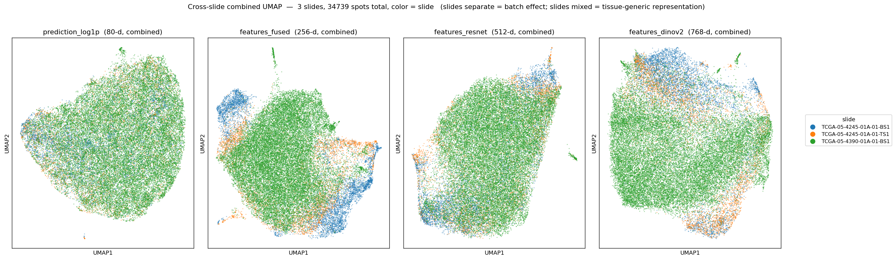
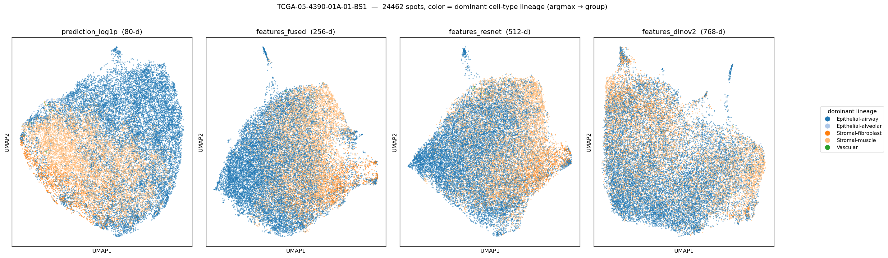
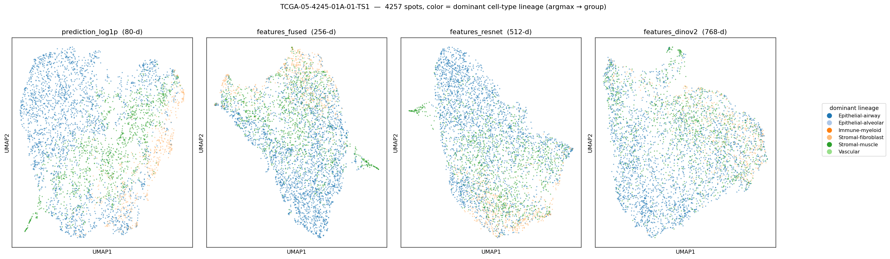
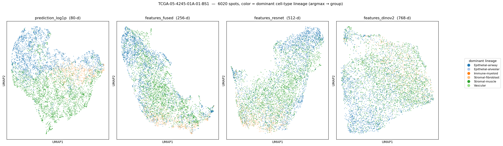

# 146-grid Hist2Cell UMAP (HEX FOV 73.2µm) — 4 representation 비교

생성: 2026-05-29. 스크립트: `lung_pilot/umap_compare.py --infer-dir inference_output_146 --dino-dir dino_output_146 --out-dir umap_output_146`

## 무엇을 / 왜

HEX 입력용 **146 px 그리드**(crop 146px = 73.2µm → 224 resize, eff. mpp 0.327 ≈ HEX 0.325)에
Hist2Cell + DINOv2 를 그대로 추론해, **HEX 와 동일한 spot 격자 위에서**의 4 representation UMAP 을 만들었다.
기존 224 그리드(112µm, Hist2Cell 학습 FOV) 결과(`../umap_output/`)와 짝이 되는 비교본이다.

| representation | 차원 | 의미 |
|---|---|---|
| `prediction_log1p` | 80 | cell-type abundance(cell2location)의 log1p |
| `features_fused` | 256 | fused_head 직전 (visual + GAT graph + transformer) |
| `features_resnet` | 512 | ResNet18 backbone (graph 미포함, raw visual) |
| `features_dinov2` | 768 | DINOv2 ViT-B/14 CLS (외부 self-supervised, HEX 의 DINO 블록 baseline) |

노드 수: 4245-BS1 6,020 / 4245-TS1 4,257 / 4390-BS1 24,462 (합 34,739).

> ⚠️ **FOV-OOD 주의 (해석의 전제)**: 146→224 는 Hist2Cell 입장에서 **학습 FOV(112µm)보다 좁은 73.2µm**
> 입력이다. 즉 여기서의 Hist2Cell prediction 은 *OOD 입력 위의 출력* 이다 — "이 격자에서의 ground-truth
> abundance" 로 읽으면 안 되고, **HEX 와 같은 grid 에서 Hist2Cell 표현이 어떻게 배치되는지**를 보기 위한 것이다.
> 그럼에도 row_sum(1.2–66.5)·UMAP 구조는 224(1.3–62.8)와 질적으로 닮아, 표현 거동은 FOV 변화에 대체로 안정적이다.

## Cross-slide UMAP (color = slide → batch effect)

축은 UMAP1/2 (무차원). 색은 슬라이드 — **섞이면 tissue-generic, 분리되면 batch effect**.
좌→우: prediction_log1p / features_fused / features_resnet / features_dinov2.

- **prediction_log1p**: 세 슬라이드가 거의 한 덩어리로 섞임 → cell-type abundance 는 슬라이드-비의존(tissue-generic). 224 와 동일한 경향.
- **features_fused**: 4245-BS1(파랑) 일부가 왼쪽으로 갈라지는 부분 batch.
- **features_resnet**: raw visual 이라 가장 morphology/stain-축으로 정리됨(부분 분리).
- **features_dinov2**: 외부 self-supervised — 부분 slide-separation, resnet 보다는 약함.

> ⚠️ **batch 시각 판독 편향**: 4390(초록)이 전체의 **70%**(24,462/34,739)라 어느 패널이든 초록이 화면을 덮어,
> "섞임처럼 보이는" 착시가 생긴다. 정량 batch 판독은 size-weighted chance + **balanced subsample**
> 가 필요하다(224 쪽 `../umap_output/cross_slide_balanced.png`·`../compare_output/` 참고). 이 그림은 정성용.

## Per-slide UMAP (color = dominant cell-type lineage)

각 spot 의 argmax cell-type → lineage group 색. cell-type 분리축이 보이면 prediction 이 조직 구조를 잡은 것.

### 4390-BS1 (24,462 spots)

prediction_log1p 에서 **Epithelial alveolar(파랑) ↔ Stromal(주황)** 의 연속적 gradient 구조가 보인다 — 폐 조직의 폐포-간질 축. resnet/fused/dinov2 는 cell-type 보다 morphology 패치 군집에 가깝다.

### 4245-TS1 (4,257 spots)

파랑(alveolar) 우세에 주황/초록 pocket. 224 per-slide 와 같은 lineage 배치 경향.

### 4245-BS1 (6,020 spots)

(파일: `per_slide_TCGA-05-4245-01A-01-BS1.png`)

## 정리

- 146(HEX FOV) 그리드에서도 Hist2Cell 표현의 **질적 순위는 224 와 일치**: prediction 이 가장 tissue-generic,
  resnet 이 가장 batchy, fused·dinov2 중간.
- 단 prediction 은 FOV-OOD 입력 위 결과이므로 수치 절대치(abundance)는 보조 정보로만. 결론은 224 와의
  방향 일치·재현성 수준에서 읽는다.
- 이 산출의 목적은 **HEX expression 도착 시 같은 146 격자에서 5번째 rep 으로 합쳐** apples-to-apples 비교하는 것.
  HEX 가 동료 146 타일에서 나오면 spot 이 1:1 정합된다(centers == coords+73 검증 완료).

## 다음
- HEX expression(146 grid) 도착 → `umap_compare.py` REPS 에 `hex_expression` 추가 + balanced cross-slide.
- (선택) 224 vs 146 paired Hist2Cell prediction 상관 — 같은 조직 위치의 FOV 효과 정량.
