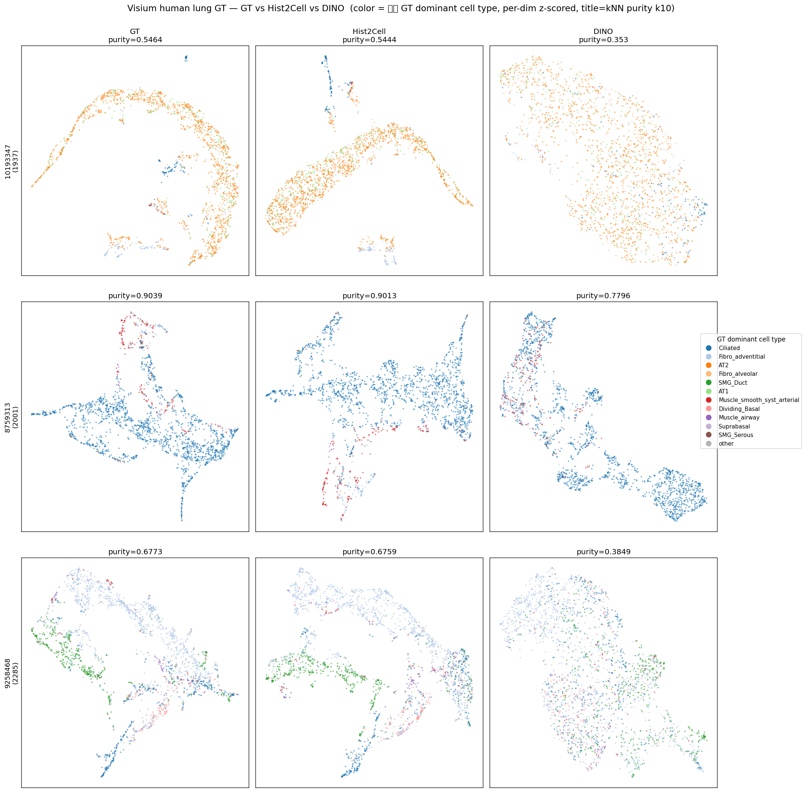

# Visium human lung GT — GT vs Hist2Cell vs DINO (HEX 도입 전 baseline)

생성: 2026-06-01. 스크립트: `lung_pilot/visium_gt_compare.py`.
데이터: `../README.md` (3장, 실제 cell2location GT 보유). 라벨·기준 = **실제 GT dominant cell type**
(= argmax(y 80 celltype)). TCGA 와 달리 정답이 Hist2Cell 예측이 아님 → **circular 아님**.

## 1. Hist2Cell 가 실제 GT 를 얼마나 맞추나 (`hist2cell_vs_GT.csv`)

| sample | 조직 | dominant 일치율 | mean per-celltype Pearson r | pooled r |
|---|---|---|---|---|
| WSA_LngSP10193347 | 폐포 | 0.871 | 0.938 | 0.992 |
| WSA_LngSP8759313 | 기도 | 0.948 | 0.939 | 0.996 |
| WSA_LngSP9258468 | 혼합 | 0.874 | 0.859 | 0.996 |

→ Hist2Cell prediction 이 **실제 GT 를 거의 그대로 재현** (dominant 87~95%, type별 r 0.86~0.94).
⚠️ 단 이 3장은 Hist2Cell **학습/in-domain 데이터일 가능성**(leave_A50_out 가중치) → 정확도는 **낙관적**.
(DINO 비교는 DINO 가 cell type 을 학습한 적 없으므로 이 caveat 과 무관.)

## 2. 각 representation 이 실제 cell type 으로 뭉치나 — kNN purity (k=10, GT dominant 기준)

| sample | GT(ref·semi-circular) | Hist2Cell | **DINO** | DINO gap vs GT |
|---|---|---|---|---|
| 10193347 (폐포) | 0.546 | 0.544 | **0.353** | −0.19 |
| 8759313 (기도) | 0.904 | 0.901 | **0.780** | −0.12 |
| 9258468 (혼합) | 0.677 | 0.676 | **0.385** | −0.29 |

행=샘플, 열=GT/Hist2Cell/DINO, 색=실제 GT dominant cell type, 제목=purity. GT·Hist2Cell 은 cell-type
별로 또렷이 갈리고, **DINO 는 색이 섞인다**(특히 폐포·혼합).

## 3. 핵심 결론 (real GT 기준)

- **Hist2Cell ≈ GT**: purity 가 GT 와 거의 동일(차이 ≤0.002) → Hist2Cell 예측이 실제 cell-type
  구조를 충실히 잡음. (TCGA 에서 prediction 을 proxy 라벨로 쓴 게 무리는 아니었음을 사후 확인.)
- **DINO 는 실제 cell type 에서 한참 아래** (purity gap −0.12~−0.29). raw morphology(self-supervised)
  만으로는 진짜 cell type 을 Hist2Cell·GT 만큼 복원 못 함 — **메울 여지(room-to-improve)가 실재**.
- **조직 의존**: 기도(Ciliated 우세, 형태 특이적)는 DINO 도 0.78 로 선전, 폐포·혼합은 0.35~0.39 로 약함.

## 4. HEX 평가로의 의미 (다음 단계)
- TCGA 분석의 한계(정답=Hist2Cell 자기예측, dino 차원지배)가 **여기선 해소** — 정답이 독립 GT 이고
  DINO 가 GT 대비 명확히 부족하므로, **dino vs dino+hex 를 이 GT 로 재면 HEX 효과를 공정 판정**할 수 있다.
  (DINO 가 ceiling 에 붙어있던 게 아니라 한참 아래라, hex 가 채울 자리가 보임.)
- 단 **HEX feature 를 이 3장에 추출** 필요(동료 모델). FOV 주의: `x` 는 112µm(Hist2Cell), HEX 는 72.8µm
  → 원본 Visium WSI 재crop 필요. DINO 는 그대로.

## 산출물
- `knn_purity_by_GT.csv`, `hist2cell_vs_GT.csv`, `umap_by_GT_dominant.png`, `embeddings/`
